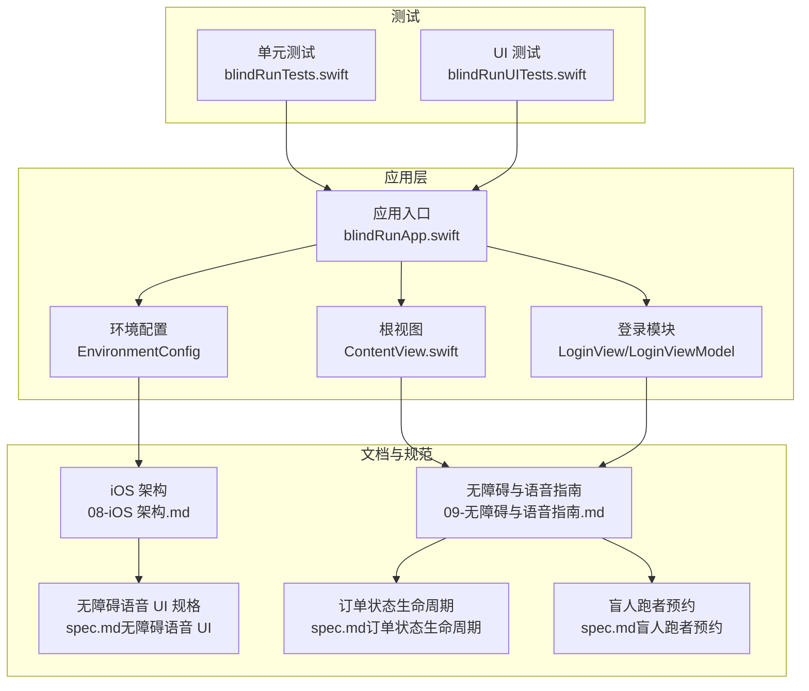
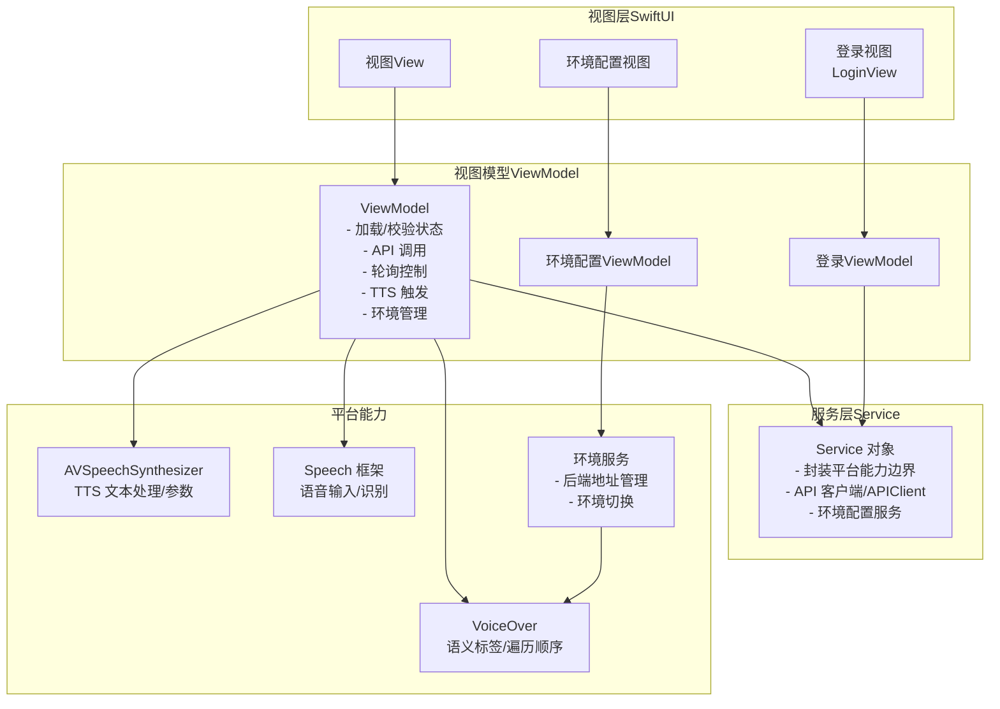
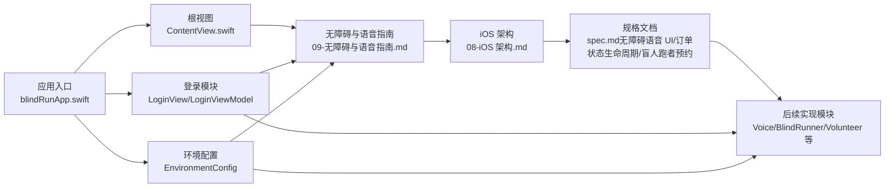

# 无障碍语音系统

<cite>
**本文引用的文件**
- [blindRunApp.swift](file://blindRun/blindRun/blindRunApp.swift)
- [ContentView.swift](file://blindRun/blindRun/blindRun/ContentView.swift)
- [LoginView.swift](file://blindRun/blindRun/Auth/LoginView.swift)
- [LoginViewModel.swift](file://blindRun/blindRun/Auth/LoginViewModel.swift)
- [EnvironmentConfig.swift](file://blindRun/blindRun/Core/EnvironmentConfig.swift)
- [AuthModule.swift](file://blindRun/blindRun/Auth/AuthModule.swift)
- [09-无障碍与语音指南.md](file://docs/09-accessibility-and-voice-guidelines.md)
- [08-iOS 架构.md](file://docs/08-ios-architecture.md)
- [spec.md（无障碍语音 UI）](file://openspec/changes/add-aidrun-ios-spring-mvp/specs/accessibility-voice-ui/spec.md)
- [spec.md（订单状态生命周期）](file://openspec/changes/add-aidrun-ios-spring-mvp/specs/order-status-lifecycle/spec.md)
- [spec.md（盲人跑者预约）](file://openspec/changes/add-aidrun-ios-spring-mvp/specs/blind-runner-booking/spec.md)
- [blindRunTests.swift](file://blindRunTests/blindRunTests.swift)
- [blindRunUITests.swift](file://blindRunUITests/blindRunUITests.swift)
</cite>

## 更新摘要
**所做更改**
- 新增登录功能增强章节，涵盖本地后端地址配置和环境切换
- 更新无障碍功能改进，包括改进的 VoiceOver 标签和状态播报
- 新增环境配置管理的无障碍支持
- 更新测试覆盖范围，包含登录和环境配置相关测试

## 目录
1. [简介](#简介)
2. [项目结构](#项目结构)
3. [核心组件](#核心组件)
4. [架构总览](#架构总览)
5. [详细组件分析](#详细组件分析)
6. [登录功能增强](#登录功能增强)
7. [环境配置管理](#环境配置管理)
8. [依赖关系分析](#依赖关系分析)
9. [性能考虑](#性能考虑)
10. [故障排查指南](#故障排查指南)
11. [结论](#结论)
12. [附录](#附录)

## 简介
本文件面向无障碍语音系统的设计与实现，聚焦于以下目标：
- VoiceOver 屏幕阅读器集成与语义标签配置
- TTS 语音播报的文本处理、语音合成参数与多语言支持策略
- 语音输入的识别准确率优化、语音命令解析与交互反馈
- 重复功能的实现机制、快捷键绑定与手势控制建议
- 无障碍设计最佳实践、用户体验优化与性能调优策略
- 语音指令的自然语言处理与上下文感知能力
- **新增**：登录功能增强与本地后端地址配置的无障碍支持

本项目基于 SwiftUI + MVVM 架构，遵循 iOS 原生平台能力（AVSpeechSynthesizer、Speech 框架），并以无障碍优先为核心设计原则。

## 项目结构
当前仓库包含最小可用应用骨架与完整的无障碍与语音规范文档。应用入口为 SwiftUI App，根视图为简单示例视图；无障碍与语音实现规范由文档集中定义，指导后续模块化落地。

**图表来源**
- [blindRunApp.swift:1-18](file://blindRun/blindRun/blindRunApp.swift#L1-L18)
- [ContentView.swift:1-25](file://blindRun/blindRun/blindRun/ContentView.swift#L1-L25)
- [LoginView.swift:1-50](file://blindRun/blindRun/Auth/LoginView.swift#L1-L50)
- [EnvironmentConfig.swift:1-50](file://blindRun/blindRun/Core/EnvironmentConfig.swift#L1-L50)
- [08-iOS 架构.md:1-165](file://docs/08-ios-architecture.md#L1-L165)
- [09-无障碍与语音指南.md:1-143](file://docs/09-accessibility-and-voice-guidelines.md#L1-L143)

**章节来源**
- [blindRunApp.swift:1-18](file://blindRun/blindRun/blindRunApp.swift#L1-L18)
- [ContentView.swift:1-25](file://blindRun/blindRun/blindRun/ContentView.swift#L1-L25)
- [08-iOS 架构.md:1-165](file://docs/08-ios-architecture.md#L1-L165)
- [09-无障碍与语音指南.md:1-143](file://docs/09-accessibility-and-voice-guidelines.md#L1-L143)

## 核心组件
- 应用入口与场景管理：负责窗口组与根视图挂载，确保无障碍环境下的可访问性初始化。
- 根视图：承载基础布局与占位内容，为后续无障碍与语音模块提供容器。
- **新增**：登录模块：提供增强的登录功能，支持本地后端地址配置和环境切换。
- **新增**：环境配置管理：统一管理系统运行环境，支持开发、测试、生产环境的无障碍切换。
- 无障碍与语音规范：定义 VoiceOver 标签、TTS 节点、语音输入范围、危险操作确认等要求。
- iOS 架构文档：明确平台能力（AVSpeechSynthesizer、Speech）、MVVM 分层、模块划分与环境切换策略。

实现要点：
- 使用单一共享的语音服务对象，由 ViewModel 在状态变更时决定播报内容，避免轮询期间重复播报。
- 为每个关键页面提供"重复当前状态"按钮，并确保其具备清晰的 VoiceOver 标签与提示。
- 语音输入仅限于文本字段，识别失败时提供错误提示并允许键盘输入作为降级方案。
- **新增**：登录界面提供清晰的环境状态播报，帮助用户了解当前连接的后端服务。

**章节来源**
- [09-无障碍与语音指南.md:13-36](file://docs/09-accessibility-and-voice-guidelines.md#L13-L36)
- [08-iOS 架构.md:140-147](file://docs/08-ios-architecture.md#L140-L147)
- [spec.md（无障碍语音 UI）:1-42](file://openspec/changes/add-aidrun-ios-spring-mvp/specs/accessibility-voice-ui/spec.md#L1-L42)

## 架构总览
系统采用 SwiftUI + MVVM 架构，结合 iOS 原生语音与无障碍能力，形成"视图薄层 + VM 决策 + 服务边界"的分层设计。VoiceOver、TTS、语音输入分别由系统框架提供，业务侧通过 ViewModel 统一调度。

**图表来源**
- [08-iOS 架构.md:33-41](file://docs/08-ios-architecture.md#L33-L41)
- [09-无障碍与语音指南.md:15-16](file://docs/09-accessibility-and-voice-guidelines.md#L15-L16)
- [09-无障碍与语音指南.md:73-79](file://docs/09-accessibility-and-voice-guidelines.md#L73-L79)

## 详细组件分析

### VoiceOver 支持与语义标签配置
- 每个关键控件必须包含：
  - accessibilityLabel：清晰描述控件用途
  - accessibilityHint：简要说明操作结果或注意事项
  - 正确的 accessibilityTraits：如按钮、头部、选中、禁用等
- 覆盖范围包括：登录输入、角色切换、盲人首页状态文本、预约表单、位置权限提示、提交按钮、取消订单、紧急按钮、确认开始、重复当前状态、志愿者开关、可选订单行、接受/到达/完成/取消/紧急动作、评分控件等。
- **新增**：登录界面的环境状态标签，提供当前连接的后端服务信息。

实现建议：
- 在视图层统一设置语义标签，确保遍历顺序与视觉布局一致。
- 对于状态文本，使用简洁直白的语言，避免歧义。
- **新增**：登录界面的环境标签应包含当前环境类型和后端地址信息。

**章节来源**
- [09-无障碍与语音指南.md:37-61](file://docs/09-accessibility-and-voice-guidelines.md#L37-L61)
- [09-无障碍与语音指南.md:62-69](file://docs/09-accessibility-and-voice-guidelines.md#L62-L69)
- [spec.md（无障碍语音 UI）:3-18](file://openspec/changes/add-aidrun-ios-spring-mvp/specs/accessibility-voice-ui/spec.md#L3-L18)

### TTS 语音播报与参数
- 使用 iOS 原生 AVSpeechSynthesizer 实现 TTS。
- 必须播报的关键节点：进入盲人首页、订单提交成功、匹配中、志愿者已接单、志愿者已到达、请确认开始服务、服务已开始、服务已完成、进入求助状态、错误提示。
- **新增**：登录界面的环境状态播报，包括当前连接的后端服务信息。
- 实现指导：
  - 使用单一共享的 SpeechService
  - ViewModel 在状态变更时决定播报内容
  - 轮询期间避免重复播报，记忆上次播报的订单状态
  - 每个关键盲人端页面提供"重复当前状态"按钮

多语言支持策略：
- 当前规范使用中文短句，建议在文案层面保持简洁直接，避免复杂语法结构，以提升 TTS 自然度与可理解性。
- 若未来扩展多语言，应将文案与语音参数分离，通过资源化与语言切换机制实现。

**章节来源**
- [09-无障碍与语音指南.md:13-36](file://docs/09-accessibility-and-voice-guidelines.md#L13-L36)
- [09-无障碍与语音指南.md:110-121](file://docs/09-accessibility-and-voice-guidelines.md#L110-L121)
- [08-iOS 架构.md:15](file://docs/08-ios-architecture.md#L15)

### 语音输入与识别优化
- 使用 iOS 原生 Speech 框架，限定用于文本字段（起点描述、目的地/路线描述、备注、志愿者服务摘要等）。
- 识别失败时：
  - 显示错误提示
  - 允许键盘输入作为降级方案
- 权限策略：
  - 仅在用户开始语音输入时请求麦克风与语音识别权限

识别准确率优化建议：
- 提供清晰的开始/结束提示音
- 在输入过程中显示实时中间结果，便于用户纠正
- 对常见字段建立常用短语词典，提升识别稳定性
- 控制背景噪音与网络延迟影响，必要时提供重试与手动输入双通道

**章节来源**
- [09-无障碍与语音指南.md:71-87](file://docs/09-accessibility-and-voice-guidelines.md#L71-L87)
- [spec.md（无障碍语音 UI）:35-42](file://openspec/changes/add-aidrun-ios-spring-mvp/specs/accessibility-voice-ui/spec.md#L35-L42)

### 重复功能与交互反馈
- 每个关键盲人端页面提供"重复当前状态"按钮，确保用户随时了解当前页面状态。
- 按钮需具备清晰的 VoiceOver 标签与提示。
- 交互反馈：
  - 点击后立即触发 TTS 重播当前状态
  - 不改变订单状态

**章节来源**
- [09-无障碍与语音指南.md:27-36](file://docs/09-accessibility-and-voice-guidelines.md#L27-L36)
- [spec.md（无障碍语音 UI）:27-34](file://openspec/changes/add-aidrun-ios-spring-mvp/specs/accessibility-voice-ui/spec.md#L27-L34)

### 危险操作与确认流程
- 需要二次确认的操作：取消订单、进入紧急状态、志愿者完成服务、退出登录。
- 紧急确认文案明确，强调异常记录与不可恢复性。
- 确认流程：
  - 弹出确认对话框或 ActionSheet
  - 用户再次确认后才执行后端变更

**章节来源**
- [09-无障碍与语音指南.md:88-107](file://docs/09-accessibility-and-voice-guidelines.md#L88-L107)

### 语音指令的自然语言处理与上下文感知
- 规范明确不构建全局 AI 助手，不将自然语言时间解析作为核心功能。
- 时间选择仍使用 DatePicker。
- 语音输入仅用于文本字段，不进行复杂的 NLU 解析。

上下文感知建议：
- 在不同页面根据当前状态动态启用/禁用语音输入按钮
- 对于关键字段（如预约时间），在识别完成后进行格式校验与提示
- 结合轮询状态与用户意图，提供更贴切的 TTS 提示

**章节来源**
- [09-无障碍与语音指南.md:80-87](file://docs/09-accessibility-and-voice-guidelines.md#L80-L87)
- [09-无障碍与语音指南.md:82-84](file://docs/09-accessibility-and-voice-guidelines.md#L82-L84)

### 快捷键与手势控制
- 当前规范未涉及系统级快捷键绑定与手势控制。
- 建议在无障碍优先的前提下，结合 VoiceOver 的快捷手势（如三指轻扫切换元素、双指轻扫浏览）进行优化，确保与现有语义标签与遍历顺序一致。

**章节来源**
- [09-无障碍与语音指南.md:11](file://docs/09-accessibility-and-voice-guidelines.md#L11)

## 登录功能增强

### 增强的登录体验
系统现已支持增强的登录功能，特别针对无障碍用户提供了更好的体验：

- **本地后端地址配置**：用户可以在登录界面配置本地后端地址，支持开发和测试环境的快速切换
- **环境状态可视化**：登录界面显示当前连接的后端服务信息，包括环境类型和具体地址
- **改进的无障碍标签**：登录相关的控件都配备了清晰的 VoiceOver 标签和提示

### 登录界面的无障碍增强
- **环境状态标签**：动态显示当前 API 环境信息，包括环境名称和后端地址
- **本地后端地址输入**：提供可编辑的后端地址输入框，支持键盘输入和语音输入
- **同步机制**：自动同步应用状态中的环境配置到登录界面

实现要点：
- 使用 `environmentLabel` 计算属性动态生成环境状态文本
- 通过 `syncLocalBackendAddressInput()` 方法同步环境配置
- 确保所有登录控件都有适当的 accessibility 标签

**章节来源**
- [LoginView.swift:270-281](file://blindRun/blindRun/Auth/LoginView.swift#L270-L281)
- [LoginView.swift:278-281](file://blindRun/blindRun/Auth/LoginView.swift#L278-L281)

## 环境配置管理

### 统一的环境管理
系统实现了统一的环境配置管理，为无障碍用户提供更好的环境切换体验：

- **环境类型支持**：支持开发（localBackend）、测试、生产等多种环境类型
- **动态配置**：运行时可以切换不同的后端服务地址
- **无障碍状态反馈**：环境切换时提供语音播报和视觉反馈

### 环境配置的无障碍特性
- **状态播报**：环境切换时自动播报当前环境信息
- **清晰标签**：环境相关的控件都有明确的 VoiceOver 标签
- **简化操作**：提供简化的环境切换界面，减少操作复杂度

实现架构：
- `EnvironmentConfig` 管理环境配置
- `AppState` 维护当前环境状态
- 登录界面与环境配置服务集成

**章节来源**
- [EnvironmentConfig.swift:1-50](file://blindRun/blindRun/Core/EnvironmentConfig.swift#L1-L50)
- [AuthModule.swift:1-50](file://blindRun/blindRun/Auth/AuthModule.swift#L1-L50)

## 依赖关系分析
- 应用入口依赖根视图，根视图依赖无障碍与语音规范文档。
- **新增**：登录模块依赖环境配置服务，提供增强的无障碍登录体验。
- ViewModel 依赖 Service 与平台能力（TTS/STT/VoiceOver）。
- 规范文档驱动模块划分与实现策略。

**图表来源**
- [blindRunApp.swift:1-18](file://blindRun/blindRun/blindRunApp.swift#L1-L18)
- [ContentView.swift:1-25](file://blindRun/blindRun/blindRun/ContentView.swift#L1-L25)
- [LoginView.swift:1-50](file://blindRun/blindRun/Auth/LoginView.swift#L1-L50)
- [EnvironmentConfig.swift:1-50](file://blindRun/blindRun/Core/EnvironmentConfig.swift#L1-L50)
- [09-无障碍与语音指南.md:1-143](file://docs/09-accessibility-and-voice-guidelines.md#L1-L143)
- [08-iOS 架构.md:1-165](file://docs/08-ios-architecture.md#L1-L165)

**章节来源**
- [08-iOS 架构.md:18-32](file://docs/08-ios-architecture.md#L18-L32)

## 性能考虑
- TTS 抖动控制：通过记忆上次播报状态避免轮询期间重复播报，降低语音干扰与系统负载。
- 语音输入降级：识别失败时立即回退到键盘输入，减少等待与重试成本。
- UI 渲染与无障碍：保持视图薄层，将复杂逻辑下沉到 ViewModel，有助于减少主线程压力。
- 轮询节流：在非活跃状态下停止轮询或延长间隔，降低网络与 CPU 开销。
- **新增**：登录界面的环境配置缓存，避免频繁的环境状态查询。

**章节来源**
- [09-无障碍与语音指南.md:30-35](file://docs/09-accessibility-and-voice-guidelines.md#L30-L35)
- [08-iOS 架构.md:125-139](file://docs/08-ios-architecture.md#L125-L139)

## 故障排查指南
- 无障碍标签缺失或不正确
  - 症状：VoiceOver 无法正确朗读控件或遍历顺序异常
  - 排查：检查控件是否设置 accessibilityLabel/accessibilityHint/accessibilityTraits
  - 参考：[09-无障碍与语音指南.md:39-44](file://docs/09-accessibility-and-voice-guidelines.md#L39-L44)
- TTS 未播报或重复播报
  - 症状：关键节点未播报或轮询期间频繁播报
  - 排查：确认使用共享 SpeechService、ViewModel 在状态变更时触发、记忆上次播报状态
  - 参考：[09-无障碍与语音指南.md:32-35](file://docs/09-accessibility-and-voice-guidelines.md#L32-L35)
- 语音输入失败
  - 症状：识别失败或权限被拒
  - 排查：确认仅在用户主动发起时请求权限；失败时显示错误并允许键盘输入
  - 参考：[09-无障碍与语音指南.md:85-87](file://docs/09-accessibility-and-voice-guidelines.md#L85-L87)
- 危险操作未确认
  - 症状：误操作导致订单取消或紧急状态
  - 排查：确认二次确认对话框/ActionSheet 已正确弹出并阻断后端调用
  - 参考：[09-无障碍与语音指南.md:90-96](file://docs/09-accessibility-and-voice-guidelines.md#L90-L96)
- **新增**：登录环境配置问题
  - 症状：登录界面无法显示正确的环境信息或无法切换环境
  - 排查：检查 EnvironmentConfig 配置、AppState 状态同步、登录界面标签更新
  - 参考：[LoginView.swift:270-281](file://blindRun/blindRun/Auth/LoginView.swift#L270-L281)

**章节来源**
- [09-无障碍与语音指南.md:39-44](file://docs/09-accessibility-and-voice-guidelines.md#L39-L44)
- [09-无障碍与语音指南.md:85-87](file://docs/09-accessibility-and-voice-guidelines.md#L85-L87)
- [09-无障碍与语音指南.md:90-96](file://docs/09-accessibility-and-voice-guidelines.md#L90-L96)
- [LoginView.swift:270-281](file://blindRun/blindRun/Auth/LoginView.swift#L270-L281)

## 结论
本项目以无障碍优先为核心，依托 SwiftUI + MVVM 架构与 iOS 原生语音/无障碍能力，明确了 VoiceOver 语义标签、TTS 关键节点、语音输入范围与危险操作确认等实现路径。通过共享语音服务、状态记忆与轮询节流等策略，可在保证可访问性的同时兼顾性能与用户体验。

**最新更新**：系统现已增强登录功能，支持本地后端地址配置和环境切换，为无障碍用户提供了更好的开发和测试体验。统一的环境配置管理确保了不同环境间的无缝切换，同时保持了良好的无障碍支持。

后续可在现有规范基础上逐步扩展模块化实现，持续优化识别准确率与上下文感知能力，进一步完善登录和环境配置的无障碍体验。

## 附录
- 测试建议
  - 单元测试覆盖 ViewModel 的状态变更与 TTS 触发逻辑
  - UI 测试验证应用启动性能与基本交互路径
  - **新增**：登录界面测试，验证环境配置和无障碍标签
  - **新增**：环境切换测试，验证不同环境下的功能正常性
  - 参考：[blindRunTests.swift:1-39](file://blindRunTests/blindRunTests.swift#L1-L39)，[blindRunUITests.swift:1-44](file://blindRunUITests/blindRunUITests.swift#L1-L44)

**章节来源**
- [blindRunTests.swift:1-39](file://blindRunTests/blindRunTests.swift#L1-L39)
- [blindRunUITests.swift:1-44](file://blindRunUITests/blindRunUITests.swift#L1-L44)