# 核心功能模块

<cite>
**本文引用的文件**
- [blindRunApp.swift](file://blindRun/blindRunApp.swift)
- [ContentView.swift](file://blindRun/ContentView.swift)
- [00-一致性检查报告.md](file://docs/00-consistency-check-report.md)
- [01-产品需求文档.md](file://docs/01-product-requirements.md)
- [02-MVP范围文档.md](file://docs/02-mvp-scope.md)
- [03-用户故事.md](file://docs/03-user-stories.md)
- [04-用户流程与状态机.md](file://docs/04-user-flows-and-state-machine.md)
- [07-API契约.OpenAPI.yaml](file://docs/07-api-contract.openapi.yaml)
- [08-iOS架构.md](file://docs/08-ios-architecture.md)
- [09-无障碍与语音指南.md](file://docs/09-accessibility-and-voice-guidelines.md)
- [auth-phone-login 规范.md](file://openspec/changes/add-aidrun-ios-spring-mvp/specs/auth-phone-login/spec.md)
- [amap-location 规范.md](file://openspec/changes/add-aidrun-ios-spring-mvp/specs/amap-location/spec.md)
- [blind-runner-booking 规范.md](file://openspec/changes/add-aidrun-ios-spring-mvp/specs/blind-runner-booking/spec.md)
- [order-status-lifecycle 规范.md](file://openspec/changes/add-aidrun-ios-spring-mvp/specs/order-status-lifecycle/spec.md)
</cite>

## 目录
1. [简介](#简介)
2. [项目结构](#项目结构)
3. [核心组件](#核心组件)
4. [架构总览](#架构总览)
5. [详细组件分析](#详细组件分析)
6. [依赖关系分析](#依赖关系分析)
7. [性能考虑](#性能考虑)
8. [故障排查指南](#故障排查指南)
9. [结论](#结论)
10. [附录](#附录)

## 简介
本文件面向 blindRun 应用的核心功能模块，系统化梳理认证系统、角色管理、盲人跑者功能、志愿者功能、订单生命周期管理、地图定位服务、无障碍语音系统、安全系统与积分系统的设计与实现要点。文档基于冻结的 MVP v0.3 规格，结合用户故事、流程与状态机、API 契约及 iOS 架构指南，提供从概念到实现的学习路径与最佳实践。

## 项目结构
当前仓库包含 iOS 应用壳与配套文档，应用入口为 SwiftUI App，核心业务由多模块协作完成（认证、角色、盲人端、志愿者端、订单、地图、语音、安全、资料）。文档中明确了 MVVM 架构、URLSession 网络层、UserDefaults/JWT、高德地图与定位、VoiceOver/TTS/Speech 等技术约束与实现建议。

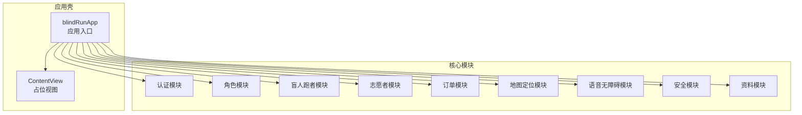

**图表来源**
- [08-iOS架构.md:18-32](file://docs/08-ios-architecture.md#L18-L32)
- [01-产品需求文档.md:116-140](file://docs/01-product-requirements.md#L116-L140)

**章节来源**
- [blindRunApp.swift:10-17](file://blindRun/blindRunApp.swift#L10-L17)
- [ContentView.swift:10-20](file://blindRun/ContentView.swift#L10-L20)
- [08-iOS架构.md:18-32](file://docs/08-ios-architecture.md#L18-L32)

## 核心组件
- 认证系统：手机号 + 固定验证码登录，JWT 返回与持久化，自动注册与角色选择。
- 角色管理：双角色共享 JWT，切换仅改变 activeRole；活跃订单阻断切换。
- 盲人跑者：资料填写、创建预约、订单轮询、服务中交互、紧急求助、评分。
- 志愿者：Mock 认证、可服务开关、附近订单列表、接单/到达/完成、服务记录、积分。
- 订单生命周期：固定流转、并发接单保护、超时自动取消、手动/系统取消区分。
- 地图定位：高德地图显示、当前位置、订单 marker、距离计算、权限拦截与回退坐标。
- 无障碍语音：VoiceOver 标签与提示、TTS 关键节点播报、语音输入、危险操作二次确认。
- 安全系统：紧急求助触发与状态同步、求助后 UI 与 TTS 提示。
- 积分系统：志愿者完成服务 +100 积分，积分商城占位展示。

**章节来源**
- [02-MVP范围文档.md:14-115](file://docs/02-mvp-scope.md#L14-L115)
- [03-用户故事.md:3-800](file://docs/03-user-stories.md#L3-L800)
- [07-API契约.OpenAPI.yaml:25-452](file://docs/07-api-contract.openapi.yaml#L25-L452)
- [09-无障碍与语音指南.md:13-143](file://docs/09-accessibility-and-voice-guidelines.md#L13-L143)

## 架构总览
应用采用 SwiftUI + MVVM 架构，网络层基于 URLSession，令牌存储为 UserDefaults（MVP），地图与定位集成高德 SDK，语音与无障碍优先。模块间通过 ViewModel 调用 Service，Service 封装 API 与平台能力边界，DTO 与 OpenAPI 约定保持一致。

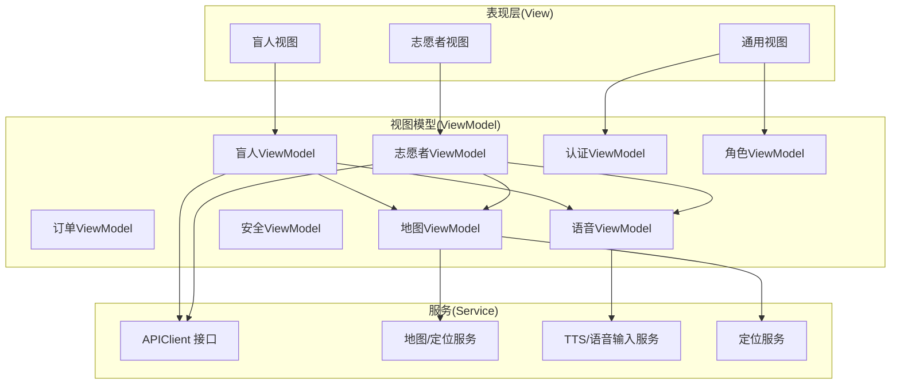

**图表来源**
- [08-iOS架构.md:33-49](file://docs/08-ios-architecture.md#L33-L49)
- [08-iOS架构.md:68-83](file://docs/08-iOS架构.md#L68-L83)

**章节来源**
- [08-iOS架构.md:1-165](file://docs/08-iOS架构.md#L1-L165)

## 详细组件分析

### 认证系统
- 登录流程：手机号 + 固定验证码（123456）登录，首次登录自动创建账号；返回 JWT 与用户信息，首次登录 activeRole 可为空，引导进入角色选择。
- 自动登录：启动时读取 UserDefaults 中 JWT，验证有效性后直接进入对应角色首页。
- 退出登录：清除本地 token，回到登录页。
- 安全约束：受 bearerAuth 保护，未登录访问返回 UNAUTHORIZED。

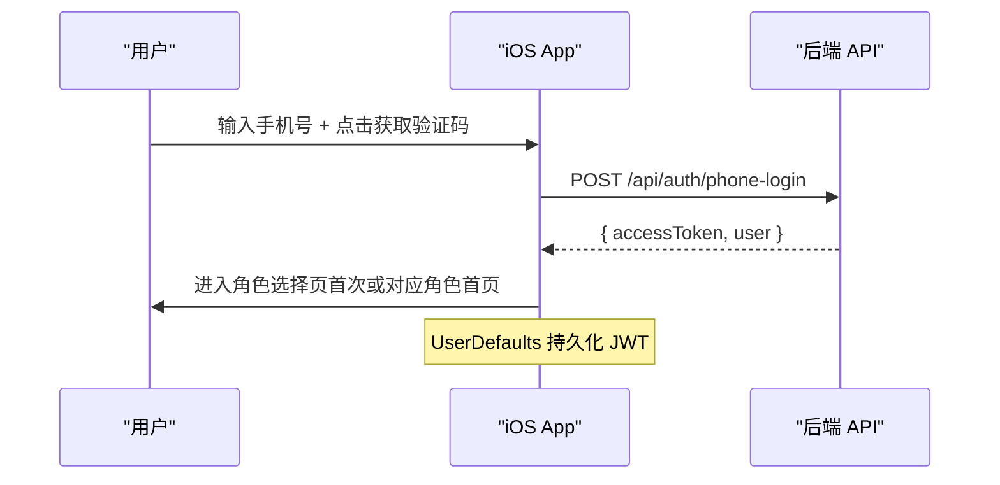

**图表来源**
- [03-用户故事.md:5-80](file://docs/03-user-stories.md#L5-L80)
- [07-API契约.OpenAPI.yaml:25-46](file://docs/07-api-contract.openapi.yaml#L25-L46)

**章节来源**
- [03-用户故事.md:5-80](file://docs/03-user-stories.md#L5-L80)
- [07-API契约.OpenAPI.yaml:25-46](file://docs/07-api-contract.openapi.yaml#L25-L46)
- [auth-phone-login 规范.md:3-30](file://openspec/changes/add-aidrun-ios-spring-mvp/specs/auth-phone-login/spec.md#L3-L30)

### 角色管理
- 双角色共享同一 JWT，切换仅修改 activeRole。
- 活跃订单（accepted / arrived / in_progress / emergency）阻断角色切换，返回 ACTIVE_ORDER_ROLE_SWITCH_BLOCKED。
- 首次登录后进入角色选择页，非首次则直接进入上次角色首页。

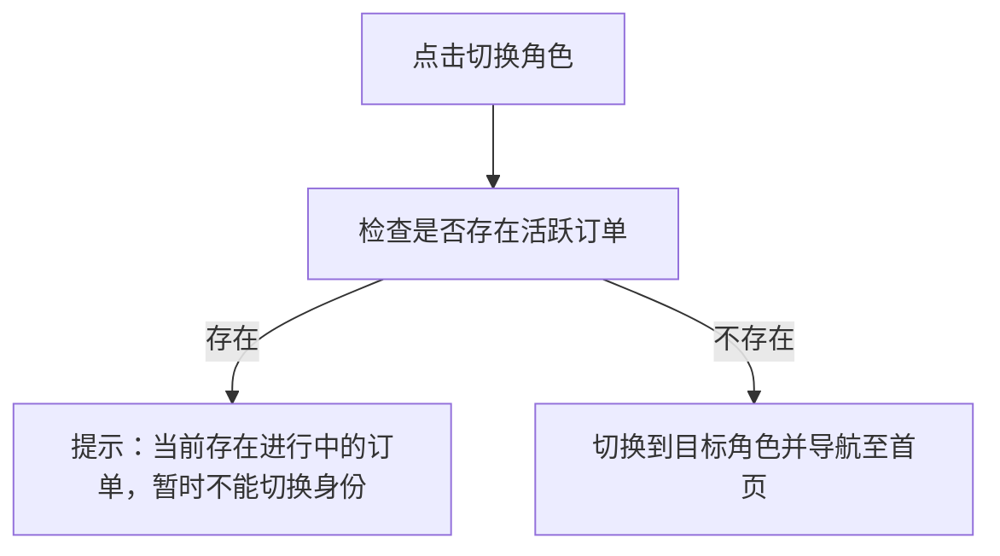

**图表来源**
- [03-用户故事.md:139-158](file://docs/03-user-stories.md#L139-L158)
- [07-API契约.OpenAPI.yaml:61-81](file://docs/07-api-contract.openapi.yaml#L61-L81)

**章节来源**
- [03-用户故事.md:139-158](file://docs/03-user-stories.md#L139-L158)
- [07-API契约.OpenAPI.yaml:61-81](file://docs/07-api-contract.openapi.yaml#L61-L81)

### 盲人跑者功能
- 资料填写：昵称、紧急联系人姓名与电话为必填；首次选择盲人角色时必填。
- 首页：无活跃订单显示“开始约跑”与当前位置地图；有活跃订单显示状态卡片。
- 创建预约：必填出发地点（默认当前定位）、预约时间；可选目的地/路线、时长、距离、配速偏好、同性志愿者偏好、备注；预约时间不得少于当前时间 30 分钟；定位权限拒绝时禁止创建。
- 订单轮询：在等待/服务中页面每 5 秒轮询订单详情，状态变化时 UI 更新并 TTS 播报。
- 服务中：显示志愿者信息与一键求助；确认开始服务后进入 in_progress。
- 紧急求助：accepted / arrived / in_progress 下触发，弹窗确认后进入 emergency。
- 取消订单：matching / accepted / arrived 可取消，记录 cancelledBy 与手动取消原因；in_progress 不支持普通取消。
- 评分：completed 后可选评分。

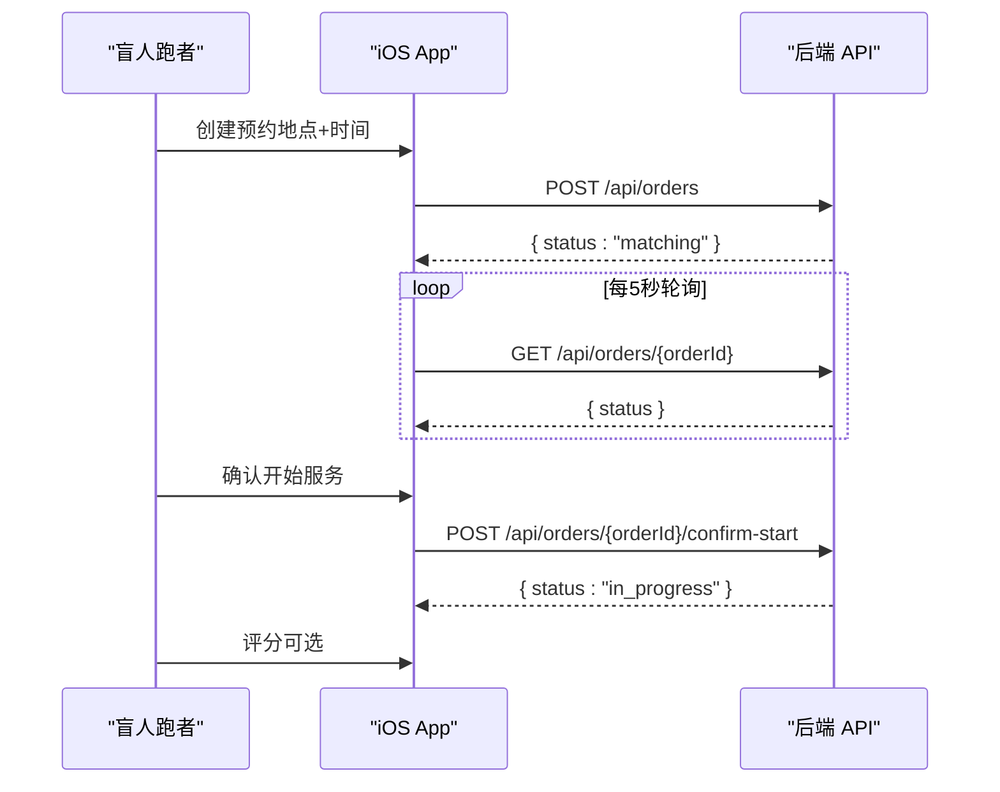

**图表来源**
- [03-用户故事.md:161-401](file://docs/03-user-stories.md#L161-L401)
- [04-用户流程与状态机.md:120-178](file://docs/04-user-flows-and-state-machine.md#L120-L178)
- [07-API契约.OpenAPI.yaml:150-208](file://docs/07-api-contract.openapi.yaml#L150-L208)

**章节来源**
- [03-用户故事.md:161-401](file://docs/03-user-stories.md#L161-L401)
- [04-用户流程与状态机.md:120-178](file://docs/04-user-flows-and-state-machine.md#L120-L178)
- [07-API契约.OpenAPI.yaml:150-208](file://docs/07-api-contract.openapi.yaml#L150-L208)
- [blind-runner-booking 规范.md:3-34](file://openspec/changes/add-aidrun-ios-spring-mvp/specs/blind-runner-booking/spec.md#L3-L34)

### 志愿者功能
- Mock 认证：完成认证页即 approved，adminReviewStatus 也 approved；isAvailable 由首页开关控制。
- 首页：显示附近订单（按距离排序）、可服务开关、积分余额、角色切换入口。
- 订单列表：按距离排序；无可用订单显示空状态；拒绝定位权限时提示开启权限。
- 订单详情：隐藏盲人电话，显示“接单”按钮；接单成功后显示电话与“查看地图”。
- 服务中：到达后进入 arrived；确认开始后 in_progress；结束服务后 completed，+100 积分。
- 服务记录：已完成/已取消订单列表，按时间倒序。
- 积分/商城：积分余额展示与占位商品。

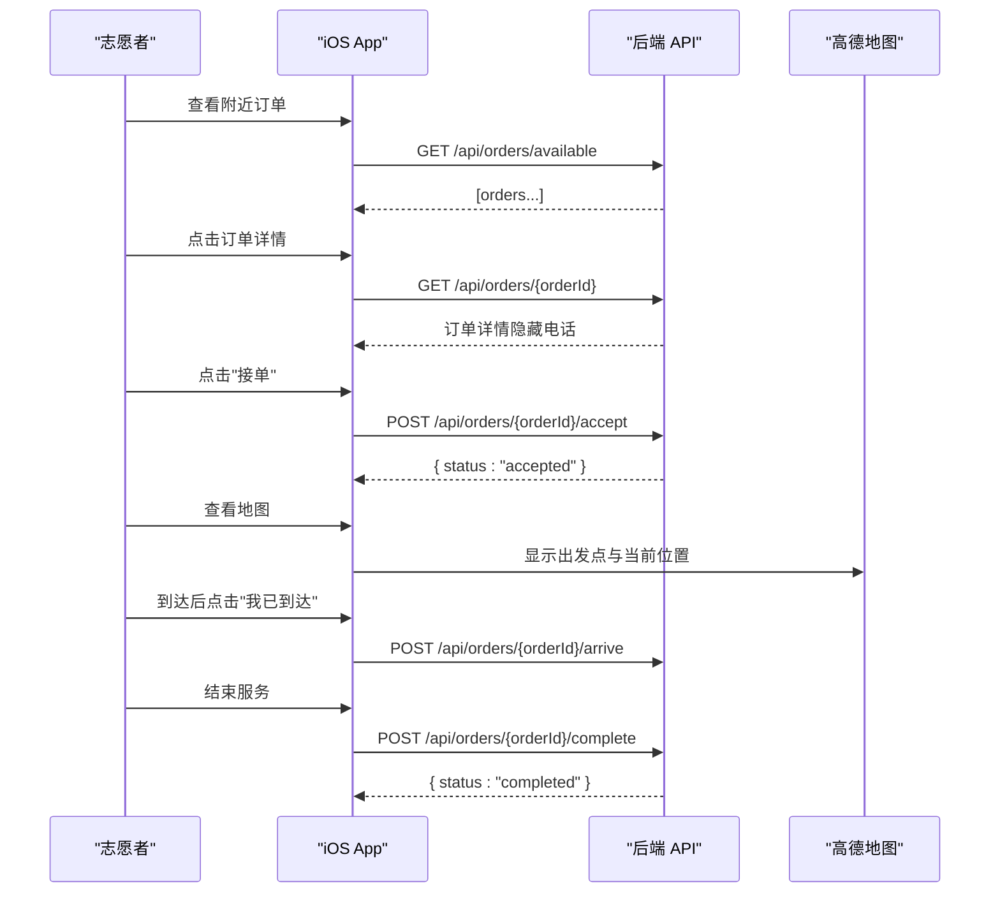

**图表来源**
- [03-用户故事.md:403-593](file://docs/03-user-stories.md#L403-L593)
- [04-用户流程与状态机.md:180-228](file://docs/04-user-flows-and-state-machine.md#L180-L228)
- [07-API契约.OpenAPI.yaml:209-342](file://docs/07-api-contract.openapi.yaml#L209-L342)

**章节来源**
- [03-用户故事.md:403-593](file://docs/03-user-stories.md#L403-L593)
- [04-用户流程与状态机.md:180-228](file://docs/04-user-flows-and-state-machine.md#L180-L228)
- [07-API契约.OpenAPI.yaml:209-342](file://docs/07-api-contract.openapi.yaml#L209-L342)

### 订单生命周期管理
- 正常流转：matching → accepted → arrived → in_progress → completed。
- 取消规则：matching / accepted / arrived 可取消；in_progress 不支持普通取消；manual vs system 取消原因区分。
- 超时取消：matching 且距离预约时间不足 30 分钟无人接单时，系统自动取消，cancelledReason = no_volunteer_available。
- 并发接单保护：同一订单仅能被一个志愿者成功接单，否则返回 ORDER_ALREADY_ACCEPTED。
- 紧急求助：accepted / arrived / in_progress 可触发 emergency，MVP 终态，不恢复。

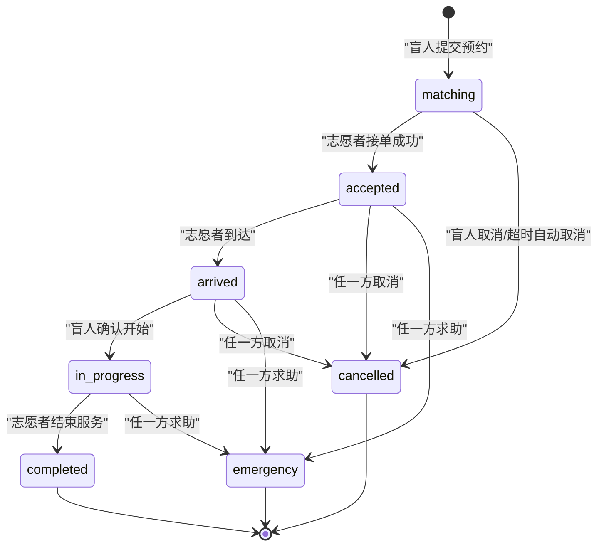

**图表来源**
- [04-用户流程与状态机.md:72-119](file://docs/04-user-flows-and-state-machine.md#L72-L119)
- [07-API契约.OpenAPI.yaml:343-387](file://docs/07-api-contract.openapi.yaml#L343-L387)
- [order-status-lifecycle 规范.md:3-66](file://openspec/changes/add-aidrun-ios-spring-mvp/specs/order-status-lifecycle/spec.md#L3-L66)

**章节来源**
- [04-用户流程与状态机.md:72-119](file://docs/04-user-flows-and-state-machine.md#L72-L119)
- [07-API契约.OpenAPI.yaml:343-387](file://docs/07-api-contract.openapi.yaml#L343-L387)
- [order-status-lifecycle 规范.md:3-66](file://openspec/changes/add-aidrun-ios-spring-mvp/specs/order-status-lifecycle/spec.md#L3-L66)

### 地图定位服务
- 集成高德地图：显示实时地图、当前位置、订单起点 marker。
- 权限拦截：盲人端创建预约与志愿者端查看/接单均需定位权限；拒绝时禁止核心流程并提示开启权限。
- 距离计算：iOS 根据志愿者当前位置与订单起点坐标计算距离并本地排序。
- 演示回退：当设备无法获取位置时，使用默认测试坐标维持演示可用性。

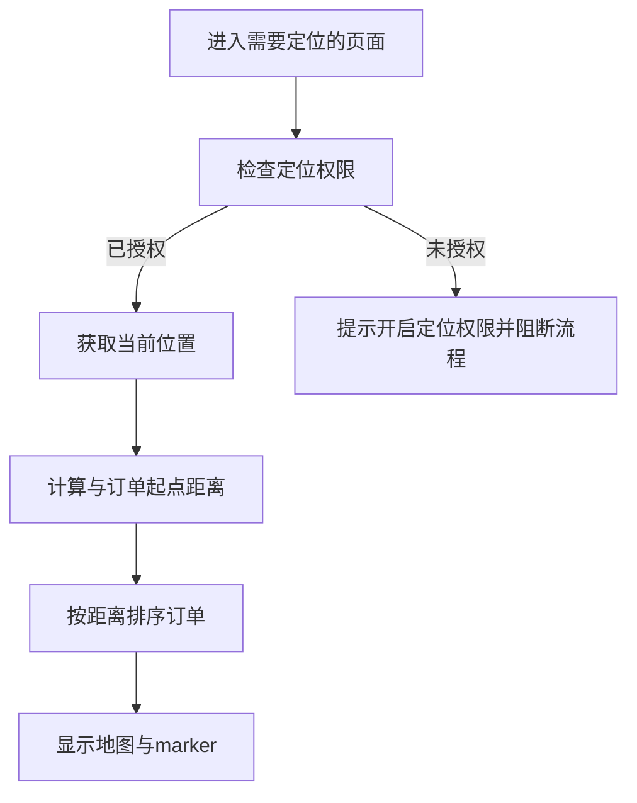

**图表来源**
- [09-无障碍与语音指南.md:108-121](file://docs/09-accessibility-and-voice-guidelines.md#L108-L121)
- [amap-location 规范.md:3-38](file://openspec/changes/add-aidrun-ios-spring-mvp/specs/amap-location/spec.md#L3-L38)

**章节来源**
- [09-无障碍与语音指南.md:108-121](file://docs/09-accessibility-and-voice-guidelines.md#L108-L121)
- [amap-location 规范.md:3-38](file://openspec/changes/add-aidrun-ios-spring-mvp/specs/amap-location/spec.md#L3-L38)

### 无障碍语音系统
- VoiceOver：所有关键按钮、输入框、状态文本配置 accessibilityLabel/accessibilityHint，遍历顺序与视觉布局一致。
- TTS：关键节点播报（进入首页、订单提交、匹配中、志愿者已接单、到达、确认开始、服务开始、完成、求助、错误提示）。
- 语音输入：Speech Framework 用于文本输入场景（地点描述、备注等），失败时允许键盘输入。
- 危险操作二次确认：取消订单、进入求助、结束服务、退出登录均需二次确认。
- 大按钮：主按钮最小高度 ≥ 64pt，确保触控可达性。

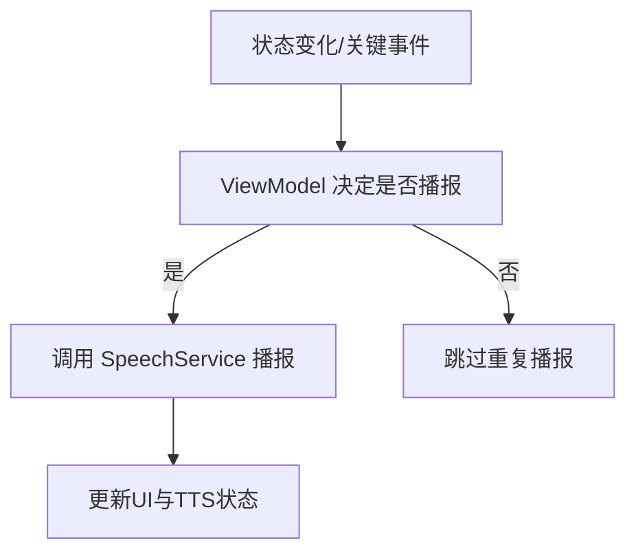

**图表来源**
- [09-无障碍与语音指南.md:13-143](file://docs/09-accessibility-and-voice-guidelines.md#L13-L143)

**章节来源**
- [09-无障碍与语音指南.md:13-143](file://docs/09-accessibility-and-voice-guidelines.md#L13-L143)

### 安全系统
- 紧急求助：任一方在 accepted / arrived / in_progress 触发，弹窗确认后进入 emergency，双方轮询观察状态变化并 TTS 提示。
- 求助后 UI：显示紧急联系人信息（盲人端），订单不可恢复，保持 emergency 终态。
- 危险操作确认：取消订单、结束服务、退出登录均需二次确认，防止误操作。

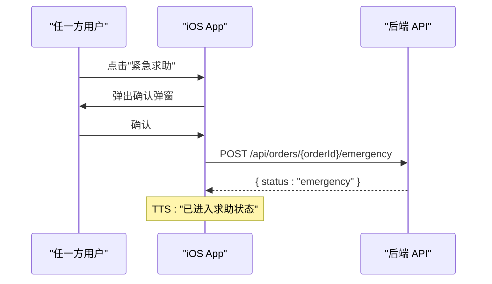

**图表来源**
- [04-用户流程与状态机.md:230-257](file://docs/04-user-flows-and-state-machine.md#L230-L257)

**章节来源**
- [04-用户流程与状态机.md:230-257](file://docs/04-user-flows-and-state-machine.md#L230-L257)

### 积分系统
- 志愿者完成一次服务获得 +100 积分；积分余额与流水通过接口查询。
- 积分商城为占位展示，不涉及真实兑换、库存或支付。

**章节来源**
- [03-用户故事.md:403-593](file://docs/03-user-stories.md#L403-L593)
- [07-API契约.OpenAPI.yaml:412-452](file://docs/07-api-contract.openapi.yaml#L412-L452)

## 依赖关系分析
- 模块耦合：各模块通过 ViewModel 与 Service 解耦，API 环境切换通过统一 APIClient 接口抽象。
- 外部依赖：高德地图 SDK、CoreLocation、AVSpeechSynthesizer、Speech 框架、URLSession。
- 数据一致性：订单状态机严格约束流转，配合后端幂等与乐观锁（并发接单保护）。
- 轮询与状态同步：盲人端在关键页面每 5 秒轮询，志愿者在服务中页面轮询，确保状态同步与 TTS 提示。

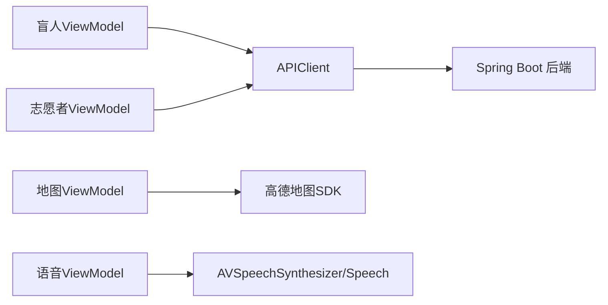

**图表来源**
- [08-iOS架构.md:68-83](file://docs/08-iOS架构.md#L68-L83)

**章节来源**
- [08-iOS架构.md:68-83](file://docs/08-iOS架构.md#L68-L83)

## 性能考虑
- 轮询频率：每 5 秒轮询满足演示需求，避免频繁网络请求；离开页面或订单进入终态时停止轮询。
- 本地排序：志愿者订单按距离排序在 iOS 完成，降低后端压力。
- 令牌存储：MVP 使用 UserDefaults，生产环境迁移 Keychain。
- 网络层：URLSession + async/await，简单可靠，避免复杂重试队列。

## 故障排查指南
- 登录失败：检查验证码是否为 123456；确认网络连通与 API 环境配置。
- 角色切换被阻断：检查是否存在 accepted / arrived / in_progress / emergency 活跃订单。
- 订单无法接单：检查志愿者是否已认证（verificationStatus/approved）、是否开启可服务开关（isAvailable）。
- 定位权限问题：在设置中开启定位权限；模拟器无定位时使用默认测试坐标。
- 紧急求助无效：确认订单状态为 accepted / arrived / in_progress；求助后订单为 emergency 终态。
- 轮询无更新：确认当前页面在轮询范围内；检查网络与 token 有效性。

**章节来源**
- [00-一致性检查报告.md:15-43](file://docs/00-consistency-check-report.md#L15-L43)
- [07-API契约.OpenAPI.yaml:469-542](file://docs/07-api-contract.openapi.yaml#L469-L542)

## 结论
blindRun 的核心功能围绕“预约型服务闭环”展开，通过严格的订单状态机、无障碍优先的语音与 VoiceOver 设计、高德地图与定位集成，以及 JWT + Mock 认证与志愿者认证策略，实现了 3 天 MVP 的可演示版本。建议在后续版本中完善真实短信、实名认证、管理员后台、WebSocket/实时轨迹、支付与库存等功能，同时将 UserDefaults 迁移至 Keychain，提升安全性与稳定性。

## 附录
- 演示脚本与验收标准详见用户故事与流程文档。
- API 约束与错误码定义见 OpenAPI 契约。
- iOS 架构与模块划分参考架构文档。