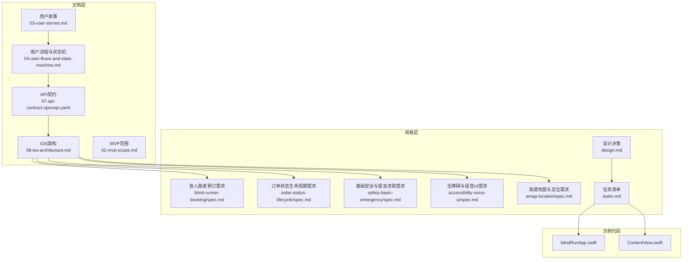
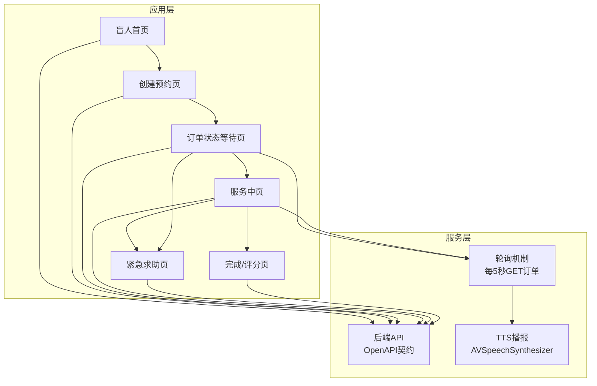
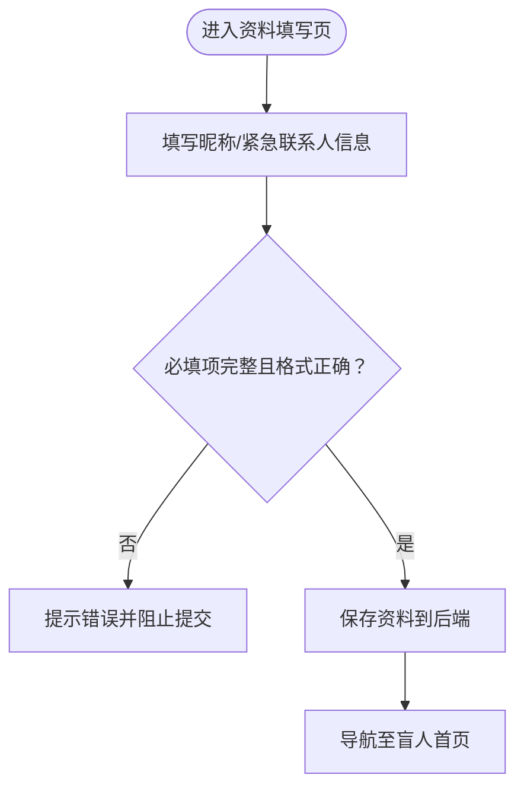
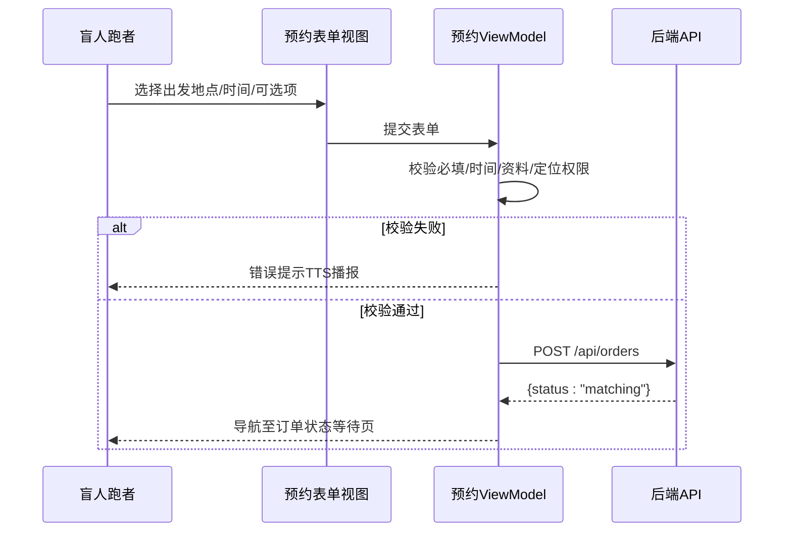
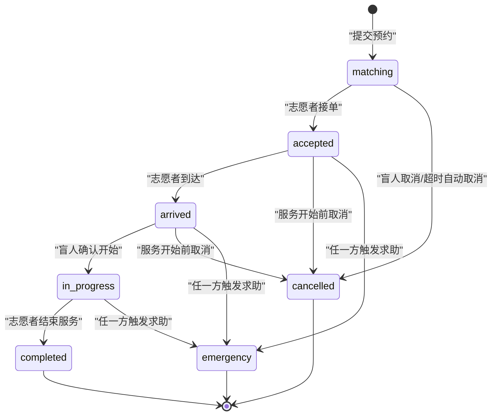
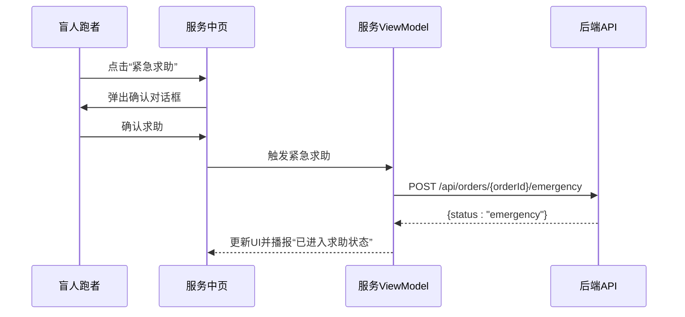
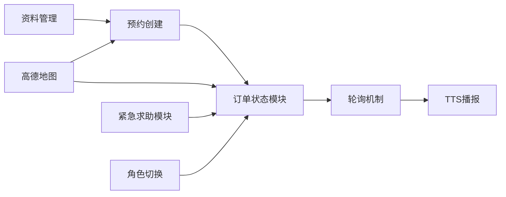

# 盲人跑者功能

<cite>
**本文引用的文件**
- [03-用户故事.md](file://docs/03-user-stories.md)
- [04-用户流程与状态机.md](file://docs/04-user-flows-and-state-machine.md)
- [07-API契约.openapi.yaml](file://docs/07-api-contract.openapi.yaml)
- [08-iOS架构.md](file://docs/08-ios-architecture.md)
- [02-MVP范围.md](file://docs/02-mvp-scope.md)
- [盲人跑者预订需求.md](file://openspec/changes/add-aidrun-ios-spring-mvp/specs/blind-runner-booking/spec.md)
- [订单状态生命周期需求.md](file://openspec/changes/add-aidrun-ios-spring-mvp/specs/order-status-lifecycle/spec.md)
- [基础安全与紧急求助需求.md](file://openspec/changes/add-aidrun-ios-spring-mvp/specs/safety-basic-emergency/spec.md)
- [无障碍与语音UI需求.md](file://openspec/changes/add-aidrun-ios-spring-mvp/specs/accessibility-voice-ui/spec.md)
- [高德地图与定位需求.md](file://openspec/changes/add-aidrun-ios-spring-mvp/specs/amap-location/spec.md)
- [设计决策.md](file://openspec/changes/add-aidrun-ios-spring-mvp/design.md)
- [任务清单.md](file://openspec/changes/add-aidrun-ios-spring-mvp/tasks.md)
- [ContentView.swift](file://blindRun/ContentView.swift)
- [blindRunApp.swift](file://blindRun/blindRunApp.swift)
</cite>

## 目录
1. [简介](#简介)
2. [项目结构](#项目结构)
3. [核心组件](#核心组件)
4. [架构总览](#架构总览)
5. [详细组件分析](#详细组件分析)
6. [依赖关系分析](#依赖关系分析)
7. [性能考虑](#性能考虑)
8. [故障排除指南](#故障排除指南)
9. [结论](#结论)
10. [附录](#附录)

## 简介
本文件面向“盲人跑者功能模块”，基于仓库内的用户故事、流程与状态机、API契约、iOS架构文档以及各规格需求，系统化梳理并阐述以下能力：
- 跑者资料管理：必填字段、紧急联系人校验、资料保存与展示
- 预约创建流程：表单验证、服务时间选择、地点确认、费用计算说明
- 订单状态跟踪：状态机、轮询机制、通知与进度展示、历史记录
- 紧急求助：触发机制、确认流程、安全保护与异常终态

文档同时提供用户故事场景与业务流程图，帮助开发者与产品人员对齐实现细节。

## 项目结构
仓库采用“多模块 + 规格驱动”的组织方式：
- 文档层：用户故事、流程与状态机、API契约、iOS架构、MVP范围等
- 规格层：新增变更中的各项需求规格（盲人跑者预订、订单生命周期、安全与紧急、无障碍与语音、高德地图与定位）
- 示例代码：SwiftUI 应用入口与内容视图（用于演示结构）

**图表来源**
- [03-用户故事.md:1-876](file://docs/03-user-stories.md#L1-L876)
- [04-用户流程与状态机.md:1-309](file://docs/04-user-flows-and-state-machine.md#L1-L309)
- [07-API契约.openapi.yaml:1-1117](file://docs/07-api-contract.openapi.yaml#L1-L1117)
- [08-iOS架构.md:1-165](file://docs/08-ios-architecture.md#L1-L165)
- [盲人跑者预订需求.md:1-34](file://openspec/changes/add-aidrun-ios-spring-mvp/specs/blind-runner-booking/spec.md#L1-L34)
- [订单状态生命周期需求.md:1-66](file://openspec/changes/add-aidrun-ios-spring-mvp/specs/order-status-lifecycle/spec.md#L1-L66)
- [基础安全与紧急求助需求.md:1-42](file://openspec/changes/add-aidrun-ios-spring-mvp/specs/safety-basic-emergency/spec.md#L1-L42)
- [无障碍与语音UI需求.md:1-42](file://openspec/changes/add-aidrun-ios-spring-mvp/specs/accessibility-voice-ui/spec.md#L1-L42)
- [高德地图与定位需求.md:1-38](file://openspec/changes/add-aidrun-ios-spring-mvp/specs/amap-location/spec.md#L1-L38)
- [设计决策.md:18-28](file://openspec/changes/add-aidrun-ios-spring-mvp/design.md#L18-L28)
- [任务清单.md:28-53](file://openspec/changes/add-aidrun-ios-spring-mvp/tasks.md#L28-L53)
- [blindRunApp.swift:1-18](file://blindRun/blindRunApp.swift#L1-L18)
- [ContentView.swift:1-25](file://blindRun/ContentView.swift#L1-L25)

**章节来源**
- [03-用户故事.md:161-401](file://docs/03-user-stories.md#L161-L401)
- [04-用户流程与状态机.md:1-309](file://docs/04-user-flows-and-state-machine.md#L1-L309)
- [08-iOS架构.md:18-49](file://docs/08-ios-architecture.md#L18-L49)
- [任务清单.md:28-53](file://openspec/changes/add-aidrun-ios-spring-mvp/tasks.md#L28-L53)

## 核心组件
围绕盲人跑者功能，核心组件与职责如下：
- 资料管理模块：负责盲人资料创建/更新，强制必填字段与紧急联系人校验
- 预约创建模块：负责表单验证、时间选择、地点确认、订单创建
- 订单状态模块：负责状态机、轮询、通知播报、历史记录
- 安全与紧急模块：负责紧急求助触发、确认流程、异常终态与安全数据记录
- 无障碍与语音模块：负责 VoiceOver、TTS、大按钮、重复状态、语音输入

这些组件在 iOS 架构中以 MVVM 形式组织，视图保持简洁，业务逻辑集中在 ViewModel 与 Service 中。

**章节来源**
- [08-iOS架构.md:18-49](file://docs/08-ios-architecture.md#L18-L49)
- [无障碍与语音UI需求.md:1-42](file://openspec/changes/add-aidrun-ios-spring-mvp/specs/accessibility-voice-ui/spec.md#L1-L42)
- [基础安全与紧急求助需求.md:1-42](file://openspec/changes/add-aidrun-ios-spring-mvp/specs/safety-basic-emergency/spec.md#L1-L42)

## 架构总览
盲人跑者功能在整体架构中的位置与交互如下：

**图表来源**
- [04-用户流程与状态机.md:120-178](file://docs/04-user-flows-and-state-machine.md#L120-L178)
- [08-iOS架构.md:125-138](file://docs/08-ios-architecture.md#L125-L138)
- [07-API契约.openapi.yaml:150-387](file://docs/07-api-contract.openapi.yaml#L150-L387)

## 详细组件分析

### 资料管理（必填字段与紧急联系人）
- 必填要求：昵称、紧急联系人姓名、紧急联系人电话
- 校验规则：
  - 未填写必填项时阻止提交并提示
  - 紧急联系人电话需符合手机号格式
- 保存与展示：资料保存到后端，完成后进入盲人首页

**图表来源**
- [03-用户故事.md:163-188](file://docs/03-user-stories.md#L163-L188)
- [盲人跑者预订需求.md:3-10](file://openspec/changes/add-aidrun-ios-spring-mvp/specs/blind-runner-booking/spec.md#L3-L10)

**章节来源**
- [03-用户故事.md:163-188](file://docs/03-user-stories.md#L163-L188)
- [盲人跑者预订需求.md:3-10](file://openspec/changes/add-aidrun-ios-spring-mvp/specs/blind-runner-booking/spec.md#L3-L10)

### 预约创建流程（表单验证、时间选择、地点确认、费用计算）
- 表单验证：
  - 出发地点：默认当前定位，定位权限拒绝时阻断并引导开启
  - 预约时间：至少在当前时间30分钟之后
  - 资料完整性：必须具备完整盲人资料与紧急联系人
- 服务时间选择：DatePicker 控件，限制最小间隔
- 地点确认：集成高德地图显示当前位置与订单起点
- 费用计算：MVP 不包含支付与费用计算，仅记录可选项（目的地、预计时长、距离、配速偏好、同性志愿者偏好、备注）

**图表来源**
- [03-用户故事.md:225-251](file://docs/03-user-stories.md#L225-L251)
- [07-API契约.openapi.yaml:150-187](file://docs/07-api-contract.openapi.yaml#L150-L187)
- [高德地图与定位需求.md:11-21](file://openspec/changes/add-aidrun-ios-spring-mvp/specs/amap-location/spec.md#L11-L21)

**章节来源**
- [03-用户故事.md:225-251](file://docs/03-user-stories.md#L225-L251)
- [07-API契约.openapi.yaml:150-187](file://docs/07-api-contract.openapi.yaml#L150-L187)
- [高德地图与定位需求.md:11-21](file://openspec/changes/add-aidrun-ios-spring-mvp/specs/amap-location/spec.md#L11-L21)

### 订单状态跟踪（状态机、轮询、通知与历史）
- 状态机（盲人视角）：
  - matching → accepted → arrived → in_progress → completed
  - emergency 为异常终态，不支持恢复
- 轮询机制：在匹配中、已接单、已到达、服务中页面每5秒轮询订单详情
- 通知与播报：状态变化时触发 TTS 播报
- 历史记录：完成/取消订单列表，按时间倒序

**图表来源**
- [04-用户流程与状态机.md:72-119](file://docs/04-user-flows-and-state-machine.md#L72-L119)
- [08-iOS架构.md:125-138](file://docs/08-ios-architecture.md#L125-L138)

**章节来源**
- [04-用户流程与状态机.md:72-119](file://docs/04-user-flows-and-state-machine.md#L72-L119)
- [08-iOS架构.md:125-138](file://docs/08-ios-architecture.md#L125-L138)

### 紧急求助（触发机制、确认流程与安全保护）
- 触发条件：仅在 accepted / arrived / in_progress 三状态下允许
- 确认流程：弹出二次确认对话框，确认后进入 emergency 异常态
- 安全保护：MVP 不自动外呼/短信，仅记录紧急联系人与事件数据
- 异常终态：emergency 不支持恢复，正常生命周期动作被拒绝

**图表来源**
- [04-用户流程与状态机.md:230-257](file://docs/04-user-flows-and-state-machine.md#L230-L257)
- [基础安全与紧急求助需求.md:11-34](file://openspec/changes/add-aidrun-ios-spring-mvp/specs/safety-basic-emergency/spec.md#L11-L34)

**章节来源**
- [04-用户流程与状态机.md:230-257](file://docs/04-user-flows-and-state-machine.md#L230-L257)
- [基础安全与紧急求助需求.md:11-34](file://openspec/changes/add-aidrun-ios-spring-mvp/specs/safety-basic-emergency/spec.md#L11-L34)

### 用户故事场景与业务流程图
- 正向流程（盲人跑者）：登录 → 资料填写 → 预约创建 → 等待接单 → 志愿者到达 → 确认开始 → 服务中 → 完成/评分
- 正向流程（志愿者）：登录 → Mock 认证 → 可服务开关 → 查看附近订单 → 接单 → 到达 → 服务中 → 结束服务
- 紧急求助流程：任一方在 active 状态点击求助 → 二次确认 → 状态转 emergency
- 角色切换拦截：存在活跃订单时禁止切换角色

```mermaid
flowchart TD
subgraph "盲人跑者正向流程"
BR1["登录"] --> BR2["资料填写"]
BR2 --> BR3["创建预约"]
BR3 --> BR4["等待接单"]
BR4 --> BR5["志愿者到达"]
BR5 --> BR6["确认开始服务"]
BR6 --> BR7["服务中"]
BR7 --> BR8["完成/评分"]
end
subgraph "志愿者正向流程"
VOL1["登录"] --> VOL2["Mock认证"]
VOL2 --> VOL3["可服务开关"]
VOL3 --> VOL4["查看附近订单"]
VOL4 --> VOL5["接单"]
VOL5 --> VOL6["到达"]
VOL6 --> VOL7["服务中"]
VOL7 --> VOL8["结束服务"]
end
subgraph "紧急求助"
EM1["active状态"] --> EM2["点击求助"]
EM2 --> EM3["二次确认"]
EM3 --> EM4["状态=emergency"]
end
```

**图表来源**
- [04-用户流程与状态机.md:120-228](file://docs/04-user-flows-and-state-machine.md#L120-L228)

**章节来源**
- [04-用户流程与状态机.md:1-309](file://docs/04-user-flows-and-state-machine.md#L1-L309)

## 依赖关系分析
- 业务依赖：资料完整性 → 预约创建；预约创建 → 订单状态轮询；状态轮询 → TTS播报
- 技术依赖：高德地图提供真实地图与定位；AVSpeechSynthesizer 提供 TTS；UserDefaults 存储 JWT
- 安全依赖：紧急求助需二次确认；异常状态不可恢复；角色切换受活跃订单约束

**图表来源**
- [08-iOS架构.md:98-147](file://docs/08-ios-architecture.md#L98-L147)
- [无障碍与语音UI需求.md:19-34](file://openspec/changes/add-aidrun-ios-spring-mvp/specs/accessibility-voice-ui/spec.md#L19-L34)
- [基础安全与紧急求助需求.md:11-34](file://openspec/changes/add-aidrun-ios-spring-mvp/specs/safety-basic-emergency/spec.md#L11-L34)

**章节来源**
- [08-iOS架构.md:98-147](file://docs/08-ios-architecture.md#L98-L147)
- [无障碍与语音UI需求.md:19-34](file://openspec/changes/add-aidrun-ios-spring-mvp/specs/accessibility-voice-ui/spec.md#L19-L34)
- [基础安全与紧急求助需求.md:11-34](file://openspec/changes/add-aidrun-ios-spring-mvp/specs/safety-basic-emergency/spec.md#L11-L34)

## 性能考虑
- 轮询频率：每5秒一次，覆盖关键页面，避免频繁网络请求
- 本地排序：志愿者侧按距离排序在 iOS 本地完成，降低后端压力
- 资源释放：页面离开或订单进入终态时停止轮询，减少资源占用
- 无障碍优化：大按钮与 TTS 播报减少误触与重复查看成本

**章节来源**
- [08-iOS架构.md:125-138](file://docs/08-ios-architecture.md#L125-L138)
- [高德地图与定位需求.md:23-29](file://openspec/changes/add-aidrun-ios-spring-mvp/specs/amap-location/spec.md#L23-L29)

## 故障排除指南
- 定位权限被拒绝：
  - 盲人端：阻止创建预约，引导开启定位权限
  - 志愿者端：阻止查看/排序附近订单，引导开启定位权限
- 资料不完整：
  - 预约创建前校验失败，提示“请先完善资料/紧急联系人”
- 预约时间过近：
  - 提示“预约时间需至少在30分钟后”，阻止提交
- 角色切换被拦截：
  - 存在活跃订单时弹出警告，提示“您有进行中的订单，无法切换角色”
- 紧急求助：
  - 仅在 active 状态允许；二次确认后进入 emergency，不可恢复

**章节来源**
- [03-用户故事.md:248-251](file://docs/03-user-stories.md#L248-L251)
- [03-用户故事.md:139-158](file://docs/03-user-stories.md#L139-L158)
- [07-API契约.openapi.yaml:489-541](file://docs/07-api-contract.openapi.yaml#L489-L541)
- [基础安全与紧急求助需求.md:11-34](file://openspec/changes/add-aidrun-ios-spring-mvp/specs/safety-basic-emergency/spec.md#L11-L34)

## 结论
盲人跑者功能模块以用户故事与状态机为驱动，结合高德地图、TTS 与无障碍设计，构建了从资料管理到预约创建、状态跟踪与紧急求助的完整闭环。通过严格的表单校验、轮询机制与异常终态设计，确保服务流程的可控性与安全性。建议在后续版本中逐步引入更丰富的无障碍能力与更灵活的费用计算模型。

## 附录
- API 端点概览（与盲人跑者相关）：
  - POST /api/auth/phone-login：手机号登录/自动注册
  - PUT /api/profiles/blind-runner：盲人资料创建/更新
  - POST /api/orders：创建预约订单
  - GET /api/orders/{orderId}：获取订单详情（轮询）
  - POST /api/orders/{orderId}/accept：志愿者接单
  - POST /api/orders/{orderId}/arrive：志愿者到达
  - POST /api/orders/{orderId}/confirm-start：盲人确认开始
  - POST /api/orders/{orderId}/complete：志愿者结束服务
  - POST /api/orders/{orderId}/cancel：取消订单
  - POST /api/orders/{orderId}/emergency：触发紧急求助
  - GET /api/orders/my：获取我的订单（历史/轮询）

**章节来源**
- [07-API契约.openapi.yaml:25-387](file://docs/07-api-contract.openapi.yaml#L25-L387)