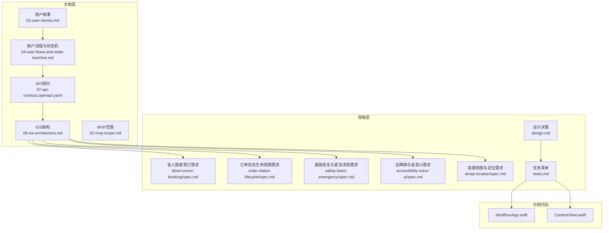
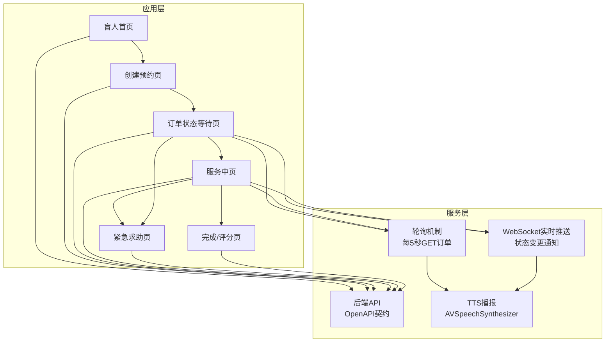
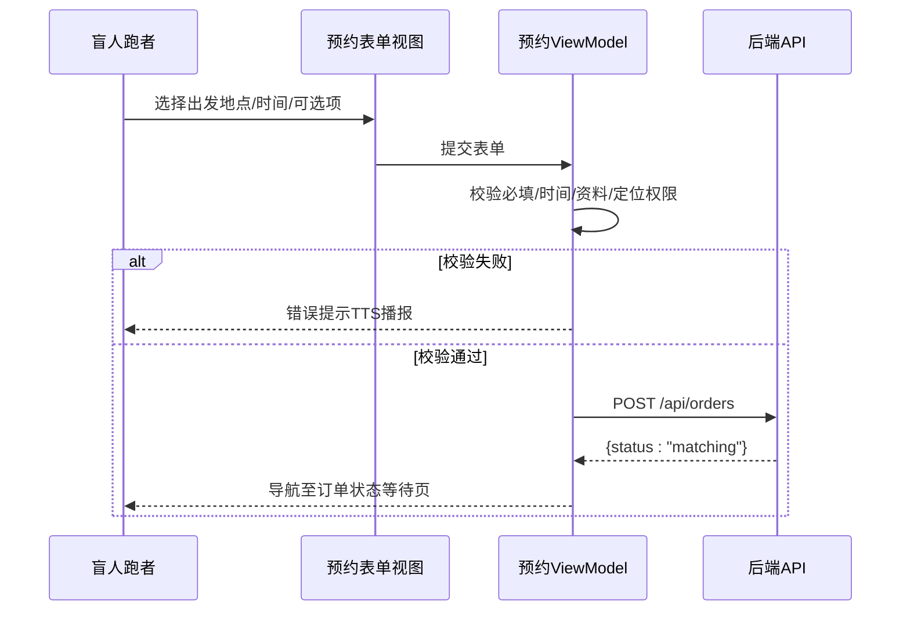
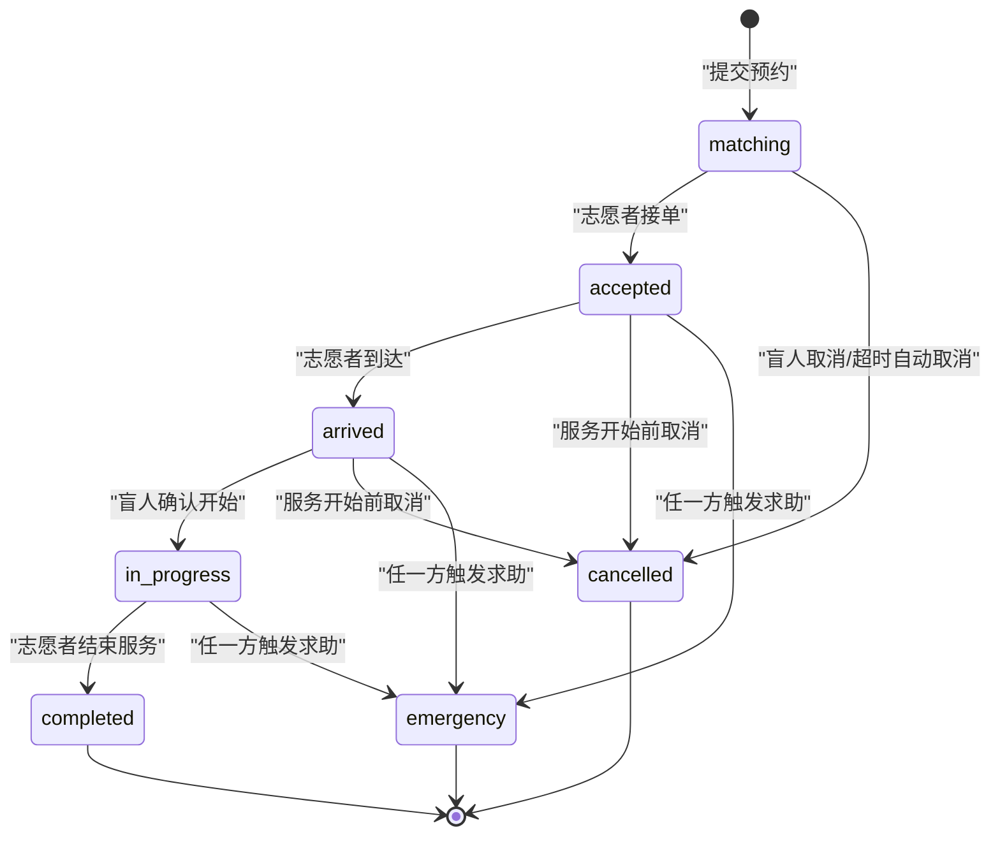
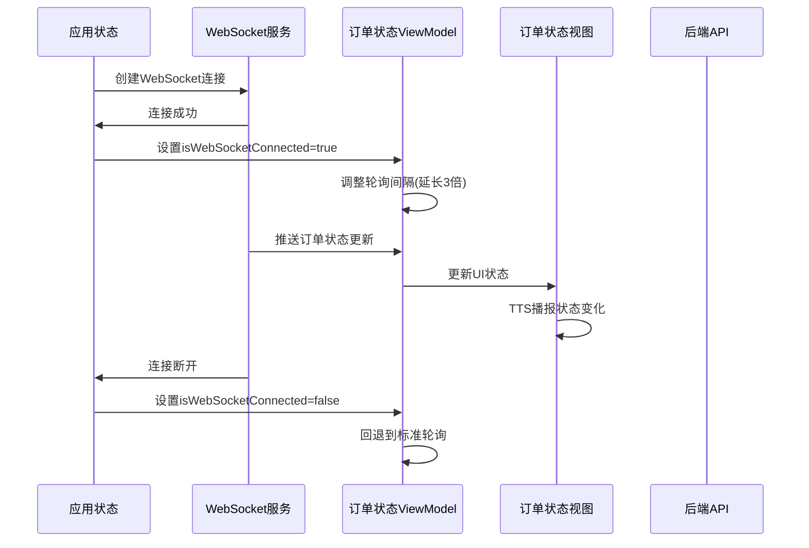
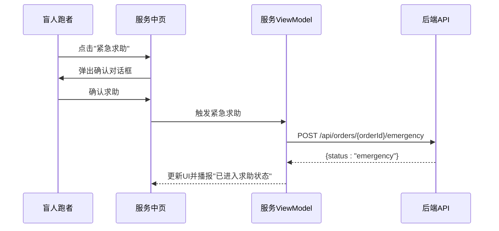
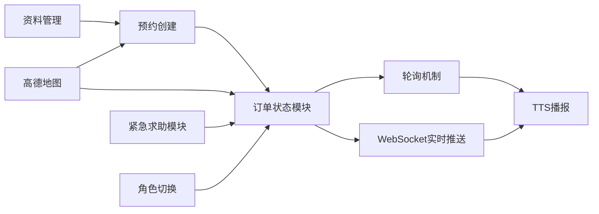

# 盲人跑者功能

<cite>
**本文引用的文件**
- [03-用户故事.md](file://docs/03-user-stories.md)
- [04-用户流程与状态机.md](file://docs/04-user-flows-and-state-machine.md)
- [07-API契约.openapi.yaml](file://docs/07-api-contract.openapi.yaml)
- [08-iOS架构.md](file://docs/08-ios-architecture.md)
- [02-MVP范围.md](file://docs/02-mvp-scope.md)
- [盲人跑者预订需求.md](file://openspec/changes/add-aidrun-ios-spring-mvp/specs/blind-runner-booking/spec.md)
- [订单状态生命周期需求.md](file://openspec/changes/add-aidrun-ios-spring-mvp/specs/order-status-lifecycle/spec.md)
- [基础安全与紧急求助需求.md](file://openspec/changes/add-aidrun-ios-spring-mvp/specs/safety-basic-emergency/spec.md)
- [无障碍与语音UI需求.md](file://openspec/changes/add-aidrun-ios-spring-mvp/specs/accessibility-voice-ui/spec.md)
- [高德地图与定位需求.md](file://openspec/changes/add-aidrun-ios-spring-mvp/specs/amap-location/spec.md)
- [设计决策.md](file://openspec/changes/add-aidrun-ios-spring-mvp/design.md)
- [任务清单.md](file://openspec/changes/add-aidrun-ios-spring-mvp/tasks.md)
- [BlindBookingView.swift](file://blindRun/blindRun/BlindRunner/BlindBookingView.swift)
- [BlindOrderStatusView.swift](file://blindRun/blindRun/BlindRunner/BlindOrderStatusView.swift)
- [SpeechInputService.swift](file://blindRun/blindRun/Voice/SpeechInputService.swift)
- [AMapContainer.swift](file://blindRun/blindRun/Map/AMapContainer.swift)
- [AMapManager.swift](file://blindRun/blindRun/Map/AMapManager.swift)
- [OrderModels.swift](file://blindRun/blindRun/Core/Models/OrderModels.swift)
- [OrderDisplayHelpers.swift](file://blindRun/blindRun/Core/Models/OrderDisplayHelpers.swift)
- [WebSocketModels.swift](file://blindRun/blindRun/Core/Models/WebSocketModels.swift)
- [WebSocketService.swift](file://blindRun/blindRun/Core/WebSocketService.swift)
- [AppState.swift](file://blindRun/blindRun/Core/AppState.swift)
- [AppColors.swift](file://blindRun/blindRun/Core/DesignSystem/AppColors.swift)
- [HighContrastText.swift](file://blindRun/blindRun/Core/DesignSystem/HighContrastText.swift)
- [blindRunApp.swift](file://blindRun/blindRun/blindRunApp.swift)
- [ContentView.swift](file://blindRun/blindRun/ContentView.swift)
</cite>

## 更新摘要
**所做更改**
- 新增 WebSocket 实时更新能力，包括盲人订单状态视图的事件订阅逻辑
- 实现 WebSocket 与轮询机制的智能切换，提升实时性和性能
- 增强 WebSocket 连接状态管理，支持连接状态感知和降级处理
- 优化订单状态跟踪的响应速度和用户体验

## 目录
1. [简介](#简介)
2. [项目结构](#项目结构)
3. [核心组件](#核心组件)
4. [架构总览](#架构总览)
5. [详细组件分析](#详细组件分析)
6. [依赖关系分析](#依赖关系分析)
7. [性能考虑](#性能考虑)
8. [故障排除指南](#故障排除指南)
9. [结论](#结论)
10. [附录](#附录)

## 简介
本文件面向"盲人跑者功能模块"，基于仓库内的用户故事、流程与状态机、API契约、iOS架构文档以及各规格需求，系统化梳理并阐述以下能力：
- 跑者资料管理：必填字段、紧急联系人校验、资料保存与展示
- 预约创建流程：表单验证、服务时间选择、地点确认、费用计算说明
- 订单状态跟踪：状态机、轮询机制、通知与进度展示、历史记录
- 紧急求助：触发机制、确认流程、安全保护与异常终态
- **WebSocket 实时更新**：实时状态推送、连接状态感知、智能降级策略

文档同时提供用户故事场景与业务流程图，帮助开发者与产品人员对齐实现细节。

## 项目结构
仓库采用"多模块 + 规格驱动"的组织方式：
- 文档层：用户故事、流程与状态机、API契约、iOS架构、MVP范围等
- 规格层：新增变更中的各项需求规格（盲人跑者预订、订单生命周期、安全与紧急、无障碍与语音、高德地图与定位）
- 示例代码：SwiftUI 应用入口与内容视图（用于演示结构）

**图表来源**
- [03-用户故事.md:1-876](file://docs/03-user-stories.md#L1-L876)
- [04-用户流程与状态机.md:1-309](file://docs/04-user-flows-and-state-machine.md#L1-L309)
- [07-API契约.openapi.yaml:1-1117](file://docs/07-api-contract.openapi.yaml#L1-L1117)
- [08-iOS架构.md:1-165](file://docs/08-iOS-architecture.md#L1-L165)
- [盲人跑者预订需求.md:1-34](file://openspec/changes/add-aidrun-ios-spring-mvp/specs/blind-runner-booking/spec.md#L1-L34)
- [订单状态生命周期需求.md:1-66](file://openspec/changes/add-aidrun-ios-spring-mvp/specs/order-status-lifecycle/spec.md#L1-L66)
- [基础安全与紧急求助需求.md:1-42](file://openspec/changes/add-aidrun-ios-spring-mvp/specs/safety-basic-emergency/spec.md#L1-L42)
- [无障碍与语音UI需求.md:1-42](file://openspec/changes/add-aidrun-ios-spring-mvp/specs/accessibility-voice-ui/spec.md#L1-L42)
- [高德地图与定位需求.md:1-38](file://openspec/changes/add-aidrun-ios-spring-mvp/specs/amap-location/spec.md#L1-L38)
- [设计决策.md:18-28](file://openspec/changes/add-aidrun-ios-spring-mvp/design.md#L18-L28)
- [任务清单.md:28-53](file://openspec/changes/add-aidrun-ios-spring-mvp/tasks.md#L28-L53)
- [blindRunApp.swift:1-18](file://blindRun/blindRun/blindRunApp.swift#L1-L18)
- [ContentView.swift:1-25](file://blindRun/blindRun/ContentView.swift#L1-L25)

**章节来源**
- [03-用户故事.md:161-401](file://docs/03-user-stories.md#L161-L401)
- [04-用户流程与状态机.md:1-309](file://docs/04-user-flows-and-state-machine.md#L1-L309)
- [08-iOS架构.md:18-49](file://docs/08-iOS-architecture.md#L18-L49)
- [任务清单.md:28-53](file://openspec/changes/add-aidrun-ios-spring-mvp/tasks.md#L28-L53)

## 核心组件
围绕盲人跑者功能，核心组件与职责如下：
- 资料管理模块：负责盲人资料创建/更新，强制必填字段与紧急联系人校验
- 预约创建模块：负责表单验证、时间选择、地点确认、订单创建
- 订单状态模块：负责状态机、轮询、通知播报、历史记录、**WebSocket 实时更新**
- 安全与紧急模块：负责紧急求助触发、确认流程、异常终态与安全数据记录
- 无障碍与语音模块：负责 VoiceOver、TTS、大按钮、重复状态、语音输入
- **WebSocket 服务模块**：负责实时消息推送、连接状态管理、智能降级策略

这些组件在 iOS 架构中以 MVVM 形式组织，视图保持简洁，业务逻辑集中在 ViewModel 与 Service 中。

**章节来源**
- [08-iOS架构.md:18-49](file://docs/08-iOS-architecture.md#L18-L49)
- [无障碍与语音UI需求.md:1-42](file://openspec/changes/add-aidrun-ios-spring-mvp/specs/accessibility-voice-ui/spec.md#L1-L42)
- [基础安全与紧急求助需求.md:1-42](file://openspec/changes/add-aidrun-ios-spring-mvp/specs/safety-basic-emergency/spec.md#L1-L42)

## 架构总览
盲人跑者功能在整体架构中的位置与交互如下：

**图表来源**
- [04-用户流程与状态机.md:120-178](file://docs/04-user-flows-and-state-machine.md#L120-L178)
- [08-iOS架构.md:125-138](file://docs/08-iOS-architecture.md#L125-L138)
- [07-API契约.openapi.yaml:150-387](file://docs/07-api-contract.openapi.yaml#L150-L387)

## 详细组件分析

### 资料管理（必填字段与紧急联系人）
- 必填要求：昵称、紧急联系人姓名、紧急联系人电话
- 校验规则：
  - 未填写必填项时阻止提交并提示
  - 紧急联系人电话需符合手机号格式
- 保存与展示：资料保存到后端，完成后进入盲人首页

**图表来源**
- [03-用户故事.md:163-188](file://docs/03-user-stories.md#L163-L188)
- [盲人跑者预订需求.md:3-10](file://openspec/changes/add-aidrun-ios-spring-mvp/specs/blind-runner-booking/spec.md#L3-L10)

**章节来源**
- [03-用户故事.md:163-188](file://docs/03-user-stories.md#L163-L188)
- [盲人跑者预订需求.md:3-10](file://openspec/changes/add-aidrun-ios-spring-mvp/specs/blind-runner-booking/spec.md#L3-L10)

### 预约创建流程（表单验证、时间选择、地点确认、费用计算）
- 表单验证：
  - 出发地点：默认当前定位，定位权限拒绝时阻断并引导开启
  - 预约时间：至少在当前时间30分钟之后
  - 资料完整性：必须具备完整盲人资料与紧急联系人
- 服务时间选择：DatePicker 控件，限制最小间隔
- 地点确认：集成高德地图显示当前位置与订单起点
- 费用计算：MVP 不包含支付与费用计算，仅记录可选项（目的地、预计时长、距离、配速偏好、同性志愿者偏好、备注）

**图表来源**
- [03-用户故事.md:225-251](file://docs/03-user-stories.md#L225-L251)
- [07-API契约.openapi.yaml:150-187](file://docs/07-api-contract.openapi.yaml#L150-L187)
- [高德地图与定位需求.md:11-21](file://openspec/changes/add-aidrun-ios-spring-mvp/specs/amap-location/spec.md#L11-L21)

**章节来源**
- [03-用户故事.md:225-251](file://docs/03-user-stories.md#L225-L251)
- [07-API契约.openapi.yaml:150-187](file://docs/07-api-contract.openapi.yaml#L150-L187)
- [高德地图与定位需求.md:11-21](file://openspec/changes/add-aidrun-ios-spring-mvp/specs/amap-location/spec.md#L11-L21)

### 订单状态跟踪（状态机、轮询、通知与历史）
- 状态机（盲人视角）：
  - matching → accepted → arrived → in_progress → completed
  - emergency 为异常终态，不支持恢复
- **WebSocket 实时更新**：当 WebSocket 连接建立时，优先使用实时推送，轮询间隔自动延长3倍
- **智能降级策略**：WebSocket 断开时自动回退到轮询机制
- 通知与播报：状态变化时触发 TTS 播报
- 历史记录：完成/取消订单列表，按时间倒序

**图表来源**
- [04-用户流程与状态机.md:72-119](file://docs/04-user-flows-and-state-machine.md#L72-L119)
- [08-iOS架构.md:125-138](file://docs/08-iOS-architecture.md#L125-L138)

**章节来源**
- [04-用户流程与状态机.md:72-119](file://docs/04-user-flows-and-state-machine.md#L72-L119)
- [08-iOS架构.md:125-138](file://docs/08-iOS-architecture.md#L125-L138)

### WebSocket 实时更新能力
**WebSocket 服务架构**：
- **连接管理**：AppState 统一管理 WebSocket 连接生命周期
- **智能切换**：根据连接状态动态调整轮询策略
- **事件订阅**：盲人订单状态视图订阅实时状态更新

**核心实现特性**：
- **连接状态感知**：通过 `appState.isWebSocketConnected` 实时检测连接状态
- **动态轮询调整**：连接时轮询间隔延长3倍，断开时使用标准间隔
- **无缝降级**：WebSocket 断开时自动回退到轮询机制
- **事件处理**：接收后端推送的状态变更事件

**图表来源**
- [BlindOrderStatusView.swift:19-25](file://blindRun/blindRun/BlindRunner/BlindOrderStatusView.swift#L19-L25)
- [BlindOrderStatusView.swift:42](file://blindRun/blindRun/BlindRunner/BlindOrderStatusView.swift#L42)
- [AppState.swift:37-41](file://blindRun/blindRun/Core/AppState.swift#L37-L41)

**章节来源**
- [BlindOrderStatusView.swift:19-25](file://blindRun/blindRun/BlindRunner/BlindOrderStatusView.swift#L19-L25)
- [BlindOrderStatusView.swift:42](file://blindRun/blindRun/BlindRunner/BlindOrderStatusView.swift#L42)
- [AppState.swift:37-41](file://blindRun/blindRun/Core/AppState.swift#L37-L41)

### 紧急求助（触发机制、确认流程与安全保护）
- 触发条件：仅在 accepted / arrived / in_progress 三状态下允许
- 确认流程：弹出二次确认对话框，确认后进入 emergency 异常态
- 安全保护：MVP 不自动外呼/短信，仅记录紧急联系人与事件数据
- 异常终态：emergency 不支持恢复，正常生命周期动作被拒绝

**图表来源**
- [04-用户流程与状态机.md:230-257](file://docs/04-user-flows-and-state-machine.md#L230-L257)
- [基础安全与紧急求助需求.md:11-34](file://openspec/changes/add-aidrun-ios-spring-mvp/specs/safety-basic-emergency/spec.md#L11-L34)

**章节来源**
- [04-用户流程与状态机.md:230-257](file://docs/04-user-flows-and-state-machine.md#L230-L257)
- [基础安全与紧急求助需求.md:11-34](file://openspec/changes/add-aidrun-ios-spring-mvp/specs/safety-basic-emergency/spec.md#L11-L34)

### 用户故事场景与业务流程图
- 正向流程（盲人跑者）：登录 → 资料填写 → 预约创建 → 等待接单 → 志愿者到达 → 确认开始 → 服务中 → 完成/评分
- 正向流程（志愿者）：登录 → Mock 认证 → 可服务开关 → 查看附近订单 → 接单 → 到达 → 服务中 → 结束服务
- 紧急求助流程：任一方在 active 状态点击求助 → 二次确认 → 状态转 emergency
- 角色切换拦截：存在活跃订单时禁止切换角色
- **WebSocket 实时更新流程**：连接建立 → 实时推送启用 → 状态变更即时响应 → 连接断开 → 自动降级轮询

**图表来源**
- [04-用户流程与状态机.md:120-228](file://docs/04-user-flows-and-state-machine.md#L120-L228)

**章节来源**
- [04-用户流程与状态机.md:1-309](file://docs/04-user-flows-and-state-machine.md#L1-L309)

## 依赖关系分析
- 业务依赖：资料完整性 → 预约创建；预约创建 → 订单状态轮询；状态轮询 → TTS播报
- 技术依赖：高德地图提供真实地图与定位；AVSpeechSynthesizer 提供 TTS；UserDefaults 存储 JWT
- 安全依赖：紧急求助需二次确认；异常状态不可恢复；角色切换受活跃订单约束
- **WebSocket 依赖**：实时更新依赖 WebSocket 连接状态；连接状态影响轮询策略；提供更好的用户体验

**图表来源**
- [08-iOS架构.md:98-147](file://docs/08-iOS-architecture.md#L98-L147)
- [无障碍与语音UI需求.md:19-34](file://openspec/changes/add-aidrun-ios-spring-mvp/specs/accessibility-voice-ui/spec.md#L19-L34)
- [基础安全与紧急求助需求.md:11-34](file://openspec/changes/add-aidrun-ios-spring-mvp/specs/safety-basic-emergency/spec.md#L11-L34)

**章节来源**
- [08-iOS架构.md:98-147](file://docs/08-iOS-architecture.md#L98-L147)
- [无障碍与语音UI需求.md:19-34](file://openspec/changes/add-aidrun-ios-spring-mvp/specs/accessibility-voice-ui/spec.md#L19-L34)
- [基础安全与紧急求助需求.md:11-34](file://openspec/changes/add-aidrun-ios-spring-mvp/specs/safety-basic-emergency/spec.md#L11-L34)

## 性能考虑
- 轮询频率：每5秒一次，覆盖关键页面，避免频繁网络请求
- **WebSocket 优化**：连接时轮询间隔延长3倍，减少不必要的轮询请求
- 本地排序：志愿者侧按距离排序在 iOS 本地完成，降低后端压力
- 资源释放：页面离开或订单进入终态时停止轮询，减少资源占用
- 无障碍优化：大按钮与 TTS 播报减少误触与重复查看成本
- **智能降级**：WebSocket 断开时自动回退，确保功能可用性

**章节来源**
- [08-iOS架构.md:125-138](file://docs/08-iOS-architecture.md#L125-L138)
- [高德地图与定位需求.md:23-29](file://openspec/changes/add-aidrun-ios-spring-mvp/specs/amap-location/spec.md#L23-L29)

## 故障排除指南
- 定位权限被拒绝：
  - 盲人端：阻止创建预约，引导开启定位权限
  - 志愿者端：阻止查看/排序附近订单，引导开启定位权限
- 资料不完整：
  - 预约创建前校验失败，提示"请先完善资料/紧急联系人"
- 预约时间过近：
  - 提示"预约时间需至少在30分钟后"，阻止提交
- 角色切换被拦截：
  - 存在活跃订单时弹出警告，提示"您有进行中的订单，无法切换角色"
- 紧急求助：
  - 仅在 active 状态允许；二次确认后进入 emergency，不可恢复
- **WebSocket 连接问题**：
  - 连接失败：自动回退到轮询机制，功能不受影响
  - 连接中断：自动重连，状态更新延迟但不会丢失
  - 状态异常：检查网络连接和后端服务状态

**章节来源**
- [03-用户故事.md:248-251](file://docs/03-user-stories.md#L248-L251)
- [03-用户故事.md:139-158](file://docs/03-user-stories.md#L139-L158)
- [07-API契约.openapi.yaml:489-541](file://docs/07-api-contract.openapi.yaml#L489-L541)
- [基础安全与紧急求助需求.md:11-34](file://openspec/changes/add-aidrun-ios-spring-mvp/specs/safety-basic-emergency/spec.md#L11-L34)

## 结论
盲人跑者功能模块以用户故事与状态机为驱动，结合高德地图、TTS 与无障碍设计，构建了从资料管理到预约创建、状态跟踪与紧急求助的完整闭环。通过严格的表单校验、轮询机制与异常终态设计，确保服务流程的可控性与安全性。

**WebSocket 实时更新能力的引入进一步提升了用户体验**：
- 实时状态响应，减少等待时间
- 智能连接管理，确保功能稳定性
- 平滑降级机制，保证服务连续性
- 性能优化策略，平衡实时性和资源消耗

建议在后续版本中逐步引入更丰富的无障碍能力与更灵活的费用计算模型。

## 附录
- API 端点概览（与盲人跑者相关）：
  - POST /api/auth/phone-login：手机号登录/自动注册
  - PUT /api/profiles/blind-runner：盲人资料创建/更新
  - POST /api/orders：创建预约订单
  - GET /api/orders/{orderId}：获取订单详情（轮询）
  - POST /api/orders/{orderId}/accept：志愿者接单
  - POST /api/orders/{orderId}/arrive：志愿者到达
  - POST /api/orders/{orderId}/confirm-start：盲人确认开始
  - POST /api/orders/{orderId}/complete：志愿者结束服务
  - POST /api/orders/{orderId}/cancel：取消订单
  - POST /api/orders/{orderId}/emergency：触发紧急求助
  - GET /api/orders/my：获取我的订单（历史/轮询）

**WebSocket 相关实现**：
- **WebSocket 服务**：统一管理连接生命周期和消息处理
- **AppState 集成**：提供连接状态的全局访问
- **智能降级**：连接状态变化时自动调整轮询策略
- **事件订阅**：支持实时状态更新和错误处理

**章节来源**
- [07-API契约.openapi.yaml:25-387](file://docs/07-api-contract.openapi.yaml#L25-L387)
- [WebSocketService.swift:31-150](file://blindRun/blindRun/Core/WebSocketService.swift#L31-L150)
- [AppState.swift:219-239](file://blindRun/blindRun/Core/AppState.swift#L219-L239)

### 盲人跑者预约系统实现

#### BlindBookingView 组件
BlindBookingView 是盲人跑者预约系统的核心界面组件，实现了完整的预约创建流程：

**核心功能特性：**
- **语音输入集成**：支持语音搜索地点和语音输入文本
- **高德地图集成**：实时显示当前位置和搜索结果
- **智能表单验证**：动态验证预约时间和地点有效性
- **无障碍设计**：完整的 VoiceOver 支持和高对比度显示

**技术实现要点：**
- 使用 `VoiceTextField` 组件集成语音输入服务
- 通过 `AMapContainer` 和 `MapViewWrapper` 实现地图显示
- 采用 `BlindBookingViewModel` 管理表单状态和业务逻辑
- 实现智能地点解析和坐标获取

**章节来源**
- [BlindBookingView.swift:291-746](file://blindRun/blindRun/BlindRunner/BlindBookingView.swift#L291-L746)
- [SpeechInputService.swift:1-187](file://blindRun/blindRun/Voice/SpeechInputService.swift#L1-L187)
- [AMapContainer.swift:19-126](file://blindRun/blindRun/Map/AMapContainer.swift#L19-L126)

#### BlindOrderStatusView 组件
BlindOrderStatusView 提供了完整的订单状态跟踪界面：

**核心功能特性：**
- **实时状态轮询**：每5秒自动刷新订单状态
- **状态播报**：通过 TTS 语音播报状态变化
- **智能动作控制**：根据状态动态显示可用操作
- **紧急求助功能**：支持一键求助和二次确认
- **WebSocket 实时更新**：优先使用实时推送，断开时自动降级

**技术实现要点：**
- 使用 `BlindOrderStatusViewModel` 管理轮询和状态逻辑
- 实现状态机驱动的动作可用性判断
- 集成确认对话框处理敏感操作
- 支持调试模式下的状态模拟
- **WebSocket 事件订阅**：通过 `subscribeToWebSocket` 方法实现

**章节来源**
- [BlindOrderStatusView.swift:162-463](file://blindRun/blindRun/BlindRunner/BlindOrderStatusView.swift#L162-L463)
- [BlindOrderStatusView.swift:159-170](file://blindRun/blindRun/BlindRunner/BlindOrderStatusView.swift#L159-L170)
- [OrderDisplayHelpers.swift:6-159](file://blindRun/blindRun/Core/Models/OrderDisplayHelpers.swift#L6-L159)

#### WebSocket 服务集成
系统集成了完整的 WebSocket 实时更新解决方案：

**WebSocketService 功能**：
- **连接管理**：自动处理连接建立、维护和断开
- **消息处理**：解析和分发 WebSocket 事件
- **错误处理**：完善的连接错误处理和重连机制
- **状态同步**：与 AppState 协调保持连接状态一致

**AppState 集成**：
- **全局访问**：提供 `webSocketService` 和 `isWebSocketConnected` 属性
- **生命周期管理**：登录时自动连接，登出时自动断开
- **状态传播**：连接状态变化时自动通知所有订阅者

**章节来源**
- [WebSocketService.swift:31-150](file://blindRun/blindRun/Core/WebSocketService.swift#L31-L150)
- [AppState.swift:37-41](file://blindRun/blindRun/Core/AppState.swift#L37-L41)
- [AppState.swift:219-239](file://blindRun/blindRun/Core/AppState.swift#L219-L239)

#### 语音输入服务集成
系统集成了完整的语音输入解决方案：

**SpeechInputService 功能：**
- **语音识别**：支持中文语音识别和实时转写
- **权限管理**：自动处理语音识别和麦克风权限
- **错误处理**：完善的错误提示和降级策略
- **字段绑定**：与特定输入字段绑定，支持多字段并发

**章节来源**
- [SpeechInputService.swift:11-187](file://blindRun/blindRun/Voice/SpeechInputService.swift#L11-L187)

#### 高德地图服务集成
系统实现了完整的地图服务集成：

**AMapContainer 组件：**
- **地图渲染**：基于高德地图 SDK 的地图显示
- **标注管理**：支持用户位置和订单标注
- **位置追踪**：实时显示用户位置和移动轨迹
- **配置管理**：支持 SDK 初始化和配置状态检测

**AMapManager 管理器：**
- **SDK 初始化**：自动从配置文件读取 API Key
- **优雅降级**：SDK 未配置时提供占位视图
- **状态监控**：监控 SDK 配置状态和可用性

**章节来源**
- [AMapContainer.swift:19-126](file://blindRun/blindRun/Map/AMapContainer.swift#L19-L126)
- [AMapManager.swift:9-50](file://blindRun/blindRun/Map/AMapManager.swift#L9-L50)

#### 订单状态模型扩展
系统增强了订单状态的显示和交互能力：

**OrderDisplayHelpers 扩展：**
- **状态机辅助**：提供状态判断和行为控制方法
- **语音播报**：为每个状态提供语音播报文本
- **视觉标识**：状态对应的图标和颜色定义
- **无障碍描述**：为每个状态提供详细的无障碍描述

**章节来源**
- [OrderDisplayHelpers.swift:6-159](file://blindRun/blindRun/Core/Models/OrderDisplayHelpers.swift#L6-L159)
- [OrderModels.swift:5-194](file://blindRun/blindRun/Core/Models/OrderModels.swift#L5-L194)

#### 无障碍设计增强
系统全面提升了无障碍体验：

**HighContrastText 组件：**
- **高对比度**：确保在深色和浅色模式下都具有良好的可读性
- **动态字体**：支持动态类型缩放，适配不同视力需求
- **语义化标签**：为每个文本元素提供清晰的语义标签

**AppColors 设计系统：**
- **色彩标准**：定义了主色调、危险色、背景色等标准色彩
- **无障碍色彩**：确保色彩对比度满足无障碍标准
- **一致性**：在整个应用中保持色彩使用的一致性

**章节来源**
- [HighContrastText.swift:7-59](file://blindRun/blindRun/Core/DesignSystem/HighContrastText.swift#L7-L59)
- [AppColors.swift:5-39](file://blindRun/blindRun/Core/DesignSystem/AppColors.swift#L5-L39)