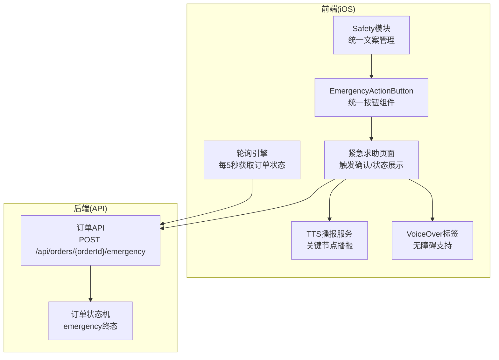
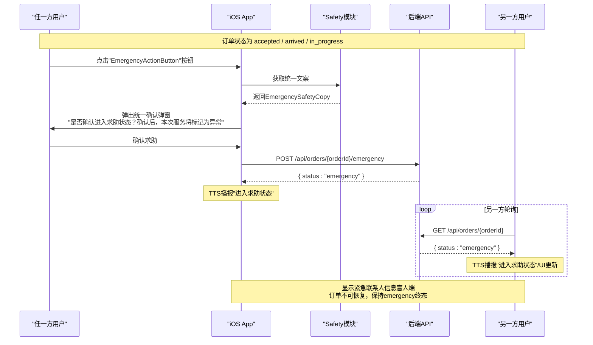
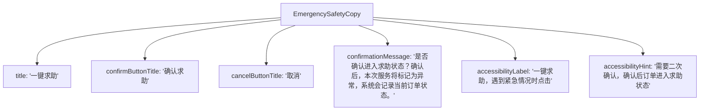
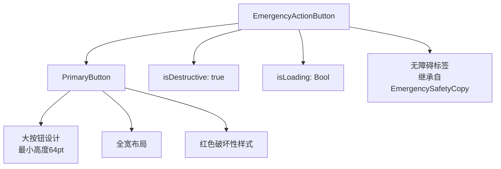
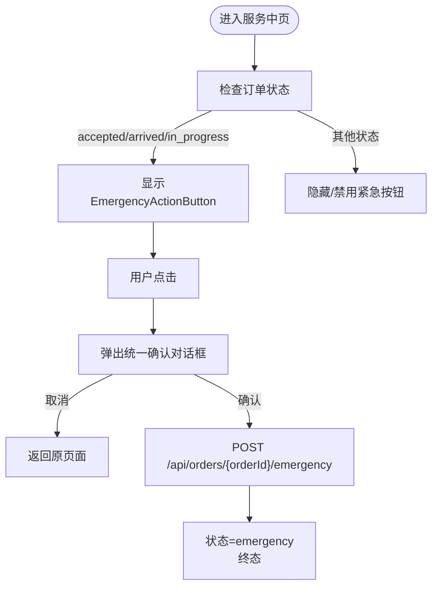
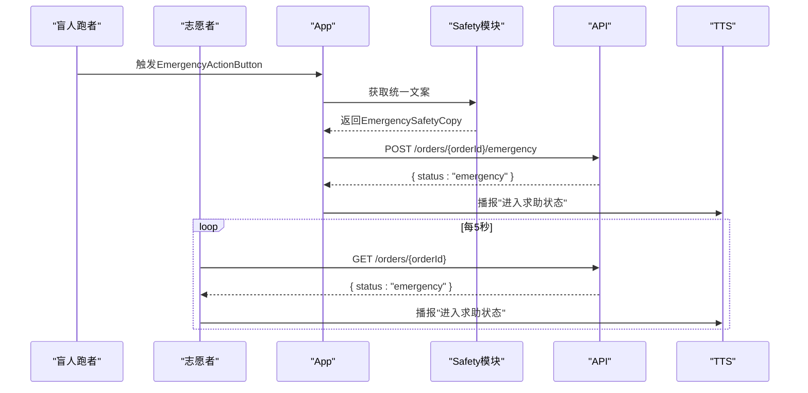
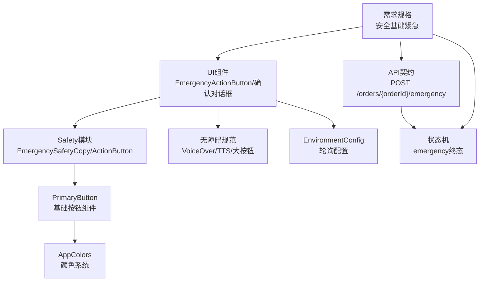

# 紧急求助功能

<cite>
**本文引用的文件**
- [04-用户流程与状态机.md](file://docs/04-user-flows-and-state-machine.md)
- [07-API契约.openapi.yaml](file://docs/07-api-contract.openapi.yaml)
- [09-无障碍与语音指南.md](file://docs/09-accessibility-and-voice-guidelines.md)
- [02-MVP范围.md](file://docs/02-mvp-scope.md)
- [spec-安全基础紧急.md](file://openspec/changes/add-aidrun-ios-spring-mvp/specs/safety-basic-emergency/spec.md)
- [spec-无障碍与语音UI.md](file://openspec/changes/add-aidrun-ios-spring-mvp/specs/accessibility-voice-ui/spec.md)
- [03-用户故事.md](file://docs/03-user-stories.md)
- [08-iOS架构.md](file://docs/08-ios-architecture.md)
- [SafetyModule.swift](file://blindRun/Safety/SafetyModule.swift)
- [BlindOrderStatusView.swift](file://blindRun/BlindRunner/BlindOrderStatusView.swift)
- [VolunteerOrderFlowViews.swift](file://blindRun/Volunteer/VolunteerOrderFlowViews.swift)
- [PrimaryButton.swift](file://blindRun/Core/DesignSystem/PrimaryButton.swift)
- [AppColors.swift](file://blindRun/Core/DesignSystem/AppColors.swift)
- [EnvironmentConfig.swift](file://blindRun/Core/EnvironmentConfig.swift)
</cite>

## 更新摘要
**变更内容**
- 新增统一的 EmergencySafetyCopy 文案管理系统
- 新增 EmergencyActionButton 统一按钮组件
- 新增 emergencyConfirmationAlert 统一确认对话框扩展
- 基于 PrimaryButton 构建的统一设计系统
- 增强的无障碍支持和用户体验一致性

## 目录
1. [简介](#简介)
2. [项目结构](#项目结构)
3. [核心组件](#核心组件)
4. [架构总览](#架构总览)
5. [详细组件分析](#详细组件分析)
6. [依赖关系分析](#依赖关系分析)
7. [性能考虑](#性能考虑)
8. [故障排查指南](#故障排查指南)
9. [结论](#结论)
10. [附录](#附录)

## 简介
本文件围绕盲人跑者紧急求助功能，系统化阐述触发机制、报警流程、安全保护措施与无障碍支持。基于MVP阶段的规范与流程文档，明确紧急求助在订单生命周期中的可用状态、确认机制、状态可视化、求助历史与安全提醒，以及通信保障与多渠道求助方式的边界与实现策略。

**更新** 新版本采用统一的 EmergencySafetyCopy 文案管理和 EmergencyActionButton 组件，提供一致的用户体验和增强的无障碍支持。

## 项目结构
紧急求助功能涉及前端iOS应用与后端API契约两部分：
- 前端：SwiftUI页面与状态管理，负责触发确认、状态轮询、TTS播报与无障碍标签。
- 后端：OpenAPI契约定义紧急求助接口与状态流转，MVP阶段不包含自动通知与真实管理员介入。

**图表来源**
- [04-用户流程与状态机.md:230-257](file://docs/04-user-flows-and-state-machine.md#L230-L257)
- [07-API契约.openapi.yaml:366-387](file://docs/07-api-contract.openapi.yaml#L366-L387)
- [SafetyModule.swift:5-42](file://blindRun/Safety/SafetyModule.swift#L5-L42)

**章节来源**
- [04-用户流程与状态机.md:1-309](file://docs/04-user-flows-and-state-machine.md#L1-L309)
- [07-API契约.openapi.yaml:1-1117](file://docs/07-api-contract.openapi.yaml#L1-L1117)

## 核心组件
- **统一文案管理**：EmergencySafetyCopy 提供所有紧急求助相关的文案，包括标题、确认按钮、取消按钮、确认消息和无障碍标签。
- **统一按钮组件**：EmergencyActionButton 基于 PrimaryButton 构建，提供统一的视觉样式和无障碍支持。
- **统一确认对话框**：emergencyConfirmationAlert 扩展提供一致的确认对话框体验。
- **触发器**：位于"盲人服务中页/志愿者服务中页"，仅在accepted/arrived/in_progress状态下可用。
- **确认对话框**：采用统一的"是否确认进入求助状态？"提示，强调进入异常态与记录当前状态。
- **状态机与终态**：触发后订单进入emergency终态，MVP不支持恢复或继续执行生命周期动作。
- **语音播报与无障碍**：TTS播报"进入求助状态"，VoiceOver标签覆盖紧急按钮，重复当前状态按钮提供二次确认能力。
- **历史与提醒**：MVP阶段记录紧急事件与紧急联系人，不包含自动通知与历史回放界面。

**更新** 新增统一的 EmergencySafetyCopy 文案管理和 EmergencyActionButton 组件，确保跨页面的一致性和增强的无障碍支持。

**章节来源**
- [SafetyModule.swift:5-42](file://blindRun/Safety/SafetyModule.swift#L5-L42)
- [spec-安全基础紧急.md:11-41](file://openspec/changes/add-aidrun-ios-spring-mvp/specs/safety-basic-emergency/spec.md#L11-L41)
- [09-无障碍与语音指南.md:88-106](file://docs/09-accessibility-and-voice-guidelines.md#L88-L106)
- [04-用户流程与状态机.md:230-257](file://docs/04-user-flows-and-state-machine.md#L230-L257)

## 架构总览
紧急求助的端到端流程如下：

**图表来源**
- [04-用户流程与状态机.md:230-257](file://docs/04-user-flows-and-state-machine.md#L230-L257)
- [07-API契约.openapi.yaml:366-387](file://docs/07-api-contract.openapi.yaml#L366-L387)
- [SafetyModule.swift:30-42](file://blindRun/Safety/SafetyModule.swift#L30-L42)

## 详细组件分析

### 统一文案管理系统
- **EmergencySafetyCopy**：集中管理所有紧急求助相关的文案，包括标题、确认按钮、取消按钮、确认消息和无障碍标签。
- **一致性保证**：确保所有页面使用相同的文案，避免用户体验不一致。
- **无障碍优化**：提供专门的 accessibilityLabel 和 accessibilityHint，增强VoiceOver支持。

**图表来源**
- [SafetyModule.swift:5-12](file://blindRun/Safety/SafetyModule.swift#L5-L12)

**章节来源**
- [SafetyModule.swift:5-12](file://blindRun/Safety/SafetyModule.swift#L5-L12)

### 统一按钮组件
- **EmergencyActionButton**：基于 PrimaryButton 构建，提供统一的视觉样式和交互行为。
- **危险操作样式**：使用红色破坏性样式，明确标识危险操作。
- **加载状态支持**：集成 isLoading 参数，支持异步操作的加载反馈。
- **无障碍标签**：自动继承 EmergencySafetyCopy 的无障碍标签和提示。

**图表来源**
- [SafetyModule.swift:14-28](file://blindRun/Safety/SafetyModule.swift#L14-L28)
- [PrimaryButton.swift:7-46](file://blindRun/Core/DesignSystem/PrimaryButton.swift#L7-L46)

**章节来源**
- [SafetyModule.swift:14-28](file://blindRun/Safety/SafetyModule.swift#L14-L28)
- [PrimaryButton.swift:7-46](file://blindRun/Core/DesignSystem/PrimaryButton.swift#L7-L46)

### 统一确认对话框扩展
- **emergencyConfirmationAlert**：View 扩展方法，提供统一的确认对话框体验。
- **参数化配置**：通过 Binding 控制显示状态，通过闭包处理确认逻辑。
- **样式一致性**：使用 EmergencySafetyCopy 的统一文案，确保视觉和语义一致性。

**章节来源**
- [SafetyModule.swift:30-42](file://blindRun/Safety/SafetyModule.swift#L30-L42)

### 触发机制与可用状态
- **可触发状态**：仅当订单处于accepted/arrived/in_progress时允许触发紧急求助。
- **禁止恢复**：进入emergency后，MVP不支持恢复到之前的任何状态，生命周期动作被限制。
- **紧急联系人**：盲人资料中必须包含紧急联系人姓名与电话，否则预订失败。

**图表来源**
- [04-用户流程与状态机.md:72-118](file://docs/04-user-flows-and-state-machine.md#L72-L118)
- [spec-安全基础紧急.md:19-33](file://openspec/changes/add-aidrun-ios-spring-mvp/specs/safety-basic-emergency/spec.md#L19-L33)
- [BlindOrderStatusView.swift:348-352](file://blindRun/BlindRunner/BlindOrderStatusView.swift#L348-L352)
- [VolunteerOrderFlowViews.swift:546-550](file://blindRun/Volunteer/VolunteerOrderFlowViews.swift#L546-L550)

**章节来源**
- [04-用户流程与状态机.md:72-118](file://docs/04-user-flows-and-state-machine.md#L72-L118)
- [spec-安全基础紧急.md:3-9](file://openspec/changes/add-aidrun-ios-spring-mvp/specs/safety-basic-emergency/spec.md#L3-L9)

### 报警流程与通信保障
- **报警触发**：任一方在满足状态条件下触发，立即进入emergency终态。
- **通信保障**：MVP阶段不包含自动拨打电话、发送短信或通知真实管理员，仅记录紧急联系人与事件。
- **另一方轮询**：另一方以每5秒轮询的方式感知emergency状态，TTS播报并更新UI。

**图表来源**
- [04-用户流程与状态机.md:230-257](file://docs/04-user-flows-and-state-machine.md#L230-L257)
- [07-API契约.openapi.yaml:366-387](file://docs/07-api-contract.openapi.yaml#L366-L387)
- [SafetyModule.swift:30-42](file://blindRun/Safety/SafetyModule.swift#L30-L42)

**章节来源**
- [04-用户流程与状态机.md:230-257](file://docs/04-user-flows-and-state-machine.md#L230-L257)
- [spec-安全基础紧急.md:35-41](file://openspec/changes/add-aidrun-ios-spring-mvp/specs/safety-basic-emergency/spec.md#L35-L41)

### 安全保护措施
- **危险操作二次确认**：紧急求助属于危险操作，必须二次确认后方可执行。
- **状态终态保护**：emergency为终态，禁止恢复或继续执行生命周期动作，避免误操作导致状态回退。
- **紧急联系人强制**：预订前必须完善紧急联系人信息，确保在紧急情况下可记录联系人。

**章节来源**
- [09-无障碍与语音指南.md:88-106](file://docs/09-accessibility-and-voice-guidelines.md#L88-L106)
- [04-用户流程与状态机.md:113-118](file://docs/04-user-flows-and-state-machine.md#L113-L118)
- [spec-安全基础紧急.md:3-9](file://openspec/changes/add-aidrun-ios-spring-mvp/specs/safety-basic-emergency/spec.md#L3-L9)

### 紧急按钮设计与无障碍支持
- **大按钮与高对比**：关键主按钮最小高度≥64pt，确保盲人用户易于触控。
- **VoiceOver标签**：紧急按钮具备清晰的accessibilityLabel与accessibilityHint。
- **重复当前状态**：每个关键页面提供"重复当前状态"按钮，配合TTS播报，增强可理解性。
- **语音输入**：文本输入场景支持语音输入，失败时提供键盘输入降级方案。
- **统一设计系统**：基于 PrimaryButton 构建，确保视觉一致性。

**更新** 新增基于 PrimaryButton 的统一设计系统，提供更好的视觉一致性和无障碍支持。

**章节来源**
- [09-无障碍与语音指南.md:6-11](file://docs/09-accessibility-and-voice-guidelines.md#L6-L11)
- [09-无障碍与语音指南.md:37-60](file://docs/09-accessibility-and-voice-guidelines.md#L37-L60)
- [09-无障碍与语音指南.md:112-120](file://docs/09-accessibility-and-voice-guidelines.md#L112-L120)
- [03-用户故事.md:703-807](file://docs/03-user-stories.md#L703-L807)
- [PrimaryButton.swift:7-46](file://blindRun/Core/DesignSystem/PrimaryButton.swift#L7-L46)

### 求助确认对话框用户体验
- **统一提示文案**：二次确认对话框采用EmergencySafetyCopy的统一文案，确保跨页面一致性。
- **危险操作拦截**：取消订单、进入求助、结束服务、退出登录均需二次确认，降低误触风险。
- **无障碍一致性**：确认弹窗与ActionSheet需提供VoiceOver标签与TTS播报，确保信息同步传达。

**更新** 新增统一的 EmergencySafetyCopy 文案管理，确保所有确认对话框使用一致的文案和样式。

**章节来源**
- [09-无障碍与语音指南.md:97-106](file://docs/09-accessibility-and-voice-guidelines.md#L97-L106)
- [03-用户故事.md:777-789](file://docs/03-user-stories.md#L777-L789)
- [SafetyModule.swift:30-42](file://blindRun/Safety/SafetyModule.swift#L30-L42)

### 求助信息自动发送机制与志愿者响应
- **自动发送**：MVP阶段不包含自动拨打电话、发送短信或通知真实管理员，仅记录紧急联系人与事件。
- **志愿者响应**：志愿者端通过轮询感知emergency状态，TTS播报并更新UI，提示进入异常态。
- **盲人端展示**：盲人端在紧急求助页面展示紧急联系人信息，保持emergency终态不变。

**章节来源**
- [spec-安全基础紧急.md:35-41](file://openspec/changes/add-aidrun-ios-spring-mvp/specs/safety-basic-emergency/spec.md#L35-L41)
- [04-用户流程与状态机.md:250-257](file://docs/04-user-flows-and-state-machine.md#L250-L257)

### 求助状态可视化与历史记录
- **可视化**：紧急求助页面明确展示当前订单状态为emergency，TTS播报"进入求助状态"，并提供重复当前状态按钮。
- **历史记录**：MVP阶段不包含紧急求助历史界面，仅记录紧急事件与紧急联系人。
- **安全提醒**：页面以简洁直白的语言提示当前异常态，避免歧义。

**章节来源**
- [09-无障碍与语音指南.md:108-120](file://docs/09-accessibility-and-voice-guidelines.md#L108-L120)
- [04-用户流程与状态机.md:256-257](file://docs/04-user-flows-and-state-machine.md#L256-L257)

### 多渠道求助方式
- **一键求助**：在满足状态条件时，任一方均可触发紧急求助。
- **语音与无障碍**：TTS播报关键节点，VoiceOver提供标签与提示，重复当前状态按钮增强可理解性。
- **边界声明**：MVP阶段不包含自动通知、真实管理员介入、实时跟踪与AI助手等高级能力。

**章节来源**
- [02-MVP范围.md:92-116](file://docs/02-mvp-scope.md#L92-L116)
- [08-iOS架构.md:162-165](file://docs/08-iOS-architecture.md#L162-L165)

## 依赖关系分析
紧急求助功能的依赖关系如下：

**图表来源**
- [spec-安全基础紧急.md:1-42](file://openspec/changes/add-aidrun-ios-spring-mvp/specs/safety-basic-emergency/spec.md#L1-L42)
- [09-无障碍与语音指南.md:1-143](file://docs/09-accessibility-and-voice-guidelines.md#L1-L143)
- [07-API契约.openapi.yaml:366-387](file://docs/07-api-contract.openapi.yaml#L366-L387)
- [SafetyModule.swift:14-28](file://blindRun/Safety/SafetyModule.swift#L14-L28)
- [PrimaryButton.swift:7-46](file://blindRun/Core/DesignSystem/PrimaryButton.swift#L7-L46)
- [EnvironmentConfig.swift:62-67](file://blindRun/Core/EnvironmentConfig.swift#L62-L67)

**章节来源**
- [spec-安全基础紧急.md:1-42](file://openspec/changes/add-aidrun-ios-spring-mvp/specs/safety-basic-emergency/spec.md#L1-L42)
- [09-无障碍与语音指南.md:1-143](file://docs/09-accessibility-and-voice-guidelines.md#L1-L143)
- [07-API契约.openapi.yaml:366-387](file://docs/07-api-contract.openapi.yaml#L366-L387)

## 性能考虑
- **轮询频率**：每5秒轮询一次订单状态，平衡实时性与资源消耗。
- **TTS节流**：避免轮询期间重复播报相同状态，减少语音干扰。
- **无障碍渲染**：大按钮与清晰标签提升可触达性，减少误触与重试成本。
- **组件复用**：EmergencyActionButton 和 EmergencySafetyCopy 提供组件复用，减少内存占用和提高渲染效率。

**更新** 新增组件复用和统一管理带来的性能优化。

## 故障排查指南
- **紧急按钮不可用**
  - 检查当前订单状态是否为accepted/arrived/in_progress。
  - 若状态不符，按钮应隐藏或禁用。
- **二次确认未弹出**
  - 确认危险操作二次确认策略已实现，检查emergencyConfirmationAlert的绑定状态。
  - 验证EmergencySafetyCopy的文案是否正确加载。
- **状态未更新**
  - 检查轮询逻辑与API返回值，确保emergency终态被正确识别。
  - 验证PrimaryButton的加载状态是否正确传递给EmergencyActionButton。
- **语音播报异常**
  - 确认TTS服务初始化与节点播报配置，避免重复播报。
  - 检查EmergencySafetyCopy的无障碍标签是否正确设置。
- **无障碍标签缺失**
  - 检查accessibilityLabel/accessibilityHint设置，确保紧急按钮与关键控件覆盖齐全。
  - 验证EmergencyActionButton是否正确继承了无障碍属性。

**更新** 新增 Safety 模块相关的故障排查项。

**章节来源**
- [04-用户流程与状态机.md:275-299](file://docs/04-user-flows-and-state-machine.md#L275-L299)
- [09-无障碍与语音指南.md:13-35](file://docs/09-accessibility-and-voice-guidelines.md#L13-L35)
- [09-无障碍与语音指南.md:37-60](file://docs/09-accessibility-and-voice-guidelines.md#L37-L60)
- [SafetyModule.swift:14-28](file://blindRun/Safety/SafetyModule.swift#L14-L28)

## 结论
紧急求助功能在MVP阶段以"安全优先、演示闭环"为核心目标：通过严格的触发条件、二次确认与终态保护，确保求助行为可控；借助TTS与VoiceOver提供无障碍播报与导航；通过轮询与UI更新实现状态同步。

**更新** 新版本通过 EmergencySafetyCopy 文案管理和 EmergencyActionButton 组件实现了统一的用户体验和增强的无障碍支持，确保跨页面的一致性和更好的可维护性。

在不引入自动通知与真实管理员介入的前提下，实现可演示的安全闭环。

## 附录
- **相关API端点**
  - POST /api/orders/{orderId}/emergency：触发紧急求助
- **相关状态**
  - emergency：终态，禁止恢复
- **相关需求**
  - 紧急联系人强制、危险操作二次确认、无障碍标签与TTS播报
- **新增组件**
  - EmergencySafetyCopy：统一文案管理
  - EmergencyActionButton：统一按钮组件
  - emergencyConfirmationAlert：统一确认对话框扩展

**章节来源**
- [07-API契约.openapi.yaml:366-387](file://docs/07-api-contract.openapi.yaml#L366-L387)
- [04-用户流程与状态机.md:72-118](file://docs/04-user-flows-and-state-machine.md#L72-L118)
- [spec-安全基础紧急.md:11-41](file://openspec/changes/add-aidrun-ios-spring-mvp/specs/safety-basic-emergency/spec.md#L11-L41)
- [09-无障碍与语音指南.md:13-35](file://docs/09-accessibility-and-voice-guidelines.md#L13-L35)
- [SafetyModule.swift:5-42](file://blindRun/Safety/SafetyModule.swift#L5-L42)