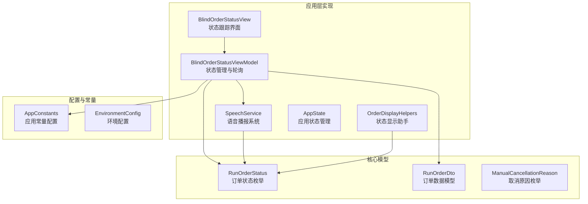
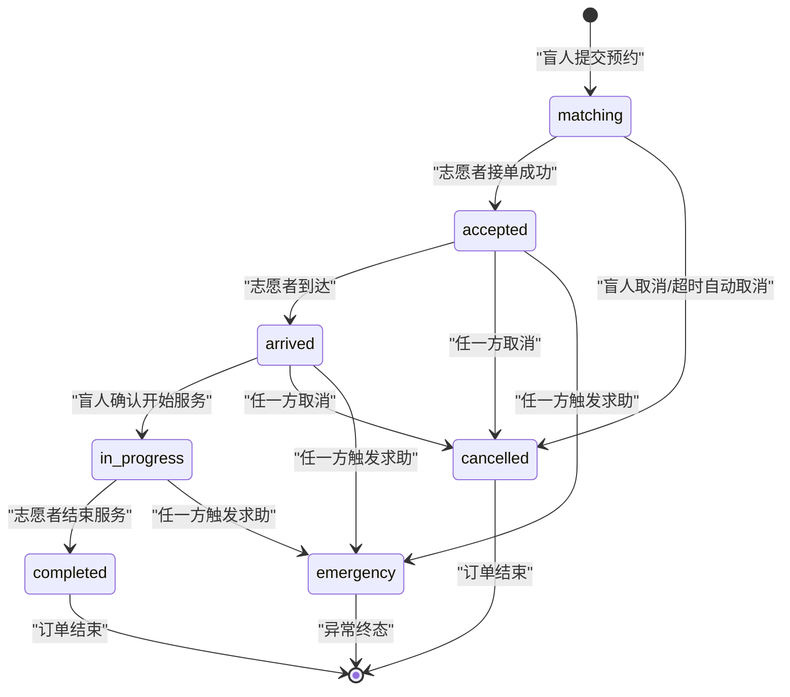
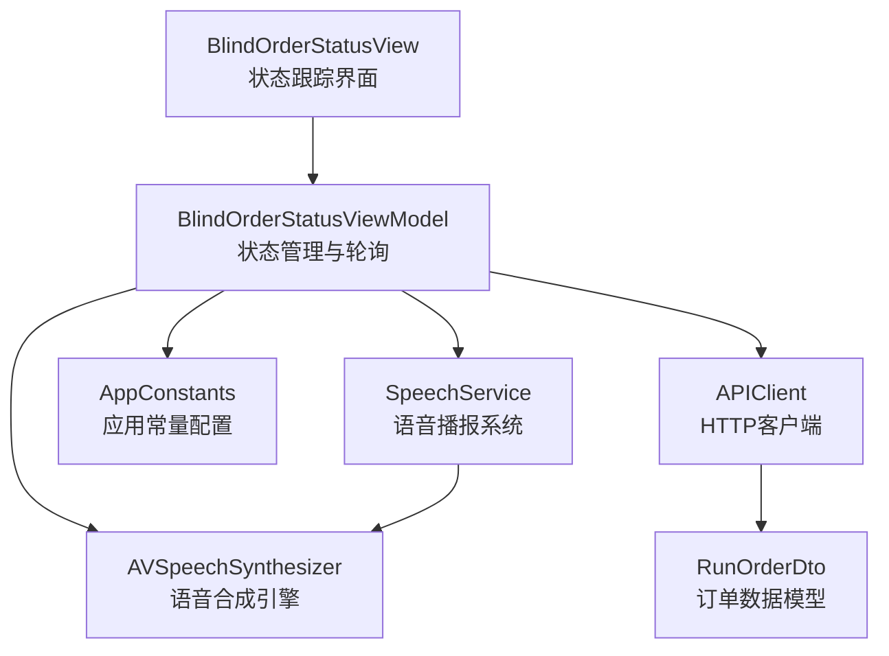
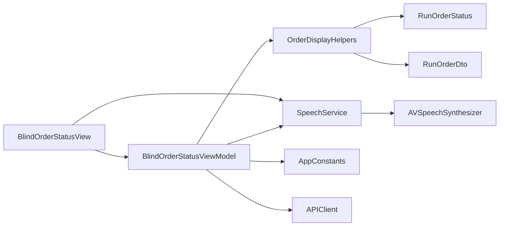

# 订单状态跟踪

<cite>
**本文引用的文件**
- [BlindOrderStatusView.swift](file://blindRun/blindRun/BlindRunner/BlindOrderStatusView.swift)
- [BlindRunnerHomeView.swift](file://blindRun/blindRun/BlindRunner/BlindRunnerHomeView.swift)
- [OrderModels.swift](file://blindRun/blindRun/Core/Models/OrderModels.swift)
- [OrderDisplayHelpers.swift](file://blindRun/blindRun/Core/Models/OrderDisplayHelpers.swift)
- [SpeechService.swift](file://blindRun/blindRun/Voice/SpeechService.swift)
- [AppState.swift](file://blindRun/blindRun/Core/AppState.swift)
- [EnvironmentConfig.swift](file://blindRun/blindRun/Core/EnvironmentConfig.swift)
- [04-用户流程与状态机.md](file://docs/04-user-flows-and-state-machine.md)
- [07-API契约.openapi.yaml](file://docs/07-api-contract.openapi.yaml)
- [08-iOS架构.md](file://docs/08-iOS架构.md)
- [03-用户故事.md](file://docs/03-user-stories.md)
- [09-无障碍与语音指南.md](file://docs/09-accessibility-and-voice-guidelines.md)
- [order-status-lifecycle-spec.md](file://openspec/changes/add-aidrun-ios-spring-mvp/specs/order-status-lifecycle/spec.md)
- [design.md](file://openspec/changes/add-aidrun-ios-spring-mvp/design.md)
- [blindRunApp.swift](file://blindRun/blindRun/blindRunApp.swift)
- [ContentView.swift](file://blindRun/blindRun/ContentView.swift)
</cite>

## 更新摘要
**所做更改**
- 新增完整的订单状态跟踪系统实现细节
- 更新轮询机制的具体实现和配置
- 增强语音播报系统的功能描述
- 完善紧急功能的交互流程
- 补充状态显示助手类的功能说明

## 目录
1. [简介](#简介)
2. [项目结构](#项目结构)
3. [核心组件](#核心组件)
4. [架构总览](#架构总览)
5. [详细组件分析](#详细组件分析)
6. [依赖关系分析](#依赖关系分析)
7. [性能考虑](#性能考虑)
8. [故障排查指南](#故障排查指南)
9. [结论](#结论)
10. [附录](#附录)

## 简介
本文件聚焦"盲人跑者订单状态跟踪"功能，基于最新的应用实现，详细介绍订单状态机在跑者视角下的完整表现与交互体验。系统现已实现从订单创建到服务完成的全链路状态流转、实时状态监控、语音播报和紧急功能，确保盲人跑者在整个服务过程中获得及时、准确的状态反馈和安全保障。

## 项目结构
- **应用层实现**：SwiftUI + MVVM架构，核心模块包含BlindRunner、Orders、Voice、Map等
- **状态管理**：完整的订单状态枚举和显示助手类
- **语音系统**：集中式TTS服务，支持状态变化播报和重复播报
- **轮询机制**：基于Task的异步轮询，智能停止策略
- **紧急功能**：一键求助功能，支持二次确认和状态记录

**图表来源**
- [BlindOrderStatusView.swift:1-463](file://blindRun/blindRun/BlindRunner/BlindOrderStatusView.swift#L1-L463)
- [OrderModels.swift:1-194](file://blindRun/blindRun/Core/Models/OrderModels.swift#L1-L194)
- [OrderDisplayHelpers.swift:1-159](file://blindRun/blindRun/Core/Models/OrderDisplayHelpers.swift#L1-L159)
- [SpeechService.swift:1-105](file://blindRun/blindRun/Voice/SpeechService.swift#L1-L105)
- [AppState.swift:1-250](file://blindRun/blindRun/Core/AppState.swift#L1-L250)

## 核心组件

### 订单状态机与流转规则
系统实现了完整的订单状态机，涵盖从matching到completed的正常流程，以及emergency异常终态：

- **正常生命周期**：matching → accepted → arrived → in_progress → completed
- **异常终态**：emergency（不可恢复）
- **终态**：cancelled（服务开始前可取消）

**图表来源**
- [OrderModels.swift:5-34](file://blindRun/blindRun/Core/Models/OrderModels.swift#L5-L34)
- [OrderDisplayHelpers.swift:6-41](file://blindRun/blindRun/Core/Models/OrderDisplayHelpers.swift#L6-L41)

### 实时轮询机制
系统采用基于Task的异步轮询机制，实现5秒间隔的实时状态监控：

- **轮询频率**：5秒间隔（AppConstants.Timing.orderPollingInterval = 5.0）
- **智能停止**：订单进入终态或页面离开时自动停止
- **状态变化检测**：仅在状态变化时更新UI并播报语音
- **内存管理**：使用Task.cancel()确保资源正确释放

### 语音播报系统
集中式TTS服务提供完整的语音反馈：

- **状态变化播报**：自动检测状态变化并播报新状态
- **重复播报功能**："重复当前状态"按钮支持手动播报
- **错误提示**：统一的错误信息语音播报
- **防重复机制**：避免轮询时重复播报相同状态

### 紧急功能实现
一键求助功能提供安全保障：

- **触发条件**：accepted、arrived、in_progress状态下可用
- **二次确认**：防止误触，确保求助操作的严肃性
- **状态记录**：自动记录求助事件和触发角色
- **不可恢复**：emergency状态为最终状态，不可恢复

**章节来源**
- [BlindOrderStatusView.swift:40-61](file://blindRun/blindRun/BlindRunner/BlindOrderStatusView.swift#L40-L61)
- [SpeechService.swift:32-47](file://blindRun/blindRun/Voice/SpeechService.swift#L32-L47)
- [OrderDisplayHelpers.swift:25-32](file://blindRun/blindRun/Core/Models/OrderDisplayHelpers.swift#L25-L32)

## 架构总览
系统采用MVVM架构模式，实现清晰的关注点分离：

**图表来源**
- [BlindOrderStatusView.swift:162-243](file://blindRun/blindRun/BlindRunner/BlindOrderStatusView.swift#L162-L243)
- [SpeechService.swift:9-18](file://blindRun/blindRun/Voice/SpeechService.swift#L9-L18)
- [EnvironmentConfig.swift:44-63](file://blindRun/blindRun/Core/EnvironmentConfig.swift#L44-L63)

## 详细组件分析

### 订单状态跟踪界面
BlindOrderStatusView提供完整的状态跟踪体验：

- **状态展示**：大字体显示当前状态，配合彩色图标和描述
- **志愿者信息**：接单后显示志愿者姓名等信息
- **预约详情**：完整展示预约时间和地点等信息
- **操作控制**：根据状态动态显示相应操作按钮
- **紧急求助**：一键求助按钮，支持二次确认对话框

### 状态管理与轮询
BlindOrderStatusViewModel负责核心状态管理和轮询逻辑：

- **轮询任务管理**：使用Task创建和管理轮询任务
- **状态变化检测**：比较前后状态，仅在变化时处理
- **错误处理**：统一的API错误处理和语音提示
- **生命周期管理**：页面出现时启动轮询，消失时停止轮询

### 语音播报实现
SpeechService提供专业的语音播报功能：

- **AVSpeechSynthesizer集成**：使用系统语音合成引擎
- **状态映射**：完整的状态到语音文本映射表
- **播放控制**：支持停止、重复播放等功能
- **状态跟踪**：记录最后播报的状态，避免重复播报

### 状态显示助手
OrderDisplayHelpers提供丰富的状态显示信息：

- **角色特定描述**：为盲人跑者提供专门的状态描述
- **视觉符号映射**：状态到系统图标和颜色的映射
- **行为控制**：根据状态决定界面元素的显示和可用性
- **排序支持**：为活跃订单提供排序键值

**章节来源**
- [BlindOrderStatusView.swift:162-452](file://blindRun/blindRun/BlindRunner/BlindOrderStatusView.swift#L162-L452)
- [BlindOrderStatusView.swift:105-157](file://blindRun/blindRun/BlindRunner/BlindOrderStatusView.swift#L105-L157)
- [SpeechService.swift:66-83](file://blindRun/blindRun/Voice/SpeechService.swift#L66-L83)
- [OrderDisplayHelpers.swift:43-114](file://blindRun/blindRun/Core/Models/OrderDisplayHelpers.swift#L43-L114)

## 依赖关系分析
系统各组件间存在清晰的依赖关系：

**图表来源**
- [OrderDisplayHelpers.swift:6-114](file://blindRun/blindRun/Core/Models/OrderDisplayHelpers.swift#L6-L114)
- [BlindOrderStatusView.swift:6-38](file://blindRun/blindRun/BlindRunner/BlindOrderStatusView.swift#L6-L38)
- [SpeechService.swift:11-18](file://blindRun/blindRun/Voice/SpeechService.swift#L11-L18)

**章节来源**
- [OrderDisplayHelpers.swift:1-159](file://blindRun/blindRun/Core/Models/OrderDisplayHelpers.swift#L1-L159)
- [BlindOrderStatusView.swift:1-158](file://blindRun/blindRun/BlindRunner/BlindOrderStatusView.swift#L1-L158)
- [SpeechService.swift:1-105](file://blindRun/blindRun/Voice/SpeechService.swift#L1-L105)

## 性能考虑
系统在性能方面进行了多项优化：

- **智能轮询停止**：订单进入终态时自动停止轮询，节省资源
- **状态变化检测**：仅在状态变化时进行UI更新和语音播报
- **Task管理**：使用Swift的Task进行异步操作，避免阻塞主线程
- **内存管理**：正确的Task取消和弱引用使用，防止内存泄漏
- **语音防重复**：避免轮询时重复播报相同状态，减少系统负载

**章节来源**
- [BlindOrderStatusView.swift:100-103](file://blindRun/blindRun/BlindRunner/BlindOrderStatusView.swift#L100-L103)
- [SpeechService.swift:34-38](file://blindRun/blindRun/Voice/SpeechService.swift#L34-L38)

## 故障排查指南
针对可能出现的问题提供排查指导：

- **轮询不工作**：检查订单状态是否为活跃状态，确认页面是否处于订单相关页面
- **语音不播报**：验证系统语音设置，检查SpeechService的初始化状态
- **紧急求助无效**：确认当前状态允许求助，检查网络连接和API响应
- **状态显示异常**：检查RunOrderStatus枚举定义，验证状态映射关系
- **内存泄漏**：确认Task正确取消，检查闭包中的循环引用

**章节来源**
- [BlindOrderStatusView.swift:112-125](file://blindRun/blindRun/BlindRunner/BlindOrderStatusView.swift#L112-L125)
- [SpeechService.swift:87-103](file://blindRun/blindRun/Voice/SpeechService.swift#L87-L103)

## 结论
本功能通过"轮询+状态机+语音播报+紧急功能"的完整实现，为盲人跑者提供了可靠的订单状态跟踪体验。系统不仅实现了基本的状态监控，还提供了专业的语音反馈和安全保障。通过智能的轮询策略、完善的错误处理和友好的用户界面，确保了良好的用户体验和系统稳定性。后续可考虑WebSocket实现实时推送，进一步提升响应速度。

## 附录

### 关键API清单
- **GET /api/orders/{orderId}**：获取订单详情和实时状态
- **POST /api/orders/{orderId}/start**：确认开始服务
- **POST /api/orders/{orderId}/cancel**：取消订单
- **POST /api/orders/{orderId}/emergency**：触发紧急求助
- **GET /api/orders/my**：获取用户历史订单

### 状态常量配置
- **轮询间隔**：5.0秒（AppConstants.Timing.orderPollingInterval）
- **状态颜色**：匹配中-警告色，进行中-成功色，紧急-危险色
- **状态图标**：对应的状态系统图标映射

### 语音播报内容
- **状态变化**：完整的状态变化语音提示
- **重复播报**：当前状态的重复播报功能
- **错误提示**：统一的错误信息语音播报

**章节来源**
- [BlindOrderStatusView.swift:113](file://blindRun/blindRun/BlindRunner/BlindOrderStatusView.swift#L113)
- [EnvironmentConfig.swift:63](file://blindRun/blindRun/Core/EnvironmentConfig.swift#L63)
- [SpeechService.swift:66-83](file://blindRun/blindRun/Voice/SpeechService.swift#L66-L83)