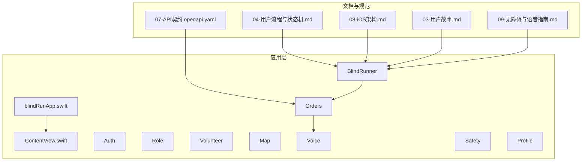
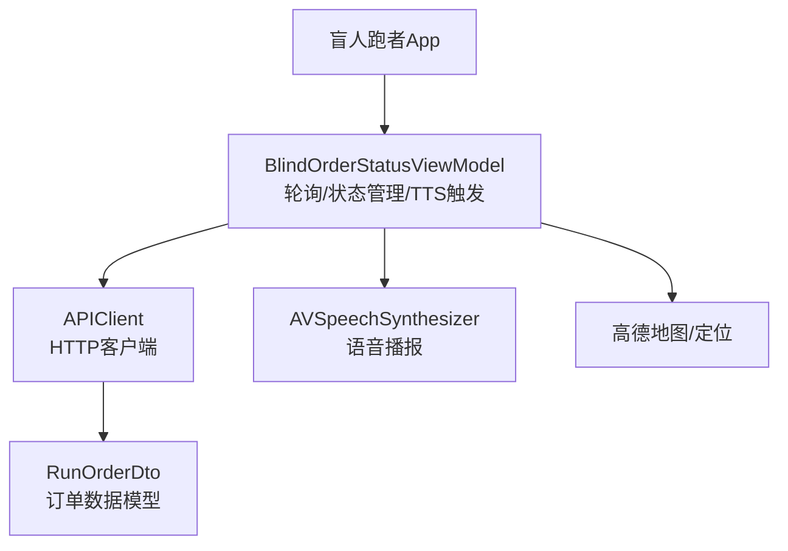
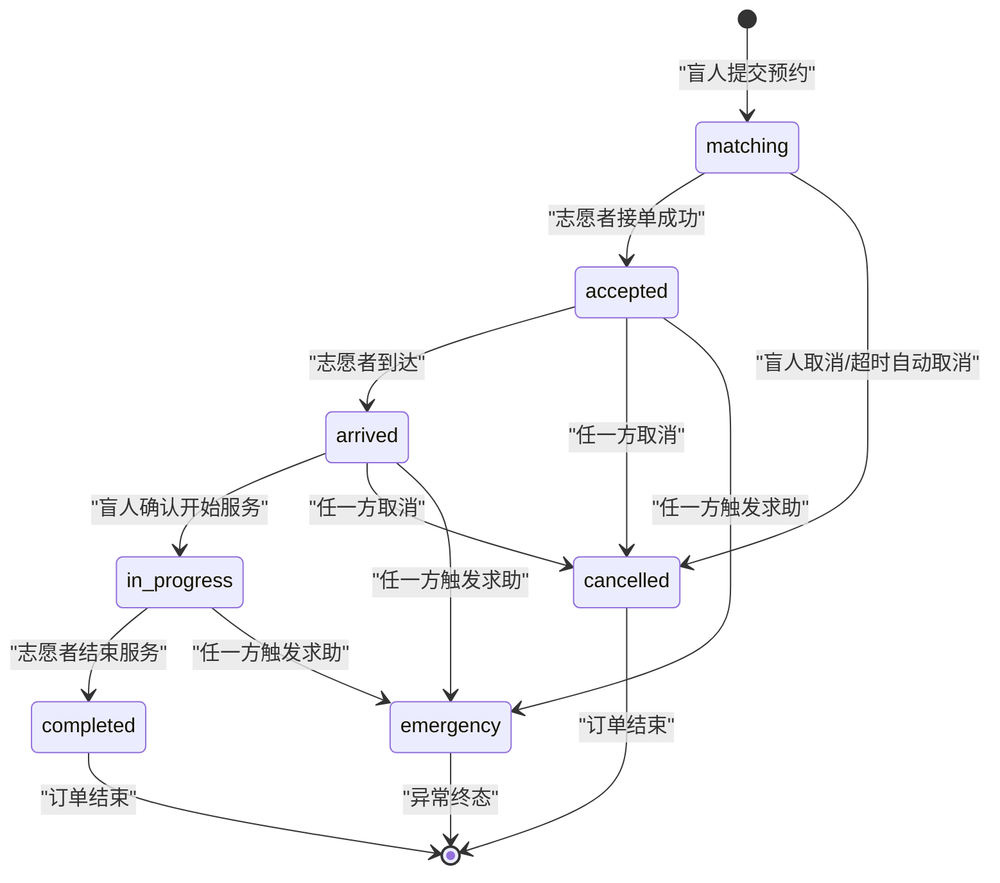
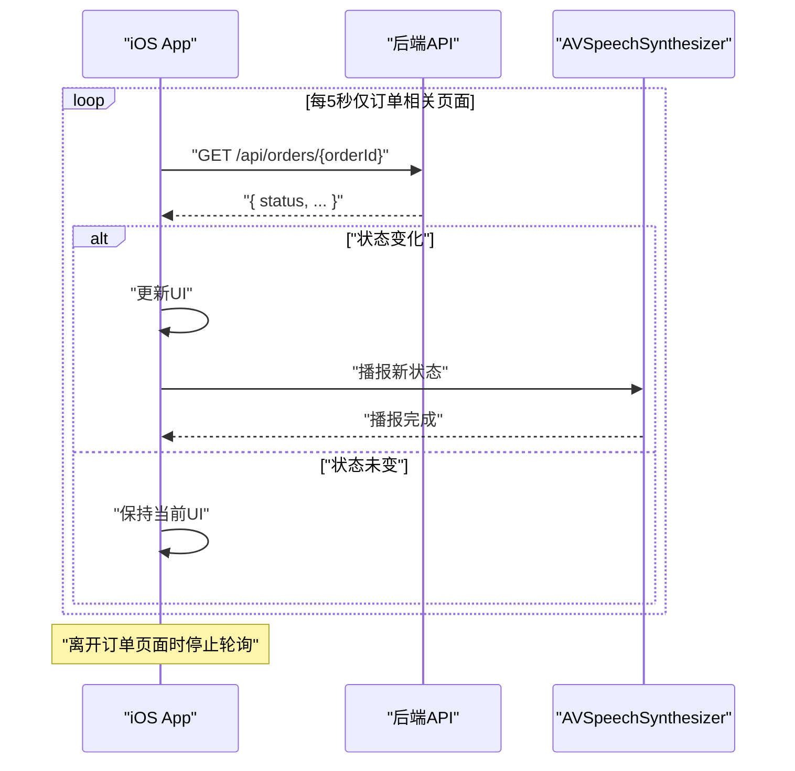
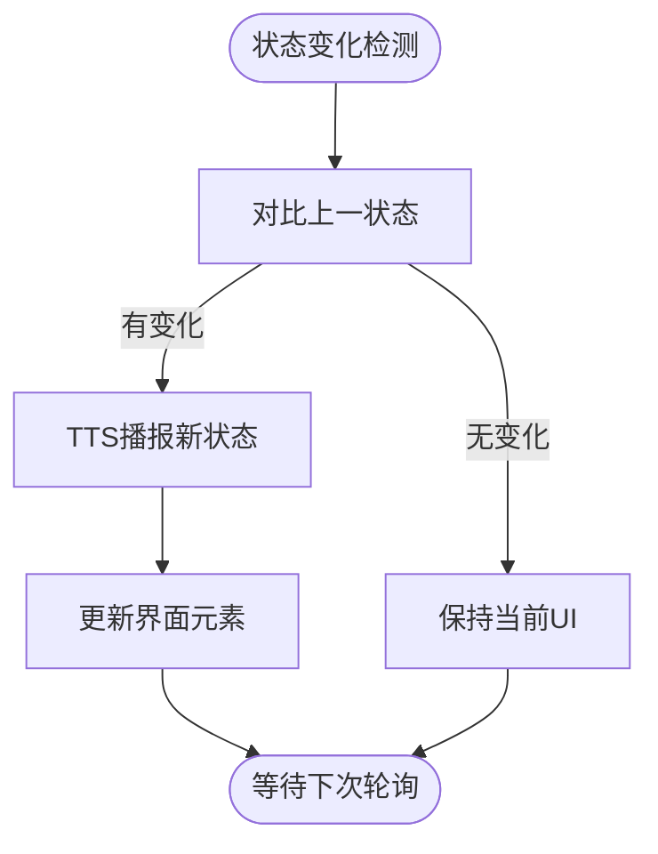
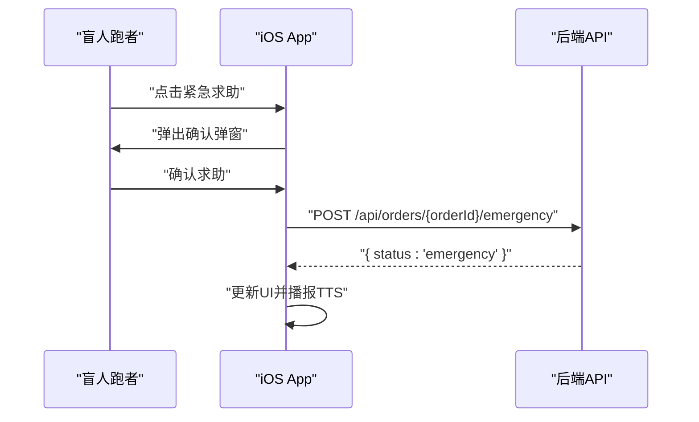
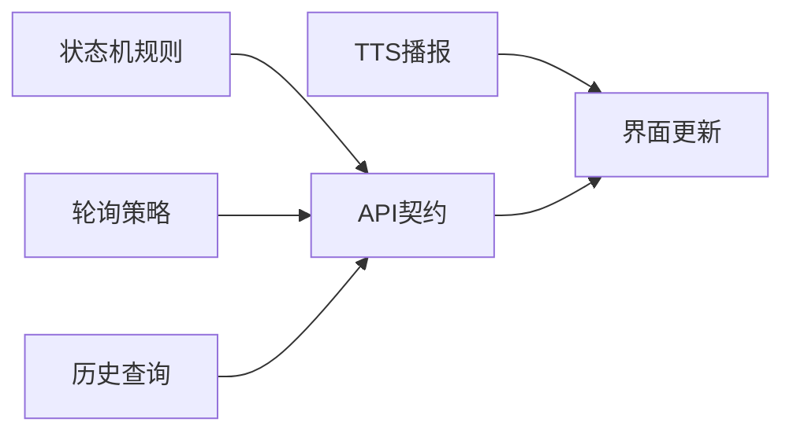

# 订单状态跟踪

<cite>
**本文引用的文件**
- [04-用户流程与状态机.md](file://docs/04-user-flows-and-state-machine.md)
- [07-API契约.openapi.yaml](file://docs/07-api-contract.openapi.yaml)
- [08-iOS架构.md](file://docs/08-ios-architecture.md)
- [03-用户故事.md](file://docs/03-user-stories.md)
- [09-无障碍与语音指南.md](file://docs/09-accessibility-and-voice-guidelines.md)
- [order-status-lifecycle-spec.md](file://openspec/changes/add-aidrun-ios-spring-mvp/specs/order-status-lifecycle/spec.md)
- [design.md](file://openspec/changes/add-aidrun-ios-spring-mvp/design.md)
- [blindRunApp.swift](file://blindRun/blindRunApp.swift)
- [ContentView.swift](file://blindRun/ContentView.swift)
</cite>

## 目录
1. [简介](#简介)
2. [项目结构](#项目结构)
3. [核心组件](#核心组件)
4. [架构总览](#架构总览)
5. [详细组件分析](#详细组件分析)
6. [依赖关系分析](#依赖关系分析)
7. [性能考虑](#性能考虑)
8. [故障排查指南](#故障排查指南)
9. [结论](#结论)
10. [附录](#附录)

## 简介
本文件聚焦“盲人跑者订单状态跟踪”功能，面向跑者视角下的状态机表现与交互体验，覆盖从订单创建到服务完成的全链路状态流转、通知机制（TTS）、进度跟踪界面设计、历史记录展示与状态查询、轮询机制与状态同步策略。文档基于冻结的MVP需求与API契约，确保实现与验收一致。

## 项目结构
- 文档层：OpenAPI契约、用户故事、状态机与轮询机制、无障碍语音规范等
- 应用层：SwiftUI + MVVM，核心模块包含Auth、Role、BlindRunner、Volunteer、Orders、Map、Voice、Safety、Profile等
- 运行时：iOS应用入口与预览视图，实际业务逻辑由各模块ViewModel与Service承载

**图表来源**
- [04-用户流程与状态机.md:1-309](file://docs/04-user-flows-and-state-machine.md#L1-L309)
- [07-API契约.openapi.yaml:1-1117](file://docs/07-api-contract.openapi.yaml#L1-L1117)
- [08-iOS架构.md:1-165](file://docs/08-ios-architecture.md#L1-L165)
- [blindRunApp.swift:1-18](file://blindRun/blindRunApp.swift#L1-L18)
- [ContentView.swift:1-25](file://blindRun/ContentView.swift#L1-L25)

**章节来源**
- [04-用户流程与状态机.md:1-309](file://docs/04-user-flows-and-state-machine.md#L1-L309)
- [07-API契约.openapi.yaml:1-1117](file://docs/07-api-contract.openapi.yaml#L1-L1117)
- [08-iOS架构.md:1-165](file://docs/08-ios-architecture.md#L1-L165)
- [blindRunApp.swift:1-18](file://blindRun/blindRunApp.swift#L1-L18)
- [ContentView.swift:1-25](file://blindRun/ContentView.swift#L1-L25)

## 核心组件
- 订单状态机与流转规则：明确从matching到accepted、arrived、in_progress、completed的正常路径，以及emergency异常终态与cancelled终态的约束
- 轮询机制：盲人端在关键页面每5秒轮询订单详情，对比状态变化并触发TTS播报
- 通知机制：AVSpeechSynthesizer播报关键节点状态，配合“重复当前状态”按钮
- 界面与交互：大按钮（≥64pt）、清晰标签与辅助功能（VoiceOver），紧急求助与取消均需二次确认
- 历史记录与查询：GET /api/orders/my 支持按status筛选，用于历史记录展示与状态查询

**章节来源**
- [04-用户流程与状态机.md:72-178](file://docs/04-user-flows-and-state-machine.md#L72-L178)
- [07-API契约.openapi.yaml:188-254](file://docs/07-api-contract.openapi.yaml#L188-L254)
- [08-iOS架构.md:125-146](file://docs/08-ios-architecture.md#L125-L146)
- [03-用户故事.md:254-373](file://docs/03-user-stories.md#L254-L373)
- [09-无障碍与语音指南.md:112-143](file://docs/09-accessibility-and-voice-guidelines.md#L112-L143)

## 架构总览
下图展示盲人跑者视角的状态跟踪在MVVM模式下的交互关系：View负责渲染状态与转发意图，ViewModel负责加载状态、验证、API调用、轮询与TTS触发，Service封装网络与平台能力边界。

**图表来源**
- [08-iOS架构.md:33-49](file://docs/08-ios-architecture.md#L33-L49)
- [07-API契约.openapi.yaml:239-254](file://docs/07-api-contract.openapi.yaml#L239-L254)

**章节来源**
- [08-iOS架构.md:33-49](file://docs/08-ios-architecture.md#L33-L49)
- [07-API契约.openapi.yaml:239-254](file://docs/07-api-contract.openapi.yaml#L239-L254)

## 详细组件分析

### 订单状态机（跑者视角）
- 正常生命周期：matching → accepted → arrived → in_progress → completed
- 异常终态：emergency（MVP不支持恢复）
- 终态：cancelled（服务开始前可取消）

**图表来源**
- [04-用户流程与状态机.md:72-96](file://docs/04-user-flows-and-state-machine.md#L72-L96)

**章节来源**
- [04-用户流程与状态机.md:72-118](file://docs/04-user-flows-and-state-machine.md#L72-L118)
- [order-status-lifecycle-spec.md:1-66](file://openspec/changes/add-aidrun-ios-spring-mvp/specs/order-status-lifecycle/spec.md#L1-L66)

### 轮询机制与状态同步
- 触发频率：每5秒
- 触发页面：订单状态等待页、盲人服务中页（仅订单相关页面）
- 终止条件：进入终态（completed/cancelled/emergency）或页面离开/用户登出
- 同步策略：对比上一次状态，变化则更新UI并播报TTS

**图表来源**
- [04-用户流程与状态机.md:275-299](file://docs/04-user-flows-and-state-machine.md#L275-L299)
- [08-iOS架构.md:125-139](file://docs/08-ios-architecture.md#L125-L139)

**章节来源**
- [04-用户流程与状态机.md:275-309](file://docs/04-user-flows-and-state-machine.md#L275-L309)
- [08-iOS架构.md:125-139](file://docs/08-ios-architecture.md#L125-L139)

### 通知机制（TTS与无障碍）
- TTS节点：进入首页、订单提交、matching、accepted、arrived、确认开始提示、服务开始、完成、求助、错误
- “重复当前状态”：每个关键页面提供，用于重复播报最新有意义状态
- 无障碍：按钮高度≥64pt，VoiceOver标签与提示完整

**图表来源**
- [09-无障碍与语音指南.md:112-143](file://docs/09-accessibility-and-voice-guidelines.md#L112-L143)
- [08-iOS架构.md:140-146](file://docs/08-ios-architecture.md#L140-L146)

**章节来源**
- [09-无障碍与语音指南.md:112-143](file://docs/09-accessibility-and-voice-guidelines.md#L112-L143)
- [08-iOS架构.md:140-146](file://docs/08-ios-architecture.md#L140-L146)

### 进度跟踪界面设计
- 订单状态等待页：展示匹配中/已接单/已到达等状态，随轮询更新
- 盲人服务中页：显示志愿者信息（接单后可见）、一键求助按钮、服务进行状态
- 大按钮与无障碍：主操作按钮高度≥64pt，所有关键控件具备accessibilityLabel与accessibilityHint

**章节来源**
- [03-用户故事.md:254-373](file://docs/03-user-stories.md#L254-L373)
- [09-无障碍与语音指南.md:112-143](file://docs/09-accessibility-and-voice-guidelines.md#L112-L143)

### 历史记录与状态查询
- 历史记录：GET /api/orders/my 支持按status过滤，用于展示历史订单与状态查询
- 查询能力：支持按状态筛选，便于跑者回顾与审计

**章节来源**
- [07-API契约.openapi.yaml:188-208](file://docs/07-api-contract.openapi.yaml#L188-L208)

### 异常状态处理（紧急求助）
- 触发条件：accepted / arrived / in_progress 任一方触发
- 行为：状态进入emergency，MVP不恢复，持续终态
- 交互：二次确认弹窗，确认后播报“已进入求助状态”

**图表来源**
- [04-用户流程与状态机.md:230-257](file://docs/04-user-flows-and-state-machine.md#L230-L257)
- [03-用户故事.md:323-350](file://docs/03-user-stories.md#L323-L350)

**章节来源**
- [04-用户流程与状态机.md:230-257](file://docs/04-user-flows-and-state-machine.md#L230-L257)
- [03-用户故事.md:323-350](file://docs/03-user-stories.md#L323-L350)

## 依赖关系分析
- 状态机依赖API契约：所有状态转换均受后端约束（如仅matching可接受、in_progress不可普通取消、emergency不可恢复）
- 轮询依赖：仅在订单相关页面启用，避免无谓网络开销
- 通知依赖：TTS播报与无障碍标签共同构成无障碍体验
- 历史查询依赖：GET /api/orders/my 提供历史检索能力

**图表来源**
- [04-用户流程与状态机.md:72-178](file://docs/04-user-flows-and-state-machine.md#L72-L178)
- [07-API契约.openapi.yaml:188-254](file://docs/07-api-contract.openapi.yaml#L188-L254)
- [08-iOS架构.md:125-146](file://docs/08-ios-architecture.md#L125-L146)

**章节来源**
- [04-用户流程与状态机.md:72-178](file://docs/04-user-flows-and-state-machine.md#L72-L178)
- [07-API契约.openapi.yaml:188-254](file://docs/07-api-contract.openapi.yaml#L188-L254)
- [08-iOS架构.md:125-146](file://docs/08-ios-architecture.md#L125-L146)

## 性能考虑
- 轮询频率权衡：5秒间隔兼顾实时性与资源消耗，MVP阶段不采用WebSocket
- 页面生命周期：离开订单相关页面即停止轮询，避免后台资源占用
- UI更新策略：仅在状态变化时更新UI并播报，减少不必要的重绘与TTS触发

**章节来源**
- [08-iOS架构.md:125-139](file://docs/08-ios-architecture.md#L125-L139)
- [design.md:34-36](file://openspec/changes/add-aidrun-ios-spring-mvp/design.md#L34-L36)

## 故障排查指南
- 定位权限问题：若定位被拒，盲人无法创建预约；志愿者无法按距离排序与接单。应提示前往设置并使用TTS说明
- 状态不更新：检查轮询是否仍在运行（页面处于订单相关页面且未进入终态），确认网络连通与token有效
- TTS未播报：确认无障碍与语音功能已启用，检查“重复当前状态”按钮是否可用
- 历史记录为空：确认已登录且存在订单；使用status参数过滤历史记录

**章节来源**
- [03-用户故事.md:248-250](file://docs/03-user-stories.md#L248-L250)
- [08-iOS架构.md:107-112](file://docs/08-ios-architecture.md#L107-L112)
- [07-API契约.openapi.yaml:188-208](file://docs/07-api-contract.openapi.yaml#L188-L208)

## 结论
本功能以“轮询+状态机+无障碍播报”为核心，确保盲人跑者在关键节点获得及时、准确的状态反馈。通过严格的终态与禁止流转规则、二次确认的危险操作与完善的TTS播报，达成MVP阶段的可用性与可访问性目标。后续可评估WebSocket以降低延迟，但需权衡复杂度与资源消耗。

## 附录
- 关键API清单
  - GET /api/orders/{orderId}：轮询与详情获取
  - POST /api/orders/{orderId}/accept：志愿者接单
  - POST /api/orders/{orderId}/arrive：志愿者到达
  - POST /api/orders/{orderId}/confirm-start：盲人确认开始
  - POST /api/orders/{orderId}/complete：志愿者结束服务
  - POST /api/orders/{orderId}/cancel：取消订单
  - POST /api/orders/{orderId}/emergency：触发求助
  - GET /api/orders/my：历史记录与状态查询

**章节来源**
- [07-API契约.openapi.yaml:239-387](file://docs/07-api-contract.openapi.yaml#L239-L387)