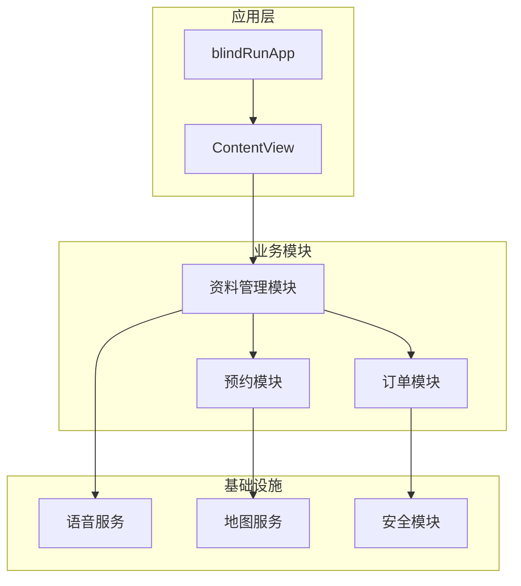
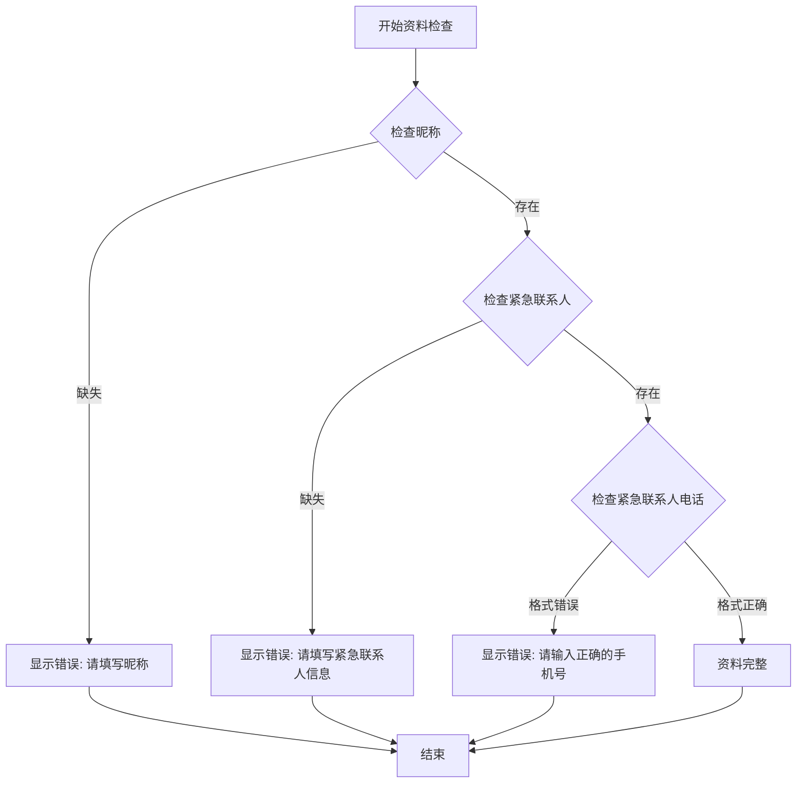
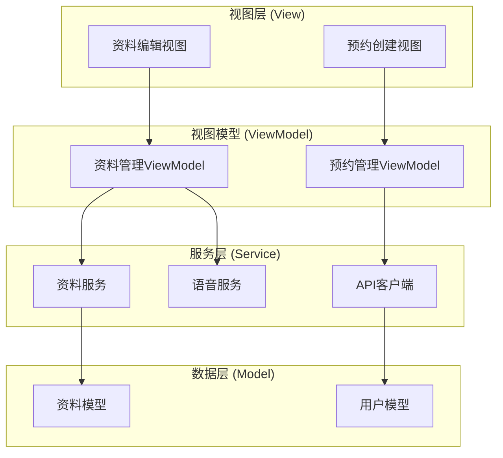
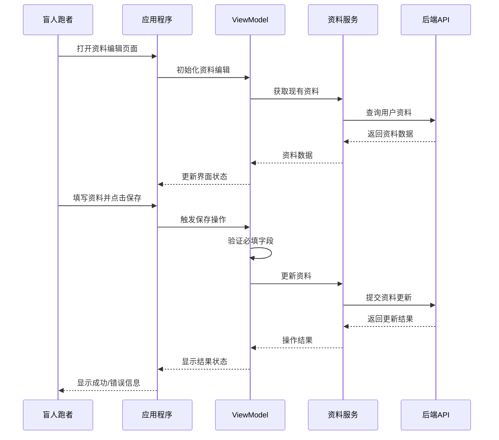
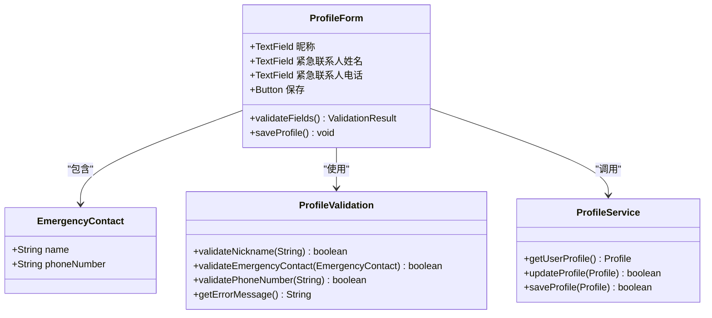
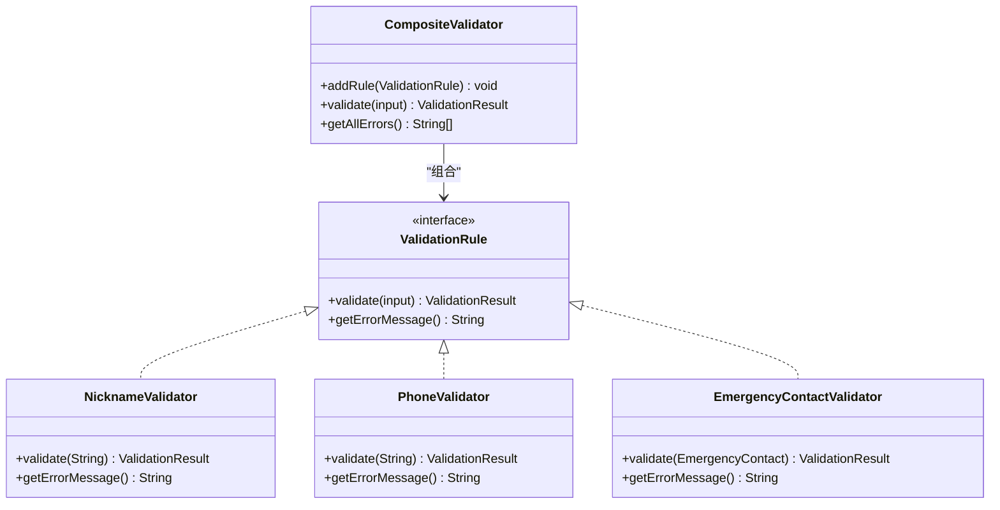
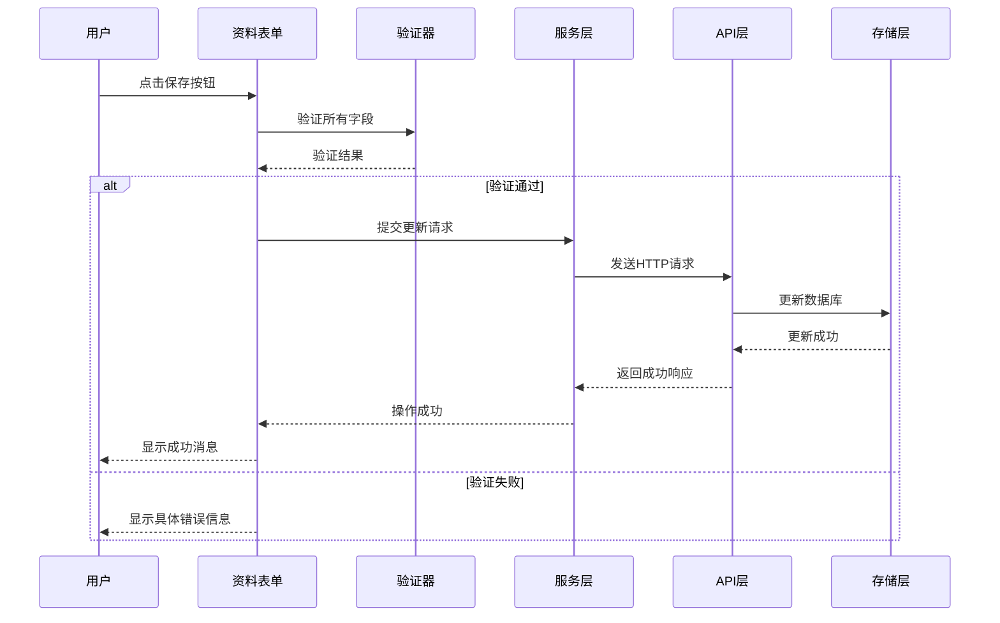
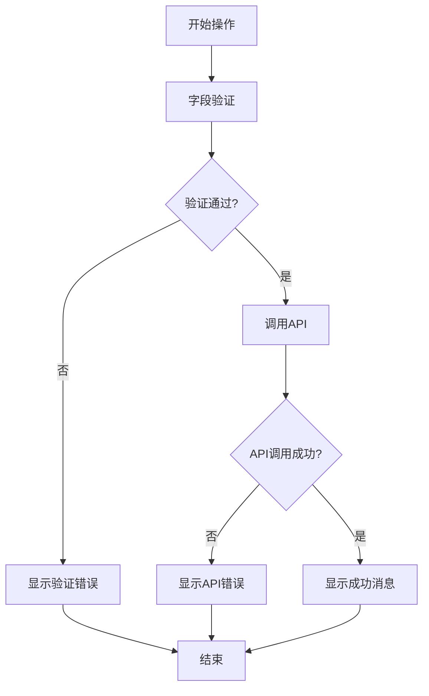
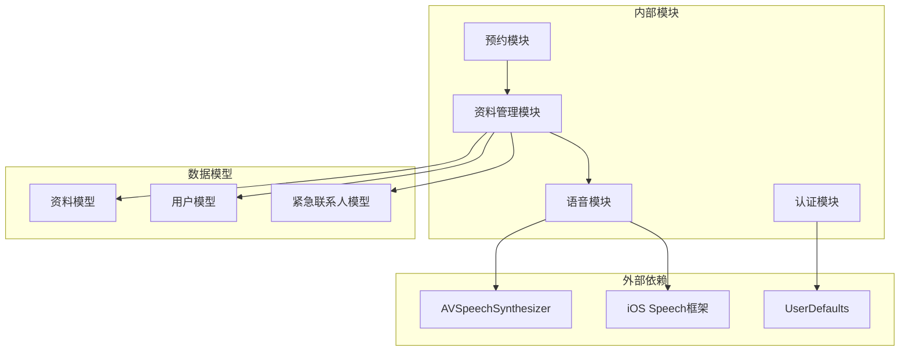
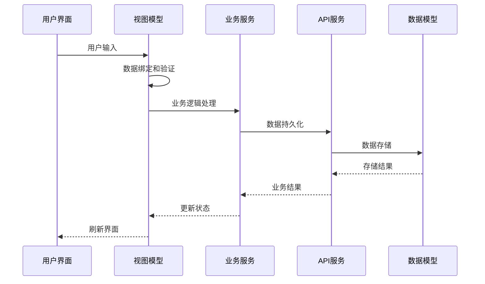

# 跑者资料管理

<cite>
**本文档引用的文件**
- [blindRunApp.swift](file://blindRun/blindRunApp.swift)
- [ContentView.swift](file://blindRun/ContentView.swift)
- [08-ios-architecture.md](file://docs/08-ios-architecture.md)
- [09-accessibility-and-voice-guidelines.md](file://docs/09-accessibility-and-voice-guidelines.md)
- [03-user-stories.md](file://docs/03-user-stories.md)
- [04-user-flows-and-state-machine.md](file://docs/04-user-flows-and-state-machine.md)
- [07-api-contract.openapi.yaml](file://docs/07-api-contract.openapi.yaml)
- [spec.md](file://openspec/changes/add-aidrun-ios-spring-mvp/specs/blind-runner-booking/spec.md)
</cite>

## 目录
1. [简介](#简介)
2. [项目结构](#项目结构)
3. [核心组件](#核心组件)
4. [架构概览](#架构概览)
5. [详细组件分析](#详细组件分析)
6. [依赖关系分析](#依赖关系分析)
7. [性能考虑](#性能考虑)
8. [故障排除指南](#故障排除指南)
9. [结论](#结论)

## 简介

本文件详细阐述盲人跑者资料管理功能，包括个人资料必填字段要求（昵称、紧急联系人姓名、紧急联系人电话）、资料完整性检查机制、资料修改和更新流程。文档还涵盖资料验证规则、数据格式要求、错误处理机制，以及资料不完整时的阻断逻辑和用户体验设计。同时，文档说明了资料表单的无障碍访问支持和语音输入功能。

## 项目结构

基于现有文档分析，项目采用SwiftUI + MVVM架构，资料管理功能属于盲人跑者模块的一部分。项目结构如下：

**图表来源**
- [blindRunApp.swift:10-17](file://blindRun/blindRunApp.swift#L10-L17)
- [08-ios-architecture.md:25-31](file://docs/08-ios-architecture.md#L25-L31)

**章节来源**
- [blindRunApp.swift:10-17](file://blindRun/blindRunApp.swift#L10-L17)
- [08-ios-architecture.md:18-31](file://docs/08-ios-architecture.md#L18-L31)

## 核心组件

### 必填字段要求

根据需求规格，盲人跑者资料必须包含以下必填字段：

1. **昵称 (nickname)** - 唯一标识跑者的名称
2. **紧急联系人姓名 (emergencyContact.name)** - 紧急情况下联系的人姓名
3. **紧急联系人电话 (emergencyContact.phoneNumber)** - 紧急联系人的手机号码

这些字段在创建预约订单前必须完整填写，否则系统会返回 `PROFILE_INCOMPLETE` 错误。

### 资料完整性检查机制

**图表来源**
- [spec.md:3-9](file://openspec/changes/add-aidrun-ios-spring-mvp/specs/blind-runner-booking/spec.md#L3-L9)
- [03-user-stories.md:179-187](file://docs/03-user-stories.md#L179-L187)

### 资料验证规则

#### 字段验证规则

| 字段 | 类型 | 必填 | 验证规则 | 错误消息 |
|------|------|------|----------|----------|
| 昵称 | string | 是 | 非空字符串 | 请填写昵称 |
| 紧急联系人姓名 | string | 是 | 非空字符串 | 请填写紧急联系人姓名 |
| 紧急联系人电话 | string | 是 | 11位中国大陆手机号格式 | 请输入正确的手机号 |

#### 数据格式要求

- **手机号格式**: 必须符合中国大陆手机号格式规范（11位数字，以1开头）
- **字符串长度**: 无强制长度限制，但建议合理范围
- **字符集**: 支持中文、英文、数字及常用标点符号

**章节来源**
- [03-user-stories.md:179-187](file://docs/03-user-stories.md#L179-L187)
- [07-api-contract.openapi.yaml:680-687](file://docs/07-api-contract.openapi.yaml#L680-L687)

## 架构概览

### MVVM架构模式

**图表来源**
- [08-ios-architecture.md:33-49](file://docs/08-ios-architecture.md#L33-L49)

### 资料管理流程

**图表来源**
- [08-ios-architecture.md:33-49](file://docs/08-ios-architecture.md#L33-L49)
- [03-user-stories.md:163-187](file://docs/03-user-stories.md#L163-L187)

**章节来源**
- [08-ios-architecture.md:33-49](file://docs/08-ios-architecture.md#L33-L49)
- [03-user-stories.md:163-187](file://docs/03-user-stories.md#L163-L187)

## 详细组件分析

### 资料表单组件

#### 必填字段组件

**图表来源**
- [07-api-contract.openapi.yaml:689-698](file://docs/07-api-contract.openapi.yaml#L689-L698)
- [03-user-stories.md:163-187](file://docs/03-user-stories.md#L163-L187)

#### 资料验证组件

**图表来源**
- [03-user-stories.md:179-187](file://docs/03-user-stories.md#L179-L187)
- [07-api-contract.openapi.yaml:680-687](file://docs/07-api-contract.openapi.yaml#L680-L687)

### 资料更新流程

#### 资料保存序列图

**图表来源**
- [03-user-stories.md:173-187](file://docs/03-user-stories.md#L173-L187)
- [08-ios-architecture.md:68-76](file://docs/08-ios-architecture.md#L68-L76)

### 错误处理机制

#### 错误处理流程

**图表来源**
- [03-user-stories.md:179-187](file://docs/03-user-stories.md#L179-L187)
- [08-ios-architecture.md:70-76](file://docs/08-ios-architecture.md#L70-L76)

**章节来源**
- [03-user-stories.md:173-187](file://docs/03-user-stories.md#L173-L187)
- [08-ios-architecture.md:68-76](file://docs/08-ios-architecture.md#L68-L76)

## 依赖关系分析

### 组件依赖关系

**图表来源**
- [08-ios-architecture.md:9-16](file://docs/08-ios-architecture.md#L9-L16)
- [09-accessibility-and-voice-guidelines.md:15](file://docs/09-accessibility-and-voice-guidelines.md#L15)

### 数据流依赖

**图表来源**
- [08-ios-architecture.md:33-41](file://docs/08-ios-architecture.md#L33-L41)

**章节来源**
- [08-ios-architecture.md:9-16](file://docs/08-ios-architecture.md#L9-L16)
- [08-ios-architecture.md:33-41](file://docs/08-ios-architecture.md#L33-L41)

## 性能考虑

### 验证性能优化

1. **即时验证**: 在用户输入时进行基本格式验证，提供即时反馈
2. **防抖处理**: 对网络请求进行防抖，避免频繁的API调用
3. **缓存策略**: 对用户资料进行本地缓存，减少重复请求
4. **异步处理**: 所有网络操作采用异步方式，避免UI阻塞

### 内存管理

- 使用弱引用避免循环引用
- 及时释放不再使用的资源
- 合理使用闭包捕获列表

## 故障排除指南

### 常见问题及解决方案

#### 资料保存失败

**问题症状**: 用户点击保存后无响应或显示错误

**排查步骤**:
1. 检查网络连接状态
2. 验证必填字段是否完整
3. 确认手机号格式是否正确
4. 查看API响应状态码

**解决方案**:
- 确保所有必填字段都已填写
- 检查手机号格式（11位数字，以1开头）
- 重试网络请求或检查服务器状态

#### 验证错误处理

**问题症状**: 输入验证提示不准确或不显示

**排查步骤**:
1. 检查验证规则配置
2. 确认错误消息本地化
3. 验证UI绑定是否正确

**解决方案**:
- 更新验证规则以匹配业务需求
- 确保错误消息与用户界面同步
- 检查数据绑定和状态管理

**章节来源**
- [03-user-stories.md:179-187](file://docs/03-user-stories.md#L179-L187)
- [09-accessibility-and-voice-guidelines.md:80-86](file://docs/09-accessibility-and-voice-guidelines.md#L80-L86)

## 结论

盲人跑者资料管理功能通过明确的必填字段要求、严格的验证机制和完善的错误处理，确保了用户资料的完整性和准确性。系统采用MVVM架构模式，结合SwiftUI的声明式编程特性，提供了良好的用户体验和无障碍访问支持。

关键特性包括：
- **必填字段强制**: 昵称、紧急联系人姓名、紧急联系人电话三要素缺一不可
- **实时验证**: 即时反馈验证结果，提升用户体验
- **错误处理**: 清晰的错误提示和降级方案
- **无障碍支持**: 完整的VoiceOver支持和语音输入功能
- **安全保障**: 资料不完整时阻断相关功能，确保服务安全

该实现为后续功能扩展奠定了坚实基础，同时满足了盲人用户的特殊需求和无障碍访问要求。