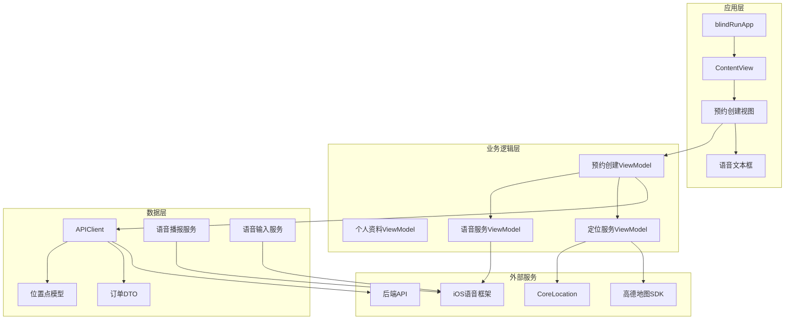
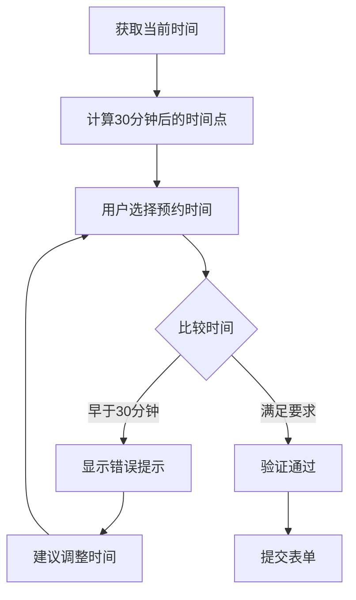
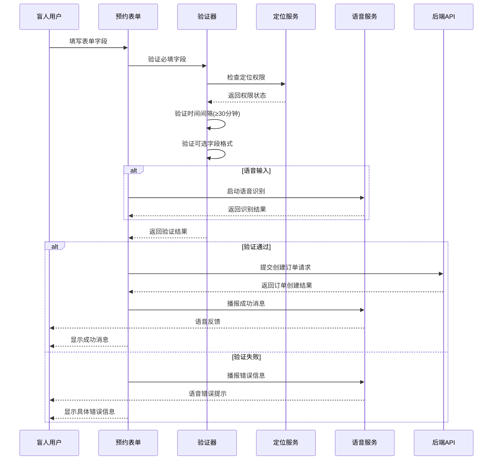
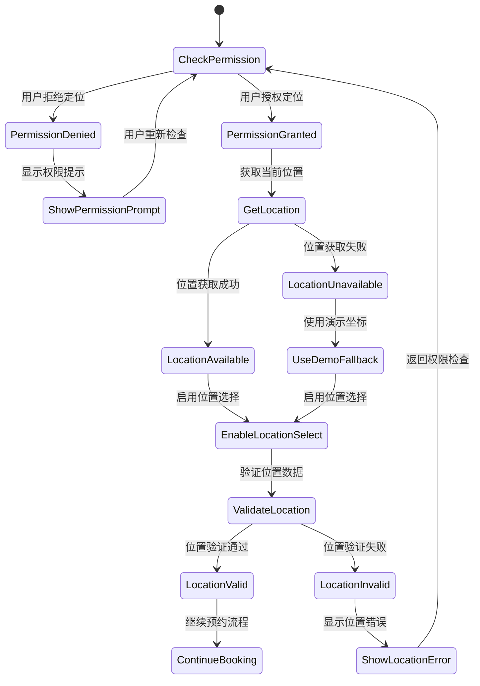
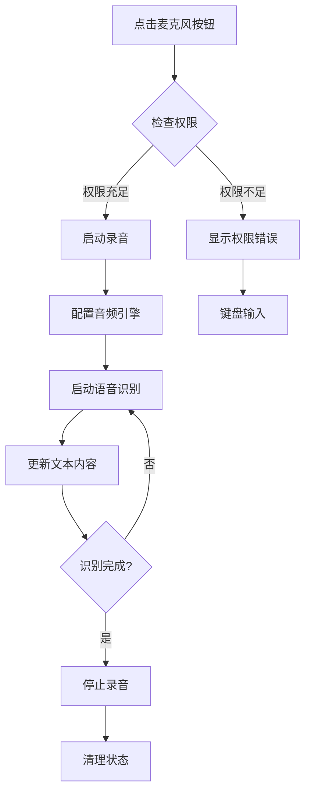
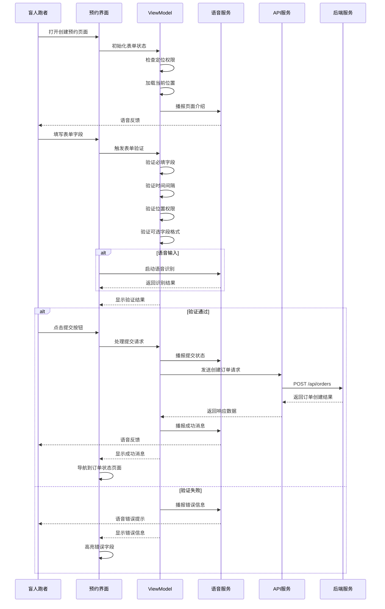
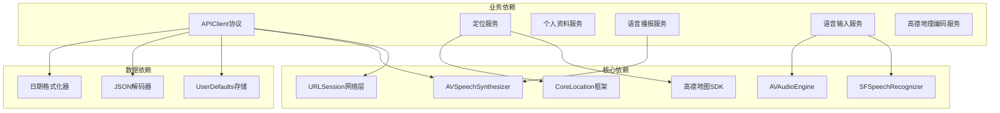

# 预约创建系统

<cite>
**本文档引用的文件**
- [BlindBookingView.swift](file://blindRun/blindRun/BlindRunner/BlindBookingView.swift)
- [VoiceTextField.swift](file://blindRun/blindRun/Voice/VoiceTextField.swift)
- [SpeechInputService.swift](file://blindRun/blindRun/Voice/SpeechInputService.swift)
- [SpeechService.swift](file://blindRun/blindRun/Voice/SpeechService.swift)
- [LocationService.swift](file://blindRun/blindRun/Map/LocationService.swift)
- [AMapGeocodingService.swift](file://blindRun/blindRun/Map/AMapGeocodingService.swift)
- [OrderModels.swift](file://blindRun/blindRun/Core/Models/OrderModels.swift)
- [AppState.swift](file://blindRun/blindRun/Core/AppState.swift)
- [04-用户流程与状态机.md](file://docs/04-user-flows-and-state-machine.md)
- [07-API契约.openapi.yaml](file://docs/07-api-contract.openapi.yaml)
- [08-iOS架构.md](file://docs/08-ios-architecture.md)
- [01-产品需求.md](file://docs/01-产品需求.md)
- [03-用户故事.md](file://docs/03-user-story.md)
- [amap-location规格.md](file://openspec/changes/add-aidrun-ios-spring-mvp/specs/amap-location/spec.md)
- [盲人跑者预约规格.md](file://openspec/changes/add-aidrun-ios-spring-mvp/specs/blind-runner-booking/spec.md)
</cite>

## 更新摘要
**所做更改**
- 新增完整的语音输入支持系统，包括VoiceTextField组件和语音识别功能
- 替换复杂的距离估算输入为简化的偏好选择（预计时长、配速偏好、路线偏好）
- 优化订单状态跟踪机制，新增"重复当前状态"按钮
- 增强无障碍访问体验，改进语音反馈和屏幕阅读器支持
- 更新UI布局，采用更简洁的表单设计

## 目录
1. [简介](#简介)
2. [项目结构](#项目结构)
3. [核心组件](#核心组件)
4. [架构概览](#架构概览)
5. [详细组件分析](#详细组件分析)
6. [依赖关系分析](#依赖关系分析)
7. [性能考虑](#性能考虑)
8. [故障排除指南](#故障排除指南)
9. [结论](#结论)

## 简介

预约创建系统是助盲跑(AidRun)应用的核心功能模块，专为盲人跑者设计，提供安全、可预约的跑步协助服务。该系统实现了完整的预约流程，包括起始位置选择、预约时间设置、可选路线信息处理等功能。

**更新** 系统现已集成完整的语音输入支持，通过VoiceTextField组件实现语音转文字功能，同时配备集中式语音播报服务，为用户提供全方位的无障碍体验。系统基于SwiftUI + MVVM架构，采用真实的高德地图集成和定位服务，确保盲人跑者能够在无障碍环境下轻松创建和管理跑步预约。

## 项目结构

盲人跑者预约系统采用模块化架构设计，主要包含以下核心模块：



**图表来源**
- [BlindBookingView.swift:291-345](file://blindRun/blindRun/BlindRunner/BlindBookingView.swift#L291-L345)
- [VoiceTextField.swift:1-200](file://blindRun/blindRun/Voice/VoiceTextField.swift#L1-L200)
- [LocationService.swift:15-197](file://blindRun/blindRun/Map/LocationService.swift#L15-L197)
- [SpeechService.swift:7-105](file://blindRun/blindRun/Voice/SpeechService.swift#L7-105)
- [SpeechInputService.swift:8-187](file://blindRun/blindRun/Voice/SpeechInputService.swift#L8-L187)

**章节来源**
- [BlindBookingView.swift:1-746](file://blindRun/blindRun/BlindRunner/BlindBookingView.swift#L1-L746)
- [VoiceTextField.swift:1-200](file://blindRun/blindRun/Voice/VoiceTextField.swift#L1-L200)
- [LocationService.swift:1-197](file://blindRun/blindRun/Map/LocationService.swift#L1-L197)
- [SpeechService.swift:1-105](file://blindRun/blindRun/Voice/SpeechService.swift#L1-L105)
- [SpeechInputService.swift:1-187](file://blindRun/blindRun/Voice/SpeechInputService.swift#L1-L187)

## 核心组件

### 预约创建表单组件

预约创建表单是系统的核心界面组件，负责收集盲人跑者的预约信息。表单包含以下关键字段：

- **起始位置选择**：基于高德地图的定位服务，支持手动选择和自动定位
- **预约时间设置**：基于日期时间选择器，强制30分钟时间限制
- **可选路线信息**：
  - 路线备注（支持语音输入）
  - 预计时长（简化为预设选项）
  - 配速偏好（走跑结合、轻松、中等、快速）
  - 路线偏好（公园步道、街道、跑道）
  - 是否携带导盲犬
  - 特殊说明（支持语音输入）

**更新** 新增VoiceTextField组件，支持语音输入和语音播报功能，为用户提供无障碍的文本输入体验。同时，距离估算输入已被替换为简化的偏好选择，降低用户认知负担。

### 时间验证逻辑组件

系统实施严格的时间验证机制，确保所有预约都符合30分钟的最小间隔要求：



**图表来源**
- [BlindBookingView.swift:83-89](file://blindRun/blindRun/BlindRunner/BlindBookingView.swift#L83-L89)
- [BlindBookingView.swift:236-238](file://blindRun/blindRun/BlindRunner/BlindBookingView.swift#L236-L238)

### 位置数据处理组件

位置数据处理组件负责管理盲人跑者的地理位置信息，包括：

- **定位权限验证**：确保用户授予必要的定位权限
- **坐标数据处理**：处理经纬度坐标和地址文本
- **位置源标识**：区分设备定位、手动输入和演示默认值
- **距离计算**：为志愿者提供距离排序功能

**更新** 增强定位权限管理，支持演示模式下的默认坐标回退机制，确保在定位不可用时仍能正常创建预约。

### 语音输入输出系统

**新增** 系统集成了完整的语音输入输出功能：

- **语音输入服务**：通过SFSpeech框架实现语音转文字，支持点击麦克风按钮开始/停止录音
- **语音播报服务**：使用AVSpeechSynthesizer提供状态变化播报，避免重复播报
- **VoiceTextField组件**：专门为文本输入设计的语音输入控件
- **无障碍支持**：完整的屏幕阅读器支持和语音反馈机制

**章节来源**
- [VoiceTextField.swift:26-57](file://blindRun/blindRun/Voice/VoiceTextField.swift#L26-L57)
- [SpeechInputService.swift:26-57](file://blindRun/blindRun/Voice/SpeechInputService.swift#L26-L57)
- [SpeechService.swift:22-52](file://blindRun/blindRun/Voice/SpeechService.swift#L22-L52)
- [BlindBookingView.swift:598-608](file://blindRun/blindRun/BlindRunner/BlindBookingView.swift#L598-L608)

## 架构概览

系统采用MVVM架构模式，确保视图层、业务逻辑层和数据层的清晰分离：

```mermaid
graph TB
subgraph "视图层 (View)"
CreateBookingView[创建预约视图]
VoiceTextField[语音文本框]
BRHomeView[盲人首页]
OrderStatusView[订单状态视图]
end
subgraph "视图模型层 (ViewModel)"
CreateBookingVM[创建预约ViewModel]
SpeechVM[语音服务ViewModel]
BRHomeVM[盲人首页ViewModel]
OrderStatusVM[订单状态ViewModel]
end
subgraph "服务层 (Service)"
APIService[API服务]
LocationService[定位服务]
ProfileService[个人资料服务]
SpeechService[语音播报服务]
SpeechInputService[语音输入服务]
AMapGeocodingService[高德地理编码服务]
end
subgraph "数据层 (Model)"
CreateOrderRequest[创建订单请求]
RunOrderDTO[运行订单DTO]
LocationPoint[位置点]
UserDTO[用户DTO]
ResolvedPlace[解析地点]
end
subgraph "外部集成"
AMapSDK[高德地图SDK]
BackendAPI[后端API]
SpeechFramework[iOS语音框架]
TTS[语音合成]
```

**图表来源**
- [BlindBookingView.swift:291-345](file://blindRun/blindRun/BlindRunner/BlindBookingView.swift#L291-L345)
- [VoiceTextField.swift:1-200](file://blindRun/blindRun/Voice/VoiceTextField.swift#L1-L200)
- [SpeechService.swift:7-105](file://blindRun/blindRun/Voice/SpeechService.swift#L7-105)
- [SpeechInputService.swift:8-187](file://blindRun/blindRun/Voice/SpeechInputService.swift#L8-L187)

## 详细组件分析

### 预约创建表单设计

#### 表单字段规范

预约创建表单遵循严格的字段规范，确保数据完整性和用户体验：

| 字段类型 | 字段名称 | 必填性 | 数据类型 | 验证规则 | 语音支持 |
|---------|----------|--------|----------|----------|----------|
| 位置选择 | 起始位置 | 必填 | LocationPoint | 需要定位权限 | 不支持语音 |
| 时间选择 | 预约时间 | 必填 | DateTime | 至少30分钟后 | 不支持语音 |
| 文本输入 | 路线备注 | 可选 | String | 最大长度限制 | 支持语音 |
| 偏好选择 | 预计时长 | 可选 | BookingDurationOption | 预设选项 | 不支持语音 |
| 偏好选择 | 配速偏好 | 可选 | PacePreference | 预设选项 | 不支持语音 |
| 偏好选择 | 路线偏好 | 可选 | RoutePreference | 预设选项 | 不支持语音 |
| 开关选择 | 是否携带导盲犬 | 可选 | Boolean | 布尔值 | 不支持语音 |
| 文本输入 | 特殊说明 | 可选 | String | 最大长度限制 | 支持语音 |

**更新** 新增VoiceTextField组件，为路线备注、特殊说明等文本字段提供语音输入功能，支持点击麦克风按钮开始语音识别。同时，距离估算输入已被替换为简化的偏好选择，包括预计时长（15-120分钟）、配速偏好（走跑结合、轻松、中等、快速）和路线偏好（公园步道、街道、跑道）。

#### 表单验证流程



**图表来源**
- [BlindBookingView.swift:228-286](file://blindRun/blindRun/BlindRunner/BlindBookingView.swift#L228-L286)
- [SpeechService.swift:49-52](file://blindRun/blindRun/Voice/SpeechService.swift#L49-L52)

#### 可选字段对系统行为的影响

可选字段虽然不影响订单创建的核心功能，但会影响志愿者的接单决策和服务质量：

- **路线备注**：帮助志愿者了解具体的跑步路线和注意事项
- **预计时长**：为志愿者提供时间规划参考，便于安排个人时间
- **配速偏好**：影响志愿者的服务策略，确保与跑者节奏匹配
- **路线偏好**：帮助志愿者选择合适的路线，提高服务效率
- **导盲犬携带**：提醒志愿者注意相关安全事项
- **特殊说明**：提供额外的服务指导信息，如携带导盲杖等

重要的是，这些可选字段不会触发自动路线导航功能，系统明确声明不会实现路线导航功能。

**章节来源**
- [OrderModels.swift:119-128](file://blindRun/blindRun/Core/Models/OrderModels.swift#L119-L128)
- [BlindBookingView.swift:535-610](file://blindRun/blindRun/BlindRunner/BlindBookingView.swift#L535-L610)

### 时间验证逻辑实现

#### 核心验证规则

系统实施严格的时间验证逻辑，确保所有预约都符合业务要求：

1. **30分钟时间限制**：预约时间必须至少距离当前时间30分钟以上
2. **实时时间检查**：每次用户选择时间时进行实时验证
3. **错误提示机制**：提供清晰的错误信息和解决方案

#### 时间验证算法

```mermaid
flowchart TD
UserSelect[用户选择预约时间] --> GetCurrent[获取当前系统时间]
GetCurrent --> CalcThreshold[计算30分钟阈值]
CalcThreshold --> CompareTime{比较用户时间 vs 阈值}
CompareTime --> |用户时间 < 阈值| ShowTooSoon[显示"预约时间太近"错误]
CompareTime --> |用户时间 ≥ 阈值| ShowValid[显示验证通过]
ShowTooSoon --> SuggestTime[建议调整到30分钟后]
SuggestTime --> UserSelect
ShowValid --> EnableSubmit[启用提交按钮]
```

**图表来源**
- [BlindBookingView.swift:83-89](file://blindRun/blindRun/BlindRunner/BlindBookingView.swift#L83-L89)
- [BlindBookingView.swift:236-238](file://blindRun/blindRun/BlindRunner/BlindBookingView.swift#L236-L238)

### 位置数据获取和验证

#### 定位权限管理

系统要求盲人跑者授予必要的定位权限，这是创建预约的前提条件：



**图表来源**
- [LocationService.swift:49-77](file://blindRun/blindRun/Map/LocationService.swift#L49-L77)
- [BlindBookingView.swift:157-185](file://blindRun/blindRun/BlindRunner/BlindBookingView.swift#L157-L185)

#### 位置数据模型

位置数据采用标准化的数据模型，确保跨平台兼容性：

| 字段名称 | 类型 | 必填 | 描述 |
|---------|------|------|------|
| latitude | Double | 是 | 纬度坐标 |
| longitude | Double | 是 | 经度坐标 |
| addressText | String | 否 | 地址文本描述 |
| source | LocationSource | 是 | 位置来源标识 |

位置来源枚举包括：
- `device_location`：设备GPS定位
- `manual`：用户手动输入
- `demo_default`：演示用默认坐标

**更新** 新增演示模式支持，在定位不可用时自动使用演示坐标，确保系统稳定性。

**章节来源**
- [AMapGeocodingService.swift:78-83](file://blindRun/blindRun/Map/AMapGeocodingService.swift#L78-L83)
- [LocationService.swift:34-47](file://blindRun/blindRun/Map/LocationService.swift#L34-L47)

### 语音输入输出系统

#### VoiceTextField组件实现

**新增** VoiceTextField组件通过iOS原生SFSpeech框架实现：

- **权限管理**：自动请求语音识别和麦克风权限
- **实时识别**：支持部分结果和最终结果的实时更新
- **错误处理**：完善的错误捕获和用户提示机制
- **多字段支持**：支持为不同文本字段独立管理语音识别状态
- **无障碍集成**：与屏幕阅读器完美配合



**图表来源**
- [VoiceTextField.swift:26-57](file://blindRun/blindRun/Voice/VoiceTextField.swift#L26-L57)
- [SpeechInputService.swift:82-149](file://blindRun/blindRun/Voice/SpeechInputService.swift#L82-L149)

#### 语音播报服务实现

**更新** 语音播报服务增强了状态管理和重复播报功能：

- **状态防重复**：记录最后播报的状态，避免轮询时重复播报
- **错误播报**：专门的错误信息播报方法
- **状态映射**：完整的订单状态到语音文本的映射表
- **流畅控制**：支持停止播报和立即开始新播报
- **重复状态功能**：新增"重复当前状态"按钮，可重新播报当前预约表单状态

**章节来源**
- [VoiceTextField.swift:1-200](file://blindRun/blindRun/Voice/VoiceTextField.swift#L1-L200)
- [SpeechInputService.swift:1-187](file://blindRun/blindRun/Voice/SpeechInputService.swift#L1-L187)
- [SpeechService.swift:1-105](file://blindRun/blindRun/Voice/SpeechService.swift#L1-L105)

### 订单创建完整流程

#### 前端流程控制



**图表来源**
- [BlindBookingView.swift:329-345](file://blindRun/blindRun/BlindRunner/BlindBookingView.swift#L329-L345)
- [BlindBookingView.swift:228-286](file://blindRun/blindRun/BlindRunner/BlindBookingView.swift#L228-L286)

#### 后端API交互

订单创建过程涉及多个后端API端点的协调工作：

1. **创建订单**：POST `/api/orders` - 创建新的预约订单
2. **获取订单详情**：GET `/api/orders/{orderId}` - 轮询订单状态
3. **订单状态管理**：各种状态转换端点

系统确保在提交过程中保持用户界面的响应性，并提供适当的加载状态指示。

**章节来源**
- [OrderModels.swift:119-128](file://blindRun/blindRun/Core/Models/OrderModels.swift#L119-L128)
- [AppState.swift:76-90](file://blindRun/blindRun/Core/AppState.swift#L76-L90)

## 依赖关系分析

### 外部依赖关系

系统对外部服务的依赖关系如下：



**图表来源**
- [SpeechService.swift:11](file://blindRun/blindRun/Voice/SpeechService.swift#L11)
- [SpeechInputService.swift:16-20](file://blindRun/blindRun/Voice/SpeechInputService.swift#L16-L20)
- [AMapGeocodingService.swift:29](file://blindRun/blindRun/Map/AMapGeocodingService.swift#L29)

### 内部模块依赖

系统内部模块之间的依赖关系体现了清晰的分层架构：

```mermaid
graph TD
subgraph "表现层"
Views[视图组件]
VoiceTextField[语音文本框]
end
subgraph "业务逻辑层"
ViewModels[视图模型]
Services[服务对象]
SpeechVM[语音服务ViewModel]
end
subgraph "数据访问层"
APIClient[API客户端]
Repositories[数据仓库]
end
subgraph "基础设施层"
Network[网络层]
Storage[存储层]
Utils[工具类]
SpeechFramework[iOS语音框架]
MapFramework[地图框架]
```

**图表来源**
- [BlindBookingView.swift:291-345](file://blindRun/blindRun/BlindRunner/BlindBookingView.swift#L291-L345)
- [VoiceTextField.swift:1-200](file://blindRun/blindRun/Voice/VoiceTextField.swift#L1-L200)
- [SpeechService.swift:7-105](file://blindRun/blindRun/Voice/SpeechService.swift#L7-105)

**章节来源**
- [BlindBookingView.swift:1-746](file://blindRun/blindRun/BlindRunner/BlindBookingView.swift#L1-L746)
- [VoiceTextField.swift:1-200](file://blindRun/blindRun/Voice/VoiceTextField.swift#L1-L200)
- [SpeechInputService.swift:1-187](file://blindRun/blindRun/Voice/SpeechInputService.swift#L1-L187)

## 性能考虑

### 响应式性能优化

系统在性能方面采取了多项优化措施：

1. **异步网络请求**：所有API调用都在后台队列执行，避免阻塞主线程
2. **智能缓存策略**：合理使用UserDefaults缓存用户会话信息
3. **内存管理**：及时释放不再使用的资源，特别是地图和定位相关的资源
4. **UI更新优化**：批量更新UI状态，减少不必要的重绘
5. **语音资源管理**：语音识别任务的及时清理和资源回收
6. **VoiceTextField优化**：语音输入的音频引擎生命周期管理

**更新** 新增语音输入的音频引擎管理，确保录音结束后正确释放音频资源。

### 网络性能优化

- **请求合并**：将多个小的API调用合并为更大的批次
- **超时控制**：设置合理的网络超时时间，避免长时间等待
- **错误重试**：实现简单的指数退避重试机制
- **离线支持**：提供基本的离线功能，如缓存最近的位置信息

### 地图和定位性能

- **定位频率控制**：合理控制定位更新频率，平衡精度和电池消耗
- **地图渲染优化**：延迟加载地图内容，优先显示关键信息
- **内存使用监控**：监控地图和定位相关的内存使用情况
- **演示模式优化**：在定位不可用时使用高效的数据回退机制

### 语音性能优化

**新增** 语音功能的性能优化：

- **音频引擎生命周期管理**：录音开始前初始化，结束后及时清理
- **识别任务并发控制**：避免同时进行多个语音识别任务
- **权限检查优化**：减少不必要的权限请求次数
- **错误处理快速响应**：及时清理状态并提供用户反馈
- **语音播报去重**：避免重复播报相同状态信息

## 故障排除指南

### 常见问题诊断

#### 定位权限相关问题

**问题症状**：用户无法选择起始位置或收到权限错误提示

**诊断步骤**：
1. 检查系统设置中的定位权限状态
2. 验证应用是否具有必要的定位权限
3. 确认用户是否授权了精确位置信息
4. 检查演示模式是否被意外启用

**解决方案**：
- 引导用户到系统设置中授予权限
- 提供清晰的权限说明和使用场景
- 实现权限状态的动态检查和提示
- 在定位不可用时自动使用演示坐标

#### 时间验证错误

**问题症状**：用户选择的时间总是显示"预约时间太近"

**诊断步骤**：
1. 检查系统时间和时区设置
2. 验证用户选择的时间是否确实早于30分钟
3. 确认本地时间与服务器时间的一致性
4. 检查minimumAppointmentTime计算逻辑

**解决方案**：
- 提供更直观的时间选择界面
- 显示具体的可选时间范围
- 添加时间偏移补偿机制
- 改善时间验证的用户反馈

#### 网络连接问题

**问题症状**：订单提交失败或页面加载缓慢

**诊断步骤**：
1. 检查网络连接状态
2. 验证API端点的可达性
3. 确认JWT令牌的有效性
4. 检查后端服务状态

**解决方案**：
- 实现网络状态监控和提示
- 添加离线模式支持
- 提供重试机制和错误恢复
- 改善错误信息的用户友好性

#### 语音功能问题

**问题症状**：语音输入无法使用或语音播报异常

**诊断步骤**：
1. 检查语音识别权限状态
2. 验证麦克风权限是否被授予
3. 确认iOS语音框架的可用性
4. 检查音频会话的激活状态

**解决方案**：
- 引导用户检查系统设置中的语音和麦克风权限
- 提供键盘输入的备用方案
- 实现语音功能的降级处理
- 改善错误提示的清晰度

#### VoiceTextField组件问题

**问题症状**：语音输入功能异常或无法显示麦克风按钮

**诊断步骤**：
1. 检查SpeechInputService的初始化状态
2. 验证SpeechService的可用性
3. 确认VoiceTextField的配置参数
4. 检查无障碍功能的启用状态

**解决方案**：
- 确保SpeechInputService正确注入到ViewModel
- 验证SpeechService的权限检查逻辑
- 检查VoiceTextField的accessibility配置
- 提供降级的键盘输入替代方案

**章节来源**
- [LocationService.swift:59-77](file://blindRun/blindRun/Map/LocationService.swift#L59-L77)
- [SpeechInputService.swift:42-53](file://blindRun/blindRun/Voice/SpeechInputService.swift#L42-L53)
- [SpeechService.swift:49-52](file://blindRun/blindRun/Voice/SpeechService.swift#L49-L52)
- [VoiceTextField.swift:26-57](file://blindRun/blindRun/Voice/VoiceTextField.swift#L26-L57)

## 结论

预约创建系统为盲人跑者提供了完整、无障碍的跑步预约解决方案。系统通过严格的验证机制、清晰的用户界面、可靠的后端集成和全新的语音输入输出功能，确保了优秀的用户体验和业务合规性。

**更新** 新系统的主要优势包括：

1. **全方位无障碍设计**：完全符合盲人用户的使用习惯，提供语音导航、大按钮设计和完整的屏幕阅读器支持
2. **严格验证机制**：确保所有预约都符合30分钟的时间要求，保障服务质量
3. **位置集成优化**：深度集成高德地图和定位服务，支持演示模式下的稳定回退
4. **语音功能完整**：集成VoiceTextField组件和语音输入输出系统，提供自然的交互方式
5. **简化的表单设计**：将复杂的距离估算替换为简化的偏好选择，降低用户认知负担
6. **状态管理完善**：完善的订单状态跟踪和轮询机制，新增"重复当前状态"功能
7. **错误处理全面**：全面的错误处理和用户友好的错误提示
8. **性能优化到位**：针对语音功能的专门性能优化措施

未来可以考虑的功能增强包括：路线导航功能、智能推荐系统、社交互动功能等，但这些都超出了MVP版本的范围。

系统通过新增的语音输入输出功能和简化的表单设计，显著提升了无障碍体验，使盲人跑者能够更加便捷地创建和管理跑步预约。语音播报服务的引入，确保了用户能够及时了解系统状态和操作结果，进一步增强了系统的易用性和可靠性。