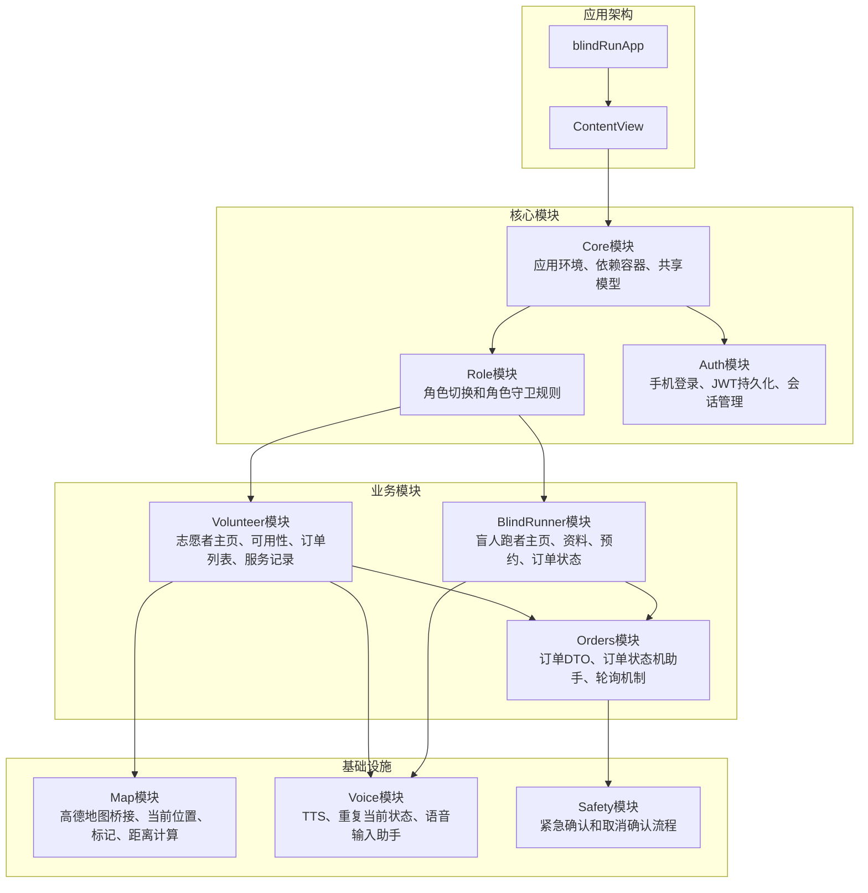
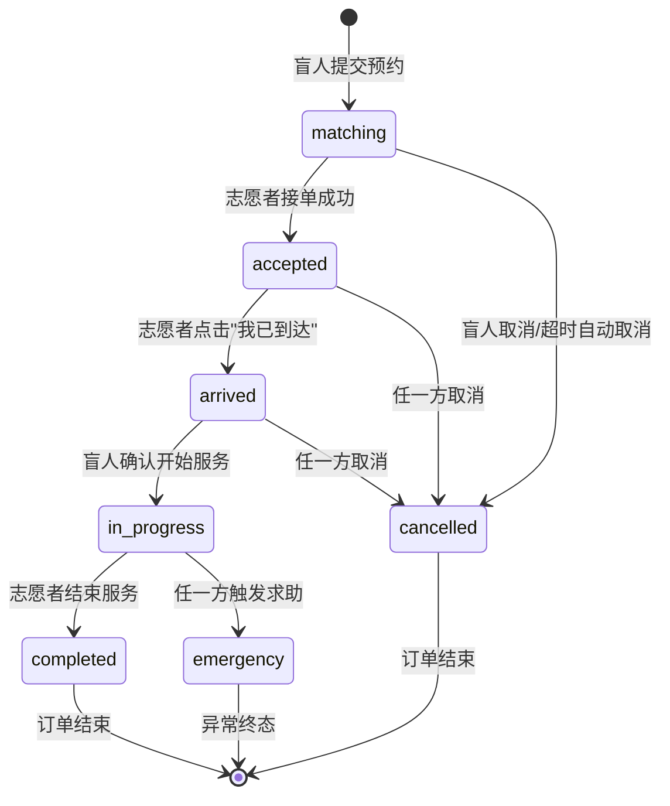
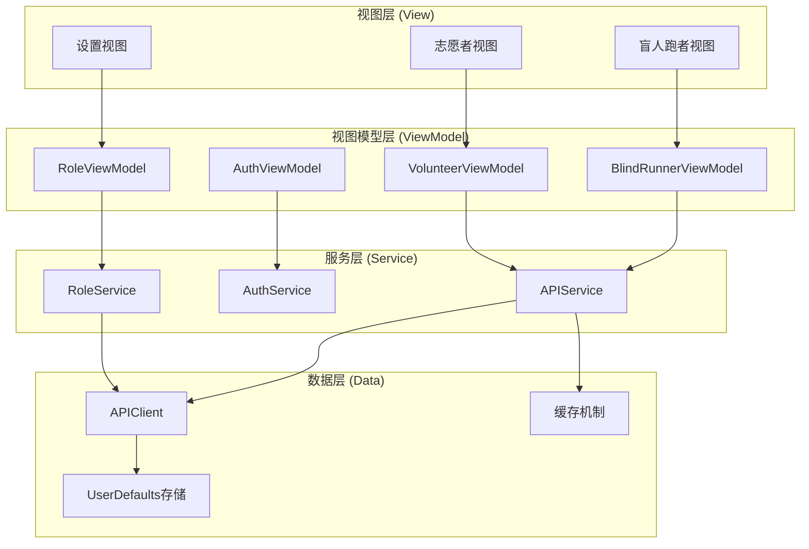
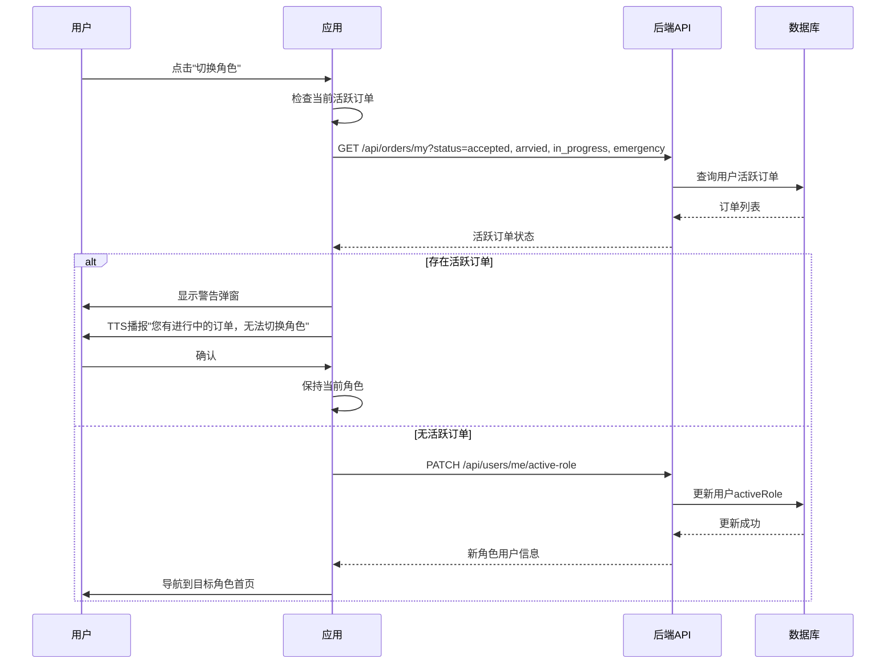
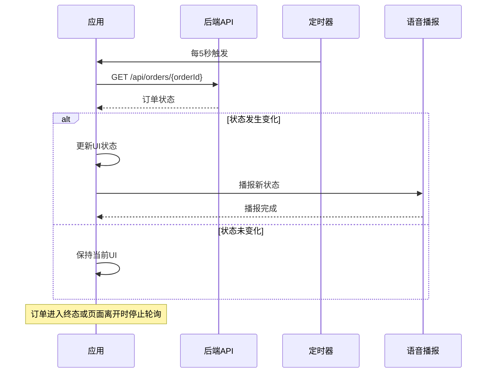
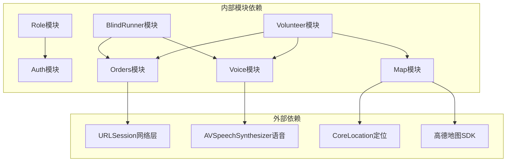
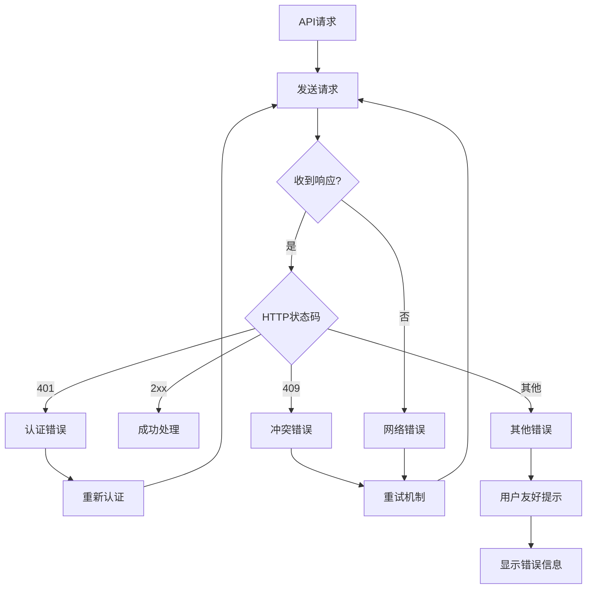

# 角色管理系统

<cite>
**本文档引用的文件**
- [04-user-flows-and-state-machine.md](file://docs/04-user-flows-and-state-machine.md)
- [07-api-contract.openapi.yaml](file://docs/07-api-contract.openapi.yaml)
- [08-ios-architecture.md](file://docs/08-ios-architecture.md)
- [blindRunApp.swift](file://blindRun/blindRun/blindRunApp.swift)
- [ContentView.swift](file://blindRun/blindRun/ContentView.swift)
</cite>

## 目录
1. [简介](#简介)
2. [项目结构](#项目结构)
3. [核心组件](#核心组件)
4. [架构概览](#架构概览)
5. [详细组件分析](#详细组件分析)
6. [依赖关系分析](#依赖关系分析)
7. [性能考虑](#性能考虑)
8. [故障排除指南](#故障排除指南)
9. [结论](#结论)

## 简介

角色管理系统是"助盲跑"应用的核心功能模块，负责管理盲人跑者和志愿者两种用户角色之间的切换机制、权限控制和状态管理。该系统确保用户能够在不同角色间无缝切换，同时维护正在进行的服务完整性。

系统基于MVVM架构模式，采用SwiftUI作为UI框架，实现了完整的角色切换拦截机制、活跃订单检测和权限边界控制。所有功能都遵循无障碍设计原则，特别考虑了盲人用户的使用需求。

## 项目结构

根据架构文档，项目采用模块化组织方式，角色管理功能主要分布在以下模块中：



**图表来源**
- [08-ios-architecture.md:18-32](file://docs/08-ios-architecture.md#L18-L32)

**章节来源**
- [08-ios-architecture.md:18-32](file://docs/08-ios-architecture.md#L18-L32)

## 核心组件

### 角色切换机制

角色切换是系统的核心功能，通过统一的JWT令牌实现跨角色访问。系统支持以下角色：

- **盲人跑者 (blind_runner)**: 发起服务请求、预约跑步、管理个人资料
- **志愿者 (volunteer)**: 接受订单、提供服务、管理可用性状态

切换机制的关键特性：
- 单一JWT令牌跨角色共享
- 仅修改activeRole字段
- 活跃订单阻塞切换逻辑

### 权限控制边界

系统实现了严格的权限边界控制：

```mermaid
flowchart TD
Start[用户尝试切换角色] --> CheckActive[检查活跃订单]
CheckActive --> HasActive{是否存在活跃订单?}
HasActive --> |是| Block[阻止切换]
HasActive --> |否| Allow[允许切换]
Block --> Alert[显示警告弹窗<br/>"您有进行中的订单，无法切换角色"]
Allow --> Navigate[导航到目标角色首页]
Alert --> Stay[保持当前角色]
Navigate --> Complete[切换完成]
```

**图表来源**
- [04-user-flows-and-state-machine.md:259-273](file://docs/04-user-flows-and-state-machine.md#L259-L273)

### 订单状态管理

系统实现了完整的订单生命周期管理，支持7种状态：



**图表来源**
- [04-user-flows-and-state-machine.md:72-96](file://docs/04-user-flows-and-state-machine.md#L72-L96)

**章节来源**
- [07-api-contract.openapi.yaml:61-81](file://docs/07-api-contract.openapi.yaml#L61-L81)
- [08-ios-architecture.md:92-97](file://docs/08-ios-architecture.md#L92-L97)

## 架构概览

系统采用MVVM架构模式，确保关注点分离和代码可维护性：



**图表来源**
- [08-ios-architecture.md:33-49](file://docs/08-ios-architecture.md#L33-L49)

### 数据持久化策略

系统采用多层数据持久化策略：

| 层级 | 存储介质 | 数据类型 | 特点 |
|------|----------|----------|------|
| 应用层 | UserDefaults | JWT令牌、环境配置 | MVP阶段，生产需迁移到Keychain |
| 缓存层 | 内存缓存 | 订单状态、用户会话 | 快速访问，应用重启丢失 |
| 网络层 | 服务器端 | 用户资料、订单数据 | 永久存储，实时同步 |

**章节来源**
- [08-ios-architecture.md:78-83](file://docs/08-ios-architecture.md#L78-L83)

## 详细组件分析

### 角色切换拦截器

角色切换拦截器是系统安全性的关键组件，确保不会在服务进行中进行角色切换：



**图表来源**
- [04-user-flows-and-state-machine.md:259-273](file://docs/04-user-flows-and-state-machine.md#L259-L273)
- [07-api-contract.openapi.yaml:61-81](file://docs/07-api-contract.openapi.yaml#L61-L81)

### 订单状态轮询机制

系统实现了智能轮询机制，确保订单状态的实时更新：



**图表来源**
- [04-user-flows-and-state-machine.md:275-299](file://docs/04-user-flows-and-state-machine.md#L275-L299)

### 权限边界控制

系统实现了严格的权限边界，防止越权操作：

| 操作 | 允许角色 | 禁止状态 | 说明 |
|------|----------|----------|------|
| 切换角色 | 任意角色 | 仅当无活跃订单 | 防止服务中断 |
| 接单 | 志愿者 | 未认证、未开启可用性 | 确保服务质量 |
| 到达确认 | 志愿者 | 非accepted状态 | 防止状态混乱 |
| 开始服务 | 盲人 | 非arrived状态 | 确保服务顺序 |
| 结束服务 | 志愿者 | 非in_progress状态 | 防止重复计费 |
| 紧急求助 | 任意角色 | emergency终态 | 确保异常处理 |

**章节来源**
- [07-api-contract.openapi.yaml:256-387](file://docs/07-api-contract.openapi.yaml#L256-L387)

## 依赖关系分析

系统采用松耦合设计，各模块间通过清晰的接口通信：



**图表来源**
- [08-ios-architecture.md:68-83](file://docs/08-ios-architecture.md#L68-L83)

### 错误处理策略

系统实现了多层次的错误处理机制：



**图表来源**
- [08-ios-architecture.md:68-77](file://docs/08-ios-architecture.md#L68-L77)

**章节来源**
- [08-ios-architecture.md:68-77](file://docs/08-ios-architecture.md#L68-L77)

## 性能考虑

### 轮询优化策略

系统采用了智能轮询策略以平衡实时性和性能：

- **轮询频率**: 5秒间隔，减少网络开销
- **触发条件**: 仅在订单相关页面启用
- **停止条件**: 订单进入终态、页面离开、用户登出
- **并发控制**: 避免重复请求，使用防抖机制

### 内存管理

- ViewModel生命周期与页面绑定，页面销毁时自动清理
- 使用弱引用避免循环引用
- 大对象及时释放，避免内存泄漏

### 网络优化

- 请求合并：多个小请求合并为批量请求
- 缓存策略：热点数据本地缓存
- 错败重试：指数退避算法减少服务器压力

## 故障排除指南

### 常见问题及解决方案

| 问题类型 | 症状 | 解决方案 |
|----------|------|----------|
| 角色切换失败 | 显示"存在活跃订单" | 完成或取消当前订单后再切换 |
| 订单状态不更新 | 轮询无响应 | 检查网络连接，重启应用 |
| 权限不足 | 操作被拒绝 | 确认角色权限，检查认证状态 |
| 语音播报异常 | 无声音输出 | 检查系统语音设置，重启TTS服务 |

### 调试工具

- **网络监控**: 使用Charles或Wireshark监控API调用
- **日志分析**: 查看系统日志和应用日志
- **状态检查**: 验证用户状态和订单状态一致性
- **性能分析**: 使用Instruments分析内存和CPU使用

**章节来源**
- [08-ios-architecture.md:140-147](file://docs/08-ios-architecture.md#L140-L147)

## 结论

角色管理系统通过精心设计的架构和严格的权限控制，为"助盲跑"应用提供了稳定可靠的角色切换功能。系统不仅满足了基本的业务需求，还充分考虑了无障碍设计和用户体验。

关键优势包括：
- **安全性**: 完整的活跃订单检测和拦截机制
- **可靠性**: 智能轮询和错误处理策略
- **可扩展性**: 模块化架构支持功能扩展
- **可维护性**: 清晰的关注点分离和依赖关系

未来可以考虑的改进方向：
- 将JWT存储从UserDefaults迁移到Keychain
- 实现WebSocket实现实时推送
- 增加更细粒度的权限控制
- 优化轮询策略以进一步降低网络开销