# 订单生命周期管理

<cite>
**本文档引用的文件**
- [04-user-flows-and-state-machine.md](file://docs/04-user-flows-and-state-machine.md)
- [order-status-lifecycle/spec.md](file://openspec/changes/add-aidrun-ios-spring-mvp/specs/order-status-lifecycle/spec.md)
- [blind-runner-booking/spec.md](file://openspec/changes/add-aidrun-ios-spring-mvp/specs/blind-runner-booking/spec.md)
- [07-api-contract.openapi.yaml](file://docs/07-api-contract.openapi.yaml)
- [08-ios-architecture.md](file://docs/08-ios-architecture.md)
- [RunOrderStatus.java](file://backend/src/main/java/com/aidrun/backend/order/RunOrderStatus.java)
- [RunOrder.java](file://backend/src/main/java/com/aidrun/backend/order/RunOrder.java)
- [RunOrderRepository.java](file://backend/src/main/java/com/aidrun/backend/order/RunOrderRepository.java)
- [RunOrderService.java](file://backend/src/main/java/com/aidrun/backend/order/RunOrderService.java)
- [RunOrderController.java](file://backend/src/main/java/com/aidrun/backend/order/RunOrderController.java)
- [EmergencyEvent.java](file://backend/src/main/java/com/aidrun/backend/order/EmergencyEvent.java)
- [Cancellation.java](file://backend/src/main/java/com/aidrun/backend/order/Cancellation.java)
- [ServiceSummary.java](file://backend/src/main/java/com/aidrun/backend/order/ServiceSummary.java)
- [OrderModels.swift](file://blindRun/Core/Models/OrderModels.swift)
- [OrdersModule.swift](file://blindRun/Orders/OrdersModule.swift)
- [blindRunApp.swift](file://blindRun/blindRun/blindRunApp.swift)
- [ContentView.swift](file://blindRun/blindRun/ContentView.swift)
- [RunOrderControllerIntegrationTest.java](file://backend/src/test/java/com/aidrun/backend/order/RunOrderControllerIntegrationTest.java)
</cite>

## 更新摘要
**所做更改**
- 新增了完整的 RunOrderService 实现，包括状态转换逻辑、并发控制机制和乐观锁实现
- 更新了订单状态机的后端实现细节，包括紧急事件处理流程和权限验证机制
- 完善了状态转换规则表，明确了每个状态的允许目标状态和触发条件
- 增强了并发控制和状态验证机制的文档说明，基于实际的代码实现

## 目录
1. [简介](#简介)
2. [项目结构](#项目结构)
3. [核心组件](#核心组件)
4. [架构概览](#架构概览)
5. [详细组件分析](#详细组件分析)
6. [依赖关系分析](#依赖关系分析)
7. [性能考虑](#性能考虑)
8. [故障排除指南](#故障排除指南)
9. [结论](#结论)

## 简介

本项目是一个iOS应用程序，专注于盲人跑者与志愿者之间的配对服务。系统实现了完整的订单生命周期管理，包括订单创建、分配、执行、完成和取消等核心功能。本文档深入解释了订单状态机的设计原理、状态转换规则和并发控制机制，详细说明了轮询机制的实现、状态同步策略和异常恢复处理。

**更新** 基于新增的完整订单管理系统，系统现在包含了完整的 RunOrderService 实现，确保前后端状态值的一致性和严格的业务规则验证。

## 项目结构

项目采用标准的SwiftUI iOS应用结构，主要包含以下关键目录和文件：

```mermaid
graph TB
subgraph "项目根目录"
Root[项目根目录]
Docs[docs/ - 文档目录]
OpenSpec[openspec/ - 规格说明]
BlindRun[blindRun/ - iOS应用源码]
Backend[backend/ - 后端服务]
Tests[blindRunTests/ - 单元测试]
UITests[blindRunUITests/ - UI测试]
end
subgraph "文档目录"
UserFlows[04-user-flows-and-state-machine.md]
APIContract[07-api-contract.openapi.yaml]
IOSArch[08-ios-architecture.md]
end
subgraph "规格说明"
OrderSpec[order-status-lifecycle/spec.md]
BookingSpec[blind-runner-booking/spec.md]
end
subgraph "iOS应用源码"
AppFile[blindRunApp.swift]
ContentView[ContentView.swift]
Assets[Assets.xcassets/]
OrderModels[OrderModels.swift]
end
subgraph "后端服务"
OrderStatus[RunOrderStatus.java]
OrderEntity[RunOrder.java]
OrderRepo[RunOrderRepository.java]
OrderService[RunOrderService.java]
OrderController[RunOrderController.java]
EmergencyEvent[EmergencyEvent.java]
Cancellation[Cancellation.java]
ServiceSummary[ServiceSummary.java]
end
Root --> Docs
Root --> OpenSpec
Root --> BlindRun
Root --> Backend
Root --> Tests
Root --> UITests
Docs --> UserFlows
Docs --> APIContract
Docs --> IOSArch
OpenSpec --> OrderSpec
OpenSpec --> BookingSpec
BlindRun --> AppFile
BlindRun --> ContentView
BlindRun --> Assets
BlindRun --> OrderModels
Backend --> OrderStatus
Backend --> OrderEntity
Backend --> OrderRepo
Backend --> OrderService
Backend --> OrderController
Backend --> EmergencyEvent
Backend --> Cancellation
Backend --> ServiceSummary
```

**图表来源**
- [04-user-flows-and-state-machine.md:1-309](file://docs/04-user-flows-and-state-machine.md#L1-L309)
- [07-api-contract.openapi.yaml:1-1117](file://docs/07-api-contract.openapi.yaml#L1-L1117)
- [RunOrderStatus.java:1-36](file://backend/src/main/java/com/aidrun/backend/order/RunOrderStatus.java#L1-L36)
- [OrderModels.swift:1-194](file://blindRun/Core/Models/OrderModels.swift#L1-L194)

**章节来源**
- [04-user-flows-and-state-machine.md:1-309](file://docs/04-user-flows-and-state-machine.md#L1-L309)
- [07-api-contract.openapi.yaml:1-1117](file://docs/07-api-contract.openapi.yaml#L1-L1117)

## 核心组件

### 订单状态机设计

系统实现了严格的订单状态机，确保业务逻辑的一致性和可预测性：

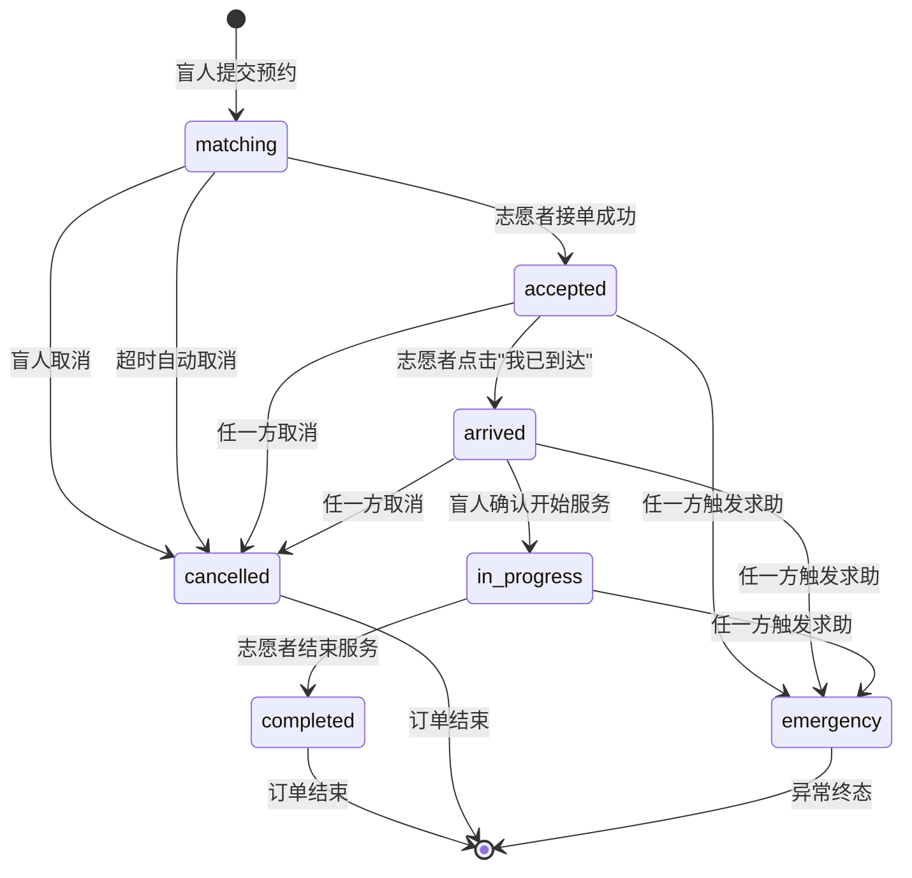

**图表来源**
- [04-user-flows-and-state-machine.md:72-96](file://docs/04-user-flows-and-state-machine.md#L72-L96)

### 状态转换规则表

| 当前状态 | 允许的目标状态 | 触发者 | 说明 |
|----------|---------------|--------|------|
| matching | accepted | 志愿者 | 接单（乐观锁保护） |
| matching | cancelled | 盲人 / 系统 | 手动取消或超时 |
| accepted | arrived | 志愿者 | 标记到达 |
| accepted | cancelled | 盲人 / 志愿者 | 服务开始前可取消 |
| accepted | emergency | 盲人 / 志愿者 | 一键求助 |
| arrived | in_progress | 盲人 | 确认开始服务 |
| arrived | cancelled | 盲人 / 志愿者 | 服务开始前可取消 |
| arrived | emergency | 盲人 / 志愿者 | 一键求助 |
| in_progress | completed | 志愿者 | 正常结束 |
| in_progress | emergency | 盲人 / 志愿者 | 一键求助 |

**禁止的流转**
- in_progress → cancelled（服务开始后不支持普通取消，只能走 emergency）
- emergency → 任何其他状态（MVP 不支持恢复或继续执行生命周期动作）
- completed → 任何状态（终态）
- cancelled → 任何状态（终态）

**更新** 基于 RunOrderService 的实际实现，明确了每个状态转换的具体业务规则和权限验证要求。

**章节来源**
- [04-user-flows-and-state-machine.md:98-119](file://docs/04-user-flows-and-state-machine.md#L98-L119)
- [RunOrderService.java:34-39](file://backend/src/main/java/com/aidrun/backend/order/RunOrderService.java#L34-L39)

## 架构概览

系统采用事件驱动架构，通过REST API实现前后端分离：

```mermaid
graph TB
subgraph "客户端层"
BRApp[盲人跑者App]
VOLApp[志愿者App]
OrderModels[OrderModels.swift]
End
subgraph "API网关"
API[REST API服务器]
RunOrderController[RunOrderController.java]
end
subgraph "业务逻辑层"
RunOrderService[订单服务]
UserService[用户服务]
LocationService[位置服务]
VolunteerService[志愿者服务]
end
subgraph "数据存储层"
OrderDB[(订单数据库)]
UserDB[(用户数据库)]
LocationDB[(位置数据库)]
EmergencyDB[(紧急事件数据库)]
CancellationDB[(取消记录数据库)]
ServiceSummaryDB[(服务总结数据库)]
end
subgraph "后端实体层"
OrderStatusEnum[RunOrderStatus.java]
OrderEntity[RunOrder.java]
OrderRepo[RunOrderRepository.java]
EmergencyEvent[EmergencyEvent.java]
Cancellation[Cancellation.java]
ServiceSummary[ServiceSummary.java]
end
subgraph "外部服务"
AMAP[高德地图API]
SMS[短信服务]
end
BRApp --> API
VOLApp --> API
OrderModels --> API
API --> RunOrderController
RunOrderController --> RunOrderService
RunOrderService --> OrderDB
UserService --> UserDB
LocationService --> LocationDB
VolunteerService --> VolunteerService
RunOrderService --> OrderStatusEnum
RunOrderService --> OrderEntity
RunOrderService --> OrderRepo
RunOrderService --> EmergencyEvent
RunOrderService --> Cancellation
RunOrderService --> ServiceSummary
LocationService --> AMAP
UserService --> SMS
```

**图表来源**
- [08-ios-architecture.md](file://docs/08-ios-architecture.md)
- [07-api-contract.openapi.yaml:1-1117](file://docs/07-api-contract.openapi.yaml#L1-L1117)
- [RunOrderStatus.java:1-36](file://backend/src/main/java/com/aidrun/backend/order/RunOrderStatus.java#L1-L36)
- [RunOrder.java:1-102](file://backend/src/main/java/com/aidrun/backend/order/RunOrder.java#L1-L102)

## 详细组件分析

### 订单状态枚举实现

系统实现了完整的 RunOrderStatus 枚举，确保前后端状态值的一致性：

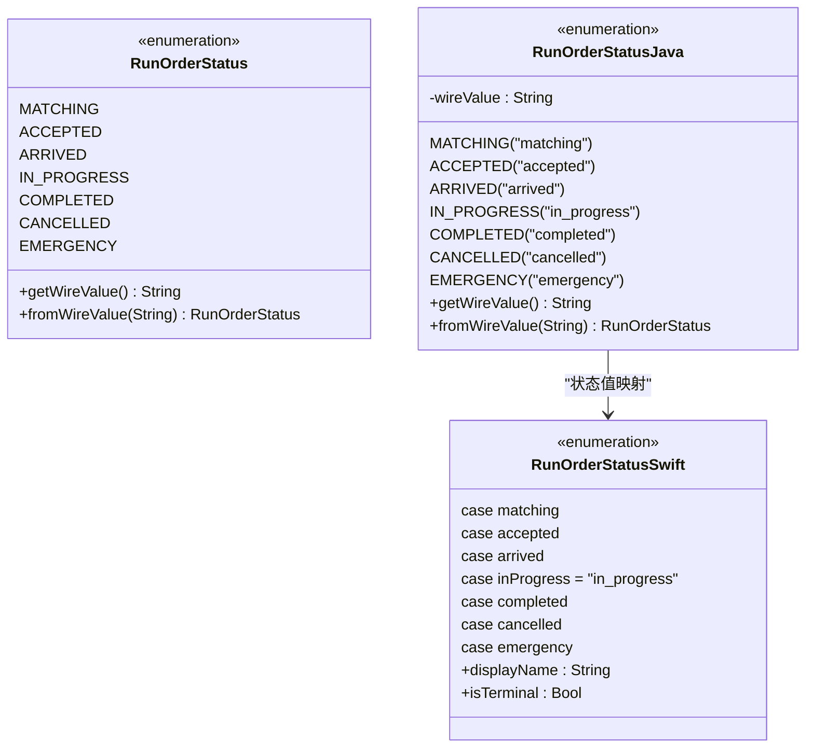

**图表来源**
- [RunOrderStatus.java:6-35](file://backend/src/main/java/com/aidrun/backend/order/RunOrderStatus.java#L6-L35)
- [OrderModels.swift:5-34](file://blindRun/Core/Models/OrderModels.swift#L5-L34)

### 订单实体模型

系统定义了完整的订单数据模型，包含所有状态转换所需的时间戳和状态字段：

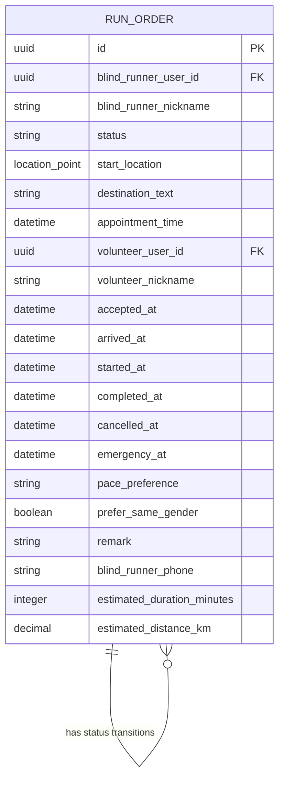

**图表来源**
- [RunOrder.java:20-101](file://backend/src/main/java/com/aidrun/backend/order/RunOrder.java#L20-L101)
- [07-api-contract.openapi.yaml:811-1048](file://docs/07-api-contract.openapi.yaml#L811-L1048)

### 订单创建流程

订单创建是整个生命周期的起点，涉及严格的验证和约束：

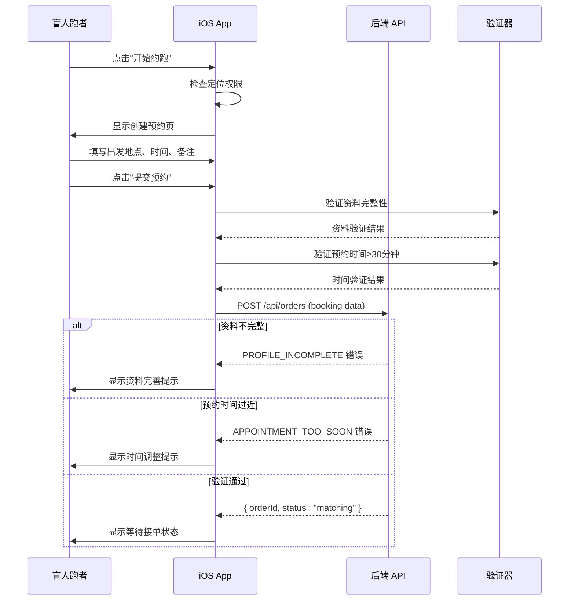

**图表来源**
- [04-user-flows-and-state-machine.md:120-178](file://docs/04-user-flows-and-state-machine.md#L120-L178)
- [blind-runner-booking/spec.md:11-25](file://openspec/changes/add-aidrun-ios-spring-mvp/specs/blind-runner-booking/spec.md#L11-L25)

### 并发控制机制

系统通过乐观锁和状态检查防止并发冲突：

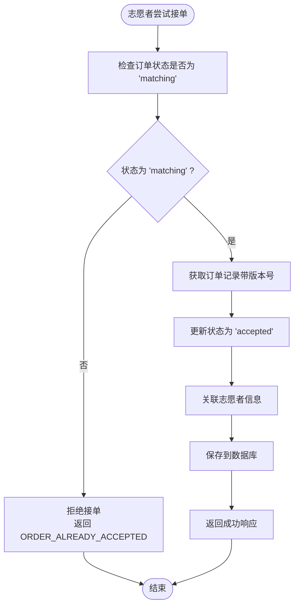

**更新** 并发控制机制现在基于 RunOrderService 的乐观锁实现，通过 acceptOrderAtomically 方法确保状态转换的原子性和一致性。

**图表来源**
- [order-status-lifecycle/spec.md:15-17](file://openspec/changes/add-aidrun-ios-spring-mvp/specs/order-status-lifecycle/spec.md#L15-L17)
- [RunOrderService.java:161-163](file://backend/src/main/java/com/aidrun/backend/order/RunOrderService.java#L161-L163)
- [RunOrderRepository.java:27-35](file://backend/src/main/java/com/aidrun/backend/order/RunOrderRepository.java#L27-L35)

### 轮询机制实现

系统采用定时轮询确保状态同步：

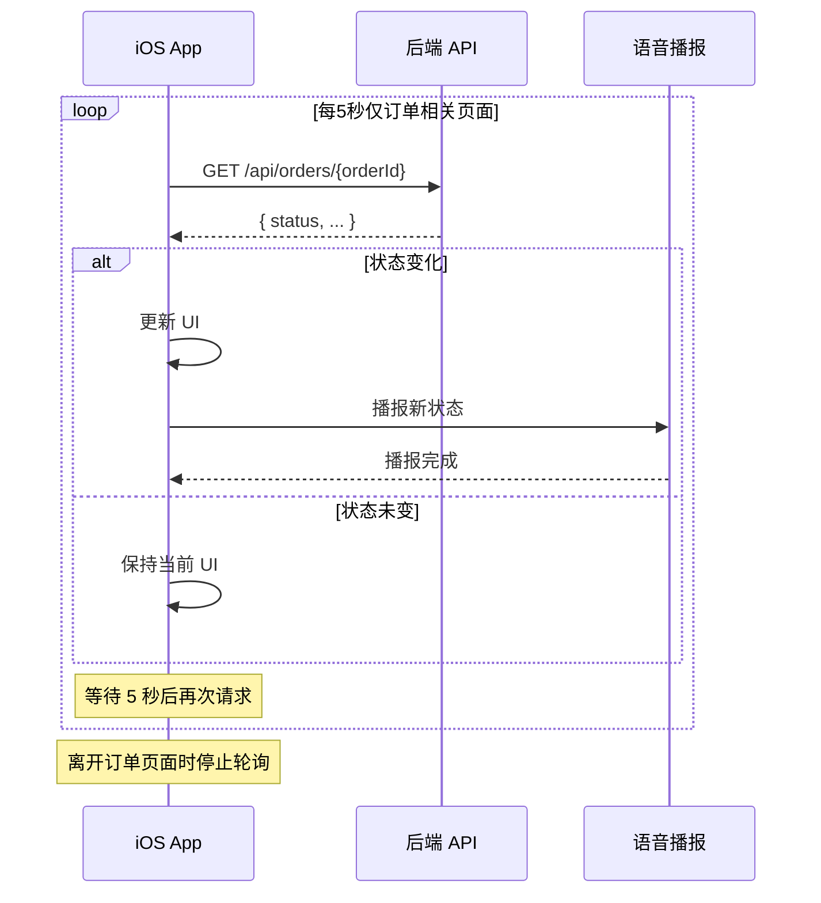

**图表来源**
- [04-user-flows-and-state-machine.md:275-299](file://docs/04-user-flows-and-state-machine.md#L275-L299)

### 紧急求助流程

紧急求助是系统的异常处理机制：

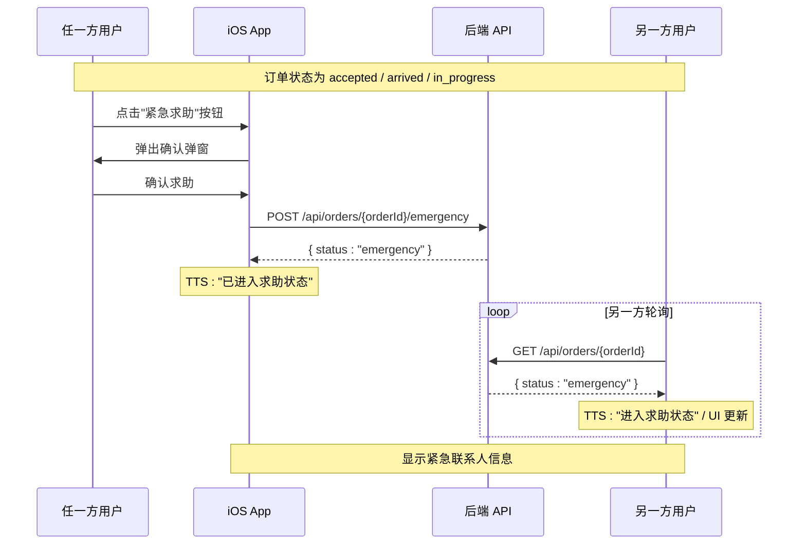

**图表来源**
- [04-user-flows-and-state-machine.md:230-257](file://docs/04-user-flows-and-state-machine.md#L230-L257)

### 数据模型设计

系统定义了完整的订单数据模型：

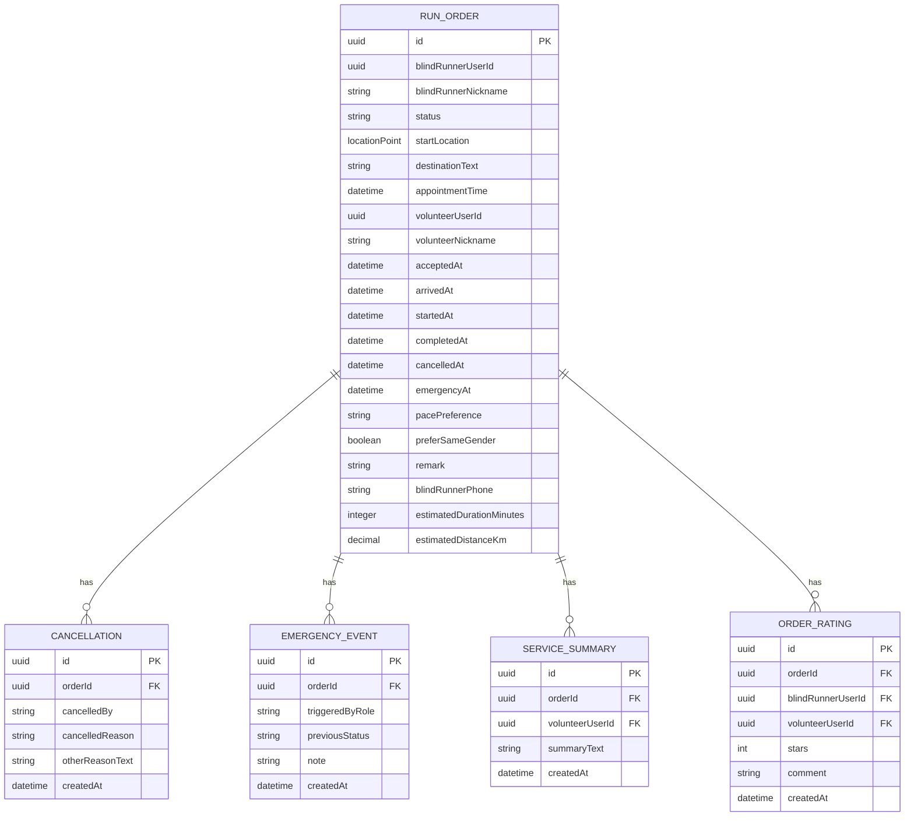

**图表来源**
- [07-api-contract.openapi.yaml:811-1048](file://docs/07-api-contract.openapi.yaml#L811-L1048)

**章节来源**
- [07-api-contract.openapi.yaml:811-1048](file://docs/07-api-contract.openapi.yaml#L811-L1048)

## 依赖关系分析

系统各组件之间的依赖关系如下：

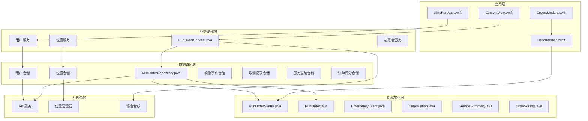

**更新** 新增了 RunOrderService.java 和相关仓储接口的依赖关系，确保状态枚举在前后端的一致性。

**图表来源**
- [08-ios-architecture.md](file://docs/08-ios-architecture.md)
- [07-api-contract.openapi.yaml:1-1117](file://docs/07-api-contract.openapi.yaml#L1-L1117)
- [RunOrderStatus.java:1-36](file://backend/src/main/java/com/aidrun/backend/order/RunOrderStatus.java#L1-L36)
- [OrderModels.swift:1-194](file://blindRun/Core/Models/OrderModels.swift#L1-L194)

**章节来源**
- [08-ios-architecture.md](file://docs/08-ios-architecture.md)

## 性能考虑

### 轮询优化策略

1. **智能轮询控制**：仅在相关页面启用轮询，离开页面时自动停止
2. **5秒间隔**：平衡实时性和网络负载
3. **状态变更检测**：只有状态变化时才更新UI和播报语音

### 并发控制优化

1. **乐观锁机制**：通过 acceptOrderAtomically 方法实现原子性状态转换
2. **状态预检查**：在更新前验证状态，避免无效操作
3. **原子性操作**：关键状态转换使用事务保证一致性

### 内存管理

1. **弱引用**：避免循环引用
2. **及时释放**：轮询结束后及时释放资源
3. **缓存策略**：合理使用内存缓存避免重复请求

**更新** 并发控制优化现在基于 RunOrderService 的乐观锁实现，通过数据库层面的原子性操作确保状态转换的性能和可靠性。

## 故障排除指南

### 常见问题及解决方案

| 问题类型 | 症状 | 可能原因 | 解决方案 |
|----------|------|----------|----------|
| 订单创建失败 | 返回 PROFILE_INCOMPLETE | 盲人资料不完整 | 引导用户完善资料 |
| 预约时间错误 | 返回 APPOINTMENT_TOO_SOON | 预约时间小于30分钟 | 提示用户调整时间 |
| 接单失败 | 返回 ORDER_ALREADY_ACCEPTED | 订单已被其他志愿者接单 | 显示其他可用订单 |
| 状态不同步 | UI显示过期状态 | 轮询间隔过长 | 检查轮询机制 |
| 紧急求助无效 | 状态未变为 emergency | 权限不足或网络问题 | 检查网络连接和权限 |
| 状态枚举不匹配 | 前后端状态值不一致 | RunOrderStatus映射错误 | 检查枚举值映射 |

**更新** 新增了基于 RunOrderService 实现的状态枚举不匹配问题排查指南，确保前后端状态值的一致性。

### 异常恢复机制

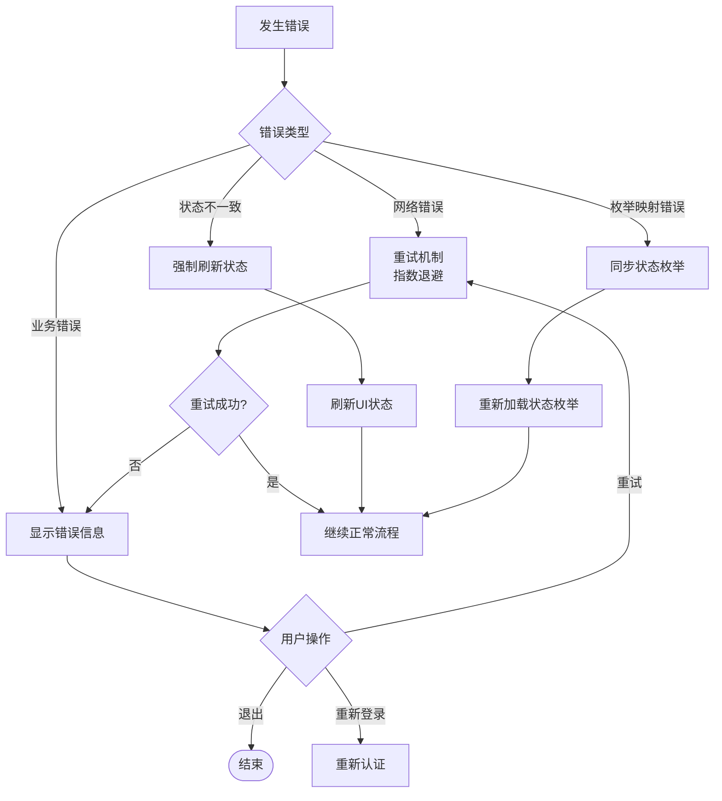

**图表来源**
- [04-user-flows-and-state-machine.md:275-299](file://docs/04-user-flows-and-state-machine.md#L275-L299)

**章节来源**
- [04-user-flows-and-state-machine.md:275-299](file://docs/04-user-flows-and-state-machine.md#L275-L299)

## 结论

本订单生命周期管理系统通过精心设计的状态机、严格的并发控制和高效的轮询机制，为盲人跑者和志愿者提供了可靠的配对服务。系统的主要优势包括：

1. **清晰的状态管理**：严格的有限状态机确保业务逻辑的确定性
2. **强大的并发控制**：乐观锁和状态检查防止竞态条件
3. **高效的轮询机制**：智能轮询在实时性和性能之间取得平衡
4. **完善的异常处理**：多层次的错误处理和恢复机制
5. **良好的扩展性**：模块化设计便于功能扩展和维护
6. **前后端一致性**：RunOrderStatus 枚举确保状态值在两端的一致性

**更新** 新增的完整订单生命周期管理系统进一步增强了系统的可靠性和用户体验，特别是通过 RunOrderService 的乐观锁实现和紧急事件处理流程，为系统提供了强大的并发控制和异常处理能力。

该系统为类似的服务匹配应用提供了优秀的参考实现，特别是在处理实时状态同步和并发控制方面具有重要的借鉴价值。