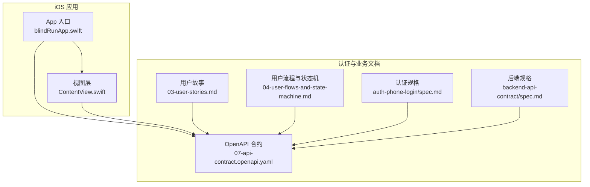
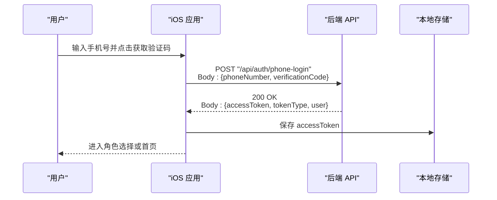
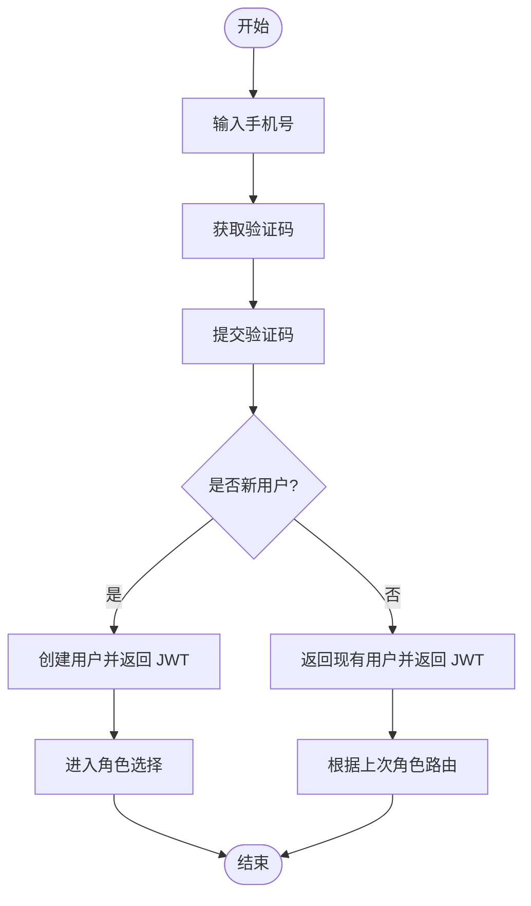
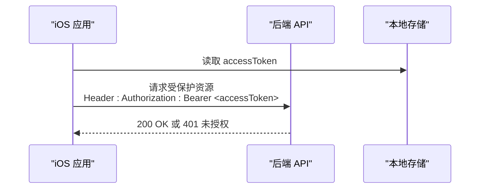
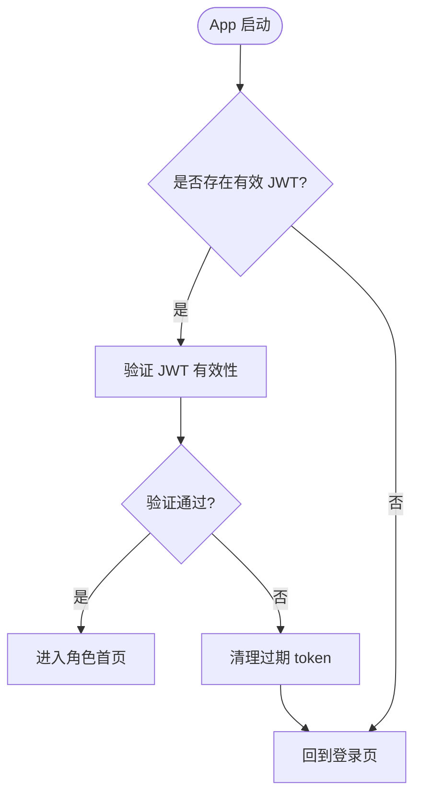
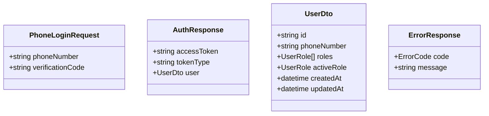
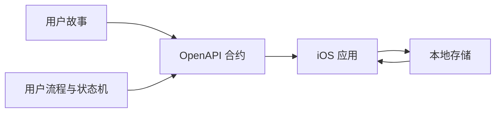

# 认证系统

<cite>
**本文引用的文件**
- [03-user-stories.md](file://docs/03-user-stories.md)
- [04-user-flows-and-state-machine.md](file://docs/04-user-flows-and-state-machine.md)
- [07-api-contract.openapi.yaml](file://docs/07-api-contract.openapi.yaml)
- [auth-phone-login/spec.md](file://openspec/changes/add-aidrun-ios-spring-mvp/specs/auth-phone-login/spec.md)
- [backend-api-contract/spec.md](file://openspec/changes/add-aidrun-ios-spring-mvp/specs/backend-api-contract/spec.md)
- [blindRunApp.swift](file://blindRun/blindRunApp.swift)
- [ContentView.swift](file://blindRun/ContentView.swift)
</cite>

## 目录
1. [简介](#简介)
2. [项目结构](#项目结构)
3. [核心组件](#核心组件)
4. [架构总览](#架构总览)
5. [详细组件分析](#详细组件分析)
6. [依赖关系分析](#依赖关系分析)
7. [性能考量](#性能考量)
8. [故障排查指南](#故障排查指南)
9. [结论](#结论)
10. [附录](#附录)

## 简介
本文件面向认证系统，聚焦“手机号登录”能力，覆盖以下主题：
- 手机号登录与账户自动创建流程
- JWT 令牌生成与验证机制
- 固定验证码验证逻辑
- 认证状态管理、会话保持、自动登录与退出登录
- 完整用户故事场景、API 接口规范与错误处理策略
- 认证中间件工作原理与安全考虑
- 提供具体代码实现示例路径，展示首次登录创建账户与现有用户登录的差异

## 项目结构
该仓库包含 iOS 应用骨架与认证相关的规格、用户故事、API 合约与状态机文档。认证系统的核心行为由用户故事与 OpenAPI 合约定义，iOS 应用负责调用后端 API 并维护本地会话。

**图表来源**
- [blindRunApp.swift:10-17](file://blindRun/blindRunApp.swift#L10-L17)
- [ContentView.swift:10-20](file://blindRun/ContentView.swift#L10-L20)
- [03-user-stories.md:1-96](file://docs/03-user-stories.md#L1-L96)
- [04-user-flows-and-state-machine.md:1-70](file://docs/04-user-flows-and-state-machine.md#L1-L70)
- [07-api-contract.openapi.yaml:25-46](file://docs/07-api-contract.openapi.yaml#L25-L46)
- [auth-phone-login/spec.md:1-30](file://openspec/changes/add-aidrun-ios-spring-mvp/specs/auth-phone-login/spec.md#L1-L30)
- [backend-api-contract/spec.md:1-34](file://openspec/changes/add-aidrun-ios-spring-mvp/specs/backend-api-contract/spec.md#L1-L34)

**章节来源**
- [blindRunApp.swift:10-17](file://blindRun/blindRunApp.swift#L10-L17)
- [ContentView.swift:10-20](file://blindRun/ContentView.swift#L10-L20)
- [03-user-stories.md:1-96](file://docs/03-user-stories.md#L1-L96)
- [04-user-flows-and-state-machine.md:1-70](file://docs/04-user-flows-and-state-machine.md#L1-L70)
- [07-api-contract.openapi.yaml:25-46](file://docs/07-api-contract.openapi.yaml#L25-L46)
- [auth-phone-login/spec.md:1-30](file://openspec/changes/add-aidrun-ios-spring-mvp/specs/auth-phone-login/spec.md#L1-L30)
- [backend-api-contract/spec.md:1-34](file://openspec/changes/add-aidrun-ios-spring-mvp/specs/backend-api-contract/spec.md#L1-L34)

## 核心组件
- 手机号登录与自动注册
  - 首次登录：提交固定验证码，后端创建用户并返回 JWT
  - 现有用户：提交固定验证码，后端返回现有用户与新 JWT
- 固定验证码验证
  - 仅接受固定值；其他值返回错误码
- JWT 令牌
  - Bearer 方案；所有受保护接口均要求携带
  - 支持自动登录与退出登录
- 认证状态管理
  - UserDefaults 存储 JWT；启动时验证并自动登录；退出登录时清理
- 角色选择与切换
  - 首次登录后进入角色选择；切换 activeRole 时对活跃订单进行拦截

**章节来源**
- [auth-phone-login/spec.md:3-29](file://openspec/changes/add-aidrun-ios-spring-mvp/specs/auth-phone-login/spec.md#L3-L29)
- [03-user-stories.md:5-96](file://docs/03-user-stories.md#L5-L96)
- [07-api-contract.openapi.yaml:25-46](file://docs/07-api-contract.openapi.yaml#L25-L46)

## 架构总览
认证系统采用“前端调用 + 后端鉴权”的分层架构。前端负责收集手机号与验证码，调用登录接口；后端完成用户校验与 JWT 签发；前端在后续请求中携带 JWT。

**图表来源**
- [07-api-contract.openapi.yaml:25-46](file://docs/07-api-contract.openapi.yaml#L25-L46)
- [03-user-stories.md:5-96](file://docs/03-user-stories.md#L5-L96)

## 详细组件分析

### 手机号登录与账户自动创建
- 首次登录
  - 行为：提交固定验证码，后端创建用户、分配可用角色、activeRole 未设置，返回 JWT
  - 场景：登录页 -> 验证码页 -> 登录成功 -> 角色选择页
- 现有用户登录
  - 行为：提交固定验证码，后端返回现有用户与新 JWT
  - 场景：登录页 -> 验证码页 -> 登录成功 -> 直接进入角色首页

**图表来源**
- [auth-phone-login/spec.md:7-13](file://openspec/changes/add-aidrun-ios-spring-mvp/specs/auth-phone-login/spec.md#L7-L13)
- [03-user-stories.md:49-79](file://docs/03-user-stories.md#L49-L79)

**章节来源**
- [auth-phone-login/spec.md:3-13](file://openspec/changes/add-aidrun-ios-spring-mvp/specs/auth-phone-login/spec.md#L3-L13)
- [03-user-stories.md:49-79](file://docs/03-user-stories.md#L49-L79)

### JWT 令牌生成与验证机制
- 生成
  - 登录成功后返回 accessToken 与 tokenType（Bearer）
- 验证
  - 所有受保护接口要求 Bearer Token
  - 缺失或无效时返回未授权错误
- 使用
  - iOS 应用在后续请求头中携带 Authorization: Bearer <token>

**图表来源**
- [07-api-contract.openapi.yaml:454-458](file://docs/07-api-contract.openapi.yaml#L454-L458)
- [07-api-contract.openapi.yaml:470-479](file://docs/07-api-contract.openapi.yaml#L470-L479)
- [auth-phone-login/spec.md:23-29](file://openspec/changes/add-aidrun-ios-spring-mvp/specs/auth-phone-login/spec.md#L23-L29)

**章节来源**
- [07-api-contract.openapi.yaml:454-479](file://docs/07-api-contract.openapi.yaml#L454-L479)
- [auth-phone-login/spec.md:23-29](file://openspec/changes/add-aidrun-ios-spring-mvp/specs/auth-phone-login/spec.md#L23-L29)

### 固定验证码验证逻辑
- 验证码
  - 仅接受固定值；其他值返回 INVALID_VERIFICATION_CODE
- 错误处理
  - 400 响应，包含错误码与消息

**图表来源**
- [auth-phone-login/spec.md:15-22](file://openspec/changes/add-aidrun-ios-spring-mvp/specs/auth-phone-login/spec.md#L15-L22)
- [07-api-contract.openapi.yaml:479-487](file://docs/07-api-contract.openapi.yaml#L479-L487)

**章节来源**
- [auth-phone-login/spec.md:15-22](file://openspec/changes/add-aidrun-ios-spring-mvp/specs/auth-phone-login/spec.md#L15-L22)
- [07-api-contract.openapi.yaml:479-487](file://docs/07-api-contract.openapi.yaml#L479-L487)

### 认证状态管理、会话保持、自动登录与退出登录
- 自动登录
  - App 启动时读取本地存储中的有效 JWT，验证后直接进入对应角色首页
  - 若 JWT 过期或无效，则清理并回到登录页
- 退出登录
  - 设置页点击退出登录并确认后，清理本地存储中的 token，回到登录页

**图表来源**
- [03-user-stories.md:61-96](file://docs/03-user-stories.md#L61-L96)

**章节来源**
- [03-user-stories.md:61-96](file://docs/03-user-stories.md#L61-L96)

### 角色选择与切换
- 首次登录后的角色选择
  - 选择“盲人跑者”或“志愿者”，保存到后端并进入对应流程
- 切换 activeRole
  - 存在活跃订单（accepted / arrived / in_progress / emergency）时禁止切换
  - 其他状态下可正常切换

**图表来源**
- [03-user-stories.md:99-158](file://docs/03-user-stories.md#L99-L158)

**章节来源**
- [03-user-stories.md:99-158](file://docs/03-user-stories.md#L99-L158)

### API 接口规范与错误处理策略
- 登录接口
  - 路径：POST /api/auth/phone-login
  - 请求体：phoneNumber、verificationCode（固定值）
  - 成功：200，返回 accessToken、tokenType、user
  - 失败：400，INVALID_VERIFICATION_CODE
- 受保护接口
  - 需要在请求头携带 Authorization: Bearer <accessToken>
  - 未携带或无效：401 UNAUTHORIZED
- 错误码
  - 包括 INVALID_VERIFICATION_CODE、UNAUTHORIZED 等稳定错误码

**图表来源**
- [07-api-contract.openapi.yaml:611-656](file://docs/07-api-contract.openapi.yaml#L611-L656)
- [07-api-contract.openapi.yaml:543-566](file://docs/07-api-contract.openapi.yaml#L543-L566)

**章节来源**
- [07-api-contract.openapi.yaml:25-46](file://docs/07-api-contract.openapi.yaml#L25-L46)
- [07-api-contract.openapi.yaml:469-566](file://docs/07-api-contract.openapi.yaml#L469-L566)

### 认证中间件工作原理与安全考虑
- 中间件职责
  - 校验 Authorization 头中的 Bearer Token
  - 对未携带或无效 token 的请求返回 401
- 安全考虑
  - 令牌有效期与刷新策略（如需）应在后端实现
  - 建议启用 HTTPS 传输
  - 前端避免在日志中输出敏感信息
  - 前端本地存储建议使用安全存储方案（如钥匙串）

**章节来源**
- [07-api-contract.openapi.yaml:454-458](file://docs/07-api-contract.openapi.yaml#L454-L458)
- [auth-phone-login/spec.md:23-29](file://openspec/changes/add-aidrun-ios-spring-mvp/specs/auth-phone-login/spec.md#L23-L29)

## 依赖关系分析
- 文档驱动
  - 用户故事与状态机定义了交互流程
  - OpenAPI 合约定义了接口契约与错误码
- 实现耦合
  - iOS 应用通过调用后端 API 实现认证
  - 本地存储与后端鉴权共同构成会话管理

**图表来源**
- [03-user-stories.md:1-96](file://docs/03-user-stories.md#L1-L96)
- [04-user-flows-and-state-machine.md:1-70](file://docs/04-user-flows-and-state-machine.md#L1-L70)
- [07-api-contract.openapi.yaml:25-46](file://docs/07-api-contract.openapi.yaml#L25-L46)

**章节来源**
- [03-user-stories.md:1-96](file://docs/03-user-stories.md#L1-L96)
- [04-user-flows-and-state-machine.md:1-70](file://docs/04-user-flows-and-state-machine.md#L1-L70)
- [07-api-contract.openapi.yaml:25-46](file://docs/07-api-contract.openapi.yaml#L25-L46)

## 性能考量
- 登录与受保护接口的调用频率较低，性能瓶颈通常不在认证链路
- 建议在前端缓存必要的用户信息，减少重复请求
- 对于轮询类接口，应合理设置轮询间隔与停止条件，避免不必要的网络负载

## 故障排查指南
- 验证码错误
  - 现象：提交非固定验证码返回 INVALID_VERIFICATION_CODE
  - 处理：提示用户重新输入验证码
- 未登录或 token 无效
  - 现象：访问受保护接口返回 401 UNAUTHORIZED
  - 处理：清理本地 token，跳转登录页
- 自动登录失败
  - 现象：启动后未进入首页
  - 处理：检查本地 token 是否存在且未过期；必要时重新登录

**章节来源**
- [07-api-contract.openapi.yaml:479-487](file://docs/07-api-contract.openapi.yaml#L479-L487)
- [07-api-contract.openapi.yaml:470-479](file://docs/07-api-contract.openapi.yaml#L470-L479)
- [03-user-stories.md:61-96](file://docs/03-user-stories.md#L61-L96)

## 结论
本认证系统以“手机号 + 固定验证码”为核心入口，结合 JWT 实现轻量级会话管理。用户故事与 OpenAPI 合约明确了登录、自动登录、退出登录与角色切换的行为边界。前端通过调用后端 API 完成认证流程，后端通过中间件统一校验令牌，确保受保护接口的安全性。建议在后续版本中完善令牌刷新、HTTPS 与本地存储安全等措施，持续提升安全性与用户体验。

## 附录
- 示例路径（用于定位实现）
  - 登录接口定义：[07-api-contract.openapi.yaml:25-46](file://docs/07-api-contract.openapi.yaml#L25-L46)
  - JWT 定义与受保护接口：[07-api-contract.openapi.yaml:454-458](file://docs/07-api-contract.openapi.yaml#L454-L458)
  - 自动登录与退出登录场景：[03-user-stories.md:61-96](file://docs/03-user-stories.md#L61-L96)
  - 首次登录与现有用户登录差异：[auth-phone-login/spec.md:7-13](file://openspec/changes/add-aidrun-ios-spring-mvp/specs/auth-phone-login/spec.md#L7-L13)
  - 角色切换拦截逻辑：[03-user-stories.md:139-158](file://docs/03-user-stories.md#L139-L158)