# 认证系统

<cite>
**本文引用的文件**
- [AuthController.java](file://backend/src/main/java/com/aidrun/backend/auth/AuthController.java)
- [AuthService.java](file://backend/src/main/java/com/aidrun/backend/auth/AuthService.java)
- [JwtService.java](file://backend/src/main/java/com/aidrun/backend/auth/JwtService.java)
- [JwtAuthenticationFilter.java](file://backend/src/main/java/com/aidrun/backend/auth/JwtAuthenticationFilter.java)
- [PhoneLoginRequest.java](file://backend/src/main/java/com/aidrun/backend/auth/dto/PhoneLoginRequest.java)
- [AuthResponse.java](file://backend/src/main/java/com/aidrun/backend/auth/dto/AuthResponse.java)
- [AppUser.java](file://backend/src/main/java/com/aidrun/backend/user/AppUser.java)
- [AppUserRepository.java](file://backend/src/main/java/com/aidrun/backend/user/AppUserRepository.java)
- [UserDto.java](file://backend/src/main/java/com/aidrun/backend/user/dto/UserDto.java)
- [UserRole.java](file://backend/src/main/java/com/aidrun/backend/user/UserRole.java)
- [UserController.java](file://backend/src/main/java/com/aidrun/backend/user/UserController.java)
- [UserService.java](file://backend/src/main/java/com/aidrun/backend/user/UserService.java)
- [UserMeResponse.java](file://backend/src/main/java/com/aidrun/backend/user/dto/UserMeResponse.java)
- [SwitchRoleRequest.java](file://backend/src/main/java/com/aidrun/backend/user/dto/SwitchRoleRequest.java)
- [ProfileController.java](file://backend/src/main/java/com/aidrun/backend/profile/ProfileController.java)
- [ProfileService.java](file://backend/src/main/java/com/aidrun/backend/profile/ProfileService.java)
- [BlindRunnerProfile.java](file://backend/src/main/java/com/aidrun/backend/profile/BlindRunnerProfile.java)
- [EmergencyContact.java](file://backend/src/main/java/com/aidrun/backend/profile/EmergencyContact.java)
- [EmergencyContactDto.java](file://backend/src/main/java/com/aidrun/backend/profile/dto/EmergencyContactDto.java)
- [EmergencyContactRequest.java](file://backend/src/main/java/com/aidrun/backend/profile/dto/EmergencyContactRequest.java)
- [SecurityConfig.java](file://backend/src/main/java/com/aidrun/backend/config/SecurityConfig.java)
- [application.yml](file://backend/src/main/resources/application.yml)
- [ErrorCode.java](file://backend/src/main/java/com/aidrun/backend/common/error/ErrorCode.java)
- [AuthControllerIntegrationTest.java](file://backend/src/test/java/com/aidrun/backend/auth/AuthControllerIntegrationTest.java)
- [07-api-contract.openapi.yaml](file://docs/07-api-contract.openapi.yaml)
- [LoginViewModel.swift](file://blindRun/Auth/LoginViewModel.swift)
- [LoginView.swift](file://blindRun/Auth/LoginView.swift)
- [SpeechService.swift](file://blindRun/Voice/SpeechService.swift)
- [AppState.swift](file://blindRun/Core/AppState.swift)
- [APIClient.swift](file://blindRun/Core/APIClient.swift)
- [EnvironmentConfig.swift](file://blindRun/Core/EnvironmentConfig.swift)
- [LocalConfig.xcconfig.example](file://LocalConfig.xcconfig.example)
- [blindRunTests.swift](file://blindRunTests/blindRunTests.swift)
</cite>

## 更新摘要
**所做更改**
- 重构认证响应结构：从双令牌系统迁移到统一的`AuthResponse{accessToken, tokenType, user}`方案
- 新增角色切换功能：支持`/api/users/me/active-role`接口实现角色切换
- 集成紧急联系人管理：在盲人跑者档案创建时自动关联紧急联系人
- 更新用户信息接口：新增`UserMeResponse`包含用户、盲人跑者档案和志愿者档案信息
- 完善会话管理和状态保持：统一的JWT令牌管理方案

## 目录
1. [简介](#简介)
2. [项目结构](#项目结构)
3. [核心组件](#核心组件)
4. [架构总览](#架构总览)
5. [详细组件分析](#详细组件分析)
6. [用户模型与数据结构](#用户模型与数据结构)
7. [认证流程实现](#认证流程实现)
8. [JWT认证系统详解](#jwt认证系统详解)
9. [认证状态管理](#认证状态管理)
10. [角色切换与紧急联系人管理](#角色切换与紧急联系人管理)
11. [输入验证与无障碍增强](#输入验证与无障碍增强)
12. [API环境管理与本地后端配置](#api环境管理与本地后端配置)
13. [依赖关系分析](#依赖关系分析)
14. [性能考量](#性能考量)
15. [故障排查指南](#故障排查指南)
16. [结论](#结论)
17. [附录](#附录)

## 简介
本文件面向认证系统，聚焦"手机号登录"能力，覆盖以下主题：
- 手机号登录与账户自动创建流程，包含完整的输入验证机制
- **统一的JWT令牌系统**，包含发行者验证和用户ID提取功能
- 固定验证码验证逻辑，支持多种错误场景
- **角色切换功能**：支持盲人跑者与志愿者角色之间的切换
- **紧急联系人管理集成**：在用户档案创建时自动关联紧急联系人信息
- **iOS端登录视图增强**：环境切换器、本地后端地址配置、开发测试体验改进
- **API环境管理**：mock、localBackend、production三种环境模式
- 认证状态管理、会话保持、自动登录与退出登录
- 完整用户故事场景、API 接口规范与错误处理策略
- 认证中间件工作原理与安全考虑
- 提供具体代码实现示例路径，展示首次登录创建账户与现有用户登录的差异

## 项目结构
该仓库包含 iOS 应用骨架与认证相关的规格、用户故事、API 合约与状态机文档。认证系统的核心行为由用户故事与 OpenAPI 合约定义，iOS 应用负责调用后端 API 并维护本地会话。

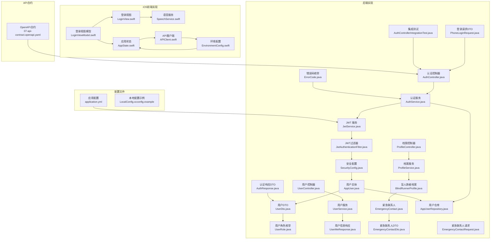

**图表来源**
- [AuthController.java:12-27](file://backend/src/main/java/com/aidrun/backend/auth/AuthController.java#L12-L27)
- [AuthService.java:16-48](file://backend/src/main/java/com/aidrun/backend/auth/AuthService.java#L16-L48)
- [JwtService.java:17-108](file://backend/src/main/java/com/aidrun/backend/auth/JwtService.java#L17-L108)
- [JwtAuthenticationFilter.java:17-63](file://backend/src/main/java/com/aidrun/backend/auth/JwtAuthenticationFilter.java#L17-L63)
- [SecurityConfig.java:17-55](file://backend/src/main/java/com/aidrun/backend/config/SecurityConfig.java#L17-L55)
- [AppUser.java:16-56](file://backend/src/main/java/com/aidrun/backend/user/AppUser.java#L16-L56)
- [UserDto.java:8-27](file://backend/src/main/java/com/aidrun/backend/user/dto/UserDto.java#L8-L27)
- [UserRole.java:6-30](file://backend/src/main/java/com/aidrun/backend/user/UserRole.java#L6-L30)
- [PhoneLoginRequest.java:6-12](file://backend/src/main/java/com/aidrun/backend/auth/dto/PhoneLoginRequest.java#L6-L12)
- [AuthResponse.java:5-10](file://backend/src/main/java/com/aidrun/backend/auth/dto/AuthResponse.java#L5-L10)
- [UserController.java:15-44](file://backend/src/main/java/com/aidrun/backend/user/UserController.java#L15-L44)
- [UserService.java:21-84](file://backend/src/main/java/com/aidrun/backend/user/UserService.java#L21-L84)
- [UserMeResponse.java:6-11](file://backend/src/main/java/com/aidrun/backend/user/dto/UserMeResponse.java#L6-L11)
- [ProfileController.java:16-43](file://backend/src/main/java/com/aidrun/backend/profile/ProfileController.java#L16-L43)
- [ProfileService.java:12-76](file://backend/src/main/java/com/aidrun/backend/profile/ProfileService.java#L12-L76)
- [BlindRunnerProfile.java:13-66](file://backend/src/main/java/com/aidrun/backend/profile/BlindRunnerProfile.java#L13-L66)
- [EmergencyContact.java:11-52](file://backend/src/main/java/com/aidrun/backend/profile/EmergencyContact.java#L11-L52)
- [EmergencyContactDto.java:5-15](file://backend/src/main/java/com/aidrun/backend/profile/dto/EmergencyContactDto.java#L5-L15)
- [EmergencyContactRequest.java:6-9](file://backend/src/main/java/com/aidrun/backend/profile/dto/EmergencyContactRequest.java#L6-L9)
- [ErrorCode.java:6-40](file://backend/src/main/java/com/aidrun/backend/common/error/ErrorCode.java#L6-L40)
- [AppUserRepository.java:6-9](file://backend/src/main/java/com/aidrun/backend/user/AppUserRepository.java#L6-L9)
- [AuthControllerIntegrationTest.java:17-136](file://backend/src/test/java/com/aidrun/backend/auth/AuthControllerIntegrationTest.java#L17-L136)
- [application.yml:30-34](file://backend/src/main/resources/application.yml#L30-L34)
- [07-api-contract.openapi.yaml:454-487](file://docs/07-api-contract.openapi.yaml#L454-L487)
- [LoginViewModel.swift:1-266](file://blindRun/Auth/LoginViewModel.swift#L1-L266)
- [LoginView.swift:1-293](file://blindRun/Auth/LoginView.swift#L1-L293)
- [SpeechService.swift:1-105](file://blindRun/Voice/SpeechService.swift#L1-L105)
- [AppState.swift:1-248](file://blindRun/Core/AppState.swift#L1-L248)
- [APIClient.swift:1-194](file://blindRun/Core/APIClient.swift#L1-L194)
- [EnvironmentConfig.swift:1-104](file://blindRun/Core/EnvironmentConfig.swift#L1-L104)
- [LocalConfig.xcconfig.example:1-31](file://LocalConfig.xcconfig.example#L1-L31)

## 核心组件
- 手机号登录与自动注册
  - 首次登录：提交固定验证码，后端创建用户并返回统一的JWT令牌
  - 现有用户：提交固定验证码，后端返回现有用户与新 JWT
  - **输入验证**：手机号格式验证（11位数字，以1开头），验证码非空验证
- **统一的JWT令牌系统**
  - **发行者验证**：令牌包含发行者标识，解析时验证发行者一致性
  - **用户ID提取**：从令牌载荷中提取用户ID，支持令牌验证与用户识别
  - **签名验证**：使用HMAC-SHA256算法进行数字签名验证
  - **响应结构**：统一的`AuthResponse{accessToken, tokenType, user}`格式
- 固定验证码验证
  - 仅接受固定值"123456"；其他值返回 INVALID_VERIFICATION_CODE 错误码
- **角色切换功能**
  - 支持在盲人跑者和志愿者角色之间切换
  - 存在活跃订单时禁止切换角色
  - 切换后立即生效并返回更新后的用户信息
- **紧急联系人管理集成**
  - 在创建盲人跑者档案时自动关联紧急联系人
  - 支持更新紧急联系人信息
  - 紧急联系人与用户档案一对一关联
- **iOS端登录视图增强**
  - **环境切换器**：调试模式下提供API环境切换功能
  - **本地后端地址配置**：支持配置本地后端地址，支持局域网IP和自定义端口
  - **开发测试体验改进**：简化环境切换，提升开发效率
- **API环境管理**
  - **mock**：本地模拟环境，不使用网络请求
  - **localBackend**：本地后端环境，支持自定义后端地址
  - **production**：生产环境，使用正式API地址
- **iOS端输入验证增强**
  - **实时标准化**：normalizedPhoneNumber()和normalizedVerificationCode()方法
  - **无障碍支持**：VoiceOver标签、TTS语音播报、震动反馈
  - **数字键盘**：手机号使用numberPad，验证码使用oneTimeCode
  - **自动提交**：验证码达到6位时自动触发登录
- JWT 令牌
  - Bearer 方案；所有受保护接口均要求携带
  - 支持自动登录与退出登录
- 认证状态管理
  - UserDefaults 存储 JWT；启动时验证并自动登录；退出登录时清理
- 角色选择与切换
  - 首次登录后进入角色选择；切换 activeRole 时对活跃订单进行拦截

**章节来源**
- [PhoneLoginRequest.java:6-12](file://backend/src/main/java/com/aidrun/backend/auth/dto/PhoneLoginRequest.java#L6-L12)
- [AuthService.java:19-47](file://backend/src/main/java/com/aidrun/backend/auth/AuthService.java#L19-L47)
- [JwtService.java:38-78](file://backend/src/main/java/com/aidrun/backend/auth/JwtService.java#L38-L78)
- [AuthResponse.java:5-10](file://backend/src/main/java/com/aidrun/backend/auth/dto/AuthResponse.java#L5-L10)
- [UserController.java:32-38](file://backend/src/main/java/com/aidrun/backend/user/UserController.java#L32-L38)
- [UserService.java:61-83](file://backend/src/main/java/com/aidrun/backend/user/UserService.java#L61-L83)
- [ProfileService.java:24-53](file://backend/src/main/java/com/aidrun/backend/profile/ProfileService.java#L24-L53)
- [EmergencyContact.java:13-52](file://backend/src/main/java/com/aidrun/backend/profile/EmergencyContact.java#L13-L52)
- [ErrorCode.java:7-18](file://backend/src/main/java/com/aidrun/backend/common/error/ErrorCode.java#L7-L18)
- [LoginViewModel.swift:15-43](file://blindRun/Auth/LoginViewModel.swift#L15-L43)
- [LoginView.swift:56-138](file://blindRun/Auth/LoginView.swift#L56-L138)
- [SpeechService.swift:49-52](file://blindRun/Voice/SpeechService.swift#L49-L52)
- [AppState.swift:76-90](file://blindRun/Core/AppState.swift#L76-L90)
- [EnvironmentConfig.swift:5-41](file://blindRun/Core/EnvironmentConfig.swift#L5-L41)

## 架构总览
认证系统采用"前端调用 + 后端鉴权"的分层架构。前端负责收集手机号与验证码，调用登录接口；后端完成用户校验与 JWT 签发；前端在后续请求中携带 JWT。新增的统一认证响应结构和角色切换功能进一步完善了认证体系。紧急联系人管理集成到用户档案创建流程中，提供完整的用户信息管理能力。

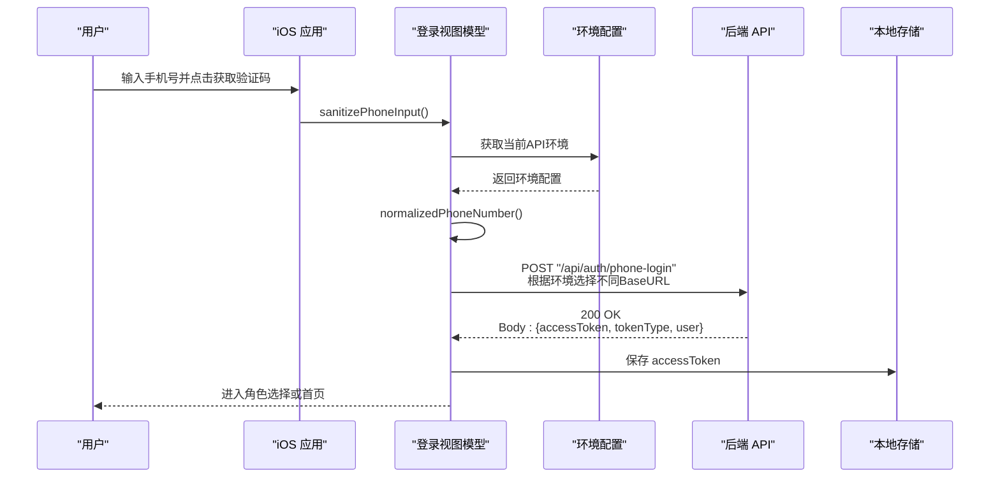

**图表来源**
- [07-api-contract.openapi.yaml:25-46](file://docs/07-api-contract.openapi.yaml#L25-L46)
- [LoginViewModel.swift:121-124](file://blindRun/Auth/LoginViewModel.swift#L121-L124)
- [LoginViewModel.swift:179-186](file://blindRun/Auth/LoginViewModel.swift#L179-L186)
- [AppState.swift:76-90](file://blindRun/Core/AppState.swift#L76-L90)
- [EnvironmentConfig.swift:21-36](file://blindRun/Core/EnvironmentConfig.swift#L21-L36)

## 详细组件分析

### 统一认证响应结构

**更新** 重构认证响应结构：从双令牌系统迁移到统一的`AuthResponse{accessToken, tokenType, user}`方案

- **响应结构**
  - accessToken：JWT访问令牌字符串
  - tokenType：令牌类型，固定为"Bearer"
  - user：用户信息DTO，包含id、phoneNumber、roles、activeRole等
- **优势**
  - 简化客户端处理逻辑
  - 统一的令牌管理方案
  - 减少API复杂度
- **向后兼容**
  - 保持与现有客户端的兼容性
  - 逐步迁移旧的双令牌系统

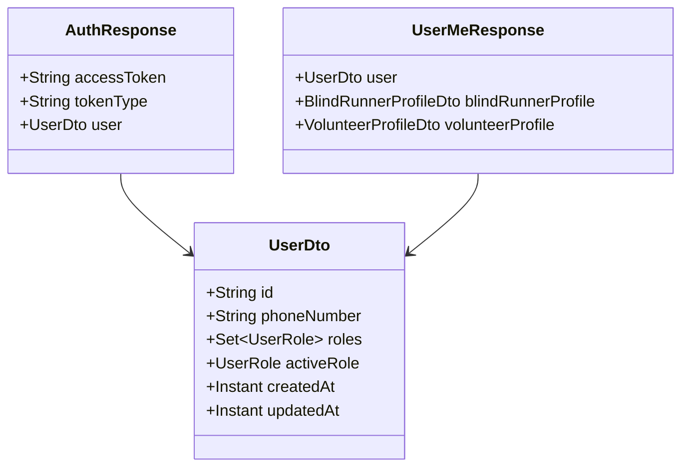

**图表来源**
- [AuthResponse.java:5-10](file://backend/src/main/java/com/aidrun/backend/auth/dto/AuthResponse.java#L5-L10)
- [UserDto.java:8-27](file://backend/src/main/java/com/aidrun/backend/user/dto/UserDto.java#L8-L27)
- [UserMeResponse.java:6-11](file://backend/src/main/java/com/aidrun/backend/user/dto/UserMeResponse.java#L6-L11)

**章节来源**
- [AuthResponse.java:5-10](file://backend/src/main/java/com/aidrun/backend/auth/dto/AuthResponse.java#L5-L10)
- [UserDto.java:8-27](file://backend/src/main/java/com/aidrun/backend/user/dto/UserDto.java#L8-L27)
- [UserMeResponse.java:6-11](file://backend/src/main/java/com/aidrun/backend/user/dto/UserMeResponse.java#L6-L11)

### 手机号登录与账户自动创建
- 首次登录
  - 行为：提交固定验证码，后端创建用户、分配可用角色、activeRole 未设置，返回统一JWT
  - 场景：登录页 -> 验证码页 -> 登录成功 -> 角色选择页
- 现有用户登录
  - 行为：提交固定验证码，后端返回现有用户与新 JWT
  - 场景：登录页 -> 验证码页 -> 登录成功 -> 直接进入角色首页
- **输入验证增强**
  - 手机号格式验证：必须是11位数字，以1开头
  - 验证码非空验证：不能为空字符串
  - 格式错误时返回 VALIDATION_FAILED 错误码

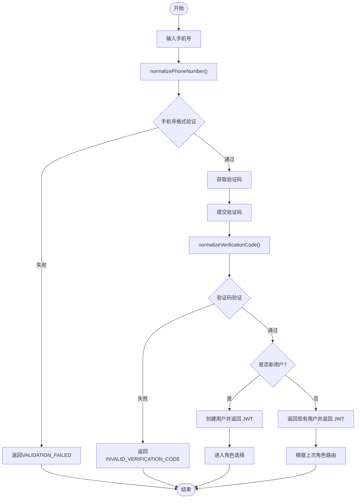

**图表来源**
- [AuthService.java:29-47](file://backend/src/main/java/com/aidrun/backend/auth/AuthService.java#L29-L47)
- [PhoneLoginRequest.java:6-12](file://backend/src/main/java/com/aidrun/backend/auth/dto/PhoneLoginRequest.java#L6-L12)
- [AuthControllerIntegrationTest.java:93-134](file://backend/src/test/java/com/aidrun/backend/auth/AuthControllerIntegrationTest.java#L93-L134)
- [LoginViewModel.swift:254-260](file://blindRun/Auth/LoginViewModel.swift#L254-L260)

**章节来源**
- [AuthService.java:29-47](file://backend/src/main/java/com/aidrun/backend/auth/AuthService.java#L29-L47)
- [PhoneLoginRequest.java:6-12](file://backend/src/main/java/com/aidrun/backend/auth/dto/PhoneLoginRequest.java#L6-L12)
- [AuthControllerIntegrationTest.java:93-134](file://backend/src/test/java/com/aidrun/backend/auth/AuthControllerIntegrationTest.java#L93-L134)
- [LoginViewModel.swift:254-260](file://blindRun/Auth/LoginViewModel.swift#L254-L260)

### **统一的JWT令牌系统**

**更新** 新增基于HMAC-SHA256的JWT令牌系统，包含发行者验证和用户ID提取功能

- **令牌格式**
  - 结构：header.payload.signature
  - Header：包含算法(HS256)和类型(JWT)
  - Payload：包含发行者(iss)、主题(sub)、签发时间(iat)
  - Signature：使用HMAC-SHA256算法对header.payload进行签名
- **发行者验证**
  - 解析时验证iss字段与配置的一致性
  - 验证签名完整性，防止令牌篡改
  - 不匹配或格式错误时返回空Optional
- **用户ID提取**
  - 成功验证后从sub字段中提取用户ID
  - 返回Optional包装，支持不存在的情况
- **安全特性**
  - 使用常量时间比较防止时序攻击
  - URL安全的Base64编码避免特殊字符问题
  - 秘钥管理在application.yml中配置

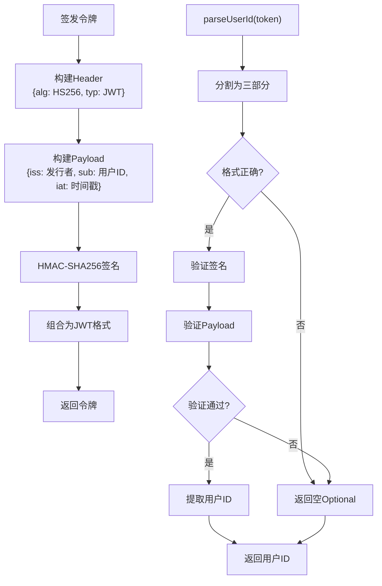

**图表来源**
- [JwtService.java:38-78](file://backend/src/main/java/com/aidrun/backend/auth/JwtService.java#L38-L78)
- [application.yml:30-34](file://backend/src/main/resources/application.yml#L30-L34)

**章节来源**
- [JwtService.java:38-78](file://backend/src/main/java/com/aidrun/backend/auth/JwtService.java#L38-L78)
- [application.yml:30-34](file://backend/src/main/resources/application.yml#L30-L34)

### 固定验证码验证逻辑
- 验证码
  - 仅接受固定值"123456"；其他值返回 INVALID_VERIFICATION_CODE
- 错误处理
  - 400 响应，包含错误码与消息
- **输入验证**
  - PhoneLoginRequest 对 verificationCode 进行非空验证
  - 集成测试覆盖了各种错误场景


**图表来源**
- [AuthService.java:31-33](file://backend/src/main/java/com/aidrun/backend/auth/AuthService.java#L31-L33)
- [AuthControllerIntegrationTest.java:42-52](file://backend/src/test/java/com/aidrun/backend/auth/AuthControllerIntegrationTest.java#L42-L52)

**章节来源**
- [AuthService.java:31-33](file://backend/src/main/java/com/aidrun/backend/auth/AuthService.java#L31-L33)
- [AuthControllerIntegrationTest.java:42-52](file://backend/src/test/java/com/aidrun/backend/auth/AuthControllerIntegrationTest.java#L42-L52)

### 认证状态管理、会话保持、自动登录与退出登录
- 自动登录
  - App 启动时读取本地存储中的有效 JWT，验证后直接进入对应角色首页
  - 若 JWT 过期或无效，则清理并回到登录页
- 退出登录
  - 设置页点击退出登录并确认后，清理本地存储中的 token，回到登录页


**图表来源**
- [07-api-contract.openapi.yaml:470-479](file://docs/07-api-contract.openapi.yaml#L470-L479)

**章节来源**
- [07-api-contract.openapi.yaml:470-479](file://docs/07/api-contract.openapi.yaml#L470-L479)

### 角色切换与紧急联系人管理

**更新** 新增角色切换功能和紧急联系人管理集成

#### 角色切换功能
- **接口实现**
  - PATCH /api/users/me/active-role：切换用户活跃角色
  - 支持BLIND_RUNNER和VOLUNTEER角色切换
- **业务规则**
  - 用户必须拥有目标角色权限
  - 存在活跃订单时禁止切换（ACCEPTED、ARRIVED、IN_PROGRESS、EMERGENCY）
  - 切换后立即生效并返回更新后的用户信息
- **错误处理**
  - 400：用户没有该角色权限
  - 409：存在活跃订单，暂时不能切换身份

#### 紧急联系人管理集成
- **档案创建时关联**
  - 在创建盲人跑者档案时自动创建紧急联系人
  - 支持紧急联系人的姓名和电话号码
- **档案更新时同步**
  - 更新盲人跑者档案时同步更新紧急联系人信息
  - 支持新增或修改紧急联系人
- **数据模型**
  - EmergencyContact与BlindRunnerProfile一对一关联
  - 紧急联系人信息包含name和phoneNumber字段

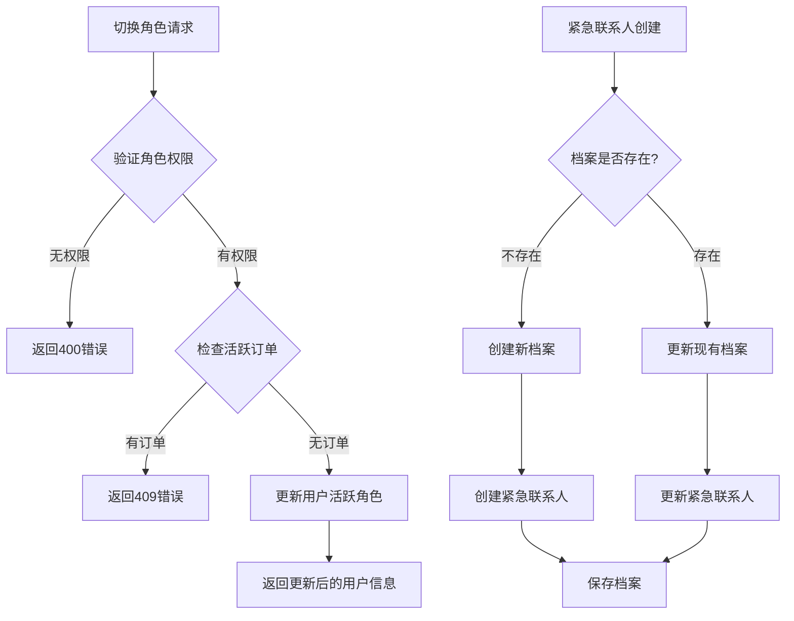

**图表来源**
- [UserController.java:32-38](file://backend/src/main/java/com/aidrun/backend/user/UserController.java#L32-L38)
- [UserService.java:61-83](file://backend/src/main/java/com/aidrun/backend/user/UserService.java#L61-L83)
- [ProfileService.java:24-53](file://backend/src/main/java/com/aidrun/backend/profile/ProfileService.java#L24-L53)
- [EmergencyContact.java:13-52](file://backend/src/main/java/com/aidrun/backend/profile/EmergencyContact.java#L13-L52)

**章节来源**
- [UserController.java:32-38](file://backend/src/main/java/com/aidrun/backend/user/UserController.java#L32-L38)
- [UserService.java:61-83](file://backend/src/main/java/com/aidrun/backend/user/UserService.java#L61-L83)
- [ProfileService.java:24-53](file://backend/src/main/java/com/aidrun/backend/profile/ProfileService.java#L24-L53)
- [EmergencyContact.java:13-52](file://backend/src/main/java/com/aidrun/backend/profile/EmergencyContact.java#L13-L52)

### API 接口规范与错误处理策略
- 登录接口
  - 路径：POST /api/auth/phone-login
  - 请求体：phoneNumber、verificationCode（固定值"123456"）
  - 成功：200，返回统一的AuthResponse格式
  - 失败：400，INVALID_VERIFICATION_CODE 或 VALIDATION_FAILED
- 角色切换接口
  - 路径：PATCH /api/users/me/active-role
  - 请求体：activeRole（BLIND_RUNNER或VOLUNTEER）
  - 成功：200，返回更新后的UserDto
  - 失败：400（无角色权限）、409（有活跃订单）
- 受保护接口
  - 需要在请求头携带 Authorization: Bearer <accessToken>
  - 未携带或无效：401 UNAUTHORIZED
- 错误码
  - 包括 INVALID_VERIFICATION_CODE、UNAUTHORIZED、VALIDATION_FAILED、ACTIVE_ORDER_ROLE_SWITCH_BLOCKED等稳定错误码

```mermaid
classDiagram
class PhoneLoginRequest {
+@NotBlank @Pattern(phoneNumber)
+@NotBlank verificationCode
}
class AuthResponse {
+String accessToken
+String tokenType
+UserDto user
}
class UserDto {
+String id
+String phoneNumber
+Set~UserRole~ roles
+UserRole activeRole
+Instant createdAt
+Instant updatedAt
}
class SwitchRoleRequest {
+@NotNull UserRole activeRole
}
class UserMeResponse {
+UserDto user
+BlindRunnerProfileDto blindRunnerProfile
+VolunteerProfileDto volunteerProfile
}
class EmergencyContactRequest {
+@NotBlank String name
+@NotBlank @Pattern(regexp = "^1\\d{10}$") String phoneNumber
}
PhoneLoginRequest --> AuthResponse
AuthResponse --> UserDto
SwitchRoleRequest --> UserDto
UserMeResponse --> UserDto
EmergencyContactRequest --> EmergencyContact
```

**图表来源**
- [PhoneLoginRequest.java:6-12](file://backend/src/main/java/com/aidrun/backend/auth/dto/PhoneLoginRequest.java#L6-L12)
- [AuthResponse.java:5-10](file://backend/src/main/java/com/aidrun/backend/auth/dto/AuthResponse.java#L5-L10)
- [UserDto.java:8-27](file://backend/src/main/java/com/aidrun/backend/user/dto/UserDto.java#L8-L27)
- [SwitchRoleRequest.java:6-9](file://backend/src/main/java/com/aidrun/backend/user/dto/SwitchRoleRequest.java#L6-L9)
- [UserMeResponse.java:6-11](file://backend/src/main/java/com/aidrun/backend/user/dto/UserMeResponse.java#L6-L11)
- [EmergencyContactRequest.java:6-9](file://backend/src/main/java/com/aidrun/backend/profile/dto/EmergencyContactRequest.java#L6-L9)

**章节来源**
- [07-api-contract.openapi.yaml:612-633](file://docs/07-api-contract.openapi.yaml#L612-L633)
- [07-api-contract.openapi.yaml:479-487](file://docs/07-api-contract.openapi.yaml#L479-L487)
- [07-api-contract.openapi.yaml:470-479](file://docs/07-api-contract.openapi.yaml#L470-L479)

### 认证中间件工作原理与安全考虑
- 中间件职责
  - 校验 Authorization 头中的 Bearer Token
  - 对未携带或无效 token 的请求返回 401
- **安全增强**
  - **发行者验证**：JWT服务内置发行者验证，防止令牌伪造
  - **签名验证**：使用HMAC-SHA256算法验证令牌完整性
  - **用户ID提取**：从验证后的载荷中提取用户ID
  - **常量时间比较**：防止时序攻击的密码学安全比较
- 安全考虑
  - 令牌有效期与刷新策略（如需）应在后端实现
  - 建议启用 HTTPS 传输
  - 前端避免在日志中输出敏感信息
  - 前端本地存储建议使用安全存储方案（如钥匙串）

**章节来源**
- [JwtService.java:56-78](file://backend/src/main/java/com/aidrun/backend/auth/JwtService.java#L56-L78)
- [JwtAuthenticationFilter.java:30-61](file://backend/src/main/java/com/aidrun/backend/auth/JwtAuthenticationFilter.java#L30-L61)
- [SecurityConfig.java:28-50](file://backend/src/main/java/com/aidrun/backend/config/SecurityConfig.java#L28-L50)

## 用户模型与数据结构

### 用户实体模型
AppUser 是认证系统的核心实体，继承自BaseEntity，包含完整的用户信息和角色管理。

- **核心属性**
  - phoneNumber：唯一手机号码，用于用户身份标识
  - roles：用户角色集合，包含BLIND_RUNNER和VOLUNTEER
  - activeRole：当前激活的角色，初始为空
- **继承关系**
  - 继承BaseEntity，自动获得id、createdAt、updatedAt等通用属性
- **数据库映射**
  - @Entity注解标识为JPA实体
  - @Table(name = "users")指定表名
  - @Column(unique = true)确保手机号唯一性

**章节来源**
- [AppUser.java:16-56](file://backend/src/main/java/com/aidrun/backend/user/AppUser.java#L16-L56)

### 用户角色枚举
UserRole 定义了系统的用户角色体系，支持JSON序列化和反序列化。

- **角色定义**
  - BLIND_RUNNER("blind_runner")：盲人跑者角色
  - VOLUNTEER("volunteer")：志愿者角色
- **序列化特性**
  - @JsonValue注解定义wireValue序列化格式
  - @JsonCreator注解支持从wireValue反序列化
- **角色管理**
  - 支持Set集合存储多个角色
  - LinkedHashSet保证角色添加顺序

**章节来源**
- [UserRole.java:6-30](file://backend/src/main/java/com/aidrun/backend/user/UserRole.java#L6-L30)

### 用户DTO映射
UserDto 提供用户数据传输对象，用于API响应的数据封装。

- **DTO结构**
  - id：用户唯一标识符
  - phoneNumber：用户手机号码
  - roles：用户角色集合
  - activeRole：当前激活角色
  - createdAt/updatedAt：创建和更新时间戳
- **映射机制**
  - from静态方法实现AppUser到UserDto的转换
  - 自动映射所有实体属性到DTO

**章节来源**
- [UserDto.java:8-27](file://backend/src/main/java/com/aidrun/backend/user/dto/UserDto.java#L8-L27)

### 用户信息响应
UserMeResponse 提供完整的用户信息响应，包含用户基本信息和相关档案。

- **响应结构**
  - user：基础用户信息
  - blindRunnerProfile：盲人跑者档案信息（可选）
  - volunteerProfile：志愿者档案信息（可选）
- **应用场景**
  - 用户个人中心信息展示
  - 完整用户资料查询
  - 角色切换后的信息更新

**章节来源**
- [UserMeResponse.java:6-11](file://backend/src/main/java/com/aidrun/backend/user/dto/UserMeResponse.java#L6-L11)

### 认证数据传输对象
PhoneLoginRequest 和 AuthResponse 定义了认证相关的数据传输结构。

- **PhoneLoginRequest**
  - phoneNumber：手机号码（非空验证，11位数字，以1开头）
  - verificationCode：验证码（非空验证）
- **AuthResponse**
  - accessToken：JWT访问令牌
  - tokenType：令牌类型（固定为Bearer）
  - user：用户信息DTO

**章节来源**
- [PhoneLoginRequest.java:6-12](file://backend/src/main/java/com/aidrun/backend/auth/dto/PhoneLoginRequest.java#L6-L12)
- [AuthResponse.java:5-10](file://backend/src/main/java/com/aidrun/backend/auth/dto/AuthResponse.java#L5-L10)

### 紧急联系人数据结构

**更新** 新增紧急联系人相关的数据传输对象

- **EmergencyContactDto**
  - name：紧急联系人姓名
  - phoneNumber：紧急联系人电话号码
  - from静态方法：从EmergencyContact实体转换为DTO
- **EmergencyContactRequest**
  - name：紧急联系人姓名（非空验证）
  - phoneNumber：紧急联系人电话号码（11位数字格式验证）
- **EmergencyContact实体**
  - 与BlindRunnerProfile一对一关联
  - 级联删除和更新
  - 独特约束确保一对一关系

**章节来源**
- [EmergencyContactDto.java:5-15](file://backend/src/main/java/com/aidrun/backend/profile/dto/EmergencyContactDto.java#L5-L15)
- [EmergencyContactRequest.java:6-9](file://backend/src/main/java/com/aidrun/backend/profile/dto/EmergencyContactRequest.java#L6-L9)
- [EmergencyContact.java:13-52](file://backend/src/main/java/com/aidrun/backend/profile/EmergencyContact.java#L13-L52)

## 认证流程实现

### 认证控制器层
AuthController 处理HTTP请求，提供RESTful认证接口。

- **接口定义**
  - @PostMapping("/phone-login")：手机号登录接口
  - @Valid参数验证：确保请求数据符合规范
  - ResponseEntity响应：标准化HTTP响应格式
- **依赖注入**
  - 注入AuthService进行业务逻辑处理
  - 自动依赖注入，无需手动配置

**章节来源**
- [AuthController.java:12-27](file://backend/src/main/java/com/aidrun/backend/auth/AuthController.java#L12-L27)

### 认证服务层
AuthService 实现核心认证逻辑，处理用户创建和令牌签发。

- **验证码验证**
  - 固定验证码："123456"
  - 非法验证码抛出ApiException
- **用户管理**
  - 查找现有用户：findByPhoneNumber
  - 创建新用户：默认赋予BLIND_RUNNER和VOLUNTEER角色
  - 事务管理：@Transactional确保数据一致性
- **令牌签发**
  - 调用jwtService.issueAccessToken
  - 包装为AuthResponse返回统一响应格式

**章节来源**
- [AuthService.java:16-48](file://backend/src/main/java/com/aidrun/backend/auth/AuthService.java#L16-L48)

### 数据访问层
AppUserRepository 提供用户数据访问接口。

- **继承关系**
  - 继承JpaRepository，自动获得CRUD操作
  - 支持分页和排序查询
- **自定义查询**
  - findByPhoneNumber：按手机号查找用户
  - 返回Optional包装，避免空指针

**章节来源**
- [AppUserRepository.java:6-9](file://backend/src/main/java/com/aidrun/backend/user/AppUserRepository.java#L6-L9)

### 用户控制器层

**更新** 新增用户控制器，支持角色切换和用户信息查询

- **用户信息查询**
  - GET /api/users/me：获取当前用户完整信息
  - 返回UserMeResponse，包含用户、盲人跑者档案和志愿者档案
- **角色切换**
  - PATCH /api/users/me/active-role：切换用户活跃角色
  - 验证角色权限和活跃订单状态
  - 返回更新后的UserDto

**章节来源**
- [UserController.java:15-44](file://backend/src/main/java/com/aidrun/backend/user/UserController.java#L15-L44)

### 用户服务层

**更新** 新增用户服务，实现角色切换和用户信息管理

- **用户信息管理**
  - getCurrentUser：获取用户完整信息（包含相关档案）
  - upsertUser：更新用户基本信息
- **角色切换逻辑**
  - 验证用户角色权限
  - 检查是否存在活跃订单
  - 更新用户活跃角色并返回更新后的用户信息

**章节来源**
- [UserService.java:21-84](file://backend/src/main/java/com/aidrun/backend/user/UserService.java#L21-L84)

### 档案控制器层

**更新** 新增档案控制器，支持紧急联系人管理

- **盲人跑者档案**
  - PUT /api/profiles/blind-runner：创建或更新盲人跑者档案
  - 自动关联紧急联系人信息
- **志愿者档案**
  - PUT /api/profiles/volunteer：创建或更新志愿者档案
  - 管理志愿者相关信息

**章节来源**
- [ProfileController.java:16-43](file://backend/src/main/java/com/aidrun/backend/profile/ProfileController.java#L16-L43)

### 档案服务层

**更新** 新增档案服务，实现紧急联系人管理

- **盲人跑者档案管理**
  - upsertBlindRunnerProfile：创建或更新盲人跑者档案
  - 自动创建或更新紧急联系人
  - 支持昵称和跑步经验信息
- **志愿者档案管理**
  - upsertVolunteerProfile：创建或更新志愿者档案
  - 管理昵称和其他志愿者相关信息

**章节来源**
- [ProfileService.java:12-76](file://backend/src/main/java/com/aidrun/backend/profile/ProfileService.java#L12-L76)

## JWT认证系统详解

### JWT服务实现
JwtService 提供完整的JWT令牌生成功能，包括令牌签发和解析验证。

- **令牌签发流程**
  - 构建Header：包含算法(HS256)和类型(JWT)
  - 构建Payload：包含发行者(iss)、主题(sub)、签发时间(iat)
  - 使用HMAC-SHA256算法签名
  - 组合为JWT字符串格式
- **令牌解析流程**
  - 验证JWT格式（必须包含三个部分）
  - 验证签名完整性
  - 解析Payload并验证发行者
  - 提取用户ID并返回Optional
- **安全特性**
  - 使用常量时间比较防止时序攻击
  - URL安全的Base64编码
  - 秘钥从配置文件读取

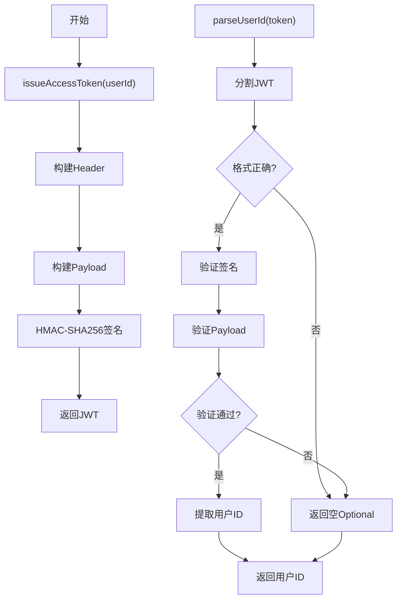

**图表来源**
- [JwtService.java:38-78](file://backend/src/main/java/com/aidrun/backend/auth/JwtService.java#L38-L78)

**章节来源**
- [JwtService.java:17-108](file://backend/src/main/java/com/aidrun/backend/auth/JwtService.java#L17-L108)

### JWT认证过滤器
JwtAuthenticationFilter 集成到Spring Security过滤器链中，负责验证请求中的JWT令牌。

- **过滤器职责**
  - 从Authorization头提取Bearer令牌
  - 调用JwtService验证令牌有效性
  - 将用户信息设置到SecurityContext
  - 放行后续请求处理
- **集成方式**
  - 在Spring Security过滤器链中添加
  - 仅对受保护接口生效
  - 保持无状态认证

**章节来源**
- [JwtAuthenticationFilter.java:17-63](file://backend/src/main/java/com/aidrun/backend/auth/JwtAuthenticationFilter.java#L17-L63)

### 安全配置
SecurityConfig 配置Spring Security，集成JWT认证过滤器。

- **配置要点**
  - 禁用CSRF保护
  - 设置Session为STATELESS
  - 配置受保护路径
  - 添加JWT认证过滤器
  - 自定义认证EntryPoint
- **路径配置**
  - /api/auth/**：开放访问
  - /api/users/me/active-role：需要认证
  - Swagger和H2控制台：开发环境开放
  - 其他路径：需要认证

**章节来源**
- [SecurityConfig.java:17-55](file://backend/src/main/java/com/aidrun/backend/config/SecurityConfig.java#L17-L55)

### 应用配置
application.yml 包含JWT相关的配置信息。

- **JWT配置**
  - aidrun.jwt.issuer：发行者标识
  - aidrun.jwt.demo-secret：签名密钥
- **其他配置**
  - 数据源配置
  - JPA配置
  - OpenAPI配置

**章节来源**
- [application.yml:30-34](file://backend/src/main/resources/application.yml#L30-L34)

## 认证状态管理

### 自动登录机制
应用启动时的自动登录流程：

- **启动检测**
  - 读取本地存储中的JWT令牌
  - 验证令牌格式和签名
  - 解析用户ID并查找用户信息
- **登录决策**
  - 令牌有效：设置认证上下文，进入角色首页
  - 令牌无效：清理本地存储，回到登录页
- **用户体验**
  - 无缝登录体验
  - 自动处理过期令牌

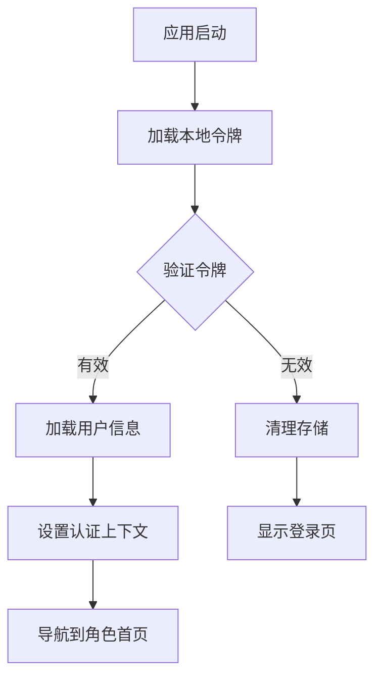

**图表来源**
- [07-api-contract.openapi.yaml:470-479](file://docs/07-api-contract.openapi.yaml#L470-L479)

### 退出登录流程
用户主动退出登录的操作流程：

- **用户操作**
  - 设置页点击退出登录
  - 确认对话框确认
- **系统处理**
  - 清理本地存储的JWT
  - 导航到登录页
  - 清空认证上下文

**章节来源**
- [07-api-contract.openapi.yaml:470-479](file://docs/07-api-contract.openapi.yaml#L470-L479)

### 会话保持策略
- **无状态设计**
  - JWT令牌包含所有必要信息
  - 服务器端不需要存储会话状态
- **令牌管理**
  - 前端存储JWT到安全位置
  - 每次请求自动附加Authorization头
- **安全考虑**
  - 令牌过期时间控制
  - 安全传输（HTTPS）
  - 本地存储安全

## 输入验证与无障碍增强

### iOS端输入验证增强

**更新** 新增iOS端输入验证增强功能，包括实时标准化处理和无障碍支持

- **实时标准化处理**
  - normalizedPhoneNumber()：过滤非数字字符，限制为11位
  - normalizedVerificationCode()：过滤非数字字符，限制为6位
  - 自动格式化输入内容，提升用户体验
- **实时输入处理**
  - @Published属性监听输入变化
  - 自动清除错误状态和震动效果
  - 语音播报手机号格式错误
- **数字键盘优化**
  - 手机号使用.numberPad键盘
  - 验证码使用.oneTimeCode键盘
  - 提升输入效率和准确性
- **自动提交功能**
  - 验证码达到6位时自动触发登录
  - 避免用户手动点击登录按钮
  - 减少操作步骤和错误率

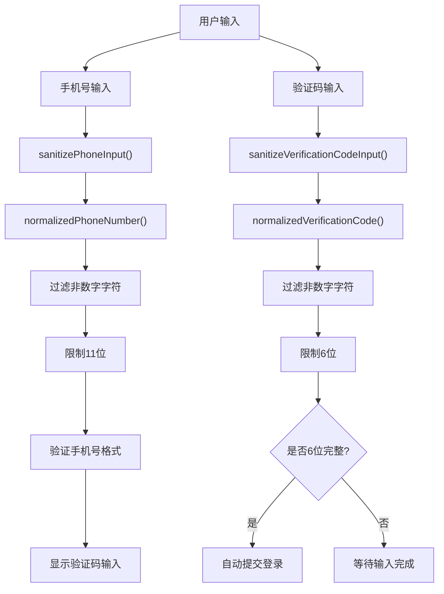

**图表来源**
- [LoginViewModel.swift:15-43](file://blindRun/Auth/LoginViewModel.swift#L15-L43)
- [LoginViewModel.swift:121-133](file://blindRun/Auth/LoginViewModel.swift#L121-L133)
- [LoginViewModel.swift:254-260](file://blindRun/Auth/LoginViewModel.swift#L254-L260)

**章节来源**
- [LoginViewModel.swift:15-43](file://blindRun/Auth/LoginViewModel.swift#L15-L43)
- [LoginViewModel.swift:121-133](file://blindRun/Auth/LoginViewModel.swift#L121-L133)
- [LoginViewModel.swift:254-260](file://blindRun/Auth/LoginViewModel.swift#L254-L260)

### 无障碍功能实现

**更新** 新增完整的无障碍功能支持，包括VoiceOver和TTS语音播报

- **VoiceOver支持**
  - 所有关键控件都有accessibilityLabel和accessibilityHint
  - 输入框提供详细的可访问性值
  - 按钮状态变化时提供可访问性提示
- **TTS语音播报**
  - SpeechService集中管理语音播报
  - 登录错误时自动语音播报错误信息
  - 防止重复播报，避免用户体验干扰
- **震动反馈**
  - 验证码错误时提供视觉震动反馈
  - 增强触觉反馈体验
- **无障碍测试**
  - 单元测试验证输入标准化功能
  - 确保无障碍功能正常工作

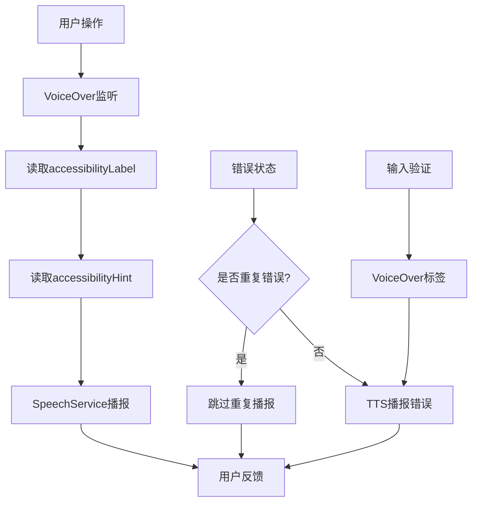

**图表来源**
- [LoginView.swift:75-87](file://blindRun/Auth/LoginView.swift#L75-L87)
- [LoginView.swift:133-138](file://blindRun/Auth/LoginView.swift#L133-L138)
- [SpeechService.swift:49-52](file://blindRun/Voice/SpeechService.swift#L49-L52)
- [LoginViewModel.swift:225-236](file://blindRun/Auth/LoginViewModel.swift#L225-L236)

**章节来源**
- [LoginView.swift:56-138](file://blindRun/Auth/LoginView.swift#L56-L138)
- [SpeechService.swift:49-52](file://blindRun/Voice/SpeechService.swift#L49-L52)
- [LoginViewModel.swift:225-236](file://blindRun/Auth/LoginViewModel.swift#L225-L236)

## API环境管理与本地后端配置

### API环境管理概述

**更新** 新增API环境管理功能，支持三种环境模式：mock、localBackend、production

- **环境模式**
  - **mock**：本地模拟环境，不使用网络请求，适合离线开发和单元测试
  - **localBackend**：本地后端环境，支持配置自定义后端地址，适合开发联调
  - **production**：生产环境，使用正式API地址，部署时使用
- **环境切换**
  - 调试模式下提供环境切换器，支持快速切换不同环境
  - 切换时自动清理会话状态，确保环境隔离
- **环境配置**
  - 通过UserDefaults持久化环境设置
  - 支持启动时从UserDefaults恢复环境配置

### 本地后端地址配置

**更新** 新增本地后端地址配置功能，提升开发测试体验

- **地址格式支持**
  - 支持IP地址：如"192.168.1.23"
  - 支持带端口：如"http://192.168.1.23:8081"
  - 支持自动端口：如"192.168.1.23"自动添加":8080"
- **地址标准化**
  - AppConstants.LocalBackend提供地址标准化处理
  - 自动添加http协议前缀
  - 确保端口号正确设置
- **持久化存储**
  - 通过UserDefaults存储用户配置
  - 支持启动时自动恢复配置
- **开发工具**
  - LoginView提供本地后端地址编辑器
  - 支持实时预览和保存配置

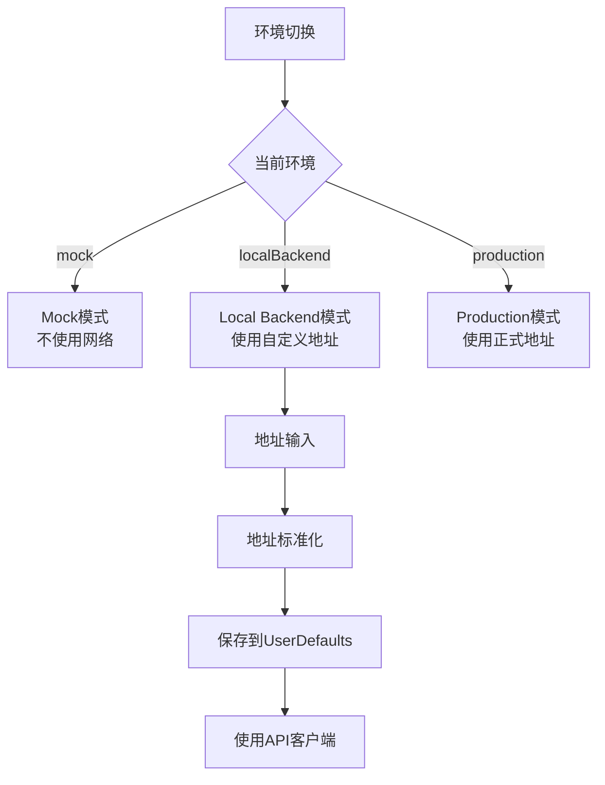

**图表来源**
- [EnvironmentConfig.swift:5-41](file://blindRun/Core/EnvironmentConfig.swift#L5-L41)
- [EnvironmentConfig.swift:69-103](file://blindRun/Core/EnvironmentConfig.swift#L69-L103)
- [LoginView.swift:206-282](file://blindRun/Auth/LoginView.swift#L206-L282)

**章节来源**
- [EnvironmentConfig.swift:5-41](file://blindRun/Core/EnvironmentConfig.swift#L5-L41)
- [EnvironmentConfig.swift:69-103](file://blindRun/Core/EnvironmentConfig.swift#L69-L103)
- [LoginView.swift:206-282](file://blindRun/Auth/LoginView.swift#L206-L282)
- [AppState.swift:76-90](file://blindRun/Core/AppState.swift#L76-L90)

### API客户端适配

**更新** 新增API客户端适配功能，根据环境动态选择不同的API客户端

- **客户端选择**
  - mock环境：使用MockAPIClient，不发起真实网络请求
  - localBackend/production：使用URLSessionAPIClient，使用baseURL
- **baseURL管理**
  - 从EnvironmentConfig获取当前环境的baseURL
  - 支持从UserDefaults恢复用户配置
  - 默认使用127.0.0.1:8080
- **令牌传递**
  - URLSessionAPIClient自动处理Authorization头
  - 从AppState获取当前accessToken

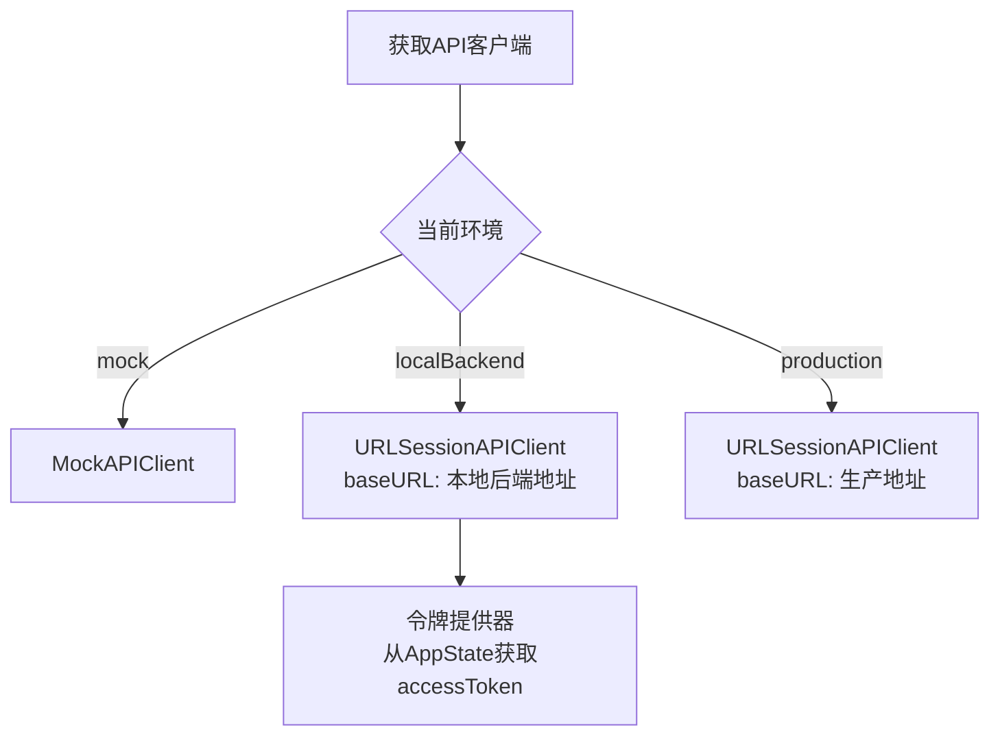

**图表来源**
- [AppState.swift:76-90](file://blindRun/Core/AppState.swift#L76-L90)
- [EnvironmentConfig.swift:21-36](file://blindRun/Core/EnvironmentConfig.swift#L21-L36)
- [APIClient.swift:103-133](file://blindRun/Core/APIClient.swift#L103-L133)

**章节来源**
- [AppState.swift:76-90](file://blindRun/Core/AppState.swift#L76-L90)
- [EnvironmentConfig.swift:21-36](file://blindRun/Core/EnvironmentConfig.swift#L21-L36)
- [APIClient.swift:103-133](file://blindRun/Core/APIClient.swift#L103-L133)

### 开发测试体验改进

**更新** 新增开发测试体验改进功能，简化环境切换和配置过程

- **环境切换器**
  - LoginView提供环境切换按钮
  - 支持循环切换mock、localBackend环境
  - 显示当前环境和baseURL信息
- **本地后端编辑器**
  - 仅在localBackend环境下显示
  - 提供地址输入框和保存按钮
  - 支持实时预览地址格式
- **调试模式限制**
  - 仅在DEBUG模式下启用环境切换功能
  - 生产环境自动回退到mock环境
- **测试支持**
  - 单元测试验证环境切换逻辑
  - 支持UI测试通过环境变量配置环境

**章节来源**
- [LoginView.swift:206-282](file://blindRun/Auth/LoginView.swift#L206-L282)
- [AppState.swift:138-155](file://blindRun/Core/AppState.swift#L138-L155)
- [blindRunTests.swift:135-153](file://blindRunTests/blindRunTests.swift#L135-L153)

## 依赖关系分析
- 文档驱动
  - 用户故事与状态机定义了交互流程
  - OpenAPI 合约定义了接口契约与错误码
- **实现增强**
  - **JWT服务**：提供基于HMAC-SHA256的令牌生成与解析
  - **安全配置**：Spring Security基础配置，支持HTTP Basic认证
  - **用户管理**：JPA实体管理用户数据
  - **过滤器链**：JWT认证过滤器集成到Spring Security
  - **输入验证**：Jakarta Validation提供参数验证
  - **iOS输入验证**：SwiftUI实时标准化处理
  - **无障碍支持**：VoiceOver和TTS语音播报
  - **API环境管理**：支持多环境切换和配置
  - **本地后端配置**：地址标准化和持久化存储
  - **角色切换功能**：UserController和UserService实现
  - **紧急联系人管理**：ProfileService集成EmergencyContact
  - **统一认证响应**：AuthResponse替代双令牌系统
- 实现耦合
  - iOS 应用通过调用后端 API 实现认证
  - 本地存储与后端鉴权共同构成会话管理
  - 语音服务与视图模型协同提供无障碍体验
  - 环境配置影响API客户端的选择和行为
  - 用户控制器依赖用户服务实现角色切换
  - 档案控制器依赖档案服务实现紧急联系人管理

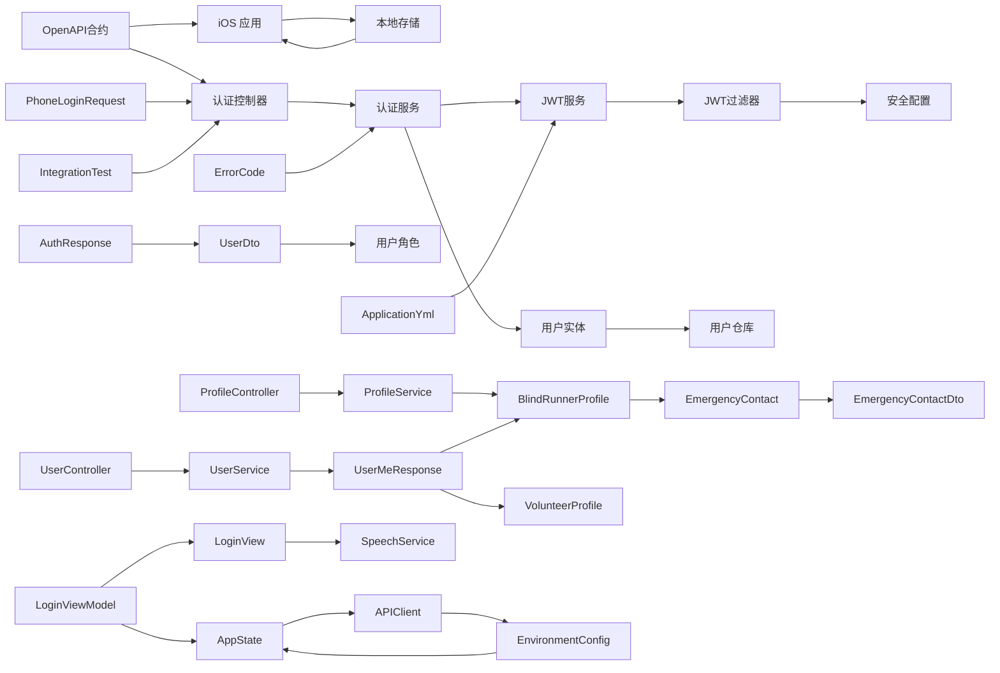

**图表来源**
- [07-api-contract.openapi.yaml:454-487](file://docs/07-api-contract.openapi.yaml#L454-L487)
- [AuthController.java:12-27](file://backend/src/main/java/com/aidrun/backend/auth/AuthController.java#L12-L27)
- [AuthService.java:16-48](file://backend/src/main/java/com/aidrun/backend/auth/AuthService.java#L16-L48)
- [JwtService.java:17-108](file://backend/src/main/java/com/aidrun/backend/auth/JwtService.java#L17-L108)
- [JwtAuthenticationFilter.java:17-63](file://backend/src/main/java/com/aidrun/backend/auth/JwtAuthenticationFilter.java#L17-L63)
- [SecurityConfig.java:17-55](file://backend/src/main/java/com/aidrun/backend/config/SecurityConfig.java#L17-L55)
- [AppUser.java:16-56](file://backend/src/main/java/com/aidrun/backend/user/AppUser.java#L16-L56)
- [AppUserRepository.java:6-9](file://backend/src/main/java/com/aidrun/backend/user/AppUserRepository.java#L6-L9)
- [UserDto.java:8-27](file://backend/src/main/java/com/aidrun/backend/user/dto/UserDto.java#L8-L27)
- [UserRole.java:6-30](file://backend/src/main/java/com/aidrun/backend/user/UserRole.java#L6-L30)
- [PhoneLoginRequest.java:6-12](file://backend/src/main/java/com/aidrun/backend/auth/dto/PhoneLoginRequest.java#L6-L12)
- [AuthResponse.java:5-10](file://backend/src/main/java/com/aidrun/backend/auth/dto/AuthResponse.java#L5-L10)
- [UserController.java:15-44](file://backend/src/main/java/com/aidrun/backend/user/UserController.java#L15-L44)
- [UserService.java:21-84](file://backend/src/main/java/com/aidrun/backend/user/UserService.java#L21-L84)
- [UserMeResponse.java:6-11](file://backend/src/main/java/com/aidrun/backend/user/dto/UserMeResponse.java#L6-L11)
- [ProfileController.java:16-43](file://backend/src/main/java/com/aidrun/backend/profile/ProfileController.java#L16-L43)
- [ProfileService.java:12-76](file://backend/src/main/java/com/aidrun/backend/profile/ProfileService.java#L12-L76)
- [EmergencyContact.java:13-52](file://backend/src/main/java/com/aidrun/backend/profile/EmergencyContact.java#L13-L52)
- [EmergencyContactDto.java:5-15](file://backend/src/main/java/com/aidrun/backend/profile/dto/EmergencyContactDto.java#L5-L15)
- [ErrorCode.java:6-40](file://backend/src/main/java/com/aidrun/backend/common/error/ErrorCode.java#L6-L40)
- [AuthControllerIntegrationTest.java:17-136](file://backend/src/test/java/com/aidrun/backend/auth/AuthControllerIntegrationTest.java#L17-L136)
- [application.yml:30-34](file://backend/src/main/resources/application.yml#L30-L34)
- [LoginViewModel.swift:1-266](file://blindRun/Auth/LoginViewModel.swift#L1-L266)
- [LoginView.swift:1-293](file://blindRun/Auth/LoginView.swift#L1-L293)
- [SpeechService.swift:1-105](file://blindRun/Voice/SpeechService.swift#L1-L105)
- [AppState.swift:1-248](file://blindRun/Core/AppState.swift#L1-L248)
- [APIClient.swift:1-194](file://blindRun/Core/APIClient.swift#L1-L194)
- [EnvironmentConfig.swift:1-104](file://blindRun/Core/EnvironmentConfig.swift#L1-L104)

**章节来源**
- [07-api-contract.openapi.yaml:454-487](file://docs/07-api-contract.openapi.yaml#L454-L487)

## 性能考量
- 登录与受保护接口的调用频率较低，性能瓶颈通常不在认证链路
- 建议在前端缓存必要的用户信息，减少重复请求
- 对于轮询类接口，应合理设置轮息间隔与停止条件，避免不必要的网络负载
- **JWT优化**：HMAC-SHA256签名相比传统JWT库更高效，URL安全编码避免额外字符转换开销
- **iOS输入验证优化**：SwiftUI实时标准化处理在主线程执行，避免阻塞UI响应
- **无障碍性能**：TTS语音播报使用异步处理，避免阻塞用户操作
- **环境切换性能**：API环境切换只在调试模式下启用，不影响生产性能
- **本地后端配置**：地址标准化处理在内存中完成，性能开销很小
- **统一响应格式**：减少客户端处理复杂度，提升整体性能
- **角色切换优化**：数据库查询优化，避免N+1查询问题

## 故障排查指南
- 验证码错误
  - 现象：提交非固定验证码返回 INVALID_VERIFICATION_CODE
  - 处理：提示用户重新输入验证码
- 无效手机号格式
  - 现象：手机号格式不正确返回 VALIDATION_FAILED
  - 处理：提示用户输入正确的手机号格式
- 未登录或 token 无效
  - 现象：访问受保护接口返回 401 UNAUTHORIZED
  - 处理：清理本地 token，跳转登录页
- **令牌解析失败**
  - **现象**：JWT服务无法解析令牌，返回空Optional
  - **可能原因**：
    - 发行者不匹配
    - 签名验证失败
    - JWT格式不符合标准
  - **处理**：重新登录获取新令牌
- **用户不存在**
  - **现象**：JWT解析成功但用户不存在
  - **可能原因**：用户被删除或数据不一致
  - **处理**：重新登录或联系管理员
- **角色切换失败**
  - **现象**：PATCH /api/users/me/active-role返回错误
  - **可能原因**：
    - 用户没有目标角色权限
    - 存在活跃订单（ACCEPTED、ARRIVED、IN_PROGRESS、EMERGENCY）
    - 角色状态冲突
  - **处理**：检查用户角色权限和订单状态
- **紧急联系人管理错误**
  - **现象**：创建或更新盲人跑者档案时失败
  - **可能原因**：
    - 紧急联系人电话号码格式不正确
    - 档案已存在但紧急联系人缺失
    - 数据库约束冲突
  - **处理**：验证输入格式，检查数据库状态
- **iOS输入验证问题**
  - **现象**：手机号或验证码输入格式不正确
  - **可能原因**：
    - 输入包含非数字字符
    - 输入长度超过限制
    - 无障碍功能未正确播报错误
  - **处理**：检查输入标准化函数和无障碍配置
- **API环境切换问题**
  - **现象**：环境切换后请求地址不正确
  - **可能原因**：
    - 本地后端地址格式不正确
    - UserDefaults存储异常
    - 网络连接问题
  - **处理**：检查地址格式，重置UserDefaults，验证网络连接
- **本地后端地址配置问题**
  - **现象**：保存地址后无效
  - **可能原因**：
    - 地址格式不符合URL规范
    - 端口被占用
    - 网络权限问题
  - **处理**：使用标准URL格式，检查端口可用性，验证网络权限
- 自动登录失败
  - 现象：启动后未进入首页
  - 处理：检查本地 token 是否存在且未过期；必要时重新登录

**章节来源**
- [AuthControllerIntegrationTest.java:93-134](file://backend/src/test/java/com/aidrun/backend/auth/AuthControllerIntegrationTest.java#L93-L134)
- [07-api-contract.openapi.yaml:479-487](file://docs/07-api-contract.openapi.yaml#L479-L487)
- [07-api-contract.openapi.yaml:470-479](file://docs/07-api-contract.openapi.yaml#L470-L479)
- [JwtService.java:56-78](file://backend/src/main/java/com/aidrun/backend/auth/JwtService.java#L56-L78)
- [JwtAuthenticationFilter.java:49-58](file://backend/src/main/java/com/aidrun/backend/auth/JwtAuthenticationFilter.java#L49-L58)
- [LoginViewModel.swift:254-260](file://blindRun/Auth/LoginViewModel.swift#L254-L260)
- [SpeechService.swift:49-52](file://blindRun/Voice/SpeechService.swift#L49-L52)
- [EnvironmentConfig.swift:69-103](file://blindRun/Core/EnvironmentConfig.swift#L69-L103)
- [LoginView.swift:206-282](file://blindRun/Auth/LoginView.swift#L206-L282)
- [UserService.java:70-77](file://backend/src/main/java/com/aidrun/backend/user/UserService.java#L70-L77)
- [ProfileService.java:38-49](file://backend/src/main/java/com/aidrun/backend/profile/ProfileService.java#L38-L49)

## 结论
本认证系统以"手机号 + 固定验证码"为核心入口，结合**统一的JWT令牌系统**实现轻量级会话管理。重构后的认证响应结构采用`AuthResponse{accessToken, tokenType, user}`统一格式，替代了原有的双令牌系统，简化了客户端处理逻辑。**JWT服务**提供发行者验证和用户ID提取功能，增强了令牌系统的安全性与可靠性。**角色切换功能**通过UserController和UserService实现，支持盲人跑者与志愿者角色之间的安全切换，并在存在活跃订单时进行拦截保护。**紧急联系人管理集成**在ProfileService中实现，自动关联紧急联系人信息到用户档案中，提供完整的用户信息管理能力。**iOS端登录视图增强**功能包括实时标准化处理、无障碍支持和语音播报，显著提升了用户体验和可访问性。**API环境管理**功能新增了三种环境模式（mock、localBackend、production），并通过环境切换器和本地后端地址配置大幅改善了开发测试体验。**本地后端地址配置**功能支持灵活的地址格式和标准化处理，满足不同开发场景的需求。**输入验证机制**确保了手机号格式的正确性和验证码的有效性，提供了完善的错误处理策略。用户故事与 OpenAPI 合约明确了登录、自动登录、退出登录、角色切换与紧急联系人管理的行为边界。前端通过调用后端 API 完成认证流程，后端通过JWT服务统一解析令牌，确保受保护接口的安全性。**集成测试覆盖**了各种登录场景，包括首次登录、现有用户登录、验证码错误、手机号格式错误等。**无障碍功能**确保了盲人用户的完整使用体验。**环境管理功能**为开发者提供了灵活的多环境支持，提升了开发效率和测试便利性。**统一响应格式**和**角色切换功能**的引入进一步完善了认证体系，为未来的功能扩展奠定了坚实基础。建议在后续版本中完善令牌刷新、HTTPS 与本地存储安全等措施，持续提升安全性与用户体验。

## 附录
- 示例路径（用于定位实现）
  - 登录接口定义：[AuthController.java:22-26](file://backend/src/main/java/com/aidrun/backend/auth/AuthController.java#L22-L26)
  - 认证服务实现：[AuthService.java:29-47](file://backend/src/main/java/com/aidrun/backend/auth/AuthService.java#L29-L47)
  - JWT服务实现：[JwtService.java:38-78](file://backend/src/main/java/com/aidrun/backend/auth/JwtService.java#L38-L78)
  - JWT过滤器实现：[JwtAuthenticationFilter.java:30-61](file://backend/src/main/java/com/aidrun/backend/auth/JwtAuthenticationFilter.java#L30-L61)
  - 安全配置：[SecurityConfig.java:28-50](file://backend/src/main/java/com/aidrun/backend/config/SecurityConfig.java#L28-L50)
  - 应用配置：[application.yml:30-34](file://backend/src/main/resources/application.yml#L30-L34)
  - 用户实体：[AppUser.java:16-56](file://backend/src/main/java/com/aidrun/backend/user/AppUser.java#L16-L56)
  - 用户仓库：[AppUserRepository.java:6-9](file://backend/src/main/java/com/aidrun/backend/user/AppUserRepository.java#L6-L9)
  - 用户DTO：[UserDto.java:17-26](file://backend/src/main/java/com/aidrun/backend/user/dto/UserDto.java#L17-L26)
  - 用户角色：[UserRole.java:6-30](file://backend/src/main/java/com/aidrun/backend/user/UserRole.java#L6-L30)
  - 输入验证：[PhoneLoginRequest.java:6-12](file://backend/src/main/java/com/aidrun/backend/auth/dto/PhoneLoginRequest.java#L6-L12)
  - 错误码定义：[ErrorCode.java:7-18](file://backend/src/main/java/com/aidrun/backend/common/error/ErrorCode.java#L7-L18)
  - 集成测试：[AuthControllerIntegrationTest.java:22-134](file://backend/src/test/java/com/aidrun/backend/auth/AuthControllerIntegrationTest.java#L22-L134)
  - API合约：[07-api-contract.openapi.yaml:612-633](file://docs/07-api-contract.openapi.yaml#L612-L633)
  - iOS登录视图模型：[LoginViewModel.swift:1-266](file://blindRun/Auth/LoginViewModel.swift#L1-L266)
  - iOS登录视图：[LoginView.swift:1-293](file://blindRun/Auth/LoginView.swift#L1-L293)
  - 语音服务：[SpeechService.swift:1-105](file://blindRun/Voice/SpeechService.swift#L1-L105)
  - iOS应用状态：[AppState.swift:1-248](file://blindRun/Core/AppState.swift#L1-L248)
  - API客户端：[APIClient.swift:1-194](file://blindRun/Core/APIClient.swift#L1-L194)
  - 环境配置：[EnvironmentConfig.swift:1-104](file://blindRun/Core/EnvironmentConfig.swift#L1-L104)
  - 本地配置示例：[LocalConfig.xcconfig.example:1-31](file://LocalConfig.xcconfig.example#L1-L31)
  - iOS单元测试：[blindRunTests.swift:87-129](file://blindRunTests/blindRunTests.swift#L87-L129)
  - 环境切换测试：[blindRunTests.swift:135-153](file://blindRunTests/blindRunTests.swift#L135-L153)
  - 本地后端地址测试：[blindRunTests.swift:155-164](file://blindRunTests/blindRunTests.swift#L155-L164)
  - 用户控制器：[UserController.java:25-38](file://backend/src/main/java/com/aidrun/backend/user/UserController.java#L25-L38)
  - 用户服务：[UserService.java:46-83](file://backend/src/main/java/com/aidrun/backend/user/UserService.java#L46-L83)
  - 档案控制器：[ProfileController.java:26-42](file://backend/src/main/java/com/aidrun/backend/profile/ProfileController.java#L26-L42)
  - 档案服务：[ProfileService.java:24-75](file://backend/src/main/java/com/aidrun/backend/profile/ProfileService.java#L24-L75)
  - 紧急联系人实体：[EmergencyContact.java:28-50](file://backend/src/main/java/com/aidrun/backend/profile/EmergencyContact.java#L28-L50)
  - 紧急联系人DTO：[EmergencyContactDto.java:10-15](file://backend/src/main/java/com/aidrun/backend/profile/dto/EmergencyContactDto.java#L10-L15)
  - 紧急联系人请求：[EmergencyContactRequest.java:6-9](file://backend/src/main/java/com/aidrun/backend/profile/dto/EmergencyContactRequest.java#L6-L9)