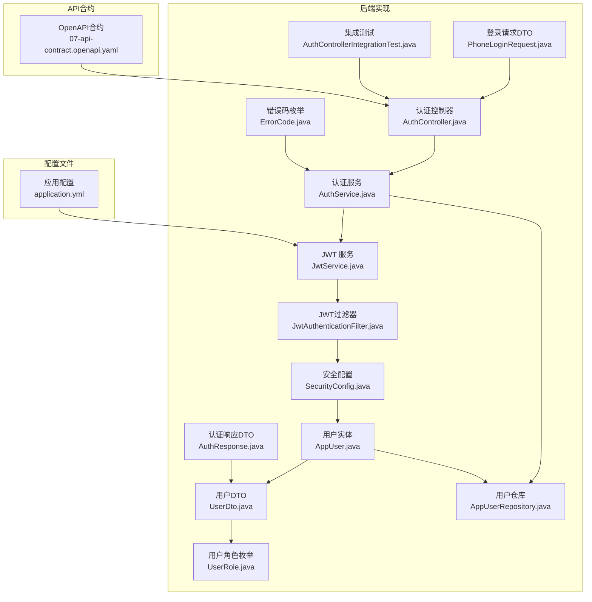
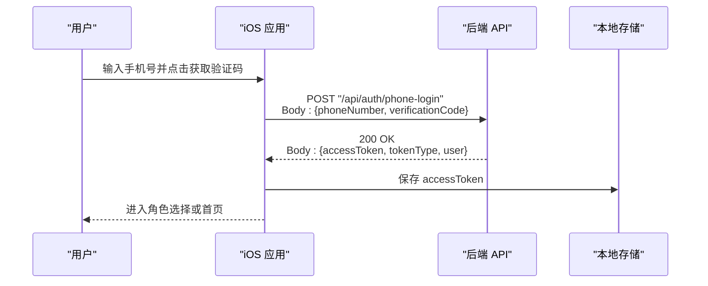
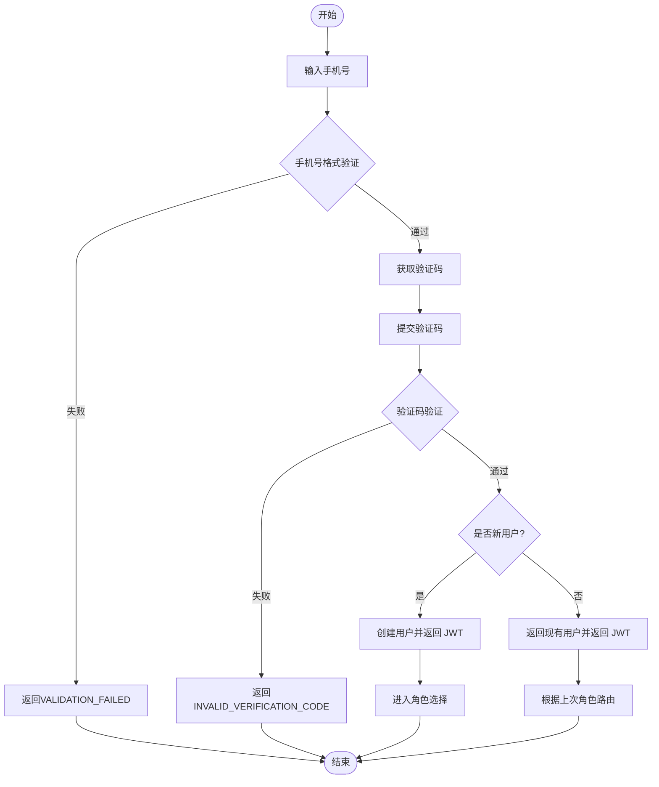
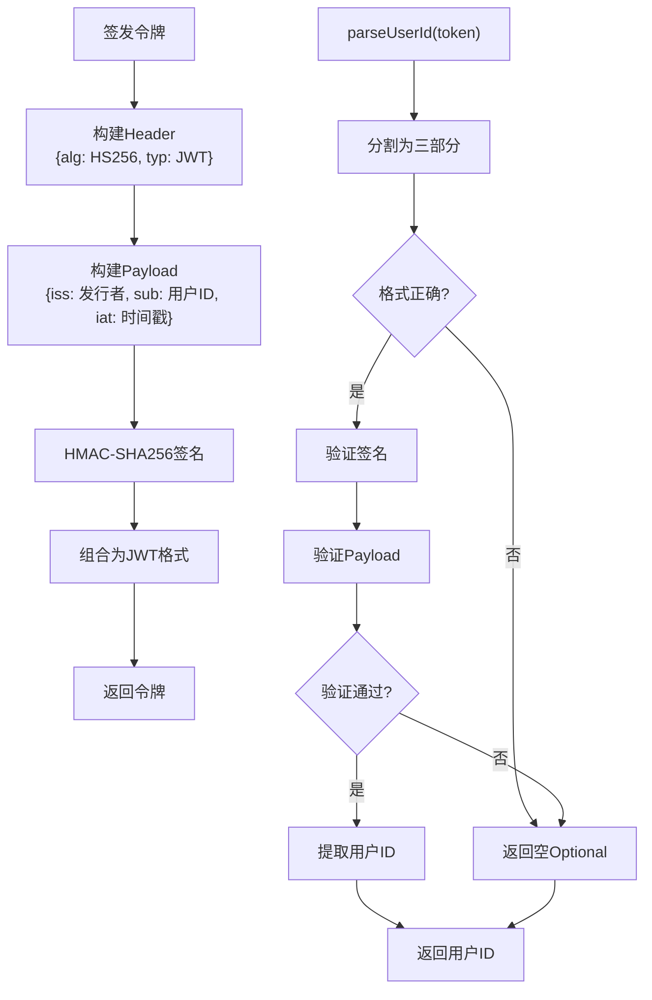
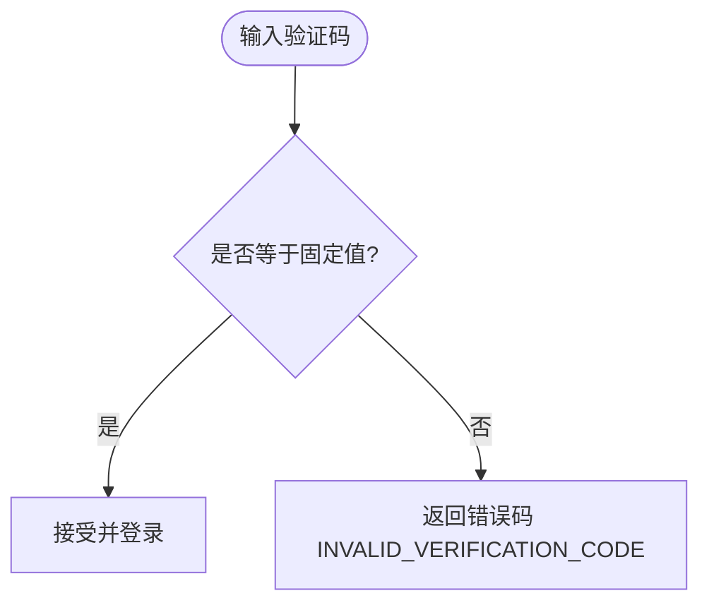
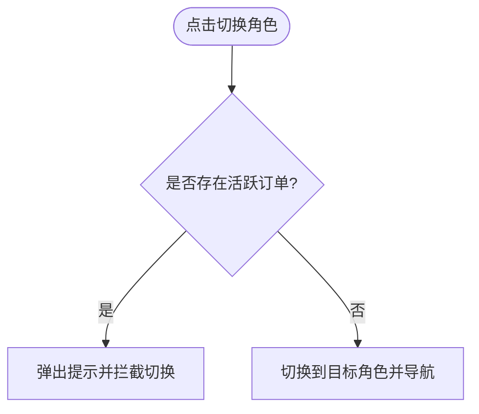
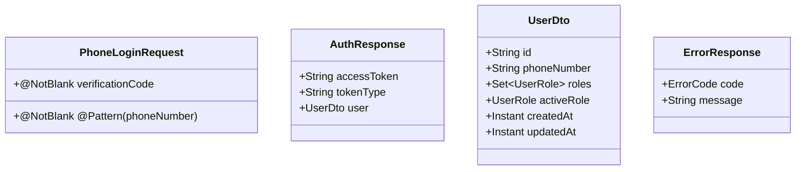
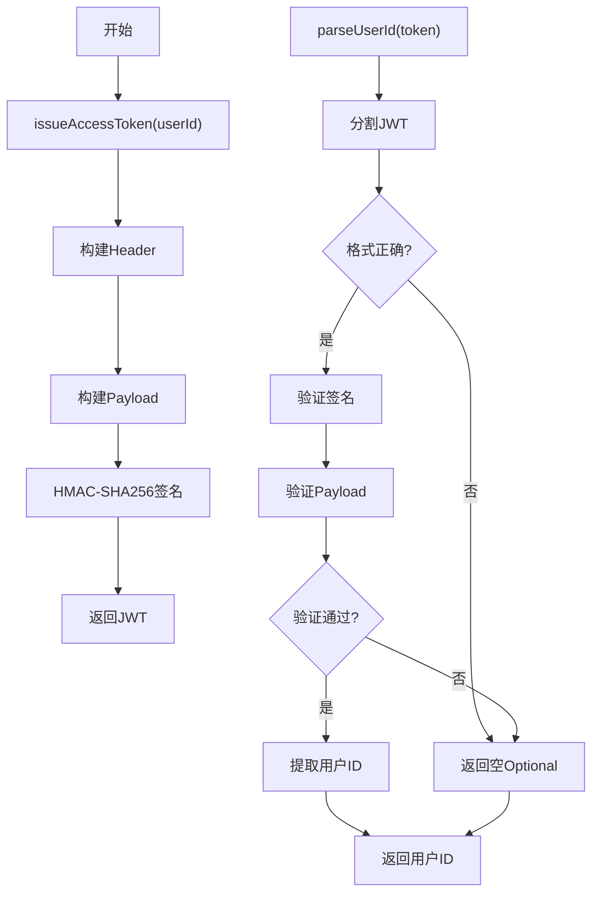
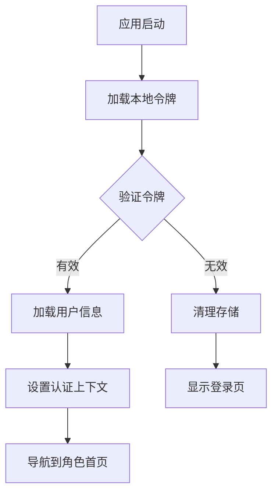
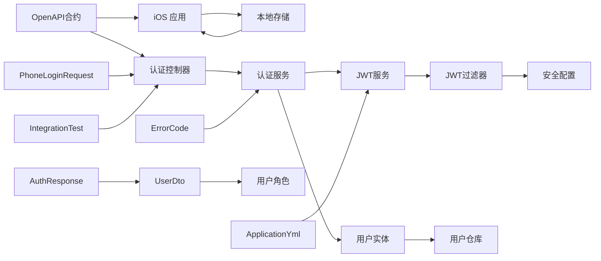

# 认证系统

<cite>
**本文引用的文件**
- [AuthController.java](file://backend/src/main/java/com/aidrun/backend/auth/AuthController.java)
- [AuthService.java](file://backend/src/main/java/com/aidrun/backend/auth/AuthService.java)
- [JwtService.java](file://backend/src/main/java/com/aidrun/backend/auth/JwtService.java)
- [JwtAuthenticationFilter.java](file://backend/src/main/java/com/aidrun/backend/auth/JwtAuthenticationFilter.java)
- [PhoneLoginRequest.java](file://backend/src/main/java/com/aidrun/backend/auth/dto/PhoneLoginRequest.java)
- [AuthResponse.java](file://backend/src/main/java/com/aidrun/backend/auth/dto/AuthResponse.java)
- [AppUser.java](file://backend/src/main/java/com/aidrun/backend/user/AppUser.java)
- [AppUserRepository.java](file://backend/src/main/java/com/aidrun/backend/user/AppUserRepository.java)
- [UserDto.java](file://backend/src/main/java/com/aidrun/backend/user/dto/UserDto.java)
- [UserRole.java](file://backend/src/main/java/com/aidrun/backend/user/UserRole.java)
- [SecurityConfig.java](file://backend/src/main/java/com/aidrun/backend/config/SecurityConfig.java)
- [application.yml](file://backend/src/main/resources/application.yml)
- [ErrorCode.java](file://backend/src/main/java/com/aidrun/backend/common/error/ErrorCode.java)
- [AuthControllerIntegrationTest.java](file://backend/src/test/java/com/aidrun/backend/auth/AuthControllerIntegrationTest.java)
- [07-api-contract.openapi.yaml](file://docs/07-api-contract.openapi.yaml)
</cite>

## 更新摘要
**所做更改**
- 新增手机号登录的输入验证机制，包括手机号格式验证和验证码验证
- 更新认证服务的错误处理策略，增强错误码的使用
- 完善JWT令牌系统的安全实现，包括常量时间比较和URL安全编码
- 新增完整的集成测试覆盖，验证各种登录场景
- 增强Spring Security配置，完善认证过滤器集成

## 目录
1. [简介](#简介)
2. [项目结构](#项目结构)
3. [核心组件](#核心组件)
4. [架构总览](#架构总览)
5. [详细组件分析](#详细组件分析)
6. [用户模型与数据结构](#用户模型与数据结构)
7. [认证流程实现](#认证流程实现)
8. [JWT认证系统详解](#jwt认证系统详解)
9. [认证状态管理](#认证状态管理)
10. [依赖关系分析](#依赖关系分析)
11. [性能考量](#性能考量)
12. [故障排查指南](#故障排查指南)
13. [结论](#结论)
14. [附录](#附录)

## 简介
本文件面向认证系统，聚焦"手机号登录"能力，覆盖以下主题：
- 手机号登录与账户自动创建流程，包含完整的输入验证机制
- **基于HMAC-SHA256的JWT令牌系统**，包含发行者验证和用户ID提取功能
- 固定验证码验证逻辑，支持多种错误场景
- 认证状态管理、会话保持、自动登录与退出登录
- 完整用户故事场景、API 接口规范与错误处理策略
- 认证中间件工作原理与安全考虑
- 提供具体代码实现示例路径，展示首次登录创建账户与现有用户登录的差异

## 项目结构
该仓库包含 iOS 应用骨架与认证相关的规格、用户故事、API 合约与状态机文档。认证系统的核心行为由用户故事与 OpenAPI 合约定义，iOS 应用负责调用后端 API 并维护本地会话。

**图表来源**
- [AuthController.java:12-27](file://backend/src/main/java/com/aidrun/backend/auth/AuthController.java#L12-L27)
- [AuthService.java:16-48](file://backend/src/main/java/com/aidrun/backend/auth/AuthService.java#L16-L48)
- [JwtService.java:17-108](file://backend/src/main/java/com/aidrun/backend/auth/JwtService.java#L17-L108)
- [JwtAuthenticationFilter.java:17-63](file://backend/src/main/java/com/aidrun/backend/auth/JwtAuthenticationFilter.java#L17-L63)
- [SecurityConfig.java:17-55](file://backend/src/main/java/com/aidrun/backend/config/SecurityConfig.java#L17-L55)
- [AppUser.java:16-56](file://backend/src/main/java/com/aidrun/backend/user/AppUser.java#L16-L56)
- [UserDto.java:8-27](file://backend/src/main/java/com/aidrun/backend/user/dto/UserDto.java#L8-L27)
- [UserRole.java:6-30](file://backend/src/main/java/com/aidrun/backend/user/UserRole.java#L6-L30)
- [PhoneLoginRequest.java:6-12](file://backend/src/main/java/com/aidrun/backend/auth/dto/PhoneLoginRequest.java#L6-L12)
- [AuthResponse.java:5-10](file://backend/src/main/java/com/aidrun/backend/auth/dto/AuthResponse.java#L5-L10)
- [ErrorCode.java:6-40](file://backend/src/main/java/com/aidrun/backend/common/error/ErrorCode.java#L6-L40)
- [AppUserRepository.java:6-9](file://backend/src/main/java/com/aidrun/backend/user/AppUserRepository.java#L6-L9)
- [AuthControllerIntegrationTest.java:17-136](file://backend/src/test/java/com/aidrun/backend/auth/AuthControllerIntegrationTest.java#L17-L136)
- [application.yml:30-34](file://backend/src/main/resources/application.yml#L30-L34)
- [07-api-contract.openapi.yaml:454-487](file://docs/07-api-contract.openapi.yaml#L454-L487)

## 核心组件
- 手机号登录与自动注册
  - 首次登录：提交固定验证码，后端创建用户并返回 JWT
  - 现有用户：提交固定验证码，后端返回现有用户与新 JWT
  - **输入验证**：手机号格式验证（11位数字，以1开头），验证码非空验证
- **基于HMAC-SHA256的JWT令牌系统**
  - **发行者验证**：令牌包含发行者标识，解析时验证发行者一致性
  - **用户ID提取**：从令牌载荷中提取用户ID，支持令牌验证与用户识别
  - **签名验证**：使用HMAC-SHA256算法进行数字签名验证
- 固定验证码验证
  - 仅接受固定值"123456"；其他值返回 INVALID_VERIFICATION_CODE 错误码
- JWT 令牌
  - Bearer 方案；所有受保护接口均要求携带
  - 支持自动登录与退出登录
- 认证状态管理
  - UserDefaults 存储 JWT；启动时验证并自动登录；退出登录时清理
- 角色选择与切换
  - 首次登录后进入角色选择；切换 activeRole 时对活跃订单进行拦截

**章节来源**
- [PhoneLoginRequest.java:6-12](file://backend/src/main/java/com/aidrun/backend/auth/dto/PhoneLoginRequest.java#L6-L12)
- [AuthService.java:19-47](file://backend/src/main/java/com/aidrun/backend/auth/AuthService.java#L19-L47)
- [JwtService.java:38-78](file://backend/src/main/java/com/aidrun/backend/auth/JwtService.java#L38-L78)
- [ErrorCode.java:7-18](file://backend/src/main/java/com/aidrun/backend/common/error/ErrorCode.java#L7-L18)

## 架构总览
认证系统采用"前端调用 + 后端鉴权"的分层架构。前端负责收集手机号与验证码，调用登录接口；后端完成用户校验与 JWT 签发；前端在后续请求中携带 JWT。

**图表来源**
- [07-api-contract.openapi.yaml:25-46](file://docs/07-api-contract.openapi.yaml#L25-L46)

## 详细组件分析

### 手机号登录与账户自动创建
- 首次登录
  - 行为：提交固定验证码，后端创建用户、分配可用角色、activeRole 未设置，返回 JWT
  - 场景：登录页 -> 验证码页 -> 登录成功 -> 角色选择页
- 现有用户登录
  - 行为：提交固定验证码，后端返回现有用户与新 JWT
  - 场景：登录页 -> 验证码页 -> 登录成功 -> 直接进入角色首页
- **输入验证增强**
  - 手机号格式验证：必须是11位数字，以1开头
  - 验证码非空验证：不能为空字符串
  - 格式错误时返回 VALIDATION_FAILED 错误码

**图表来源**
- [AuthService.java:29-47](file://backend/src/main/java/com/aidrun/backend/auth/AuthService.java#L29-L47)
- [PhoneLoginRequest.java:6-12](file://backend/src/main/java/com/aidrun/backend/auth/dto/PhoneLoginRequest.java#L6-L12)
- [AuthControllerIntegrationTest.java:93-134](file://backend/src/test/java/com/aidrun/backend/auth/AuthControllerIntegrationTest.java#L93-L134)

**章节来源**
- [AuthService.java:29-47](file://backend/src/main/java/com/aidrun/backend/auth/AuthService.java#L29-L47)
- [PhoneLoginRequest.java:6-12](file://backend/src/main/java/com/aidrun/backend/auth/dto/PhoneLoginRequest.java#L6-L12)
- [AuthControllerIntegrationTest.java:93-134](file://backend/src/test/java/com/aidrun/backend/auth/AuthControllerIntegrationTest.java#L93-L134)

### **基于HMAC-SHA256的JWT令牌系统**

**更新** 新增基于HMAC-SHA256的JWT令牌系统，包含发行者验证和用户ID提取功能

- **令牌格式**
  - 结构：header.payload.signature
  - Header：包含算法(HS256)和类型(JWT)
  - Payload：包含发行者(iss)、主题(sub)、签发时间(iat)
  - Signature：使用HMAC-SHA256算法对header.payload进行签名
- **发行者验证**
  - 解析时验证iss字段与配置的一致性
  - 验证签名完整性，防止令牌篡改
  - 不匹配或格式错误时返回空Optional
- **用户ID提取**
  - 成功验证后从sub字段中提取用户ID
  - 返回Optional包装，支持不存在的情况
- **安全特性**
  - 使用常量时间比较防止时序攻击
  - URL安全的Base64编码避免特殊字符问题
  - 秘钥管理在application.yml中配置

**图表来源**
- [JwtService.java:38-78](file://backend/src/main/java/com/aidrun/backend/auth/JwtService.java#L38-L78)
- [application.yml:30-34](file://backend/src/main/resources/application.yml#L30-L34)

**章节来源**
- [JwtService.java:38-78](file://backend/src/main/java/com/aidrun/backend/auth/JwtService.java#L38-L78)
- [application.yml:30-34](file://backend/src/main/resources/application.yml#L30-L34)

### 固定验证码验证逻辑
- 验证码
  - 仅接受固定值"123456"；其他值返回 INVALID_VERIFICATION_CODE
- 错误处理
  - 400 响应，包含错误码与消息
- **输入验证**
  - PhoneLoginRequest 对 verificationCode 进行非空验证
  - 集成测试覆盖了各种错误场景

**图表来源**
- [AuthService.java:31-33](file://backend/src/main/java/com/aidrun/backend/auth/AuthService.java#L31-L33)
- [AuthControllerIntegrationTest.java:42-52](file://backend/src/test/java/com/aidrun/backend/auth/AuthControllerIntegrationTest.java#L42-L52)

**章节来源**
- [AuthService.java:31-33](file://backend/src/main/java/com/aidrun/backend/auth/AuthService.java#L31-L33)
- [AuthControllerIntegrationTest.java:42-52](file://backend/src/test/java/com/aidrun/backend/auth/AuthControllerIntegrationTest.java#L42-L52)

### 认证状态管理、会话保持、自动登录与退出登录
- 自动登录
  - App 启动时读取本地存储中的有效 JWT，验证后直接进入对应角色首页
  - 若 JWT 过期或无效，则清理并回到登录页
- 退出登录
  - 设置页点击退出登录并确认后，清理本地存储中的 token，回到登录页

**图表来源**
- [07-api-contract.openapi.yaml:470-479](file://docs/07-api-contract.openapi.yaml#L470-L479)

**章节来源**
- [07-api-contract.openapi.yaml:470-479](file://docs/07-api-contract.openapi.yaml#L470-L479)

### 角色选择与切换
- 首次登录后的角色选择
  - 选择"盲人跑者"或"志愿者"，保存到后端并进入对应流程
- 切换 activeRole
  - 存在活跃订单（accepted / arrived / in_progress / emergency）时禁止切换
  - 其他状态下可正常切换

**图表来源**
- [07-api-contract.openapi.yaml:533-541](file://docs/07-api-contract.openapi.yaml#L533-L541)

**章节来源**
- [07-api-contract.openapi.yaml:533-541](file://docs/07-api-contract.openapi.yaml#L533-L541)

### API 接口规范与错误处理策略
- 登录接口
  - 路径：POST /api/auth/phone-login
  - 请求体：phoneNumber、verificationCode（固定值"123456"）
  - 成功：200，返回 accessToken、tokenType、user
  - 失败：400，INVALID_VERIFICATION_CODE 或 VALIDATION_FAILED
- 受保护接口
  - 需要在请求头携带 Authorization: Bearer <accessToken>
  - 未携带或无效：401 UNAUTHORIZED
- 错误码
  - 包括 INVALID_VERIFICATION_CODE、UNAUTHORIZED、VALIDATION_FAILED 等稳定错误码

**图表来源**
- [PhoneLoginRequest.java:6-12](file://backend/src/main/java/com/aidrun/backend/auth/dto/PhoneLoginRequest.java#L6-L12)
- [AuthResponse.java:5-10](file://backend/src/main/java/com/aidrun/backend/auth/dto/AuthResponse.java#L5-L10)
- [UserDto.java:8-27](file://backend/src/main/java/com/aidrun/backend/user/dto/UserDto.java#L8-L27)

**章节来源**
- [07-api-contract.openapi.yaml:612-633](file://docs/07-api-contract.openapi.yaml#L612-L633)
- [07-api-contract.openapi.yaml:479-487](file://docs/07-api-contract.openapi.yaml#L479-L487)
- [07-api-contract.openapi.yaml:470-479](file://docs/07-api-contract.openapi.yaml#L470-L479)

### 认证中间件工作原理与安全考虑
- 中间件职责
  - 校验 Authorization 头中的 Bearer Token
  - 对未携带或无效 token 的请求返回 401
- **安全增强**
  - **发行者验证**：JWT服务内置发行者验证，防止令牌伪造
  - **签名验证**：使用HMAC-SHA256算法验证令牌完整性
  - **用户ID提取**：从验证后的载荷中提取用户ID
  - **常量时间比较**：防止时序攻击的密码学安全比较
- 安全考虑
  - 令牌有效期与刷新策略（如需）应在后端实现
  - 建议启用 HTTPS 传输
  - 前端避免在日志中输出敏感信息
  - 前端本地存储建议使用安全存储方案（如钥匙串）

**章节来源**
- [JwtService.java:56-78](file://backend/src/main/java/com/aidrun/backend/auth/JwtService.java#L56-L78)
- [JwtAuthenticationFilter.java:30-61](file://backend/src/main/java/com/aidrun/backend/auth/JwtAuthenticationFilter.java#L30-L61)
- [SecurityConfig.java:28-50](file://backend/src/main/java/com/aidrun/backend/config/SecurityConfig.java#L28-L50)

## 用户模型与数据结构

### 用户实体模型
AppUser 是认证系统的核心实体，继承自BaseEntity，包含完整的用户信息和角色管理。

- **核心属性**
  - phoneNumber：唯一手机号码，用于用户身份标识
  - roles：用户角色集合，包含BLIND_RUNNER和VOLUNTEER
  - activeRole：当前激活的角色，初始为空
- **继承关系**
  - 继承BaseEntity，自动获得id、createdAt、updatedAt等通用属性
- **数据库映射**
  - @Entity注解标识为JPA实体
  - @Table(name = "users")指定表名
  - @Column(unique = true)确保手机号唯一性

**章节来源**
- [AppUser.java:16-56](file://backend/src/main/java/com/aidrun/backend/user/AppUser.java#L16-L56)

### 用户角色枚举
UserRole 定义了系统的用户角色体系，支持JSON序列化和反序列化。

- **角色定义**
  - BLIND_RUNNER("blind_runner")：盲人跑者角色
  - VOLUNTEER("volunteer")：志愿者角色
- **序列化特性**
  - @JsonValue注解定义wireValue序列化格式
  - @JsonCreator注解支持从wireValue反序列化
- **角色管理**
  - 支持Set集合存储多个角色
  - LinkedHashSet保证角色添加顺序

**章节来源**
- [UserRole.java:6-30](file://backend/src/main/java/com/aidrun/backend/user/UserRole.java#L6-L30)

### 用户DTO映射
UserDto 提供用户数据传输对象，用于API响应的数据封装。

- **DTO结构**
  - id：用户唯一标识符
  - phoneNumber：用户手机号码
  - roles：用户角色集合
  - activeRole：当前激活角色
  - createdAt/updatedAt：创建和更新时间戳
- **映射机制**
  - from静态方法实现AppUser到UserDto的转换
  - 自动映射所有实体属性到DTO

**章节来源**
- [UserDto.java:8-27](file://backend/src/main/java/com/aidrun/backend/user/dto/UserDto.java#L8-L27)

### 认证数据传输对象
PhoneLoginRequest 和 AuthResponse 定义了认证相关的数据传输结构。

- **PhoneLoginRequest**
  - phoneNumber：手机号码（非空验证，11位数字，以1开头）
  - verificationCode：验证码（非空验证）
- **AuthResponse**
  - accessToken：JWT访问令牌
  - tokenType：令牌类型（固定为Bearer）
  - user：用户信息DTO

**章节来源**
- [PhoneLoginRequest.java:6-12](file://backend/src/main/java/com/aidrun/backend/auth/dto/PhoneLoginRequest.java#L6-L12)
- [AuthResponse.java:5-10](file://backend/src/main/java/com/aidrun/backend/auth/dto/AuthResponse.java#L5-L10)

## 认证流程实现

### 认证控制器层
AuthController 处理HTTP请求，提供RESTful认证接口。

- **接口定义**
  - @PostMapping("/phone-login")：手机号登录接口
  - @Valid参数验证：确保请求数据符合规范
  - ResponseEntity响应：标准化HTTP响应格式
- **依赖注入**
  - 注入AuthService进行业务逻辑处理
  - 自动依赖注入，无需手动配置

**章节来源**
- [AuthController.java:12-27](file://backend/src/main/java/com/aidrun/backend/auth/AuthController.java#L12-L27)

### 认证服务层
AuthService 实现核心认证逻辑，处理用户创建和令牌签发。

- **验证码验证**
  - 固定验证码："123456"
  - 非法验证码抛出ApiException
- **用户管理**
  - 查找现有用户：findByPhoneNumber
  - 创建新用户：默认赋予BLIND_RUNNER和VOLUNTEER角色
  - 事务管理：@Transactional确保数据一致性
- **令牌签发**
  - 调用jwtService.issueAccessToken
  - 包装为AuthResponse返回

**章节来源**
- [AuthService.java:16-48](file://backend/src/main/java/com/aidrun/backend/auth/AuthService.java#L16-L48)

### 数据访问层
AppUserRepository 提供用户数据访问接口。

- **继承关系**
  - 继承JpaRepository，自动获得CRUD操作
  - 支持分页和排序查询
- **自定义查询**
  - findByPhoneNumber：按手机号查找用户
  - 返回Optional包装，避免空指针

**章节来源**
- [AppUserRepository.java:6-9](file://backend/src/main/java/com/aidrun/backend/user/AppUserRepository.java#L6-L9)

## JWT认证系统详解

### JWT服务实现
JwtService 提供完整的JWT令牌生成功能，包括令牌签发和解析验证。

- **令牌签发流程**
  - 构建Header：包含算法(HS256)和类型(JWT)
  - 构建Payload：包含发行者(iss)、主题(sub)、签发时间(iat)
  - 使用HMAC-SHA256算法签名
  - 组合为JWT字符串格式
- **令牌解析流程**
  - 验证JWT格式（必须包含三个部分）
  - 验证签名完整性
  - 解析Payload并验证发行者
  - 提取用户ID并返回Optional
- **安全特性**
  - 使用常量时间比较防止时序攻击
  - URL安全的Base64编码
  - 秘钥从配置文件读取

**图表来源**
- [JwtService.java:38-78](file://backend/src/main/java/com/aidrun/backend/auth/JwtService.java#L38-L78)

**章节来源**
- [JwtService.java:17-108](file://backend/src/main/java/com/aidrun/backend/auth/JwtService.java#L17-L108)

### JWT认证过滤器
JwtAuthenticationFilter 集成到Spring Security过滤器链中，负责验证请求中的JWT令牌。

- **过滤器职责**
  - 从Authorization头提取Bearer令牌
  - 调用JwtService验证令牌有效性
  - 将用户信息设置到SecurityContext
  - 放行后续请求处理
- **集成方式**
  - 在Spring Security过滤器链中添加
  - 仅对受保护接口生效
  - 保持无状态认证

**章节来源**
- [JwtAuthenticationFilter.java:17-63](file://backend/src/main/java/com/aidrun/backend/auth/JwtAuthenticationFilter.java#L17-L63)

### 安全配置
SecurityConfig 配置Spring Security，集成JWT认证过滤器。

- **配置要点**
  - 禁用CSRF保护
  - 设置Session为STATELESS
  - 配置受保护路径
  - 添加JWT认证过滤器
  - 自定义认证EntryPoint
- **路径配置**
  - /api/auth/**：开放访问
  - Swagger和H2控制台：开发环境开放
  - 其他路径：需要认证

**章节来源**
- [SecurityConfig.java:17-55](file://backend/src/main/java/com/aidrun/backend/config/SecurityConfig.java#L17-L55)

### 应用配置
application.yml 包含JWT相关的配置信息。

- **JWT配置**
  - aidrun.jwt.issuer：发行者标识
  - aidrun.jwt.demo-secret：签名密钥
- **其他配置**
  - 数据源配置
  - JPA配置
  - OpenAPI配置

**章节来源**
- [application.yml:30-34](file://backend/src/main/resources/application.yml#L30-L34)

## 认证状态管理

### 自动登录机制
应用启动时的自动登录流程：

- **启动检测**
  - 读取本地存储中的JWT令牌
  - 验证令牌格式和签名
  - 解析用户ID并查找用户信息
- **登录决策**
  - 令牌有效：设置认证上下文，进入角色首页
  - 令牌无效：清理本地存储，回到登录页
- **用户体验**
  - 无缝登录体验
  - 自动处理过期令牌

**图表来源**
- [07-api-contract.openapi.yaml:470-479](file://docs/07-api-contract.openapi.yaml#L470-L479)

### 退出登录流程
用户主动退出登录的操作流程：

- **用户操作**
  - 设置页点击退出登录
  - 确认对话框确认
- **系统处理**
  - 清理本地存储的JWT
  - 导航到登录页
  - 清空认证上下文

**章节来源**
- [07-api-contract.openapi.yaml:470-479](file://docs/07-api-contract.openapi.yaml#L470-L479)

### 会话保持策略
- **无状态设计**
  - JWT令牌包含所有必要信息
  - 服务器端不需要存储会话状态
- **令牌管理**
  - 前端存储JWT到安全位置
  - 每次请求自动附加Authorization头
- **安全考虑**
  - 令牌过期时间控制
  - 安全传输（HTTPS）
  - 本地存储安全

## 依赖关系分析
- 文档驱动
  - 用户故事与状态机定义了交互流程
  - OpenAPI 合约定义了接口契约与错误码
- **实现增强**
  - **JWT服务**：提供基于HMAC-SHA256的令牌生成与解析
  - **安全配置**：Spring Security基础配置，支持HTTP Basic认证
  - **用户管理**：JPA实体管理用户数据
  - **过滤器链**：JWT认证过滤器集成到Spring Security
  - **输入验证**：Jakarta Validation提供参数验证
- 实现耦合
  - iOS 应用通过调用后端 API 实现认证
  - 本地存储与后端鉴权共同构成会话管理

**图表来源**
- [07-api-contract.openapi.yaml:454-487](file://docs/07-api-contract.openapi.yaml#L454-L487)
- [AuthController.java:12-27](file://backend/src/main/java/com/aidrun/backend/auth/AuthController.java#L12-L27)
- [AuthService.java:16-48](file://backend/src/main/java/com/aidrun/backend/auth/AuthService.java#L16-L48)
- [JwtService.java:17-108](file://backend/src/main/java/com/aidrun/backend/auth/JwtService.java#L17-L108)
- [JwtAuthenticationFilter.java:17-63](file://backend/src/main/java/com/aidrun/backend/auth/JwtAuthenticationFilter.java#L17-L63)
- [SecurityConfig.java:17-55](file://backend/src/main/java/com/aidrun/backend/config/SecurityConfig.java#L17-L55)
- [AppUser.java:16-56](file://backend/src/main/java/com/aidrun/backend/user/AppUser.java#L16-L56)
- [AppUserRepository.java:6-9](file://backend/src/main/java/com/aidrun/backend/user/AppUserRepository.java#L6-L9)
- [UserDto.java:8-27](file://backend/src/main/java/com/aidrun/backend/user/dto/UserDto.java#L8-L27)
- [UserRole.java:6-30](file://backend/src/main/java/com/aidrun/backend/user/UserRole.java#L6-L30)
- [PhoneLoginRequest.java:6-12](file://backend/src/main/java/com/aidrun/backend/auth/dto/PhoneLoginRequest.java#L6-L12)
- [AuthResponse.java:5-10](file://backend/src/main/java/com/aidrun/backend/auth/dto/AuthResponse.java#L5-L10)
- [ErrorCode.java:6-40](file://backend/src/main/java/com/aidrun/backend/common/error/ErrorCode.java#L6-L40)
- [AuthControllerIntegrationTest.java:17-136](file://backend/src/test/java/com/aidrun/backend/auth/AuthControllerIntegrationTest.java#L17-L136)
- [application.yml:30-34](file://backend/src/main/resources/application.yml#L30-L34)

**章节来源**
- [07-api-contract.openapi.yaml:454-487](file://docs/07-api-contract.openapi.yaml#L454-L487)

## 性能考量
- 登录与受保护接口的调用频率较低，性能瓶颈通常不在认证链路
- 建议在前端缓存必要的用户信息，减少重复请求
- 对于轮询类接口，应合理设置轮息间隔与停止条件，避免不必要的网络负载
- **JWT优化**：HMAC-SHA256签名相比传统JWT库更高效，URL安全编码避免额外字符转换开销

## 故障排查指南
- 验证码错误
  - 现象：提交非固定验证码返回 INVALID_VERIFICATION_CODE
  - 处理：提示用户重新输入验证码
- 无效手机号格式
  - 现象：手机号格式不正确返回 VALIDATION_FAILED
  - 处理：提示用户输入正确的手机号格式
- 未登录或 token 无效
  - 现象：访问受保护接口返回 401 UNAUTHORIZED
  - 处理：清理本地 token，跳转登录页
- **令牌解析失败**
  - **现象**：JWT服务无法解析令牌，返回空Optional
  - **可能原因**：
    - 发行者不匹配
    - 签名验证失败
    - JWT格式不符合标准
  - **处理**：重新登录获取新令牌
- **用户不存在**
  - **现象**：JWT解析成功但用户不存在
  - **可能原因**：用户被删除或数据不一致
  - **处理**：重新登录或联系管理员
- 自动登录失败
  - 现象：启动后未进入首页
  - 处理：检查本地 token 是否存在且未过期；必要时重新登录

**章节来源**
- [AuthControllerIntegrationTest.java:93-134](file://backend/src/test/java/com/aidrun/backend/auth/AuthControllerIntegrationTest.java#L93-L134)
- [07-api-contract.openapi.yaml:479-487](file://docs/07-api-contract.openapi.yaml#L479-L487)
- [07-api-contract.openapi.yaml:470-479](file://docs/07-api-contract.openapi.yaml#L470-L479)
- [JwtService.java:56-78](file://backend/src/main/java/com/aidrun/backend/auth/JwtService.java#L56-L78)
- [JwtAuthenticationFilter.java:49-58](file://backend/src/main/java/com/aidrun/backend/auth/JwtAuthenticationFilter.java#L49-L58)

## 结论
本认证系统以"手机号 + 固定验证码"为核心入口，结合**基于HMAC-SHA256的JWT令牌系统**实现轻量级会话管理。新增的JWT服务提供发行者验证和用户ID提取功能，增强了令牌系统的安全性与可靠性。**输入验证机制**确保了手机号格式的正确性和验证码的有效性，提供了完善的错误处理策略。用户故事与 OpenAPI 合约明确了登录、自动登录、退出登录与角色切换的行为边界。前端通过调用后端 API 完成认证流程，后端通过JWT服务统一解析令牌，确保受保护接口的安全性。**集成测试覆盖**了各种登录场景，包括首次登录、现有用户登录、验证码错误、手机号格式错误等。建议在后续版本中完善令牌刷新、HTTPS 与本地存储安全等措施，持续提升安全性与用户体验。

## 附录
- 示例路径（用于定位实现）
  - 登录接口定义：[AuthController.java:22-26](file://backend/src/main/java/com/aidrun/backend/auth/AuthController.java#L22-L26)
  - 认证服务实现：[AuthService.java:29-47](file://backend/src/main/java/com/aidrun/backend/auth/AuthService.java#L29-L47)
  - JWT服务实现：[JwtService.java:38-78](file://backend/src/main/java/com/aidrun/backend/auth/JwtService.java#L38-L78)
  - JWT过滤器实现：[JwtAuthenticationFilter.java:30-61](file://backend/src/main/java/com/aidrun/backend/auth/JwtAuthenticationFilter.java#L30-L61)
  - 安全配置：[SecurityConfig.java:28-50](file://backend/src/main/java/com/aidrun/backend/config/SecurityConfig.java#L28-L50)
  - 应用配置：[application.yml:30-34](file://backend/src/main/resources/application.yml#L30-L34)
  - 用户实体：[AppUser.java:16-56](file://backend/src/main/java/com/aidrun/backend/user/AppUser.java#L16-L56)
  - 用户仓库：[AppUserRepository.java:6-9](file://backend/src/main/java/com/aidrun/backend/user/AppUserRepository.java#L6-L9)
  - 用户DTO：[UserDto.java:17-26](file://backend/src/main/java/com/aidrun/backend/user/dto/UserDto.java#L17-L26)
  - 用户角色：[UserRole.java:6-30](file://backend/src/main/java/com/aidrun/backend/user/UserRole.java#L6-L30)
  - 输入验证：[PhoneLoginRequest.java:6-12](file://backend/src/main/java/com/aidrun/backend/auth/dto/PhoneLoginRequest.java#L6-L12)
  - 错误码定义：[ErrorCode.java:7-18](file://backend/src/main/java/com/aidrun/backend/common/error/ErrorCode.java#L7-L18)
  - 集成测试：[AuthControllerIntegrationTest.java:22-134](file://backend/src/test/java/com/aidrun/backend/auth/AuthControllerIntegrationTest.java#L22-L134)
  - API合约：[07-api-contract.openapi.yaml:612-633](file://docs/07-api-contract.openapi.yaml#L612-L633)