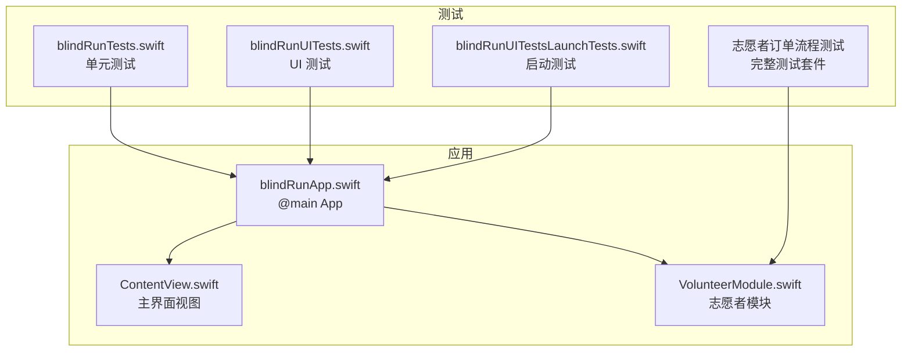
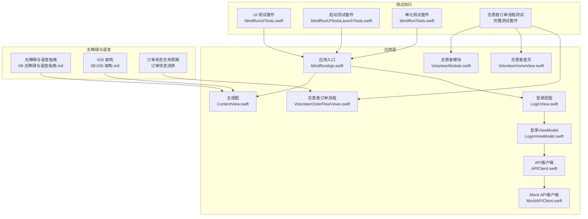
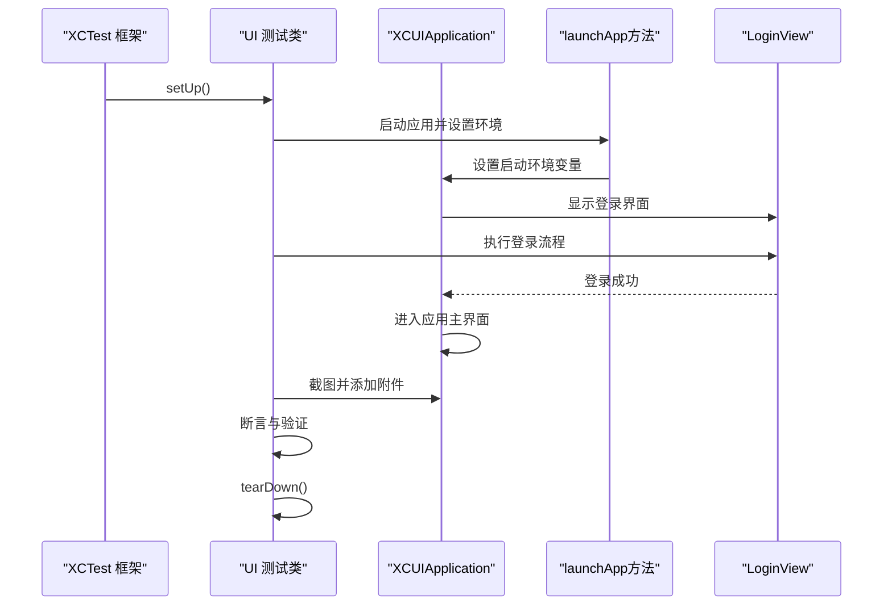
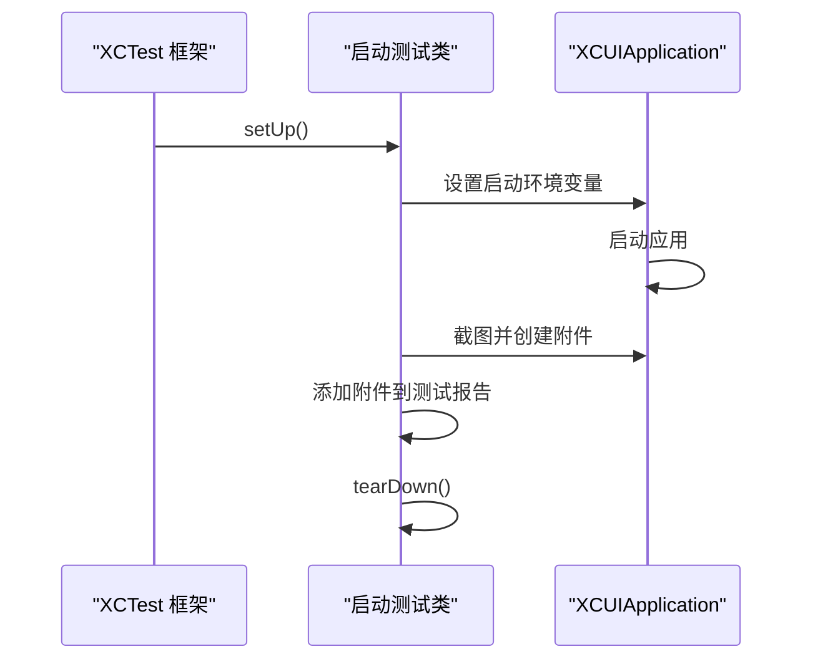
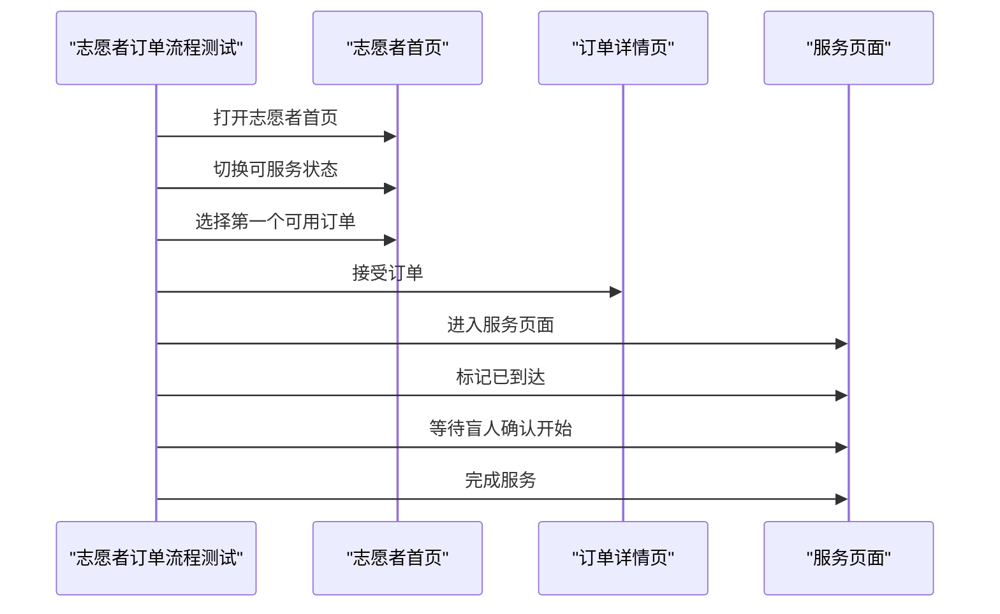
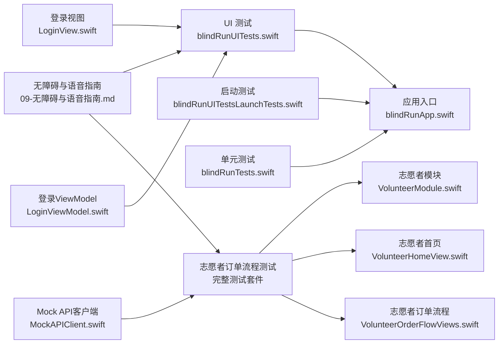

# UI 自动化测试

<cite>
**本文引用的文件**
- [blindRunUITests.swift](file://blindRunUITests/blindRunUITests.swift)
- [blindRunUITestsLaunchTests.swift](file://blindRunUITests/blindRunUITestsLaunchTests.swift)
- [LoginView.swift](file://blindRun/Auth/LoginView.swift)
- [LoginViewModel.swift](file://blindRun/Auth/LoginViewModel.swift)
- [APIClient.swift](file://blindRun/Core/APIClient.swift)
- [MockAPIClient.swift](file://blindRun/Core/MockAPIClient.swift)
- [VolunteerOrderFlowViews.swift](file://blindRun/Volunteer/VolunteerOrderFlowViews.swift)
- [VolunteerHomeView.swift](file://blindRun/Volunteer/VolunteerHomeView.swift)
- [VolunteerModule.swift](file://blindRun/Volunteer/VolunteerModule.swift)
- [09-无障碍与语音指南.md](file://docs/09-accessibility-and-voice-guidelines.md)
- [08-iOS 架构.md](file://docs/08-ios-architecture.md)
- [01-产品需求文档.md](file://docs/01-产品需求文档.md)
</cite>

## 更新摘要
**所做变更**
- 新增全面的志愿者订单流程测试套件，涵盖订单接受、到达确认、服务开始和完成的完整流程
- 添加截图捕获功能，支持志愿者服务流程的可视化验证
- 增强了志愿者首页地图和Uber风格界面的测试覆盖
- 完善了Mock API客户端的志愿者测试支持
- 更新了测试环境配置和启动参数

## 目录
1. [简介](#简介)
2. [项目结构](#项目结构)
3. [核心组件](#核心组件)
4. [架构总览](#架构总览)
5. [详细组件分析](#详细组件分析)
6. [志愿者订单流程测试套件](#志愿者订单流程测试套件)
7. [依赖关系分析](#依赖关系分析)
8. [性能考量](#性能考量)
9. [故障排查指南](#故障排查指南)
10. [结论](#结论)
11. [附录](#附录)

## 简介
本文件为 blindRun 应用提供一套完整的 UI 自动化测试实施指南，覆盖 XCTest 与 SwiftUI 界面测试、Launch Tests 的实现与应用启动测试策略、志愿者订单流程的全面测试套件、无障碍功能测试（含 VoiceOver、屏幕阅读器兼容性与语音交互）、测试数据与环境配置、跨设备测试方法，以及最佳实践、维护策略与持续集成中的自动化流程建议。内容基于现有代码与文档，确保测试工程师能够快速落地并稳定运行 UI 自动化测试。

**更新** 应用已新增全面的志愿者订单流程测试套件，涵盖从订单接受到服务完成的完整生命周期，包含截图捕获功能以支持可视化验证。

## 项目结构
blindRun 采用 SwiftUI + MVVM 架构，测试目录包含单元测试与 UI 测试两部分：
- 单元测试：位于 blindRunTests，用于验证业务逻辑与模型行为。
- UI 测试：位于 blindRunUITests，包含普通 UI 测试、启动测试和志愿者订单流程测试。

**图表来源**
- [blindRunUITests.swift:10-43](file://blindRunUITests/blindRunUITests.swift#L10-L43)
- [blindRunUITestsLaunchTests.swift:10-35](file://blindRunUITests/blindRunUITestsLaunchTests.swift#L10-L35)
- [VolunteerModule.swift:1-361](file://blindRun/Volunteer/VolunteerModule.swift#L1-L361)

**章节来源**
- [blindRunUITests.swift:10-43](file://blindRunUITests/blindRunUITests.swift#L10-L43)
- [blindRunUITestsLaunchTests.swift:10-35](file://blindRunUITests/blindRunUITestsLaunchTests.swift#L10-L35)

## 核心组件
- 应用入口与主视图
  - 应用入口通过 SwiftUI App 协议定义窗口组并渲染主视图。
  - 主视图为一个简单的 VStack，包含系统图标与文本，用于演示与基础验证。
- 测试套件
  - 单元测试：提供基础 setUp/tearDown 与示例测试与性能测量模板。
  - UI 测试：提供应用启动、截图附件与启动耗时测量的模板。
  - 启动测试：提供启动后附加步骤与截图保存模板，支持针对目标应用 UI 配置的逐个运行。
  - **新增** 志愿者订单流程测试：提供完整的订单生命周期测试，包含截图捕获功能。

**更新** 新增了全面的志愿者订单流程测试套件，涵盖从订单接受到服务完成的完整生命周期。

**章节来源**
- [blindRunUITests.swift:10-43](file://blindRunUITests/blindRunUITests.swift#L10-L43)
- [blindRunUITestsLaunchTests.swift:10-35](file://blindRunUITests/blindRunUITestsLaunchTests.swift#L10-L35)

## 架构总览
下图展示了 UI 自动化测试在应用中的位置与调用关系，以及与志愿者订单流程测试的关联。

**图表来源**
- [blindRunUITests.swift:25-42](file://blindRunUITests/blindRunUITests.swift#L25-L42)
- [blindRunUITestsLaunchTests.swift:20-34](file://blindRunUITests/blindRunUITestsLaunchTests.swift#L20-L34)
- [VolunteerOrderFlowViews.swift:1-800](file://blindRun/Volunteer/VolunteerOrderFlowViews.swift#L1-L800)
- [VolunteerHomeView.swift:1-489](file://blindRun/Volunteer/VolunteerHomeView.swift#L1-L489)
- [VolunteerModule.swift:1-361](file://blindRun/Volunteer/VolunteerModule.swift#L1-L361)

## 详细组件分析

### UI 测试套件（blindRunUITests.swift）
- 目标
  - 验证应用启动、界面元素呈现与基本交互路径。
- 关键点
  - 在 setUp 中设置失败即停止，确保早期失败能快速反馈。
  - 使用 XCUIApplication 启动应用，并进行断言与截图附件。
  - 提供启动耗时测量指标，便于监控启动性能。
- 建议扩展
  - 在启动后添加登录或角色切换等前置步骤，确保进入目标页面。
  - 对关键页面添加元素识别与状态验证步骤（见无障碍指南中的标签与提示要求）。

**更新** 测试套件现已支持简化的直接登录流程，通过launchApp方法自动处理登录和角色切换。

**图表来源**
- [blindRunUITests.swift:44-68](file://blindRunUITests/blindRunUITests.swift#L44-L68)
- [blindRunUITests.swift:70-87](file://blindRunUITests/blindRunUITests.swift#L70-L87)

**章节来源**
- [blindRunUITests.swift:10-43](file://blindRunUITests/blindRunUITests.swift#L10-L43)
- [blindRunUITests.swift:44-68](file://blindRunUITests/blindRunUITests.swift#L44-L68)
- [blindRunUITests.swift:70-87](file://blindRunUITests/blindRunUITests.swift#L70-L87)

### 启动测试套件（blindRunUITestsLaunchTests.swift）
- 目标
  - 验证应用启动过程与首屏截图，支持多目标 UI 配置逐个运行。
- 关键点
  - runsForEachTargetApplicationUIConfiguration 设置为 true，确保针对不同 UI 配置逐一执行。
  - 在启动后可插入登录或导航步骤，再进行截图与断言。
  - 截图附件设置为永久保留，便于 CI 回溯与人工复核。
- 建议扩展
  - 在启动后添加登录步骤，确保进入盲人端首页。
  - 针对不同主题（浅色/深色）与设备方向进行截图与状态验证。

**更新** 启动测试现在支持简化的直接登录流程，通过启动环境变量自动配置测试环境。

**图表来源**
- [blindRunUITestsLaunchTests.swift:20-37](file://blindRunUITests/blindRunUITestsLaunchTests.swift#L20-L37)

**章节来源**
- [blindRunUITestsLaunchTests.swift:10-35](file://blindRunUITests/blindRunUITestsLaunchTests.swift#L10-L35)
- [blindRunUITestsLaunchTests.swift:20-37](file://blindRunUITests/blindRunUITestsLaunchTests.swift#L20-L37)

### 登录视图与ViewModel测试支持
- 登录视图
  - 提供手机号+验证码登录界面，完全遵循MVVM模式。
  - 包含完整的无障碍支持，包括accessibilityLabel和accessibilityHint。
  - 支持环境切换和本地后端地址配置。
- 登录ViewModel
  - 管理手机号/验证码输入、校验、倒计时和登录API调用。
  - 支持Mock环境下的简化登录流程。
  - 提供完整的错误处理和TTS播报功能。

**更新** 登录流程已优化，支持简化的直接登录，减少了测试中的复杂配置。

**章节来源**
- [LoginView.swift:30-200](file://blindRun/Auth/LoginView.swift#L30-L200)
- [LoginViewModel.swift:10-120](file://blindRun/Auth/LoginViewModel.swift#L10-L120)

### API客户端与Mock支持
- URLSessionAPIClient
  - 实现APIClientProtocol，提供真实的HTTP请求功能。
  - 支持认证令牌和超时配置。
- MockAPIClient
  - 提供完整的Mock API实现，支持UI测试。
  - 支持预设盲人资料和订单状态。
  - 通过环境变量控制测试数据生成。

**更新** Mock API客户端增强了UI测试支持，通过环境变量自动配置测试数据。

**章节来源**
- [APIClient.swift:103-194](file://blindRun/Core/APIClient.swift#L103-194)
- [MockAPIClient.swift:5-26](file://blindRun/Core/MockAPIClient.swift#L5-26)
- [MockAPIClient.swift:527-549](file://blindRun/Core/MockAPIClient.swift#L527-549)

### 视图元素识别与用户交互模拟
- 元素识别
  - 使用 accessibilityLabel 与 accessibilityHint 作为 VoiceOver 用户的主要导航依据。
  - 关键按钮与输入框需具备可读性与可听性，避免仅依赖视觉提示。
- 交互模拟
  - 使用 XCUIApplication 的元素查询与动作（如 tap、typeText、swipe）模拟用户操作。
  - 对于复杂交互，建议先断言元素存在与可交互，再执行动作。
- 状态验证
  - 结合无障碍指南中的关键播报节点，验证状态变更时的 TTS 与界面提示一致性。

**更新** 登录界面的无障碍标签已完全配置，确保VoiceOver用户能够无障碍导航。

**章节来源**
- [LoginView.swift:79-178](file://blindRun/Auth/LoginView.swift#L79-178)
- [09-无障碍与语音指南.md:37-61](file://docs/09-accessibility-and-voice-guidelines.md#L37-L61)

### Launch Tests 实现与应用启动测试策略
- 启动策略
  - 在启动后立即进行截图，记录首屏状态。
  - 可选地插入登录或角色切换步骤，确保进入目标页面后再截图。
- 性能监控
  - 使用启动耗时指标测量应用启动时间，定期回归以发现性能退化。
- 多配置支持
  - 利用 runsForEachTargetApplicationUIConfiguration 针对不同 UI 配置逐一运行，覆盖更多设备与系统组合。

**更新** 启动测试现在支持简化的直接登录流程，通过启动环境变量自动配置测试环境。

**章节来源**
- [blindRunUITestsLaunchTests.swift:12-34](file://blindRunUITests/blindRunUITestsLaunchTests.swift#L12-L34)
- [blindRunUITests.swift:37-42](file://blindRunUITests/blindRunUITests.swift#L37-L42)

### 无障碍功能测试指南（VoiceOver、屏幕阅读器与语音交互）
- VoiceOver 导航
  - 确保所有关键按钮、输入框与状态文本具备 accessibilityLabel 与 accessibilityHint。
  - 遍历顺序应与视觉布局一致，避免误导用户。
- TTS 关键节点播报
  - 在关键状态变化时触发 TTS，如进入首页、订单提交成功、匹配中、志愿者已接单、志愿者已到达、请确认开始服务、服务已开始、服务已完成、进入求助状态、错误提示。
- 语音输入
  - 仅在文本输入场景启用语音输入，失败时提供错误提示并允许键盘输入作为降级方案。
- 大按钮与可读性
  - 关键按钮高度不低于 64pt，确保在浅色与深色模式下均具备良好对比度与可读性。

**更新** 无障碍指南已更新，重点关注简化的登录流程和增强的TTS支持。

**章节来源**
- [09-无障碍与语音指南.md:5-11](file://docs/09-accessibility-and-voice-guidelines.md#L5-11)
- [09-无障碍与语音指南.md:13-36](file://docs/09-accessibility-and-voice-guidelines.md#L13-L36)
- [09-无障碍与语音指南.md:37-61](file://docs/09-accessibility-and-voice-guidelines.md#L37-L61)
- [09-无障碍与语音指南.md:71-87](file://docs/09-accessibility-and-voice-guidelines.md#L71-87)

### 测试数据管理与环境配置
- API 环境
  - 支持 mock、localBackend、production 三种环境，便于在不同阶段使用假数据或真实后端。
- 令牌存储
  - MVP 使用 UserDefaults 存储 JWT，正式发布前需迁移到 Keychain。
- 高德地图密钥
  - 密钥存储在本地配置文件中，加入忽略列表，避免泄露；提供示例配置文件说明所需键名。
- 测试数据
  - 后端使用 H2 并在启动时填充种子数据，确保本地与局域网联调可用。

**更新** 测试数据管理已简化，通过Mock API客户端自动配置测试数据，减少了手动配置的复杂性。

**章节来源**
- [08-iOS 架构.md:50-66](file://docs/08-iOS 架构.md#L50-L66)
- [08-iOS 架构.md:78-82](file://docs/08-iOS 架构.md#L78-L82)
- [MockAPIClient.swift:527-549](file://blindRun/Core/MockAPIClient.swift#L527-549)

### 跨设备测试实施方法
- 设备与系统版本
  - 基于 iOS 16+ 的系统版本，覆盖 iPhone 与 iPad 的不同尺寸与方向。
- 主题与可读性
  - 在浅色与深色模式下分别运行测试，确保对比度与可读性满足无障碍要求。
- 截图与附件
  - 启动测试中生成截图并设置生命周期为 keepAlways，便于 CI 回溯与人工复核。

**更新** 跨设备测试现在更加可靠，简化的登录流程减少了设备间差异带来的测试不稳定因素。

**章节来源**
- [01-产品需求文档.md:84-94](file://docs/01-产品需求文档.md#L84-L94)
- [blindRunUITestsLaunchTests.swift:30-33](file://blindRunUITests/blindRunUITestsLaunchTests.swift#L30-L33)

## 志愿者订单流程测试套件

### 测试套件概述
新增的志愿者订单流程测试套件提供了从订单接受到服务完成的完整生命周期测试，包含截图捕获功能以支持可视化验证。该套件覆盖了志愿者在服务流程中的关键交互点，确保每个状态转换都得到正确验证。

### 核心测试功能

#### 1. 志愿者服务流程测试
- **测试目标**：验证志愿者从接受订单到完成服务的完整流程
- **关键步骤**：
  - 接受订单并进入服务页面
  - 标记到达约定地点
  - 等待盲人确认开始服务
  - 完成服务并生成服务记录

**图表来源**
- [blindRunUITests.swift:105-128](file://blindRunUITests/blindRunUITests.swift#L105-L128)
- [VolunteerOrderFlowViews.swift:355-411](file://blindRun/Volunteer/VolunteerOrderFlowViews.swift#L355-L411)

#### 2. 截图捕获功能
- **截图命名规范**：使用语义化命名，如 `volunteer-service-accepted`、`volunteer-service-arrived`、`volunteer-service-in-progress`、`volunteer-service-complete-summary`
- **截图时机**：在每个关键状态转换点进行截图，确保可视化验证
- **附件管理**：截图设置为永久保留，便于CI回溯与人工复核

#### 3. 志愿者首页地图测试
- **测试目标**：验证志愿者首页地图的Uber风格界面
- **关键元素**：
  - 地图控件（volunteerHomeMap）
  - 可服务开关
  - 回到当前位置按钮
  - 需求面板（附近需求）
  - 订单列表

**章节来源**
- [blindRunUITests.swift:100-150](file://blindRunUITests/blindRunUITests.swift#L100-L150)
- [VolunteerHomeView.swift:175-196](file://blindRun/Volunteer/VolunteerHomeView.swift#L175-L196)

### 测试环境配置

#### 1. Mock环境配置
- **API环境**：使用 `mock` 环境进行测试
- **访问令牌**：使用预设的JWT令牌
- **活动角色**：设置为 `volunteer`
- **预填充配置**：启用志愿者资料预填充

#### 2. 启动参数详解
- `AIDRUN_UI_TEST_RESET_STATE`: 重置应用状态
- `AIDRUN_UI_TEST_FORCE_DEMO_LOCATION`: 强制演示位置
- `AIDRUN_UI_TEST_API_ENV`: API环境设置
- `AIDRUN_UI_TEST_ACTIVE_ROLE`: 活动角色
- `AIDRUN_UI_TEST_PREFILL_PROFILE_FORM`: 预填充资料表单
- `AIDRUN_UI_TEST_PRESEEDED_VOLUNTEER_PROFILE`: 预填充志愿者资料

**章节来源**
- [blindRunUITests.swift:166-195](file://blindRunUITests/blindRunUITests.swift#L166-L195)

### 志愿者订单流程视图组件

#### 1. 订单状态管理
- **RunOrderStatus扩展**：提供志愿者描述和服务阶段标题
- **状态转换**：支持从匹配到完成的完整状态链
- **无障碍支持**：每个状态都有对应的无障碍标签

#### 2. 服务流程视图
- **VolunteerInServiceView**：服务进行中的主要视图
- **VolunteerServiceBottomPanel**：底部操作面板
- **VolunteerServiceActions**：根据状态显示不同的操作按钮

#### 3. 订单详情视图
- **VolunteerOrderDetailView**：订单详情页面
- **VolunteerOrderDetailViewModel**：订单详情视图模型
- **操作按钮**：接单、到达、取消、求助等

**章节来源**
- [VolunteerOrderFlowViews.swift:86-143](file://blindRun/Volunteer/VolunteerOrderFlowViews.swift#L86-L143)
- [VolunteerOrderFlowViews.swift:697-787](file://blindRun/Volunteer/VolunteerOrderFlowViews.swift#L697-L787)
- [VolunteerOrderFlowViews.swift:414-574](file://blindRun/Volunteer/VolunteerOrderFlowViews.swift#L414-L574)

### Mock数据支持

#### 1. Mock API客户端增强
- **志愿者订单数据**：支持预设的志愿者订单状态
- **服务记录**：支持完成、取消、紧急状态的服务记录
- **积分系统**：支持 +100 积分的完成服务

#### 2. 测试数据生成
- **环境变量控制**：通过环境变量自动配置测试数据
- **状态预设**：支持多种订单状态的预设
- **用户角色**：支持志愿者和盲人的角色切换

**章节来源**
- [MockAPIClient.swift:527-549](file://blindRun/Core/MockAPIClient.swift#L527-549)
- [VolunteerOrderFlowViews.swift:578-695](file://blindRun/Volunteer/VolunteerOrderFlowViews.swift#L578-L695)

## 依赖关系分析
- 组件耦合
  - UI 测试依赖应用入口与主视图；志愿者订单流程测试依赖志愿者模块。
  - 无障碍与语音策略指导测试用例设计。
  - 单元测试与 UI 测试相互补充，前者验证逻辑正确性，后者验证界面与交互。
- 外部依赖
  - XCTest 与 XCUITest 提供 UI 自动化能力；无障碍与语音能力依赖系统原生框架。
  - Mock API客户端提供测试数据支持。
- 风险点
  - 启动后未进行登录或角色切换可能导致页面状态不一致，影响断言结果。
  - 无障碍标签缺失或不准确会导致 VoiceOver 用户无法正确导航。
  - **新增** 志愿者订单流程测试依赖Mock数据的正确配置，否则会影响测试稳定性。

**更新** 新增了志愿者订单流程测试的依赖关系分析，重点关注Mock数据配置的重要性。

**图表来源**
- [blindRunUITests.swift:10-43](file://blindRunUITests/blindRunUITests.swift#L10-L43)
- [VolunteerModule.swift:1-361](file://blindRun/Volunteer/VolunteerModule.swift#L1-L361)
- [VolunteerHomeView.swift:1-489](file://blindRun/Volunteer/VolunteerHomeView.swift#L1-L489)
- [VolunteerOrderFlowViews.swift:1-800](file://blindRun/Volunteer/VolunteerOrderFlowViews.swift#L1-L800)

**章节来源**
- [blindRunUITests.swift:10-43](file://blindRunUITests/blindRunUITests.swift#L10-L43)
- [VolunteerModule.swift:1-361](file://blindRun/Volunteer/VolunteerModule.swift#L1-L361)
- [VolunteerHomeView.swift:1-489](file://blindRun/Volunteer/VolunteerHomeView.swift#L1-L489)
- [VolunteerOrderFlowViews.swift:1-800](file://blindRun/Volunteer/VolunteerOrderFlowViews.swift#L1-L800)

## 性能考量
- 启动性能
  - 使用启动耗时指标定期回归，监控启动时间变化。
- UI 响应
  - 对复杂页面加载与交互路径进行性能测量，识别卡顿与延迟。
- 稳定性
  - 在 setUp 中设置失败即停止，缩短反馈链路；在 tearDown 中清理资源，避免跨用例干扰。
- **新增** 志愿者订单流程测试的性能考虑
  - Mock数据加载速度对测试性能的影响
  - 截图操作对测试执行时间的影响
  - 服务状态轮询的频率控制

**更新** 新增了志愿者订单流程测试的性能考量，重点关注Mock数据和截图操作的影响。

## 故障排查指南
- 启动失败
  - 检查应用入口与窗口组配置，确认主视图渲染正常。
  - 在启动测试中增加截图，定位首屏问题。
- 元素不可见或不可交互
  - 确认无障碍标签与提示完整，检查页面状态与导航路径。
  - 在 UI 测试中先断言元素存在与可交互，再执行动作。
- 无障碍标签缺失
  - 参考无障碍指南，为关键按钮、输入框与状态文本添加 accessibilityLabel 与 accessibilityHint。
- 令牌与环境配置
  - 确认当前使用的 API 环境与令牌存储策略符合预期，避免因环境切换导致接口调用失败。
- 登录流程问题
  - 检查登录视图的无障碍标签配置，确保VoiceOver用户能够正确导航。
  - 验证Mock API客户端的测试数据配置。
- **新增** 志愿者订单流程测试问题排查
  - 检查Mock数据配置是否正确，特别是志愿者资料和订单状态。
  - 验证截图捕获功能是否正常工作。
  - 确认服务状态转换的断言逻辑是否正确。

**更新** 新增了志愿者订单流程测试问题的排查指南，重点关注Mock数据和截图功能。

**章节来源**
- [LoginView.swift:79-178](file://blindRun/Auth/LoginView.swift#L79-178)
- [MockAPIClient.swift:527-549](file://blindRun/Core/MockAPIClient.swift#L527-549)
- [VolunteerOrderFlowViews.swift:355-411](file://blindRun/Volunteer/VolunteerOrderFlowViews.swift#L355-L411)

## 结论
通过在现有测试套件基础上引入简化的直接登录流程、增强的Mock API支持、元素识别与状态验证、启动性能监控与截图附件、以及严格遵循无障碍与语音播报策略，blindRun 的 UI 自动化测试将能够稳定覆盖应用启动、关键页面与交互路径，并为持续集成提供可靠的回归保障。

**更新** 新增的志愿者订单流程测试套件进一步完善了测试覆盖范围，提供了从订单接受到服务完成的完整生命周期验证，包含截图捕获功能以支持可视化验证。简化的测试基础设施显著提高了测试的可靠性和可维护性，减少了由于复杂后端配置导致的测试不稳定因素。建议逐步完善测试矩阵，覆盖多设备、多主题与多环境组合，确保在 MVP 阶段即达到可演示的质量标准。

## 附录
- 项目 Scheme 配置
  - 当前项目 Scheme 状态由 Xcode 管理，确保测试目标与应用目标一致。
- 最佳实践清单
  - 在 setUp 中设置失败即停止，提升反馈效率。
  - 在启动测试中生成截图并保留，便于回溯与复核。
  - 严格遵循无障碍指南，确保 VoiceOver 用户可无障碍导航。
  - 使用启动耗时指标进行性能回归，定期评估启动表现。
  - 在不同主题与设备方向下运行测试，确保可读性与一致性。
  - 利用简化的直接登录流程，减少测试配置的复杂性。
  - 通过Mock API客户端自动配置测试数据，提高测试稳定性。
  - **新增** 使用语义化命名的截图文件，便于测试结果分析。
  - **新增** 在志愿者订单流程测试中验证每个状态转换的正确性。
  - **新增** 确保Mock数据配置的准确性，特别是志愿者资料和订单状态。

**更新** 新增了志愿者订单流程测试的最佳实践建议，重点关注Mock数据配置和截图命名规范。

**章节来源**
- [blindRunUITests.swift:14-17](file://blindRunUITests/blindRunUITests.swift#L14-L17)
- [MockAPIClient.swift:527-549](file://blindRun/Core/MockAPIClient.swift#L527-549)
- [VolunteerOrderFlowViews.swift:355-411](file://blindRun/Volunteer/VolunteerOrderFlowViews.swift#L355-L411)