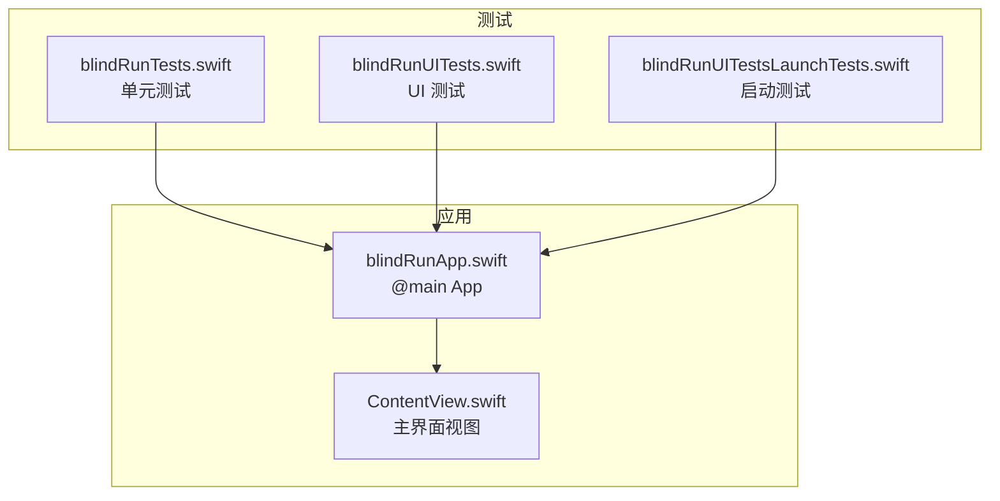
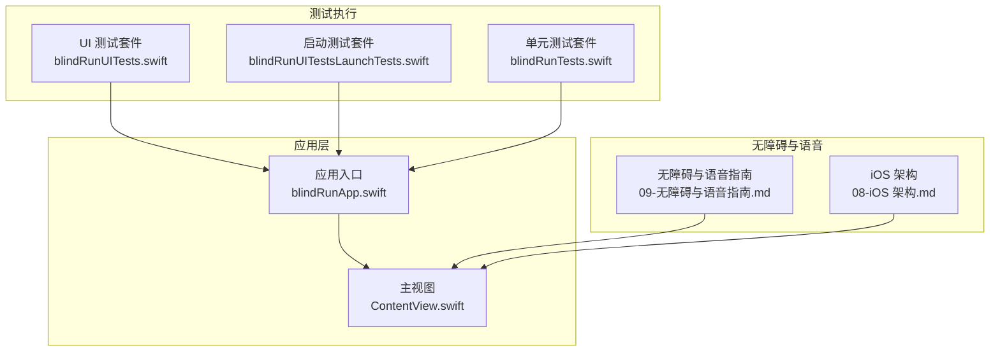
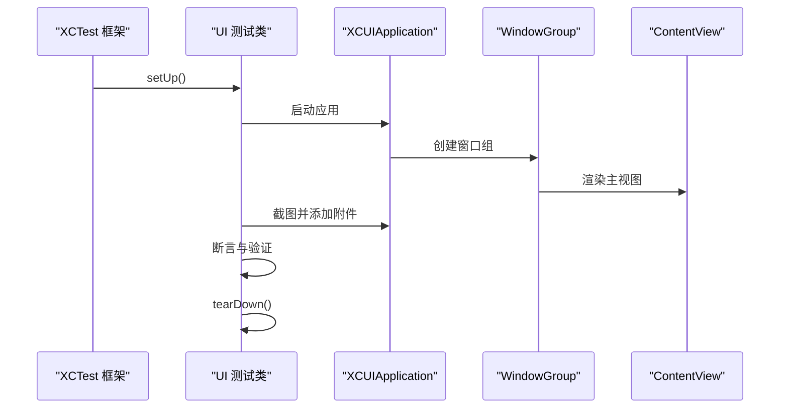
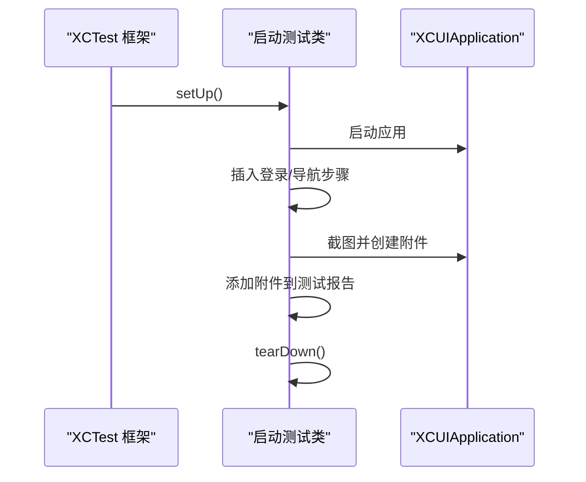
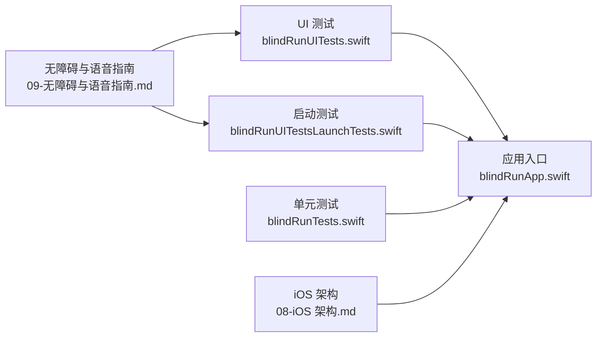

# UI 自动化测试

<cite>
**本文引用的文件**
- [blindRunTests.swift](file://blindRunTests/blindRunTests.swift)
- [blindRunUITests.swift](file://blindRunUITests/blindRunUITests.swift)
- [blindRunUITestsLaunchTests.swift](file://blindRunUITests/blindRunUITestsLaunchTests.swift)
- [ContentView.swift](file://blindRun/ContentView.swift)
- [blindRunApp.swift](file://blindRun/blindRunApp.swift)
- [09-无障碍与语音指南.md](file://docs/09-accessibility-and-voice-guidelines.md)
- [08-iOS 架构.md](file://docs/08-ios-architecture.md)
- [01-产品需求文档.md](file://docs/01-product-requirements.md)
- [xcschememanagement.plist](file://blindRun.xcodeproj/xcuserdata/jerry.xcuserdatad/xcschemes/xcschememanagement.plist)
</cite>

## 目录
1. [简介](#简介)
2. [项目结构](#项目结构)
3. [核心组件](#核心组件)
4. [架构总览](#架构总览)
5. [详细组件分析](#详细组件分析)
6. [依赖关系分析](#依赖关系分析)
7. [性能考量](#性能考量)
8. [故障排查指南](#故障排查指南)
9. [结论](#结论)
10. [附录](#附录)

## 简介
本文件为 blindRun 应用提供一套完整的 UI 自动化测试实施指南，覆盖 XCTest 与 SwiftUI 界面测试、Launch Tests 的实现与应用启动测试策略、无障碍功能测试（含 VoiceOver、屏幕阅读器兼容性与语音交互）、测试数据与环境配置、跨设备测试方法，以及最佳实践、维护策略与持续集成中的自动化流程建议。内容基于现有代码与文档，确保测试工程师能够快速落地并稳定运行 UI 自动化测试。

## 项目结构
blindRun 采用 SwiftUI + MVVM 架构，测试目录包含单元测试与 UI 测试两部分：
- 单元测试：位于 blindRunTests，用于验证业务逻辑与模型行为。
- UI 测试：位于 blindRunUITests，包含普通 UI 测试与启动测试（Launch Tests）。

图表来源
- [blindRunApp.swift:10-17](file://blindRun/blindRunApp.swift#L10-L17)
- [ContentView.swift:10-20](file://blindRun/ContentView.swift#L10-L20)
- [blindRunTests.swift:11-38](file://blindRunTests/blindRunTests.swift#L11-L38)
- [blindRunUITests.swift:10-43](file://blindRunUITests/blindRunUITests.swift#L10-L43)
- [blindRunUITestsLaunchTests.swift:10-35](file://blindRunUITests/blindRunUITestsLaunchTests.swift#L10-L35)

章节来源
- [blindRunApp.swift:10-17](file://blindRun/blindRunApp.swift#L10-L17)
- [ContentView.swift:10-20](file://blindRun/ContentView.swift#L10-L20)
- [blindRunTests.swift:11-38](file://blindRunTests/blindRunTests.swift#L11-L38)
- [blindRunUITests.swift:10-43](file://blindRunUITests/blindRunUITests.swift#L10-L43)
- [blindRunUITestsLaunchTests.swift:10-35](file://blindRunUITests/blindRunUITestsLaunchTests.swift#L10-L35)

## 核心组件
- 应用入口与主视图
  - 应用入口通过 SwiftUI App 协议定义窗口组并渲染主视图。
  - 主视图为一个简单的 VStack，包含系统图标与文本，用于演示与基础验证。
- 测试套件
  - 单元测试：提供基础 setUp/tearDown 与示例测试与性能测量模板。
  - UI 测试：提供应用启动、截图附件与启动耗时测量的模板。
  - 启动测试：提供启动后附加步骤与截图保存模板，支持针对目标应用 UI 配置的逐个运行。

章节来源
- [blindRunApp.swift:10-17](file://blindRun/blindRunApp.swift#L10-L17)
- [ContentView.swift:10-20](file://blindRun/ContentView.swift#L10-L20)
- [blindRunTests.swift:11-38](file://blindRunTests/blindRunTests.swift#L11-L38)
- [blindRunUITests.swift:10-43](file://blindRunUITests/blindRunUITests.swift#L10-L43)
- [blindRunUITestsLaunchTests.swift:10-35](file://blindRunUITests/blindRunUITestsLaunchTests.swift#L10-L35)

## 架构总览
下图展示了 UI 自动化测试在应用中的位置与调用关系，以及与无障碍与语音播报策略的关联。

图表来源
- [blindRunUITests.swift:25-42](file://blindRunUITests/blindRunUITests.swift#L25-L42)
- [blindRunUITestsLaunchTests.swift:20-34](file://blindRunUITests/blindRunUITestsLaunchTests.swift#L20-L34)
- [blindRunTests.swift:21-36](file://blindRunTests/blindRunTests.swift#L21-L36)
- [blindRunApp.swift:10-17](file://blindRun/blindRunApp.swift#L10-L17)
- [ContentView.swift:10-20](file://blindRun/ContentView.swift#L10-L20)
- [09-无障碍与语音指南.md:13-36](file://docs/09-accessibility-and-voice-guidelines.md#L13-L36)
- [08-iOS 架构.md:140-147](file://docs/08-ios-architecture.md#L140-L147)

## 详细组件分析

### UI 测试套件（blindRunUITests.swift）
- 目标
  - 验证应用启动、界面元素呈现与基本交互路径。
- 关键点
  - 在 setUp 中设置失败即停止，确保早期失败能快速反馈。
  - 使用 XCUIApplication 启动应用，并进行断言与截图附件。
  - 提供启动耗时测量指标，便于监控启动性能。
- 建议扩展
  - 在启动后添加登录或角色切换等前置步骤，确保进入目标页面。
  - 对关键页面添加元素识别与状态验证步骤（见无障碍指南中的标签与提示要求）。

图表来源
- [blindRunUITests.swift:12-34](file://blindRunUITests/blindRunUITests.swift#L12-L34)
- [blindRunApp.swift:12-16](file://blindRun/blindRunApp.swift#L12-L16)
- [ContentView.swift:10-20](file://blindRun/ContentView.swift#L10-L20)

章节来源
- [blindRunUITests.swift:10-43](file://blindRunUITests/blindRunUITests.swift#L10-L43)
- [blindRunApp.swift:10-17](file://blindRun/blindRunApp.swift#L10-L17)
- [ContentView.swift:10-20](file://blindRun/ContentView.swift#L10-L20)

### 启动测试套件（blindRunUITestsLaunchTests.swift）
- 目标
  - 验证应用启动过程与首屏截图，支持多目标 UI 配置逐个运行。
- 关键点
  - runsForEachTargetApplicationUIConfiguration 设置为 true，确保针对不同 UI 配置逐一执行。
  - 在启动后可插入登录或导航步骤，再进行截图与断言。
  - 截图附件设置为永久保留，便于 CI 回溯与人工复核。
- 建议扩展
  - 在启动后添加登录步骤，确保进入盲人端首页。
  - 针对不同主题（浅色/深色）与设备方向进行截图与状态验证。

图表来源
- [blindRunUITestsLaunchTests.swift:12-34](file://blindRunUITests/blindRunUITestsLaunchTests.swift#L12-L34)

章节来源
- [blindRunUITestsLaunchTests.swift:10-35](file://blindRunUITests/blindRunUITestsLaunchTests.swift#L10-L35)

### 单元测试套件（blindRunTests.swift）
- 目标
  - 验证业务逻辑与模型行为，为 UI 测试提供前置条件与数据支撑。
- 关键点
  - 提供性能测试模板，可用于测量关键函数执行时间。
  - 建议结合 API 环境与令牌存储策略，确保测试稳定性。

章节来源
- [blindRunTests.swift:11-38](file://blindRunTests/blindRunTests.swift#L11-L38)
- [08-iOS 架构.md:78-82](file://docs/08-ios-architecture.md#L78-L82)

### 视图元素识别与用户交互模拟
- 元素识别
  - 使用 accessibilityLabel 与 accessibilityHint 作为 VoiceOver 用户的主要导航依据。
  - 关键按钮与输入框需具备可读性与可听性，避免仅依赖视觉提示。
- 交互模拟
  - 使用 XCUIApplication 的元素查询与动作（如 tap、typeText、swipe）模拟用户操作。
  - 对于复杂交互，建议先断言元素存在与可交互，再执行动作。
- 状态验证
  - 结合无障碍指南中的关键播报节点，验证状态变更时的 TTS 与界面提示一致性。

章节来源
- [09-无障碍与语音指南.md:37-61](file://docs/09-accessibility-and-voice-guidelines.md#L37-L61)
- [09-无障碍与语音指南.md:13-36](file://docs/09-accessibility-and-voice-guidelines.md#L13-L36)

### Launch Tests 实现与应用启动测试策略
- 启动策略
  - 在启动后立即进行截图，记录首屏状态。
  - 可选地插入登录或角色切换步骤，确保进入目标页面后再截图。
- 性能监控
  - 使用启动耗时指标测量应用启动时间，定期回归以发现性能退化。
- 多配置支持
  - 利用 runsForEachTargetApplicationUIConfiguration 针对不同 UI 配置逐一运行，覆盖更多设备与系统组合。

章节来源
- [blindRunUITestsLaunchTests.swift:12-34](file://blindRunUITests/blindRunUITestsLaunchTests.swift#L12-L34)
- [blindRunUITests.swift:37-42](file://blindRunUITests/blindRunUITests.swift#L37-L42)

### 无障碍功能测试指南（VoiceOver、屏幕阅读器与语音交互）
- VoiceOver 导航
  - 确保所有关键按钮、输入框与状态文本具备 accessibilityLabel 与 accessibilityHint。
  - 遍历顺序应与视觉布局一致，避免误导用户。
- TTS 关键节点播报
  - 在关键状态变化时触发 TTS，如进入首页、订单提交成功、匹配中、志愿者已接单、志愿者已到达、请确认开始服务、服务已开始、服务已完成、进入求助状态、错误提示。
- 语音输入
  - 仅在文本输入场景启用语音输入，失败时提供错误提示并允许键盘输入作为降级方案。
- 大按钮与可读性
  - 关键按钮高度不低于 64pt，确保在浅色与深色模式下均具备良好对比度与可读性。

章节来源
- [09-无障碍与语音指南.md:5-11](file://docs/09-accessibility-and-voice-guidelines.md#L5-L11)
- [09-无障碍与语音指南.md:13-36](file://docs/09-accessibility-and-voice-guidelines.md#L13-L36)
- [09-无障碍与语音指南.md:37-61](file://docs/09-accessibility-and-voice-guidelines.md#L37-L61)
- [09-无障碍与语音指南.md:71-87](file://docs/09-accessibility-and-voice-guidelines.md#L71-L87)
- [09-无障碍与语音指南.md:140-147](file://docs/09-accessibility-and-voice-guidelines.md#L140-L147)

### 测试数据管理与环境配置
- API 环境
  - 支持 mock、localBackend、production 三种环境，便于在不同阶段使用假数据或真实后端。
- 令牌存储
  - MVP 使用 UserDefaults 存储 JWT，正式发布前需迁移到 Keychain。
- 高德地图密钥
  - 密钥存储在本地配置文件中，加入忽略列表，避免泄露；提供示例配置文件说明所需键名。
- 测试数据
  - 后端使用 H2 并在启动时填充种子数据，确保本地与局域网联调可用。

章节来源
- [08-iOS 架构.md:50-66](file://docs/08-ios-architecture.md#L50-L66)
- [08-iOS 架构.md:78-82](file://docs/08-ios-architecture.md#L78-L82)
- [08-iOS 架构.md:119-124](file://docs/08-ios-architecture.md#L119-L124)
- [01-产品需求文档.md:136-153](file://docs/01-product-requirements.md#L136-L153)

### 跨设备测试实施方法
- 设备与系统版本
  - 基于 iOS 16+ 的系统版本，覆盖 iPhone 与 iPad 的不同尺寸与方向。
- 主题与可读性
  - 在浅色与深色模式下分别运行测试，确保对比度与可读性满足无障碍要求。
- 截图与附件
  - 启动测试中生成截图并设置生命周期为 keepAlways，便于 CI 回溯与人工复核。

章节来源
- [01-产品需求文档.md:84-94](file://docs/01-product-requirements.md#L84-L94)
- [blindRunUITestsLaunchTests.swift:30-33](file://blindRunUITests/blindRunUITestsLaunchTests.swift#L30-L33)

## 依赖关系分析
- 组件耦合
  - UI 测试依赖应用入口与主视图；无障碍与语音策略指导测试用例设计。
  - 单元测试与 UI 测试相互补充，前者验证逻辑正确性，后者验证界面与交互。
- 外部依赖
  - XCTest 与 XCUITest 提供 UI 自动化能力；无障碍与语音能力依赖系统原生框架。
- 风险点
  - 启动后未进行登录或角色切换可能导致页面状态不一致，影响断言结果。
  - 无障碍标签缺失或不准确会导致 VoiceOver 用户无法正确导航。

图表来源
- [blindRunUITests.swift:10-43](file://blindRunUITests/blindRunUITests.swift#L10-L43)
- [blindRunUITestsLaunchTests.swift:10-35](file://blindRunUITests/blindRunUITestsLaunchTests.swift#L10-L35)
- [blindRunTests.swift:11-38](file://blindRunTests/blindRunTests.swift#L11-L38)
- [blindRunApp.swift:10-17](file://blindRun/blindRunApp.swift#L10-L17)
- [09-无障碍与语音指南.md:13-36](file://docs/09-accessibility-and-voice-guidelines.md#L13-L36)
- [08-iOS 架构.md:140-147](file://docs/08-ios-architecture.md#L140-L147)

章节来源
- [blindRunUITests.swift:10-43](file://blindRunUITests/blindRunUITests.swift#L10-L43)
- [blindRunUITestsLaunchTests.swift:10-35](file://blindRunUITests/blindRunUITestsLaunchTests.swift#L10-L35)
- [blindRunTests.swift:11-38](file://blindRunTests/blindRunTests.swift#L11-L38)
- [blindRunApp.swift:10-17](file://blindRun/blindRunApp.swift#L10-L17)
- [09-无障碍与语音指南.md:13-36](file://docs/09-accessibility-and-voice-guidelines.md#L13-L36)
- [08-iOS 架构.md:140-147](file://docs/08-ios-architecture.md#L140-L147)

## 性能考量
- 启动性能
  - 使用启动耗时指标定期回归，监控启动时间变化。
- UI 响应
  - 对复杂页面加载与交互路径进行性能测量，识别卡顿与延迟。
- 稳定性
  - 在 setUp 中设置失败即停止，缩短反馈链路；在 tearDown 中清理资源，避免跨用例干扰。

## 故障排查指南
- 启动失败
  - 检查应用入口与窗口组配置，确认主视图渲染正常。
  - 在启动测试中增加截图，定位首屏问题。
- 元素不可见或不可交互
  - 确认无障碍标签与提示完整，检查页面状态与导航路径。
  - 在 UI 测试中先断言元素存在与可交互，再执行动作。
- 无障碍标签缺失
  - 参考无障碍指南，为关键按钮、输入框与状态文本添加 accessibilityLabel 与 accessibilityHint。
- 令牌与环境配置
  - 确认当前使用的 API 环境与令牌存储策略符合预期，避免因环境切换导致接口调用失败。

章节来源
- [blindRunUITests.swift:12-19](file://blindRunUITests/blindRunUITests.swift#L12-L19)
- [blindRunUITestsLaunchTests.swift:16-18](file://blindRunUITests/blindRunUITestsLaunchTests.swift#L16-L18)
- [09-无障碍与语音指南.md:37-61](file://docs/09-accessibility-and-voice-guidelines.md#L37-L61)
- [08-iOS 架构.md:78-82](file://docs/08-ios-architecture.md#L78-L82)

## 结论
通过在现有测试套件基础上引入登录前置步骤、元素识别与状态验证、启动性能监控与截图附件、以及严格遵循无障碍与语音播报策略，blindRun 的 UI 自动化测试将能够稳定覆盖应用启动、关键页面与交互路径，并为持续集成提供可靠的回归保障。建议逐步完善测试矩阵，覆盖多设备、多主题与多环境组合，确保在 MVP 阶段即达到可演示的质量标准。

## 附录
- 项目 Scheme 配置
  - 当前项目 Scheme 状态由 Xcode 管理，确保测试目标与应用目标一致。
- 最佳实践清单
  - 在 setUp 中设置失败即停止，提升反馈效率。
  - 在启动测试中生成截图并保留，便于回溯与复核。
  - 严格遵循无障碍指南，确保 VoiceOver 用户可无障碍导航。
  - 使用启动耗时指标进行性能回归，定期评估启动表现。
  - 在不同主题与设备方向下运行测试，确保可读性与一致性。

章节来源
- [xcschememanagement.plist:4-12](file://blindRun.xcodeproj/xcuserdata/jerry.xcuserdatad/xcschemes/xcschememanagement.plist#L4-L12)