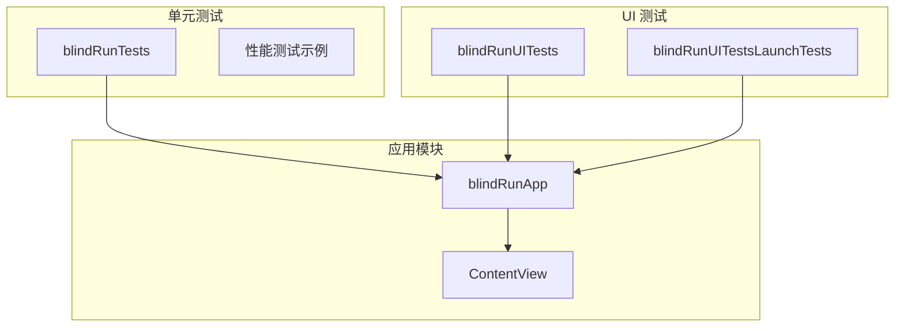
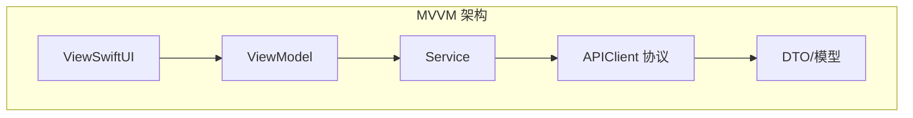
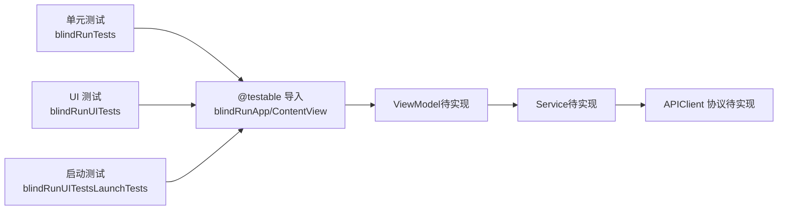

# 单元测试

<cite>
**本文引用的文件**
- [blindRunTests.swift](file://blindRunTests/blindRunTests.swift)
- [blindRunUITests.swift](file://blindRunUITests/blindRunUITests.swift)
- [blindRunUITestsLaunchTests.swift](file://blindRunUITests/blindRunUITestsLaunchTests.swift)
- [ContentView.swift](file://blindRun/ContentView.swift)
- [blindRunApp.swift](file://blindRun/blindRunApp.swift)
- [08-ios-architecture.md](file://docs/08-ios-architecture.md)
- [02-mvp-scope.md](file://docs/02-mvp-scope.md)
</cite>

## 目录
1. [简介](#简介)
2. [项目结构](#项目结构)
3. [核心组件](#核心组件)
4. [架构总览](#架构总览)
5. [详细组件分析](#详细组件分析)
6. [依赖关系分析](#依赖关系分析)
7. [性能考量](#性能考量)
8. [故障排查指南](#故障排查指南)
9. [结论](#结论)
10. [附录](#附录)

## 简介
本指南面向 blindRun iOS 应用的单元测试实施，围绕 XCTest 框架与 Swift 单元测试最佳实践展开，结合项目采用的 SwiftUI + MVVM 架构，系统讲解测试用例组织、setUp/tearDown 生命周期、SwiftUI 组件与 ViewModel 测试、Service 层与数据模型测试、Mock 对象（尤其是 APIClient 协议）的创建与使用、异步操作与错误处理测试、性能测试、测试数据准备、断言方法以及测试覆盖率建议。目标是帮助开发者建立高质量、可维护、可扩展的测试体系，确保核心业务逻辑与交互稳定性。

## 项目结构
blindRun 项目采用 SwiftUI + MVVM 架构，测试相关目录与文件如下：
- 单元测试：blindRunTests
  - 目标模块导入：@testable import blindRun
  - 示例测试类：blindRunTests
  - 性能测试示例：measure 块
- UI 测试：blindRunUITests
  - 目标应用启动与截图：XCUIApplication
  - 启动性能测量：XCTApplicationLaunchMetric
  - UI 测试生命周期：setUpWithError/tearDownWithError
- 应用入口与视图
  - 应用主入口：blindRunApp
  - 主视图：ContentView

图表来源
- [blindRunApp.swift:10-17](file://blindRun/blindRunApp.swift#L10-L17)
- [ContentView.swift:10-20](file://blindRun/ContentView.swift#L10-L20)
- [blindRunTests.swift:11-38](file://blindRunTests/blindRunTests.swift#L11-L38)
- [blindRunUITests.swift:10-43](file://blindRunUITests/blindRunUITests.swift#L10-L43)
- [blindRunUITestsLaunchTests.swift:10-35](file://blindRunUITests/blindRunUITestsLaunchTests.swift#L10-L35)

章节来源
- [blindRunApp.swift:10-17](file://blindRun/blindRunApp.swift#L10-L17)
- [ContentView.swift:10-20](file://blindRun/ContentView.swift#L10-L20)
- [blindRunTests.swift:11-38](file://blindRunTests/blindRunTests.swift#L11-L38)
- [blindRunUITests.swift:10-43](file://blindRunUITests/blindRunUITests.swift#L10-L43)
- [blindRunUITestsLaunchTests.swift:10-35](file://blindRunUITests/blindRunUITestsLaunchTests.swift#L10-L35)

## 核心组件
- 测试基类与生命周期
  - XCTestCase 提供 setUpWithError/tearDownWithError 生命周期钩子，用于初始化与清理。
  - 单元测试类示例：blindRunTests
  - UI 测试类示例：blindRunUITests、blindRunUITestsLaunchTests
- 性能测试
  - 使用 measure 块测量代码执行时间；UI 测试提供启动性能测量示例。
- 断言与异步
  - XCTest 提供丰富的断言方法；支持 throws 与 async 测试标注，便于测试异步与错误路径。
- @testable 导入
  - 将被测模块标记为 @testable，以便在测试中访问内部实现细节（如私有属性/方法），便于构造测试数据与验证行为。

章节来源
- [blindRunTests.swift:11-38](file://blindRunTests/blindRunTests.swift#L11-L38)
- [blindRunUITests.swift:10-43](file://blindRunUITests/blindRunUITests.swift#L10-L43)
- [blindRunUITestsLaunchTests.swift:10-35](file://blindRunUITests/blindRunUITestsLaunchTests.swift#L10-L35)

## 架构总览
基于文档的架构说明，blindRun 采用 SwiftUI + MVVM：
- View：负责渲染状态与转发用户意图
- ViewModel：持有加载/校验状态、API 调用、轮询、TTS 触发等
- Service：封装 API 与平台能力边界
- APIClient：统一协议，Mock 与真实实现共享调用点

图表来源
- [08-ios-architecture.md:33-48](file://docs/08-ios-architecture.md#L33-L48)
- [08-ios-architecture.md:68-82](file://docs/08-ios-architecture.md#L68-L82)

章节来源
- [08-ios-architecture.md:33-48](file://docs/08-ios-architecture.md#L33-L48)
- [08-ios-architecture.md:68-82](file://docs/08-ios-architecture.md#L68-L82)

## 详细组件分析

### 单元测试用例组织与生命周期
- 组织方式
  - 使用 XCTestCase 子类组织测试用例，每个测试方法独立、可并行执行。
  - 使用 setUpWithError 在每个测试前准备环境；tearDownWithError 在每个测试后清理。
- 建议实践
  - 将公共初始化逻辑放入 setUpWithError，避免重复代码。
  - 在 tearDownWithError 清理临时状态或资源，确保测试隔离性。
- 异步与错误
  - 对 throws/async 的测试方法使用 throws 标注，捕获未处理错误。
  - 对异步操作使用 await 或 measure 验证完成与性能。

章节来源
- [blindRunTests.swift:13-19](file://blindRunTests/blindRunTests.swift#L13-L19)
- [blindRunTests.swift:21-29](file://blindRunTests/blindRunTests.swift#L21-L29)

### SwiftUI 组件测试
- 目标
  - 验证视图渲染、状态变化、用户交互响应。
- 方法
  - 使用 PreviewProvider 或在测试中直接实例化视图，断言渲染结果与交互行为。
  - 对于依赖外部状态（如 ViewModel）的视图，通过注入 ViewModel 进行测试。
- 建议
  - 保持 View 轻薄，将复杂逻辑移至 ViewModel，便于单元测试。
  - 使用 @MainActor 标注涉及 UI 更新的方法，确保主线程断言。

章节来源
- [ContentView.swift:10-20](file://blindRun/ContentView.swift#L10-L20)
- [08-ios-architecture.md:35-39](file://docs/08-ios-architecture.md#L35-L39)

### ViewModel 测试
- 目标
  - 验证加载状态、校验状态、API 调用、轮询、TTS 触发等。
- 方法
  - 注入 Mock Service/APIClient，控制网络与平台行为。
  - 断言状态变化、事件触发与副作用。
- 建议
  - 将 ViewModel 的副作用（如 TTS、导航）抽象为可注入的服务接口，便于替换与测试。
  - 对轮询逻辑进行时间控制与停止条件验证。

章节来源
- [08-ios-architecture.md:33-48](file://docs/08-ios-architecture.md#L33-L48)

### Service 层与数据模型测试
- 目标
  - 验证 Service 的请求构建、响应解析、错误映射与重试策略。
- 方法
  - 使用 Mock APIClient，返回预设数据或错误，验证 Service 的处理逻辑。
  - 对数据模型进行序列化/反序列化测试，确保与后端契约一致。
- 建议
  - 保持 Service 无副作用，便于纯函数式测试。
  - 对错误路径进行充分覆盖，包括网络错误、解码错误、业务错误。

章节来源
- [08-ios-architecture.md:68-82](file://docs/08-ios-architecture.md#L68-L82)

### Mock 对象与 APIClient 协议
- 目标
  - 通过统一的 APIClient 协议，提供 Mock 实现以隔离网络依赖。
- 方法
  - 定义 APIClient 协议，暴露请求构建、鉴权、解码与错误映射职责。
  - 在测试中实现该协议，返回固定数据或抛出特定错误，验证调用点行为。
- 建议
  - 为不同测试场景提供多种 Mock 实现（成功、失败、超时、鉴权失败）。
  - 保持 Mock 的简单性与可控性，避免过度复杂导致测试脆弱。

章节来源
- [08-ios-architecture.md:68-82](file://docs/08-ios-architecture.md#L68-L82)

### 异步操作测试
- 目标
  - 验证异步任务（网络请求、定时轮询、UI 更新）的正确性与性能。
- 方法
  - 使用 await 等待异步完成，断言最终状态。
  - 使用 measure 块测量异步操作耗时，确保性能达标。
- 建议
  - 对轮询逻辑设置上限与停止条件，避免无限等待。
  - 对 UI 更新使用 @MainActor，确保断言在主线程执行。

章节来源
- [blindRunTests.swift:21-29](file://blindRunTests/blindRunTests.swift#L21-L29)
- [08-ios-architecture.md:125-139](file://docs/08-ios-architecture.md#L125-L139)

### 错误处理测试
- 目标
  - 验证错误路径、错误映射与用户提示。
- 方法
  - 通过 Mock 返回错误，断言错误类型、用户提示与日志记录。
  - 对网络错误、鉴权失败、业务错误分别进行测试。
- 建议
  - 将错误映射集中处理，便于测试与维护。
  - 对 TTS 错误播报进行覆盖，确保无障碍体验。

章节来源
- [08-ios-architecture.md:70-76](file://docs/08-ios-architecture.md#L70-L76)

### 性能测试
- 目标
  - 评估关键路径的执行时间与内存占用，确保用户体验流畅。
- 方法
  - 使用 measure 块测量函数执行时间；UI 测试使用 XCTApplicationLaunchMetric 测量启动性能。
- 建议
  - 选择代表性场景进行性能测试，避免过度测量。
  - 结合异步测试，关注轮询与 UI 刷新的性能影响。

章节来源
- [blindRunTests.swift:31-36](file://blindRunTests/blindRunTests.swift#L31-L36)
- [blindRunUITests.swift:37-42](file://blindRunUITests/blindRunUITests.swift#L37-L42)

### 测试数据准备与断言方法
- 测试数据
  - 使用固定数据或工厂方法生成测试数据，确保可重复性。
  - 对 Mock 数据进行边界值与异常值覆盖。
- 断言
  - 使用 XCTAssert 系列断言验证结果；对集合使用 count/isEmpty 等断言。
  - 对异步结果使用 eventually 断言或轮询断言。
- 覆盖率
  - 建议关键业务路径覆盖率不低于 80%，核心 ViewModel 与 Service 达到 90%+。
  - 对错误路径与边界条件进行充分覆盖。

章节来源
- [blindRunTests.swift:21-29](file://blindRunTests/blindRunTests.swift#L21-L29)
- [02-mvp-scope.md:119-133](file://docs/02-mvp-scope.md#L119-L133)

### UI 测试与启动测试
- 目标
  - 验证应用启动、界面布局与基本交互。
- 方法
  - 使用 XCUIApplication 启动应用，断言界面元素与交互。
  - 使用截图附件记录启动画面，便于回归检查。
- 建议
  - 在 setUp 中设置 continueAfterFailure=false，快速失败。
  - 对关键页面截图并持久保存，便于对比 UI 变更。

章节来源
- [blindRunUITests.swift:12-19](file://blindRunUITests/blindRunUITests.swift#L12-L19)
- [blindRunUITests.swift:25-34](file://blindRunUITests/blindRunUITests.swift#L25-L34)
- [blindRunUITestsLaunchTests.swift:16-18](file://blindRunUITests/blindRunUITestsLaunchTests.swift#L16-L18)
- [blindRunUITestsLaunchTests.swift:20-34](file://blindRunUITests/blindRunUITestsLaunchTests.swift#L20-L34)

## 依赖关系分析
- 测试与被测模块
  - 单元测试通过 @testable import 访问被测模块内部实现，便于构造与验证。
- 测试与 UI
  - UI 测试通过 XCUIApplication 控制应用，验证启动与界面交互。
- 测试与网络
  - 通过 APIClient 协议抽象网络层，测试中注入 Mock 实现，隔离外部依赖。

图表来源
- [blindRunTests.swift:8-9](file://blindRunTests/blindRunTests.swift#L8-L9)
- [blindRunUITests.swift:8](file://blindRunUITests/blindRunUITests.swift#L8)
- [blindRunUITestsLaunchTests.swift:8](file://blindRunUITests/blindRunUITestsLaunchTests.swift#L8)
- [08-ios-architecture.md:33-48](file://docs/08-ios-architecture.md#L33-L48)
- [08-ios-architecture.md:68-82](file://docs/08-ios-architecture.md#L68-L82)

章节来源
- [blindRunTests.swift:8-9](file://blindRunTests/blindRunTests.swift#L8-L9)
- [blindRunUITests.swift:8](file://blindRunUITests/blindRunUITests.swift#L8)
- [blindRunUITestsLaunchTests.swift:8](file://blindRunUITests/blindRunUITestsLaunchTests.swift#L8)
- [08-ios-architecture.md:33-48](file://docs/08-ios-architecture.md#L33-L48)
- [08-ios-architecture.md:68-82](file://docs/08-ios-architecture.md#L68-L82)

## 性能考量
- 关键指标
  - 启动时间：使用 XCTApplicationLaunchMetric 测量。
  - 业务关键路径：使用 measure 块测量 ViewModel/Service 的执行时间。
- 优化建议
  - 减少主线程阻塞，将耗时操作移至后台队列。
  - 对轮询频率与停止条件进行合理设计，避免频繁网络请求。
  - 对 UI 更新进行节流，减少不必要的重绘。

章节来源
- [blindRunUITests.swift:37-42](file://blindRunUITests/blindRunUITests.swift#L37-L42)
- [blindRunTests.swift:31-36](file://blindRunTests/blindRunTests.swift#L31-L36)
- [08-ios-architecture.md:125-139](file://docs/08-ios-architecture.md#L125-L139)

## 故障排查指南
- 常见问题
  - 测试未断言：确保每个测试都有明确断言，避免“空测试”。
  - 异步测试失败：使用 await 或 measure，确保等待完成再断言。
  - UI 测试不稳定：设置 continueAfterFailure=false，确保失败快速暴露。
  - Mock 数据不一致：使用固定数据或工厂方法，确保可重复性。
- 建议
  - 对错误路径进行充分测试，包括网络错误、鉴权失败、业务错误。
  - 对 TTS 与无障碍功能进行覆盖，确保用户体验一致性。

章节来源
- [blindRunUITests.swift:15-16](file://blindRunUITests/blindRunUITests.swift#L15-L16)
- [blindRunUITestsLaunchTests.swift:17](file://blindRunUITests/blindRunUITestsLaunchTests.swift#L17)
- [08-ios-architecture.md:70-76](file://docs/08-ios-architecture.md#L70-L76)

## 结论
通过本指南，开发者可以基于 XCTest 框架与 SwiftUI + MVVM 架构，系统地构建单元测试与 UI 测试体系。重点在于：清晰的测试用例组织、完善的 setUp/tearDown 生命周期、针对 ViewModel 与 Service 的 Mock 测试、对异步与错误路径的覆盖、以及性能与覆盖率的持续改进。建议在项目早期即引入测试规范，确保核心业务逻辑与交互的稳定性与可维护性。

## 附录
- 测试覆盖率建议
  - 关键业务路径：≥80%
  - 核心 ViewModel/Service：≥90%
  - 错误路径与边界条件：充分覆盖
- 最佳实践清单
  - 使用 @testable 导入，隔离外部依赖
  - 通过 APIClient 协议抽象网络层，便于 Mock
  - 对异步与 UI 更新进行主线程断言
  - 使用 measure 块进行性能测试
  - 在 UI 测试中记录关键页面截图