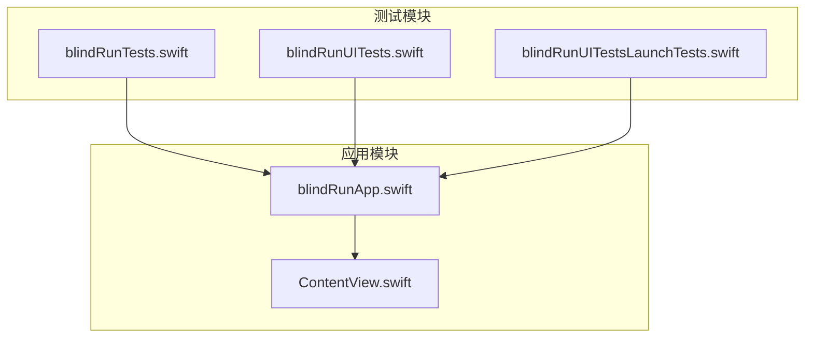
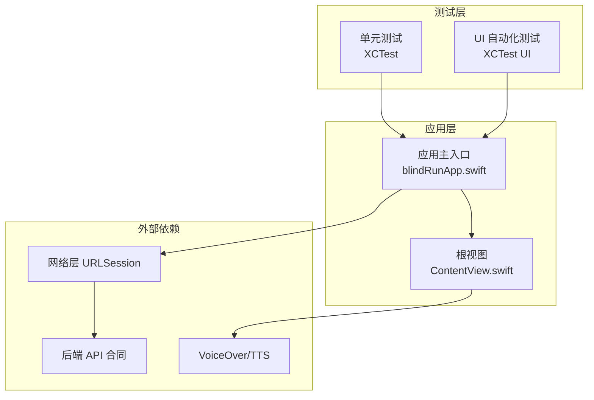
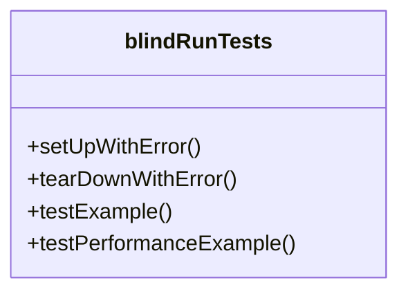
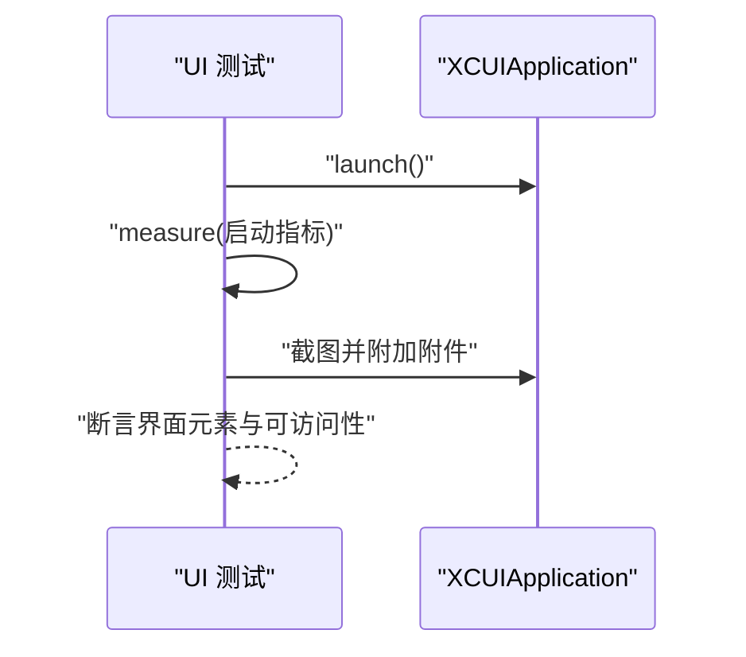
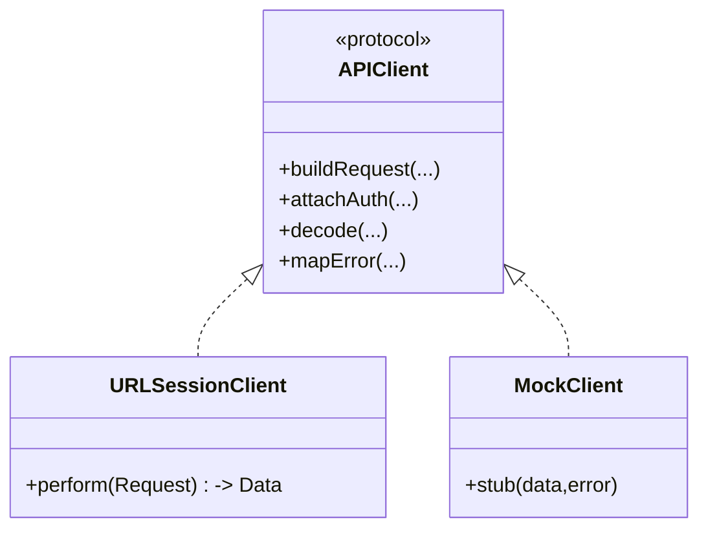
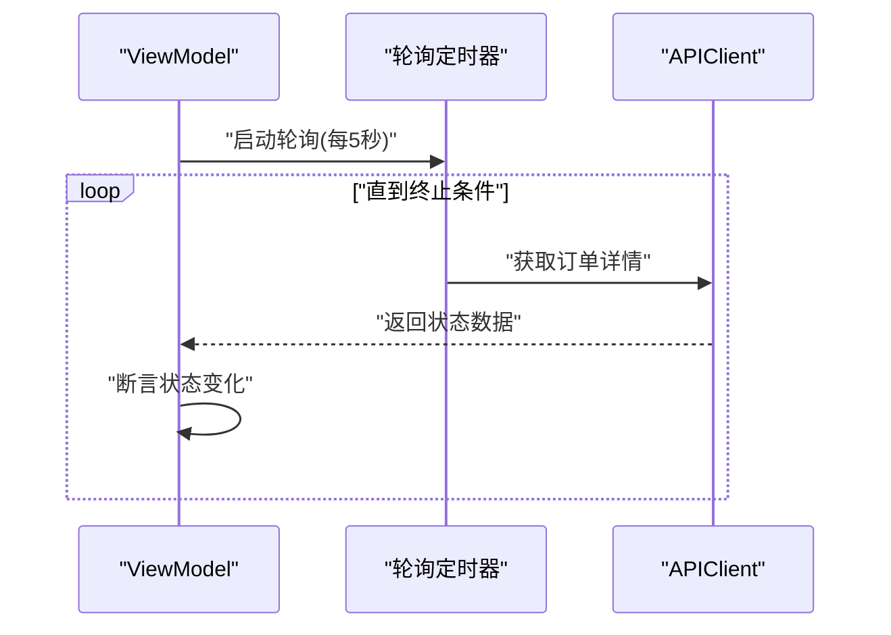
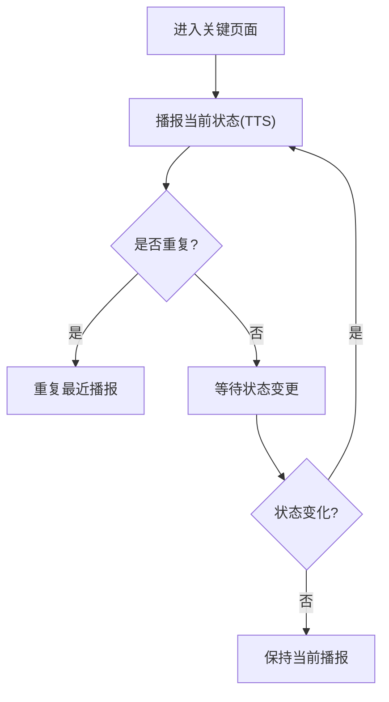
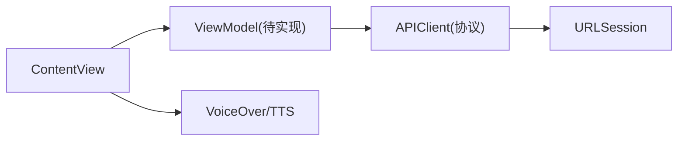

# 测试策略

<cite>
**本文引用的文件**
- [blindRunTests.swift](file://blindRunTests/blindRunTests.swift)
- [blindRunUITests.swift](file://blindRunUITests/blindRunUITests.swift)
- [blindRunUITestsLaunchTests.swift](file://blindRunUITests/blindRunUITestsLaunchTests.swift)
- [ContentView.swift](file://blindRun/ContentView.swift)
- [blindRunApp.swift](file://blindRun/blindRunApp.swift)
- [08-ios-architecture.md](file://docs/08-ios-architecture.md)
- [09-accessibility-and-voice-guidelines.md](file://docs/09-accessibility-and-voice-guidelines.md)
- [07-api-contract.openapi.yaml](file://docs/07-api-contract.openapi.yaml)
- [.gitignore](file://.gitignore)
</cite>

## 目录
1. [引言](#引言)
2. [项目结构](#项目结构)
3. [核心组件](#核心组件)
4. [架构总览](#架构总览)
5. [详细组件分析](#详细组件分析)
6. [依赖关系分析](#依赖关系分析)
7. [性能考量](#性能考量)
8. [故障排查指南](#故障排查指南)
9. [结论](#结论)
10. [附录](#附录)

## 引言
本测试策略文档面向 blindRun iOS 应用，旨在为测试工程师与开发者提供一套系统化的测试实施指南，覆盖单元测试、集成测试与 UI 自动化测试。文档结合现有项目结构与官方架构/无障碍规范，明确测试框架选择、用例设计原则、覆盖率目标、Mock 与测试数据准备、异步与网络测试方法、无障碍与语音测试要点，以及在持续集成中的自动化流程与质量门禁建议。

## 项目结构
blindRun 当前处于早期原型阶段，包含最小可用应用与基础测试模板：
- 应用入口与视图：应用主入口与一个简单视图，便于验证启动与渲染。
- 单元测试与 UI 测试：XCTest 模板类，分别用于逻辑与界面自动化。
- 文档：iOS 架构、无障碍与语音规范、API 合同等，为测试设计提供依据。

图表来源
- [blindRunApp.swift:1-18](file://blindRun/blindRunApp.swift#L1-L18)
- [ContentView.swift:1-25](file://blindRun/ContentView.swift#L1-L25)
- [blindRunTests.swift:1-39](file://blindRunTests/blindRunTests.swift#L1-L39)
- [blindRunUITests.swift:1-44](file://blindRunUITests/blindRunUITests.swift#L1-L44)
- [blindRunUITestsLaunchTests.swift:1-36](file://blindRunUITests/blindRunUITestsLaunchTests.swift#L1-L36)

章节来源
- [blindRunApp.swift:1-18](file://blindRun/blindRunApp.swift#L1-L18)
- [ContentView.swift:1-25](file://blindRun/ContentView.swift#L1-L25)
- [blindRunTests.swift:1-39](file://blindRunTests/blindRunTests.swift#L1-L39)
- [blindRunUITests.swift:1-44](file://blindRunUITests/blindRunUITests.swift#L1-L44)
- [blindRunUITestsLaunchTests.swift:1-36](file://blindRunUITests/blindRunUITestsLaunchTests.swift#L1-L36)

## 核心组件
- 应用入口与视图
  - 应用主入口负责窗口组与根视图绑定。
  - 根视图为简单布局，包含图像与文本，便于 UI 测试与可访问性检查。
- 测试套件
  - 单元测试：基于 XCTest，支持同步与异步测试、性能测量。
  - UI 测试：基于 XCTest UI 测试，包含启动性能测量与截图附件。
- 架构与 API 规范
  - iOS 架构采用 SwiftUI + MVVM，网络层基于 URLSession，支持多环境（mock/localBackend/production）切换。
  - API 合同定义了鉴权、用户、资料、志愿者与订单等端点，为网络层与集成测试提供契约依据。
- 无障碍与语音规范
  - 明确 TTS 节点、VoiceOver 标签与高对比度按钮等要求，指导可访问性测试。

章节来源
- [blindRunApp.swift:10-17](file://blindRun/blindRunApp.swift#L10-L17)
- [ContentView.swift:10-24](file://blindRun/ContentView.swift#L10-L24)
- [blindRunTests.swift:11-38](file://blindRunTests/blindRunTests.swift#L11-L38)
- [blindRunUITests.swift:10-43](file://blindRunUITests/blindRunUITests.swift#L10-L43)
- [blindRunUITestsLaunchTests.swift:10-35](file://blindRunUITests/blindRunUITestsLaunchTests.swift#L10-L35)
- [08-ios-architecture.md:33-82](file://docs/08-ios-architecture.md#L33-L82)
- [07-api-contract.openapi.yaml:25-411](file://docs/07-api-contract.openapi.yaml#L25-L411)
- [09-accessibility-and-voice-guidelines.md:13-138](file://docs/09-accessibility-and-voice-guidelines.md#L13-L138)

## 架构总览
下图展示了应用、测试与外部依赖的关系，以及测试在整体架构中的位置。

图表来源
- [blindRunApp.swift:10-17](file://blindRun/blindRunApp.swift#L10-L17)
- [ContentView.swift:10-24](file://blindRun/ContentView.swift#L10-L24)
- [08-ios-architecture.md:68-82](file://docs/08-ios-architecture.md#L68-L82)
- [07-api-contract.openapi.yaml:1-24](file://docs/07-api-contract.openapi.yaml#L1-L24)
- [09-accessibility-and-voice-guidelines.md:37-138](file://docs/09-accessibility-and-voice-guidelines.md#L37-L138)

## 详细组件分析

### 单元测试策略
- 测试框架：XCTest（SwiftUI + MVVM 架构天然利于单元测试）。
- 设计原则
  - 针对 ViewModel 的状态变更、业务逻辑与异步轮询进行断言。
  - 使用 @MainActor 标注涉及 UI 更新的方法，确保在主线程断言。
  - 将网络层抽象为可注入的协议，便于替换为 Mock 实现。
- 覆盖率目标
  - 关键路径：登录、角色切换、订单状态轮询、危险操作确认。
  - 边界条件：空值、无效参数、鉴权失败、网络异常。
- 性能测试
  - 使用 measure 包裹耗时逻辑，监控 ViewModel 初始化、数据解析与 UI 渲染。

图表来源
- [blindRunTests.swift:11-38](file://blindRunTests/blindRunTests.swift#L11-L38)

章节来源
- [blindRunTests.swift:11-38](file://blindRunTests/blindRunTests.swift#L11-L38)
- [08-ios-architecture.md:33-48](file://docs/08-ios-architecture.md#L33-L48)

### UI 自动化测试策略
- 测试框架：XCTest UI 测试。
- 设计原则
  - 启动即断言：设置 continueAfterFailure=false，确保失败快速反馈。
  - 启动性能：使用应用启动指标测量启动耗时。
  - 截图附件：保留关键启动画面，便于回归对比。
- 覆盖范围
  - 应用启动流程、主界面渲染、可访问性标签与交互。
- 最佳实践
  - 在 setUp 中统一设置初始状态（如方向），避免跨用例干扰。
  - 使用稳定的元素标识与可访问性标签进行查找。

图表来源
- [blindRunUITests.swift:25-42](file://blindRunUITests/blindRunUITests.swift#L25-L42)
- [blindRunUITestsLaunchTests.swift:20-34](file://blindRunUITests/blindRunUITestsLaunchTests.swift#L20-L34)

章节来源
- [blindRunUITests.swift:10-43](file://blindRunUITests/blindRunUITests.swift#L10-L43)
- [blindRunUITestsLaunchTests.swift:10-35](file://blindRunUITests/blindRunUITestsLaunchTests.swift#L10-L35)

### SwiftUI 组件测试
- 目标：验证视图渲染、状态变化与可访问性属性。
- 方法
  - 使用预览与 @PreviewProvider 验证静态内容。
  - 在单元测试中实例化视图并断言布局与样式。
  - 使用 Accessibility Inspector 检查标签、提示与 trait。
- 关注点
  - 主按钮高度、对比度与可点击区域。
  - 每个关键控件的 accessibilityLabel/accessibilityHint。
  - “重复当前状态”按钮的行为一致性。

图表来源
- [ContentView.swift:10-24](file://blindRun/ContentView.swift#L10-L24)
- [09-accessibility-and-voice-guidelines.md:37-70](file://docs/09-accessibility-and-voice-guidelines.md#L37-L70)

章节来源
- [ContentView.swift:10-24](file://blindRun/ContentView.swift#L10-L24)
- [09-accessibility-and-voice-guidelines.md:37-70](file://docs/09-accessibility-and-voice-guidelines.md#L37-L70)

### 网络层测试
- 框架与职责
  - URLSession + async/await；APIClient 协议封装请求构建、鉴权头、响应解码与错误映射。
  - 支持 mock/localBackend/production 三环境切换。
- 测试策略
  - 协议驱动：以 APIClient 作为依赖注入点，替换为 Mock 实现。
  - 契约驱动：依据 API 合同编写端到端场景（登录、角色切换、订单 CRUD、轮询）。
  - 错误路径：模拟 401、400、409 等错误码，验证用户提示与 TTS。
- 覆盖范围
  - 请求构建、鉴权头、JSON 编解码、重试策略、环境切换。

图表来源
- [08-ios-architecture.md:68-82](file://docs/08-ios-architecture.md#L68-L82)
- [07-api-contract.openapi.yaml:25-411](file://docs/07-api-contract.openapi.yaml#L25-L411)

章节来源
- [08-ios-architecture.md:50-82](file://docs/08-ios-architecture.md#L50-L82)
- [07-api-contract.openapi.yaml:25-411](file://docs/07-api-contract.openapi.yaml#L25-L411)

### 异步操作测试
- 轮询与定时任务
  - 订单状态页面按固定周期轮询，需在测试中控制时间推进与断言。
  - 使用 TestExpectation 或自定义时序控制器，避免真实等待。
- 并发与线程
  - 使用 @MainActor 标注 UI 相关断言，确保在主线程执行。
  - 对后台任务进行隔离，避免竞态条件。

图表来源
- [08-ios-architecture.md:125-139](file://docs/08-ios-architecture.md#L125-L139)

章节来源
- [08-ios-architecture.md:125-139](file://docs/08-ios-architecture.md#L125-L139)

### 无障碍与语音测试
- TTS 要求
  - 必须播报节点清单与“重复当前状态”按钮行为。
  - 避免轮询期间重复播报，维护状态记忆。
- VoiceOver 要求
  - 每个关键控件具备 accessibilityLabel/accessibilityHint 与正确 trait。
  - 主页、订单页、志愿者页均需覆盖。
- 语音输入
  - 仅在用户发起时申请麦克风权限，失败时允许键盘输入。

图表来源
- [09-accessibility-and-voice-guidelines.md:13-36](file://docs/09-accessibility-and-voice-guidelines.md#L13-L36)

章节来源
- [09-accessibility-and-voice-guidelines.md:13-36](file://docs/09-accessibility-and-voice-guidelines.md#L13-L36)

## 依赖关系分析
- 组件耦合
  - 视图与 ViewModel 低耦合，便于独立测试。
  - 网络层通过协议注入，支持 Mock 替换。
- 外部依赖
  - URLSession 与 AVFoundation（TTS）、Speech（语音输入）。
  - 高德地图 SDK（地图与定位桥接）。
- 风险点
  - 真实网络与定位权限可能影响测试稳定性，建议在 CI 中使用模拟环境。

图表来源
- [08-ios-architecture.md:33-48](file://docs/08-ios-architecture.md#L33-L48)
- [09-accessibility-and-voice-guidelines.md:13-36](file://docs/09-accessibility-and-voice-guidelines.md#L13-L36)

章节来源
- [08-ios-architecture.md:33-48](file://docs/08-ios-architecture.md#L33-L48)
- [09-accessibility-and-voice-guidelines.md:13-36](file://docs/09-accessibility-and-voice-guidelines.md#L13-L36)

## 性能考量
- 启动性能
  - 使用应用启动指标测量冷启动/热启动时间，设定阈值。
- UI 渲染
  - 避免在主线程执行重计算；对复杂视图进行懒加载与缓存。
- 网络与轮询
  - 控制轮询频率与并发数量，避免过度请求导致卡顿。
- 测试性能
  - 在单元测试中使用 measure 包裹热点路径，识别回归。

## 故障排查指南
- 常见问题
  - UI 测试失败：检查元素标识与可访问性标签，确认 setUp 初始化。
  - 启动失败：核对环境配置与截图附件命名。
  - 无障碍告警：补充缺失的 accessibilityLabel/accessibilityHint。
- 定位手段
  - 使用 XCTest 截图附件与日志输出。
  - 在 CI 中启用详细日志与失败快照。
- 回归预防
  - 将关键 UI 与可访问性检查纳入每日流水线。

章节来源
- [blindRunUITests.swift:12-19](file://blindRunUITests/blindRunUITests.swift#L12-L19)
- [blindRunUITestsLaunchTests.swift:16-18](file://blindRunUITests/blindRunUITestsLaunchTests.swift#L16-L18)
- [09-accessibility-and-voice-guidelines.md:37-61](file://docs/09-accessibility-and-voice-guidelines.md#L37-L61)

## 结论
blindRun 当前处于早期原型阶段，测试策略应以“可验证、可回归、可扩展”为目标。建议优先补齐 ViewModel 与网络层的单元测试，完善 UI 自动化与可访问性测试，并在 CI 中引入启动性能与可访问性检查。随着功能演进，逐步增加集成测试与端到端场景，确保在 mock/localBackend/production 三环境下的一致性。

## 附录

### 测试用例设计原则
- 契约驱动：以 API 合同为边界，覆盖成功与失败路径。
- 可观测性：为关键路径添加日志与断言，便于定位问题。
- 可重复性：使用稳定的数据与环境，避免随机性。

章节来源
- [07-api-contract.openapi.yaml:25-411](file://docs/07-api-contract.openapi.yaml#L25-L411)

### 覆盖率要求（建议）
- 单元测试：核心 ViewModel 与工具函数 >80%，关键分支与异常路径全覆盖。
- 集成测试：网络层与关键业务流程 >70%。
- UI 测试：关键页面与可访问性 >90%。
- 启动性能：冷启动时间 <5s，热启动 <1s。

章节来源
- [08-ios-architecture.md:50-82](file://docs/08-ios-architecture.md#L50-L82)
- [09-accessibility-and-voice-guidelines.md:13-36](file://docs/09-accessibility-and-voice-guidelines.md#L13-L36)

### 测试数据准备与 Mock 对象
- 测试数据
  - 使用固定示例数据（如固定电话号码、验证码、订单状态枚举）。
  - 为不同场景准备正反例数据集。
- Mock 对象
  - 以 APIClient 协议为中心，提供 Mock URLSessionClient 与 Mock API 实现。
  - 使用 TestExpectation 或时序控制器模拟异步结果。

章节来源
- [08-ios-architecture.md:68-82](file://docs/08-ios-architecture.md#L68-L82)

### 测试环境配置
- 环境切换
  - 在 Debug 构建中暴露环境选择器，支持 mock/localBackend/production。
  - 本地后端支持局域网 IP，便于联调。
- 配置管理
  - 高德地图密钥存储于本地配置文件，加入 .gitignore。
  - 提供示例配置文件，标注所需键名。

章节来源
- [08-ios-architecture.md:50-82](file://docs/08-ios-architecture.md#L50-L82)
- [.gitignore:59-62](file://.gitignore#L59-L62)

### 持续集成与质量门禁
- 流水线建议
  - 构建：编译 Debug/Release 构建。
  - 单元测试：运行 XCTest，生成覆盖率报告。
  - UI 测试：在模拟器上运行 UI 测试，上传截图附件。
  - 可访问性检查：集成 Accessibility Inspector 规则。
  - 性能基线：比较启动指标与关键路径耗时。
- 质量门禁
  - 覆盖率阈值：单元测试 >80%，集成测试 >70%。
  - 可访问性：零告警。
  - 启动性能：冷启动 ≤5s，热启动 ≤1s。
  - 失败即阻断：任何测试失败阻止合并。

章节来源
- [blindRunUITests.swift:15-16](file://blindRunUITests/blindRunUITests.swift#L15-L16)
- [09-accessibility-and-voice-guidelines.md:131-139](file://docs/09-accessibility-and-voice-guidelines.md#L131-L139)