# 测试策略

<cite>
**本文引用的文件**
- [blindRunTests.swift](file://blindRunTests/blindRunTests.swift)
- [blindRunUITests.swift](file://blindRunUITests/blindRunUITests.swift)
- [blindRunUITestsLaunchTests.swift](file://blindRunUITests/blindRunUITestsLaunchTests.swift)
- [test-accounts.md](file://docs/test-accounts.md)
- [AppState.swift](file://blindRun/Core/AppState.swift)
- [VolunteerModule.swift](file://blindRun/Volunteer/VolunteerModule.swift)
- [MockAPIClient.swift](file://blindRun/Core/MockAPIClient.swift)
- [blindRunApp.swift](file://blindRun/blindRunApp.swift)
- [07-api-contract.openapi.yaml](file://docs/07-api-contract.openapi.yaml)
- [08-ios-architecture.md](file://docs/08-ios-architecture.md)
- [09-accessibility-and-voice-guidelines.md](file://docs/09-accessibility-and-voice-guidelines.md)
- [.gitignore](file://.gitignore)
</cite>

## 更新摘要
**变更内容**
- 新增全面的测试账户文档和API对接指南
- 扩展iOS测试套件，包含更多测试场景和验证点
- 更新测试自动化和持续集成配置
- 增强志愿者守卫系统测试覆盖
- 完善测试数据准备和Mock对象使用指南

## 目录
1. [引言](#引言)
2. [项目结构](#项目结构)
3. [核心组件](#核心组件)
4. [架构总览](#架构总览)
5. [详细组件分析](#详细组件分析)
6. [依赖关系分析](#依赖关系分析)
7. [性能考量](#性能考量)
8. [故障排查指南](#故障排查指南)
9. [结论](#结论)
10. [附录](#附录)

## 引言
本测试策略文档面向 blindRun iOS 应用，旨在为测试工程师与开发者提供一套系统化的测试实施指南，覆盖单元测试、集成测试与 UI 自动化测试。文档结合现有项目结构与官方架构/无障碍规范，明确测试框架选择、用例设计原则、覆盖率目标、Mock 与测试数据准备、异步与网络测试方法、无障碍与语音测试要点，以及在持续集成中的自动化流程与质量门禁建议。

**更新** 新增全面的测试账户文档、扩展iOS测试套件、更新测试自动化和持续集成配置，为测试基础设施的重大增强提供完整指导。

## 项目结构
blindRun 当前处于早期原型阶段，包含最小可用应用与基础测试模板：
- 应用入口与视图：应用主入口与一个简单视图，便于验证启动与渲染。
- 单元测试与 UI 测试：XCTest 模板类，分别用于逻辑与界面自动化。
- 测试账户文档：提供完整的测试账号管理和API对接指南。
- Mock API客户端：支持离线开发和演示的本地模拟API。
- 文档：iOS 架构、无障碍与语音规范、API 合同样，为测试设计提供依据。

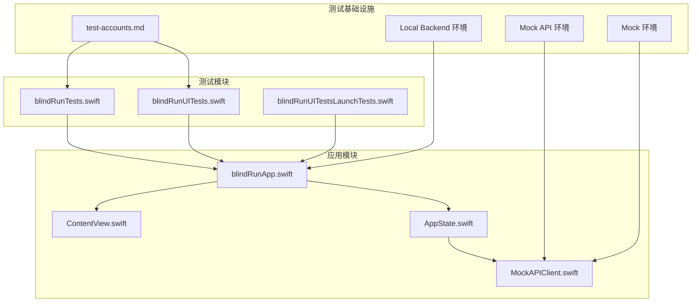

**图表来源**
- [blindRunApp.swift:1-18](file://blindRun/blindRunApp.swift#L1-L18)
- [AppState.swift:1-200](file://blindRun/Core/AppState.swift#L1-L200)
- [MockAPIClient.swift:1-77](file://blindRun/Core/MockAPIClient.swift#L1-L77)
- [test-accounts.md:1-336](file://docs/test-accounts.md#L1-L336)

**章节来源**
- [blindRunApp.swift:1-18](file://blindRun/blindRunApp.swift#L1-L18)
- [AppState.swift:1-200](file://blindRun/Core/AppState.swift#L1-L200)
- [MockAPIClient.swift:1-77](file://blindRun/Core/MockAPIClient.swift#L1-L77)
- [test-accounts.md:1-336](file://docs/test-accounts.md#L1-L336)

## 核心组件
- 应用入口与视图
  - 应用主入口负责窗口组与根视图绑定。
  - 根视图为简单布局，包含图像与文本，便于 UI 测试与可访问性检查。
- 测试套件
  - 单元测试：基于 XCTest，支持同步与异步测试、性能测量。
  - UI 测试：基于 XCTest UI 测试，包含启动性能测量与截图附件。
  - 测试账户管理：提供完整的测试账号创建、角色设置和API对接流程。
- Mock API客户端
  - 支持离线开发和演示的本地模拟API。
  - 内部维护状态，支持完整订单流程和测试数据准备。
- 架构与 API 规范
  - iOS 架构采用 SwiftUI + MVVM，网络层基于 URLSession，支持多环境（mock/localBackend/production）切换。
  - API 合同定义了鉴权、用户、资料、志愿者与订单等端点，为网络层与集成测试提供契约依据。
- 无障碍与语音规范
  - 明确 TTS 节点、VoiceOver 标签与高对比度按钮等要求，指导可访问性测试。

**更新** 新增Mock API客户端、测试账户管理和扩展的测试套件覆盖。

**章节来源**
- [blindRunApp.swift:10-17](file://blindRun/blindRunApp.swift#L10-L17)
- [AppState.swift:57-74](file://blindRun/Core/AppState.swift#L57-L74)
- [MockAPIClient.swift:1-77](file://blindRun/Core/MockAPIClient.swift#L1-L77)
- [test-accounts.md:1-336](file://docs/test-accounts.md#L1-L336)
- [08-ios-architecture.md:33-82](file://docs/08-ios-architecture.md#L33-L82)
- [09-accessibility-and-voice-guidelines.md:13-138](file://docs/09-accessibility-and-voice-guidelines.md#L13-L138)

## 架构总览
下图展示了应用、测试与外部依赖的关系，以及测试在整体架构中的位置。

```mermaid
graph TB
subgraph "应用层"
App["应用主入口<br/>blindRunApp.swift"]
View["根视图<br/>ContentView.swift"]
AppState["应用状态<br/>AppState"]
MockAPI["Mock API 客户端<br/>MockAPIClient"]
Guard["志愿者守卫系统<br/>VolunteerOrderActionGuard"]
end
subgraph "测试层"
UT["单元测试<br/>XCTest"]
UIT["UI 自动化测试<br/>XCTest UI"]
End2End["端到端测试<br/>集成测试"]
TestAccounts["测试账户管理<br/>test-accounts.md"]
End2End --> API["后端 API 合同"]
Guard --> Profiles["志愿者资料模型"]
AppState --> Profiles
UT --> Guard
UT --> AppState
UIT --> App
App --> MockAPI
MockAPI --> TestAccounts
View --> VO["VoiceOver/TTS"]
```

**图表来源**
- [blindRunApp.swift:10-17](file://blindRun/blindRunApp.swift#L10-L17)
- [AppState.swift:57-74](file://blindRun/Core/AppState.swift#L57-L74)
- [MockAPIClient.swift:1-77](file://blindRun/Core/MockAPIClient.swift#L1-L77)
- [VolunteerModule.swift:6-25](file://blindRun/Volunteer/VolunteerModule.swift#L6-L25)
- [test-accounts.md:1-336](file://docs/test-accounts.md#L1-L336)

## 详细组件分析

### 单元测试策略
- 测试框架：XCTest（SwiftUI + MVVM 架构天然利于单元测试）。
- 设计原则
  - 针对 ViewModel 的状态变更、业务逻辑与异步轮询进行断言。
  - 使用 @MainActor 标注涉及 UI 更新的方法，确保在主线程断言。
  - 将网络层抽象为可注入的协议，便于替换为 Mock 实现。
- 覆盖率目标
  - 关键路径：登录、角色切换、订单状态轮询、危险操作确认。
  - 边界条件：空值、无效参数、鉴权失败、网络异常。
  - **新增** 测试账户：手机号格式验证、验证码输入处理、环境切换。
- 性能测试
  - 使用 measure 包裹耗时逻辑，监控 ViewModel 初始化、数据解析与 UI 渲染。

**更新** 新增测试账户相关测试用例和环境切换测试。

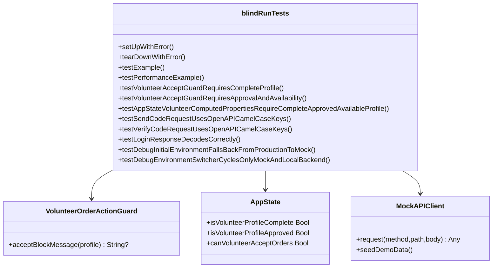

**图表来源**
- [blindRunTests.swift:1-479](file://blindRunTests/blindRunTests.swift#L1-L479)
- [VolunteerModule.swift:6-25](file://blindRun/Volunteer/VolunteerModule.swift#L6-L25)
- [AppState.swift:57-74](file://blindRun/Core/AppState.swift#L57-L74)
- [MockAPIClient.swift:1-77](file://blindRun/Core/MockAPIClient.swift#L1-L77)

**章节来源**
- [blindRunTests.swift:1-479](file://blindRunTests/blindRunTests.swift#L1-L479)
- [VolunteerModule.swift:6-25](file://blindRun/Volunteer/VolunteerModule.swift#L6-L25)
- [AppState.swift:57-74](file://blindRun/Core/AppState.swift#L57-L74)
- [MockAPIClient.swift:1-77](file://blindRun/Core/MockAPIClient.swift#L1-L77)

### UI 自动化测试策略
- 测试框架：XCTest UI 测试。
- 设计原则
  - 启动即断言：设置 continueAfterFailure=false，确保失败快速反馈。
  - 启动性能：使用应用启动指标测量启动耗时。
  - 截图附件：保留关键启动画面，便于回归对比。
- 覆盖范围
  - 应用启动流程、主界面渲染、可访问性标签与交互。
  - **新增** 测试账户流程：登录、角色设置、资料完善。
  - **新增** 志愿者接单流程：可用性开关、订单接受、服务状态转换。
- 最佳实践
  - 在 setUp 中统一设置初始状态（如方向），避免跨用例干扰。
  - 使用稳定的元素标识与可访问性标签进行查找。
  - **新增** 环境配置：支持mock、localBackend和production三种环境。

**更新** 新增测试账户流程和志愿者接单流程的UI自动化测试。

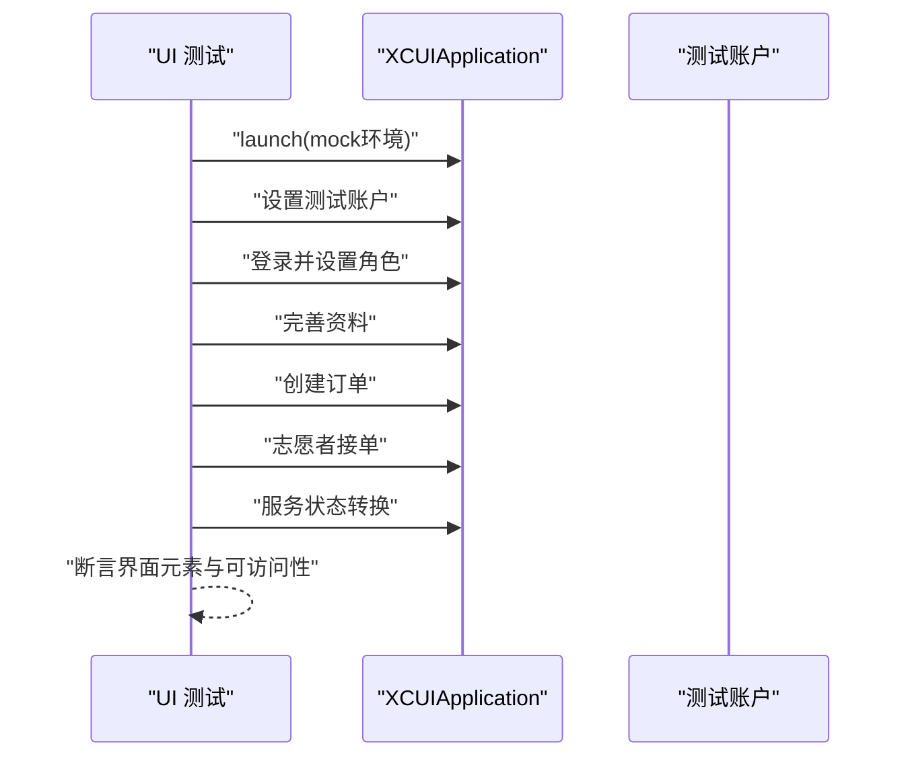

**图表来源**
- [blindRunUITests.swift:1-358](file://blindRunUITests/blindRunUITests.swift#L1-L358)
- [test-accounts.md:1-336](file://docs/test-accounts.md#L1-L336)

**章节来源**
- [blindRunUITests.swift:1-358](file://blindRunUITests/blindRunUITests.swift#L1-L358)
- [test-accounts.md:1-336](file://docs/test-accounts.md#L1-L336)

### 测试账户管理策略
- **测试账户文档**：提供完整的测试账号创建、角色设置和API对接流程。
- **API对接指南**：包含环境地址、管理员账号、用户测试账号的完整流程。
- **Postman集成**：支持API规范导入和认证配置。
- **常见问题解答**：涵盖验证码、角色设置、订单创建等常见问题。

**新增** 测试账户管理是本次更新的重要组成部分，为测试提供了标准化的账号管理流程。

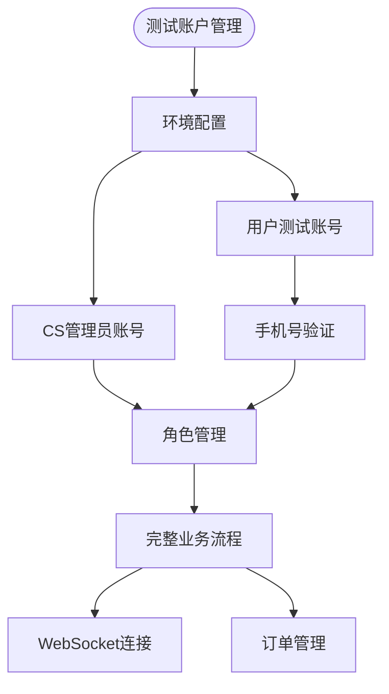

**图表来源**
- [test-accounts.md:1-336](file://docs/test-accounts.md#L1-L336)

**章节来源**
- [test-accounts.md:1-336](file://docs/test-accounts.md#L1-L336)

### Mock API客户端测试
- **离线开发支持**：支持完全离线的开发和演示环境。
- **状态管理**：内部维护用户状态、订单状态和紧急联系人。
- **网络延迟模拟**：模拟300ms网络延迟，提供真实的网络体验。
- **测试数据种子**：初始化演示数据，支持完整的业务流程测试。

**新增** Mock API客户端为测试提供了可靠的离线环境，支持完整的业务流程验证。

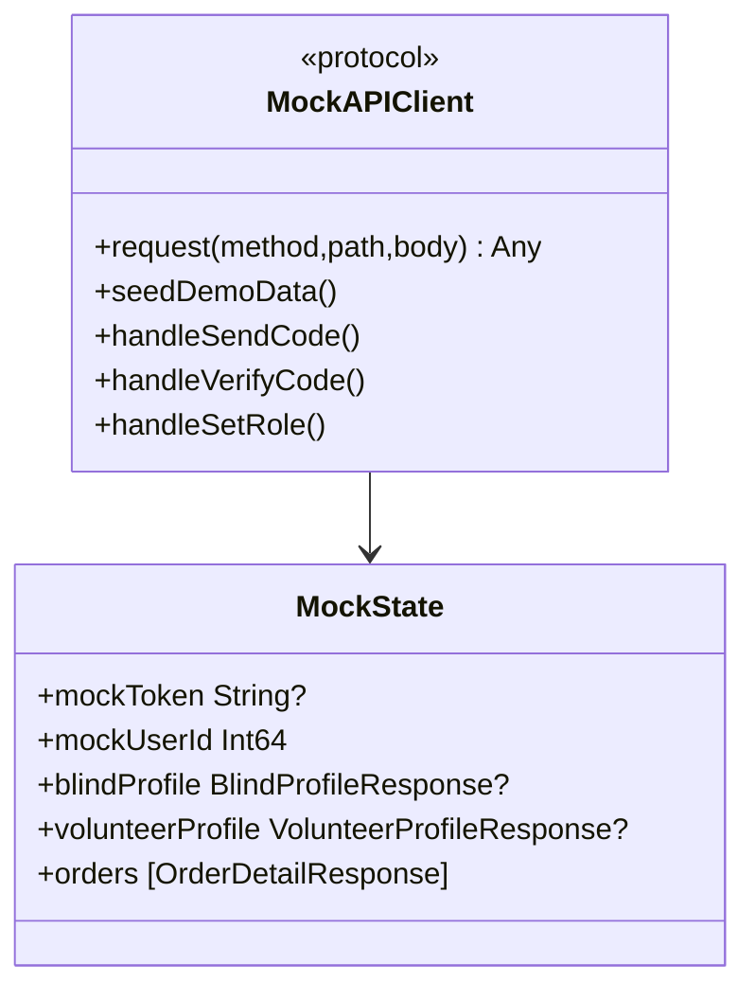

**图表来源**
- [MockAPIClient.swift:1-77](file://blindRun/Core/MockAPIClient.swift#L1-L77)

**章节来源**
- [MockAPIClient.swift:1-77](file://blindRun/Core/MockAPIClient.swift#L1-L77)

### SwiftUI 组件测试
- 目标：验证视图渲染、状态变化与可访问性属性。
- 方法
  - 使用预览与 @PreviewProvider 验证静态内容。
  - 在单元测试中实例化视图并断言布局与样式。
  - 使用 Accessibility Inspector 检查标签、提示与 trait。
- 关注点
  - 主按钮高度、对比度与可点击区域。
  - 每个关键控件的 accessibilityLabel/accessibilityHint。
  - "重复当前状态"按钮的行为一致性。

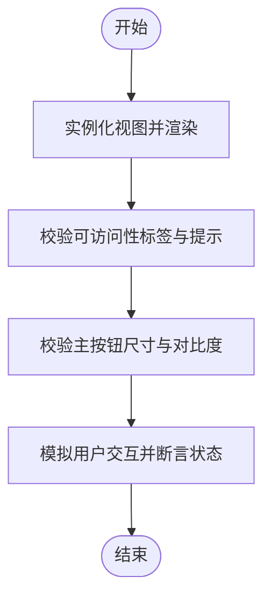

**图表来源**
- [09-accessibility-and-voice-guidelines.md:37-70](file://docs/09-accessibility-and-voice-guidelines.md#L37-L70)

**章节来源**
- [09-accessibility-and-voice-guidelines.md:37-70](file://docs/09-accessibility-and-voice-guidelines.md#L37-L70)

### 网络层测试
- 框架与职责
  - URLSession + async/await；APIClient 协议封装请求构建、鉴权头、响应解码与错误映射。
  - 支持 mock/localBackend/production 三环境切换。
- 测试策略
  - 协议驱动：以 APIClient 作为依赖注入点，替换为 Mock 实现。
  - 契约驱动：依据 API 合同编写端到端场景（登录、角色切换、订单 CRUD、轮询）。
  - 错误路径：模拟 401、400、409 等错误码，验证用户提示与 TTS。
- 覆盖范围
  - 请求构建、鉴权头、JSON 编解码、重试策略、环境切换。

**更新** 新增Mock API客户端的网络层测试支持。

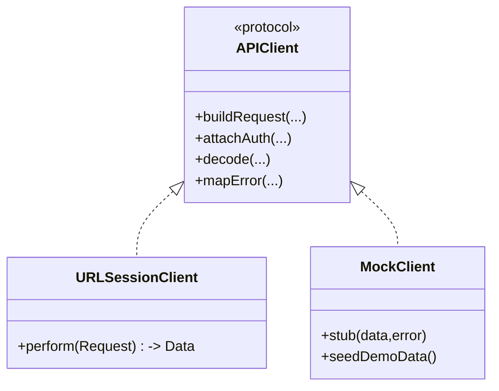

**图表来源**
- [08-ios-architecture.md:68-82](file://docs/08-ios-architecture.md#L68-L82)
- [MockAPIClient.swift:1-77](file://blindRun/Core/MockAPIClient.swift#L1-L77)

**章节来源**
- [08-ios-architecture.md:50-82](file://docs/08-ios-architecture.md#L50-L82)
- [MockAPIClient.swift:1-77](file://blindRun/Core/MockAPIClient.swift#L1-L77)

### 异步操作测试
- 轮询与定时任务
  - 订单状态页面按固定周期轮询，需在测试中控制时间推进与断言。
  - 使用 TestExpectation 或自定义时序控制器，避免真实等待。
- 并发与线程
  - 使用 @MainActor 标注 UI 相关断言，确保在主线程执行。
  - 对后台任务进行隔离，避免竞态条件。

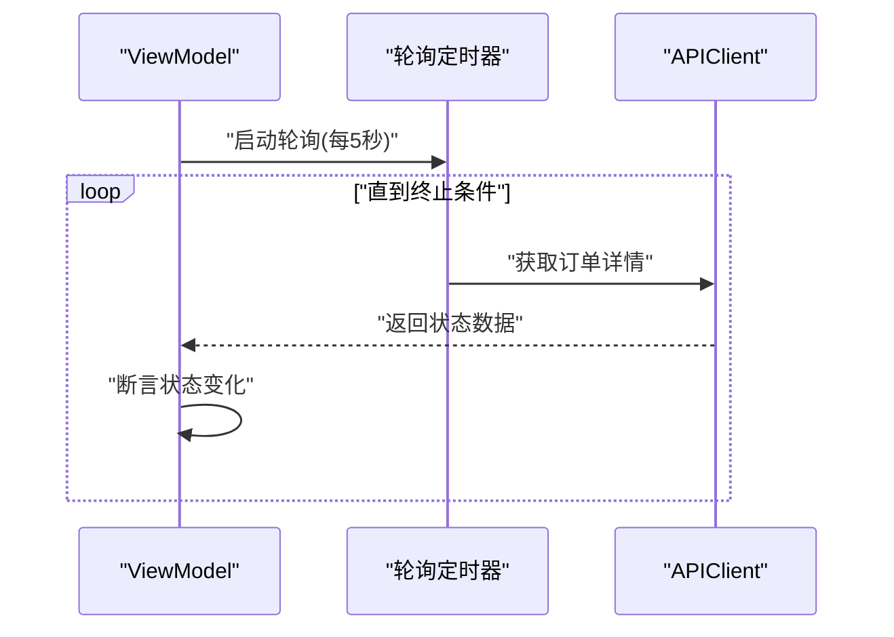

**图表来源**
- [08-ios-architecture.md:125-139](file://docs/08-ios-architecture.md#L125-L139)

**章节来源**
- [08-ios-architecture.md:125-139](file://docs/08-ios-architecture.md#L125-L139)

### 无障碍与语音测试
- TTS 要求
  - 必须播报节点清单与"重复当前状态"按钮行为。
  - 避免轮询期间重复播报，维护状态记忆。
- VoiceOver 要求
  - 每个关键控件具备 accessibilityLabel/accessibilityHint 与正确 trait。
  - 主页、订单页、志愿者页均需覆盖。
- 语音输入
  - 仅在用户发起时申请麦克风权限，失败时允许键盘输入。

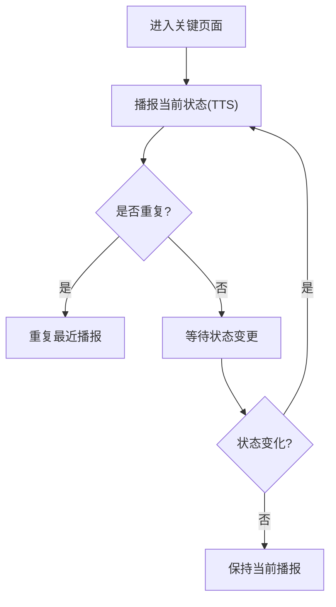

**图表来源**
- [09-accessibility-and-voice-guidelines.md:13-36](file://docs/09-accessibility-and-voice-guidelines.md#L13-L36)

**章节来源**
- [09-accessibility-and-voice-guidelines.md:13-36](file://docs/09-accessibility-and-voice-guidelines.md#L13-L36)

### 志愿者守卫系统测试
**新增** 志愿者接受订单守卫系统是本次更新的重点，包含以下测试覆盖：

- 测试框架：XCTest 单元测试
- 测试目标：验证志愿者接单前的三个必要条件
- 测试场景：
  - 资料完整性验证：昵称和手机号不能为空且符合格式要求
  - 认证状态验证：必须通过志愿者认证（verificationStatus 和 adminReviewStatus 均为 approved）
  - 可用性状态验证：必须开启可服务状态（isAvailable = true）

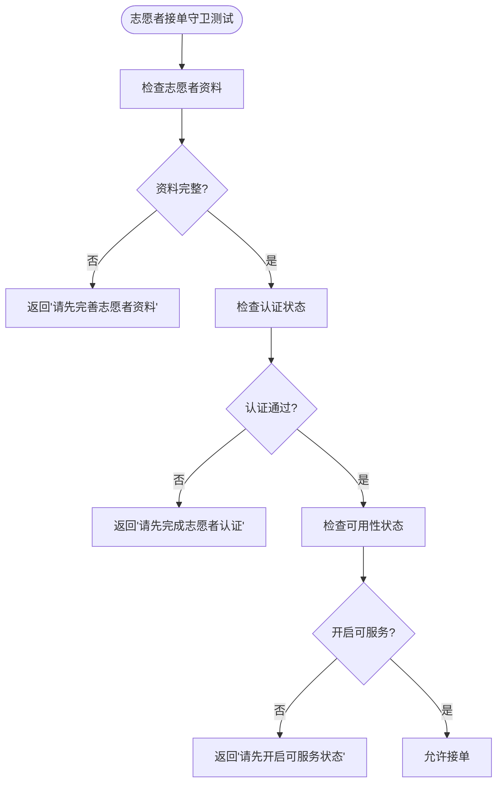

**图表来源**
- [VolunteerModule.swift:6-25](file://blindRun/Volunteer/VolunteerModule.swift#L6-L25)
- [blindRunTests.swift:413-453](file://blindRunTests/blindRunTests.swift#L413-L453)

**章节来源**
- [VolunteerModule.swift:6-25](file://blindRun/Volunteer/VolunteerModule.swift#L6-L25)
- [blindRunTests.swift:413-453](file://blindRunTests/blindRunTests.swift#L413-L453)
- [AppState.swift:57-74](file://blindRun/Core/AppState.swift#L57-L74)

## 依赖关系分析
- 组件耦合
  - 视图与 ViewModel 低耦合，便于独立测试。
  - 网络层通过协议注入，支持 Mock 替换。
  - 志愿者守卫系统依赖应用状态和志愿者资料模型。
  - **新增** Mock API客户端提供独立的测试环境。
- 外部依赖
  - URLSession 与 AVFoundation（TTS）、Speech（语音输入）。
  - 高德地图 SDK（地图与定位桥接）。
- 风险点
  - 真实网络与定位权限可能影响测试稳定性，建议在 CI 中使用模拟环境。
  - **新增** 测试账户管理需要确保API环境的正确配置。

**更新** 新增Mock API客户端和测试账户管理的依赖关系。

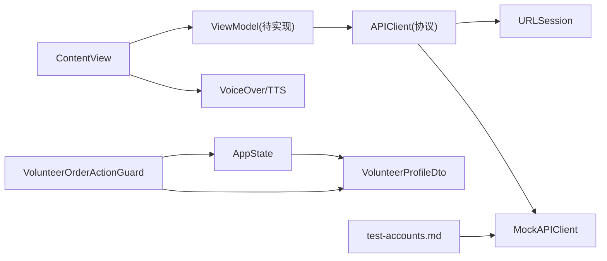

**图表来源**
- [AppState.swift:57-74](file://blindRun/Core/AppState.swift#L57-L74)
- [VolunteerModule.swift:6-25](file://blindRun/Volunteer/VolunteerModule.swift#L6-L25)
- [MockAPIClient.swift:1-77](file://blindRun/Core/MockAPIClient.swift#L1-L77)
- [test-accounts.md:1-336](file://docs/test-accounts.md#L1-L336)

**章节来源**
- [AppState.swift:57-74](file://blindRun/Core/AppState.swift#L57-L74)
- [VolunteerModule.swift:6-25](file://blindRun/Volunteer/VolunteerModule.swift#L6-L25)
- [MockAPIClient.swift:1-77](file://blindRun/Core/MockAPIClient.swift#L1-L77)
- [test-accounts.md:1-336](file://docs/test-accounts.md#L1-L336)

## 性能考量
- 启动性能
  - 使用应用启动指标测量冷启动/热启动时间，设定阈值。
- UI 渲染
  - 避免在主线程执行重计算；对复杂视图进行懒加载与缓存。
- 网络与轮询
  - 控制轮询频率与并发数量，避免过度请求导致卡顿。
  - **新增** Mock API客户端模拟网络延迟，提供真实的性能测试环境。
- 测试性能
  - 在单元测试中使用 measure 包裹热点路径，识别回归。

**更新** 新增Mock API客户端的性能测试支持。

**章节来源**
- [MockAPIClient.swift:38-39](file://blindRun/Core/MockAPIClient.swift#L38-L39)

## 故障排查指南
- 常见问题
  - UI 测试失败：检查元素标识与可访问性标签，确认 setUp 初始化。
  - 启动失败：核对环境配置与截图附件命名。
  - 无障碍告警：补充缺失的 accessibilityLabel/accessibilityHint。
  - 志愿者守卫测试失败：检查资料格式、认证状态和可用性标志。
  - **新增** 测试账户问题：验证码获取、角色设置、API对接。
- 定位手段
  - 使用 XCTest 截图附件与日志输出。
  - 在 CI 中启用详细日志与失败快照。
  - 检查志愿者资料模型的验证规则。
  - **新增** 验证测试账户文档的API端点和参数格式。
- 回归预防
  - 将关键 UI 与可访问性检查纳入每日流水线。
  - 新增志愿者守卫测试用例，确保三个验证条件都得到覆盖。
  - **新增** 定期验证测试账户文档的有效性和准确性。

**更新** 新增测试账户相关的故障排查指南。

**章节来源**
- [blindRunUITests.swift:12-19](file://blindRunUITests/blindRunUITests.swift#L12-L19)
- [test-accounts.md:302-336](file://docs/test-accounts.md#L302-L336)
- [blindRunTests.swift:413-453](file://blindRunTests/blindRunTests.swift#L413-L453)

## 结论
blindRun 当前处于早期原型阶段，测试策略应以"可验证、可回归、可扩展"为目标。随着测试基础设施的重大增强，建议优先补齐 ViewModel 与网络层的单元测试，完善 UI 自动化与可访问性测试，并在 CI 中引入启动性能与可访问性检查。**新增** 的测试账户管理和Mock API客户端为测试提供了更强大的支持，建议优先使用这些工具来提升测试效率和质量。

**更新** 新增测试账户管理和Mock API客户端的使用建议。

## 附录

### 测试用例设计原则
- 契约驱动：以 API 合同为边界，覆盖成功与失败路径。
- 可观测性：为关键路径添加日志与断言，便于定位问题。
- 可重复性：使用稳定的数据与环境，避免随机性。
- 完整性：覆盖所有业务规则和边界条件。
- **新增** 测试账户驱动：基于测试账户文档设计端到端测试场景。

**更新** 新增测试账户驱动的设计原则。

**章节来源**
- [07-api-contract.openapi.yaml:25-411](file://docs/07-api-contract.openapi.yaml#L25-L411)
- [test-accounts.md:1-336](file://docs/test-accounts.md#L1-L336)

### 覆盖率要求（建议）
- 单元测试：核心 ViewModel 与工具函数 >80%，关键分支与异常路径全覆盖。
- 集成测试：网络层与关键业务流程 >70%。
- UI 测试：关键页面与可访问性 >90%。
- 启动性能：冷启动时间 <5s，热启动 <1s。
- **新增** 志愿者守卫系统：资料验证、认证状态检查、可用性状态验证全覆盖。
- **新增** 测试账户：手机号格式验证、验证码处理、角色设置流程全覆盖。

**更新** 新增志愿者守卫系统和测试账户的覆盖率要求。

**章节来源**
- [08-ios-architecture.md:50-82](file://docs/08-ios-architecture.md#L50-L82)
- [blindRunTests.swift:413-453](file://blindRunTests/blindRunTests.swift#L413-L453)
- [test-accounts.md:1-336](file://docs/test-accounts.md#L1-L336)

### 测试数据准备与 Mock 对象
- 测试数据
  - 使用固定示例数据（如固定电话号码、验证码、订单状态枚举）。
  - 为不同场景准备正反例数据集。
  - **新增** 志愿者资料测试数据：包含不同认证状态和可用性组合。
  - **新增** 测试账户数据：包含管理员账号和用户测试账号的完整信息。
- Mock 对象
  - 以 APIClient 协议为中心，提供 Mock URLSessionClient 与 Mock API 实现。
  - 使用 TestExpectation 或时序控制器模拟异步结果。
  - **新增** 志愿者守卫测试辅助方法：makeVolunteerProfile 和 makeApprovedVolunteerProfile。
  - **新增** Mock API客户端：支持完整的测试数据种子和状态管理。
- **新增** 测试账户准备
  - 使用测试账户文档提供的API端点创建测试用户。
  - 验证验证码获取和角色设置流程。
  - 准备不同角色的测试数据。

**更新** 新增测试账户和Mock API客户端的数据准备指南。

**章节来源**
- [08-ios-architecture.md:68-82](file://docs/08-ios-architecture.md#L68-L82)
- [blindRunTests.swift:455-478](file://blindRunTests/blindRunTests.swift#L455-L478)
- [MockAPIClient.swift:1-77](file://blindRun/Core/MockAPIClient.swift#L1-L77)
- [test-accounts.md:1-336](file://docs/test-accounts.md#L1-L336)

### 测试环境配置
- 环境切换
  - 在 Debug 构建中暴露环境选择器，支持 mock/localBackend/production。
  - 本地后端支持局域网 IP，便于联调。
  - **新增** UI测试环境配置：支持通过环境变量配置测试环境。
- 配置管理
  - 高德地图密钥存储于本地配置文件，加入 .gitignore。
  - 提供示例配置文件，标注所需键名。
  - **新增** 测试账户环境变量：支持通过环境变量配置测试账户信息。

**更新** 新增UI测试环境配置和测试账户环境变量的支持。

**章节来源**
- [08-ios-architecture.md:50-82](file://docs/08-ios-architecture.md#L50-L82)
- [blindRunApp.swift:43-67](file://blindRun/blindRunApp.swift#L43-L67)
- [.gitignore:59-62](file://.gitignore#L59-L62)

### 持续集成与质量门禁
- 流水线建议
  - 构建：编译 Debug/Release 构建。
  - 单元测试：运行 XCTest，生成覆盖率报告。
  - UI 测试：在模拟器上运行 UI 测试，上传截图附件。
  - 可访问性检查：集成 Accessibility Inspector 规则。
  - 性能基线：比较启动指标与关键路径耗时。
  - **新增** 测试账户验证：确保测试账户文档的有效性和API端点的正确性。
  - **新增** Mock API测试：验证Mock API客户端的功能和数据完整性。
- 质量门禁
  - 覆盖率阈值：单元测试 >80%，集成测试 >70%。
  - 可访问性：零告警。
  - 启动性能：冷启动 ≤5s，热启动 ≤1s。
  - 失败即阻断：任何测试失败阻止合并。
  - **新增** 测试账户门禁：测试账户API端点必须返回预期结果。
  - **新增** Mock API门禁：Mock API必须支持完整的业务流程。

**更新** 新增测试账户和Mock API的持续集成配置。

**章节来源**
- [blindRunUITests.swift:15-16](file://blindRunUITests/blindRunUITests.swift#L15-L16)
- [test-accounts.md:1-336](file://docs/test-accounts.md#L1-L336)
- [MockAPIClient.swift:1-77](file://blindRun/Core/MockAPIClient.swift#L1-L77)