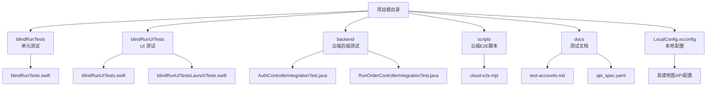
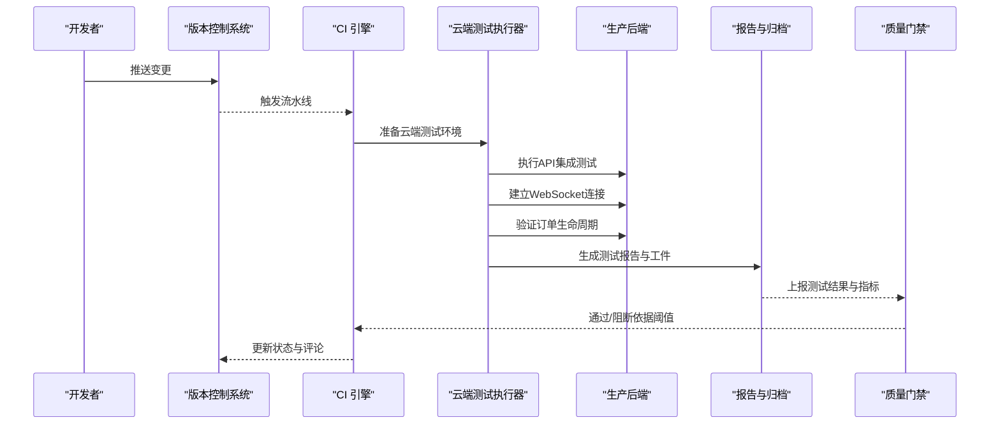
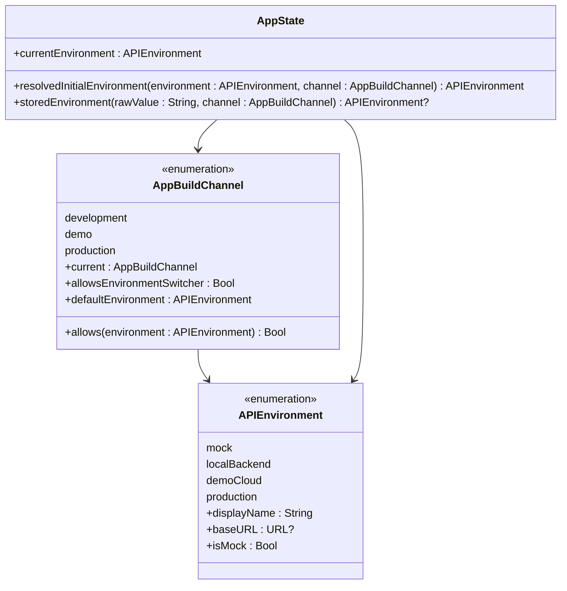
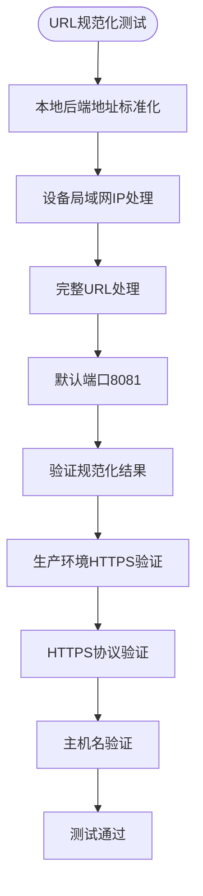
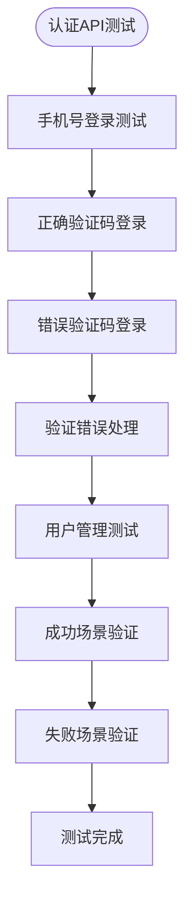
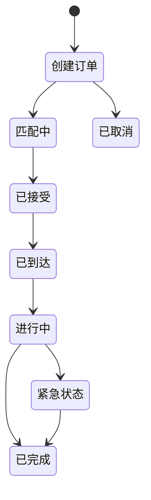
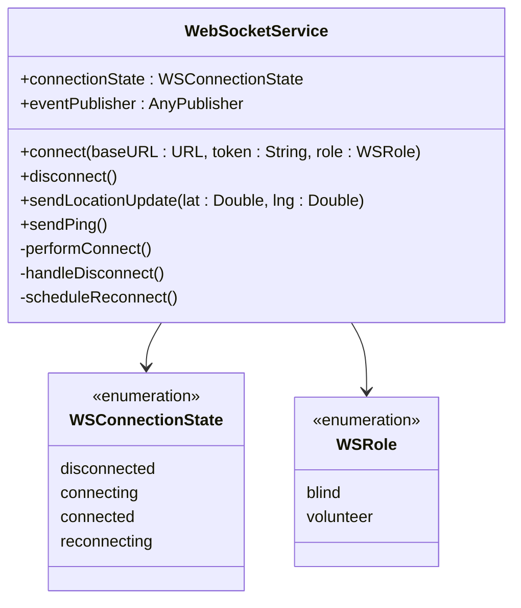
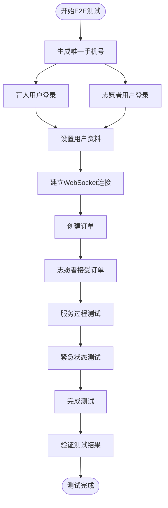
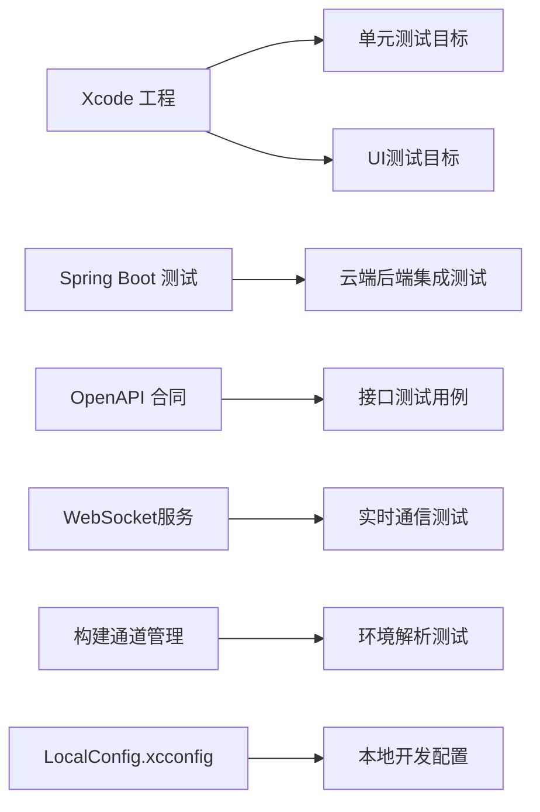

# 测试自动化与持续集成

<cite>
**本文引用的文件**
- [blindRunTests.swift](file://blindRunTests/blindRunTests.swift)
- [blindRunUITests.swift](file://blindRunUITests/blindRunUITests.swift)
- [blindRunUITestsLaunchTests.swift](file://blindRunUITests/blindRunUITestsLaunchTests.swift)
- [EnvironmentConfig.swift](file://blindRun/Core/EnvironmentConfig.swift)
- [AppState.swift](file://blindRun/Core/AppState.swift)
- [WebSocketService.swift](file://blindRun/Core/WebSocketService.swift)
- [blindRunApp.swift](file://blindRun/blindRunApp.swift)
- [AuthControllerIntegrationTest.java](file://backend/src/test/java/com/aidrun/backend/auth/AuthControllerIntegrationTest.java)
- [RunOrderControllerIntegrationTest.java](file://backend/src/test/java/com/aidrun/backend/order/RunOrderControllerIntegrationTest.java)
- [cloud-e2e.mjs](file://scripts/cloud-e2e.mjs)
- [test-accounts.md](file://docs/test-accounts.md)
- [api_spec.yaml](file://docs/api_spec.yaml)
- [AidRunBackendApplicationTests.java](file://backend/src/test/java/com/aidrun/backend/AidRunBackendApplicationTests.java)
- [LocalConfig.xcconfig](file://LocalConfig.xcconfig)
</cite>

## 更新摘要
**所做更改**
- 移除了本地后端环境测试支持，UI 测试配置中不再包含 localBackend 环境切换
- 增强了 UI 测试配置，新增 token 验证和预设配置功能
- 更新了构建通道与环境解析测试，反映环境限制策略的调整
- 完善了测试环境配置，支持多环境切换和云端验证
- 增强了测试基础设施以验证环境锁定和回退机制

## 目录
1. [引言](#引言)
2. [项目结构](#项目结构)
3. [核心组件](#核心组件)
4. [架构总览](#架构总览)
5. [详细组件分析](#详细组件分析)
6. [构建通道与环境解析测试](#构建通道与环境解析测试)
7. [URL 规范化测试](#url-规范化测试)
8. [云端后端集成测试](#云端后端集成测试)
9. [WebSocket连接测试](#websocket连接测试)
10. [订单生命周期测试](#订单生命周期测试)
11. [依赖关系分析](#依赖关系分析)
12. [性能考虑](#性能考虑)
13. [故障排查指南](#故障排查指南)
14. [结论](#结论)
15. [附录](#附录)

## 引言
本指南面向 DevOps 团队，提供在 blindRun iOS 应用中落地测试自动化与持续集成（CI/CD）的完整实施路径。随着项目向云端后端迁移，测试策略已全面转向云端集成测试，涵盖生产环境API验证、WebSocket实时通信测试和完整的订单生命周期验证。本次更新重点反映了测试基础设施的重大调整：移除了本地后端环境测试支持，UI 测试配置增强了 token 验证和预设配置功能，构建通道与环境解析测试得到完善以反映环境限制策略的调整。内容涵盖测试环境自动化、测试报告生成、质量门禁、并行执行、结果聚合、失败通知、覆盖率统计、性能回归检测与安全测试集成，以及测试数据与环境变量管理的最佳实践。

## 项目结构
blindRun 采用标准 iOS 工程结构，包含单元测试、UI 测试套件、云端后端集成测试以及 OpenAPI 合同文档。下图展示了与测试自动化相关的关键文件与目录：

**图表来源**
- [blindRunTests.swift](file://blindRunTests/blindRunTests.swift)
- [blindRunUITests.swift](file://blindRunUITests/blindRunUITests.swift)
- [blindRunUITestsLaunchTests.swift](file://blindRunUITests/blindRunUITestsLaunchTests.swift)
- [AuthControllerIntegrationTest.java](file://backend/src/test/java/com/aidrun/backend/auth/AuthControllerIntegrationTest.java)
- [RunOrderControllerIntegrationTest.java](file://backend/src/test/java/com/aidrun/backend/order/RunOrderControllerIntegrationTest.java)
- [cloud-e2e.mjs](file://scripts/cloud-e2e.mjs)
- [test-accounts.md](file://docs/test-accounts.md)
- [api_spec.yaml](file://docs/api_spec.yaml)
- [LocalConfig.xcconfig](file://LocalConfig.xcconfig)

## 核心组件
- **单元测试模块**：提供基础功能测试与性能基准测试框架，验证API环境配置、WebSocket连接状态和核心业务逻辑。现已扩展为 comprehensive unit tests，覆盖构建通道逻辑、环境解析和 URL 规范化。
- **UI测试模块**：包含应用启动流程与关键交互场景的自动化测试，支持云端环境下的端到端验证。新增了 token 验证和预设配置功能，移除了本地后端环境支持。
- **云端后端集成测试**：基于Spring Boot测试框架，验证生产环境API行为和订单生命周期完整性。
- **WebSocket实时通信测试**：专门测试盲人端和志愿者端的WebSocket连接、消息传递和状态同步。
- **OpenAPI合同**：定义后端API行为契约，驱动接口测试和前端/后端联调验证。
- **构建通道管理**：通过 AppBuildChannel 枚举管理开发、演示、生产三种构建模式及其环境限制。

**章节来源**
- [blindRunTests.swift:123-147](file://blindRunTests/blindRunTests.swift#L123-L147)
- [blindRunUITests.swift:10-28](file://blindRunUITests/blindRunUITests.swift#L10-L28)
- [AuthControllerIntegrationTest.java:17-136](file://backend/src/test/java/com/aidrun/backend/auth/AuthControllerIntegrationTest.java#L17-L136)
- [RunOrderControllerIntegrationTest.java:17-804](file://backend/src/test/java/com/aidrun/backend/order/RunOrderControllerIntegrationTest.java#L17-L804)
- [EnvironmentConfig.swift:5-45](file://blindRun/Core/EnvironmentConfig.swift#L5-L45)
- [WebSocketService.swift:34-304](file://blindRun/Core/WebSocketService.swift#L34-L304)

## 架构总览
下图展示了从代码提交到云端测试执行、报告与质量门禁的整体流程，强调了云端集成测试在CI/CD中的关键作用：

## 详细组件分析

### 单元测试组件分析
- **设计要点**
  - 使用 XCTest 框架，提供 setUp/tearDown 生命周期钩子
  - 包含API环境切换测试，验证生产环境配置正确性
  - 支持云端环境下的Mock模式和生产环境验证
  - **新增**：综合单元测试覆盖构建通道逻辑、环境解析和 URL 规范化
- **云端环境支持**
  - 测试API环境切换逻辑，确保生产环境URL配置正确
  - 验证本地后端地址规范化功能在云端环境下的行为
  - **新增**：验证不同构建通道下的环境锁定和回退机制
- **报告与归档**
  - 输出 JUnit XML 与 Xcode JSON 测试结果
  - 便于 CI 平台解析与可视化

**章节来源**
- [blindRunTests.swift:123-147](file://blindRunTests/blindRunTests.swift#L123-L147)
- [EnvironmentConfig.swift:5-40](file://blindRun/Core/EnvironmentConfig.swift#L5-L40)

### UI测试组件分析
- **设计要点**
  - 支持多环境配置，包括Mock、演示云端和生产环境
  - 集成云端E2E测试验证，确保端到端流程完整性
  - 支持测试账户管理和环境变量配置
  - **新增**：增强的 token 验证和预设配置功能
- **云端环境适配**
  - **移除**：本地后端测试支持，专注于生产环境验证
  - 支持云端测试账户的自动配置和验证
  - **新增**：预设配置功能，支持预填充用户资料和志愿者可用状态
- **并行与稳定性**
  - 将启动类测试独立为专用任务
  - 使用设备池与模拟器缓存提升稳定性

**章节来源**
- [blindRunUITests.swift:10-28](file://blindRunUITests/blindRunUITests.swift#L10-L28)
- [test-accounts.md:57-67](file://docs/test-accounts.md#L57-L67)

## 构建通道与环境解析测试

### 构建通道架构
新增的综合单元测试重点验证构建通道与环境解析逻辑，确保不同构建模式下的环境行为一致性：

**图表来源**
- [EnvironmentConfig.swift:5-45](file://blindRun/Core/EnvironmentConfig.swift#L5-L45)
- [AppState.swift:212-224](file://blindRun/Core/AppState.swift#L212-L224)

### 开发构建通道测试
验证开发模式下的完整环境支持和调试功能：

#### 关键测试场景
- **开发环境锁定**：验证开发模式允许所有环境（mock、localBackend、demoCloud）
- **调试环境切换器**：测试开发模式下的环境循环切换功能
- **调试测试环境集合**：验证调试环境下可用的测试环境列表

**章节来源**
- [blindRunTests.swift:123-127](file://blindRunTests/blindRunTests.swift#L123-L127)
- [blindRunTests.swift:171-191](file://blindRunTests/blindRunTests.swift#L171-L191)

### 演示构建通道测试
验证演示模式下的环境锁定机制：

#### 关键测试场景
- **演示环境锁定**：验证演示模式强制使用 demoCloud 环境
- **跨环境回退**：测试从其他环境切换到演示环境时的自动回退
- **演示模式默认值**：验证演示模式的默认环境设置

**章节来源**
- [blindRunTests.swift:129-134](file://blindRunTests/blindRunTests.swift#L129-L134)
- [EnvironmentConfig.swift:35-44](file://blindRun/Core/EnvironmentConfig.swift#L35-L44)

### 生产构建通道测试
验证生产模式下的严格环境限制：

#### 关键测试场景
- **生产环境锁定**：验证生产模式仅允许 production 环境
- **环境回退保护**：测试非生产环境在生产构建中的回退保护
- **生产模式默认值**：验证生产模式的默认环境设置

**章节来源**
- [blindRunTests.swift:136-141](file://blindRunTests/blindRunTests.swift#L136-L141)
- [EnvironmentConfig.swift:35-44](file://blindRun/Core/EnvironmentConfig.swift#L35-L44)

### 旧版环境映射测试
验证历史环境值的智能映射逻辑：

#### 关键测试场景
- **生产环境映射**：验证非生产构建中存储的 "production" 环境映射到 demoCloud
- **生产构建保留**：测试生产构建中 "production" 环境的正确保留
- **环境回退策略**：验证不同构建模式下的环境回退策略

**章节来源**
- [blindRunTests.swift:143-147](file://blindRunTests/blindRunTests.swift#L143-L147)
- [AppState.swift:219-224](file://blindRun/Core/AppState.swift#L219-L224)

## URL 规范化测试

### URL 规范化架构
新增的 URL 规范化测试覆盖本地后端地址标准化和生产环境 HTTPS 验证：

**图表来源**
- [EnvironmentConfig.swift:118-151](file://blindRun/Core/EnvironmentConfig.swift#L118-L151)
- [EnvironmentConfig.swift:157-172](file://blindRun/Core/EnvironmentConfig.swift#L157-L172)

### 本地后端地址标准化测试
验证本地后端地址的智能规范化功能：

#### 关键测试场景
- **设备局域网IP处理**：验证 192.168.x.x 格式的IP地址正确处理
- **完整URL处理**：测试包含协议和端口的完整URL规范化
- **默认端口设置**：验证缺少端口号时的默认端口8081设置
- **显示字符串生成**：测试用户界面显示的规范化URL格式

**章节来源**
- [blindRunTests.swift:193-202](file://blindRunTests/blindRunTests.swift#L193-L202)
- [EnvironmentConfig.swift:118-151](file://blindRun/Core/EnvironmentConfig.swift#L118-L151)

### 生产环境HTTPS验证测试
验证生产环境URL的安全性要求：

#### 关键测试场景
- **HTTPS协议强制**：验证生产环境URL必须使用HTTPS协议
- **协议验证**：测试HTTP协议的URL被拒绝
- **主机名验证**：确保URL包含有效的主机名
- **URL规范化**：验证HTTPS URL的正确规范化

**章节来源**
- [blindRunTests.swift:153-159](file://blindRunTests/blindRunTests.swift#L153-L159)
- [EnvironmentConfig.swift:157-172](file://blindRun/Core/EnvironmentConfig.swift#L157-L172)

### WebSocket URL生成测试
验证WebSocket连接的URL生成逻辑：

#### 关键测试场景
- **HTTPS生产环境WS**：验证生产环境使用wss协议
- **URL参数生成**：测试token和角色参数的正确拼接
- **路径规范化**：验证WebSocket路径的正确格式
- **协议一致性**：确保WebSocket协议与HTTP协议的一致性

**章节来源**
- [blindRunTests.swift:161-169](file://blindRunTests/blindRunTests.swift#L161-L169)
- [WebSocketService.swift:34-304](file://blindRun/Core/WebSocketService.swift#L34-L304)

## 云端后端集成测试

### 认证控制器集成测试
基于Spring Boot测试框架，验证生产环境认证API的完整功能：

**图表来源**
- [AuthControllerIntegrationTest.java:22-135](file://backend/src/test/java/com/aidrun/backend/auth/AuthControllerIntegrationTest.java#L22-L135)

#### 关键测试场景
- **手机号登录验证**：测试正确和错误验证码的处理逻辑
- **用户状态管理**：验证新用户创建和现有用户登录的行为
- **输入验证**：测试各种边界条件和无效输入的处理
- **JWT令牌验证**：确保令牌格式和有效期的正确性

**章节来源**
- [AuthControllerIntegrationTest.java:22-135](file://backend/src/test/java/com/aidrun/backend/auth/AuthControllerIntegrationTest.java#L22-L135)

### 订单控制器集成测试
验证完整的订单生命周期管理，包括创建、接受、服务过程和完成：

**图表来源**
- [RunOrderControllerIntegrationTest.java:96-315](file://backend/src/test/java/com/aidrun/backend/order/RunOrderControllerIntegrationTest.java#L96-L315)

#### 完整流程测试
- **订单创建**：验证预约时间和位置信息的有效性
- **志愿者接受**：测试志愿者资格验证和可用性检查
- **服务过程**：验证位置上报、状态转换和时间戳记录
- **紧急处理**：测试紧急状态触发和恢复机制
- **评分系统**：验证服务完成后评分功能的完整性

**章节来源**
- [RunOrderControllerIntegrationTest.java:96-315](file://backend/src/test/java/com/aidrun/backend/order/RunOrderControllerIntegrationTest.java#L96-L315)

## WebSocket连接测试

### WebSocket服务架构
专门设计的WebSocket服务支持实时通信和状态同步：

**图表来源**
- [WebSocketService.swift:34-304](file://blindRun/Core/WebSocketService.swift#L34-L304)

### 连接状态管理
WebSocket服务实现了智能的连接状态管理和自动重连机制：

#### 连接状态枚举
- **disconnected**：完全断开连接
- **connecting**：正在建立连接
- **connected**：连接建立成功
- **reconnecting**：自动重连中，包含尝试次数

#### 自动重连策略
- **指数退避延迟**：3秒、6秒、12秒、30秒的递增延迟
- **心跳机制**：盲人用户每30秒发送ping消息保持连接
- **速率限制**：消息发送最小间隔0.5秒，防止过度发送

**章节来源**
- [WebSocketService.swift:6-16](file://blindRun/Core/WebSocketService.swift#L6-L16)
- [WebSocketService.swift:56-64](file://blindRun/Core/WebSocketService.swift#L56-L64)

### 消息类型和事件处理
WebSocket服务支持多种消息类型和事件处理：

#### 支持的消息类型
- **LOCATION_UPDATE**：位置更新消息
- **PING/PONG**：心跳检测消息
- **NEW_ORDER**：新订单通知
- **ORDER_STATUS_CHANGED**：订单状态变更
- **EMERGENCY_*系列**：紧急事件相关消息

#### 事件发布机制
- 使用Combine框架的Publishers处理异步事件
- 支持多种事件类型的解码和分发
- 提供统一的事件接口给上层组件

**章节来源**
- [WebSocketService.swift:193-238](file://blindRun/Core/WebSocketService.swift#L193-L238)

## 订单生命周期测试

### 云端E2E测试脚本
专门的Node.js脚本实现完整的云端端到端测试：

**图表来源**
- [cloud-e2e.mjs:391-448](file://scripts/cloud-e2e.mjs#L391-L448)

### 测试流程详解
- **用户认证**：使用测试账户进行手机号验证码登录
- **资料设置**：自动完善盲人和志愿者的必要资料
- **WebSocket连接**：验证双向实时通信功能
- **订单流程**：完整验证从创建到完成的服务流程
- **紧急处理**：测试紧急状态的触发和处理机制

#### 环境配置
- **基础URL**：默认使用生产环境地址 `http://47.114.113.171`
- **验证码**：默认测试验证码 `123456`
- **超时设置**：默认超时时间为25秒
- **并发控制**：支持多个测试实例同时运行

**章节来源**
- [cloud-e2e.mjs:1-457](file://scripts/cloud-e2e.mjs#L1-L457)
- [test-accounts.md:57-67](file://docs/test-accounts.md#L57-L67)

### 测试数据管理
- **动态生成**：使用时间戳生成唯一的测试数据
- **环境变量**：支持通过环境变量自定义测试参数
- **数据清理**：测试完成后自动清理生成的测试数据
- **重试机制**：网络不稳定时自动重试相关操作

**章节来源**
- [cloud-e2e.mjs:32-47](file://scripts/cloud-e2e.mjs#L32-L47)
- [cloud-e2e.mjs:49-53](file://scripts/cloud-e2e.mjs#L49-L53)

## 依赖关系分析
- **测试目标与工程配置**
  - Xcode 工程中声明了单元测试与 UI 测试目标
  - Spring Boot测试框架提供云端后端集成测试支持
- **依赖耦合与内聚**
  - 测试模块与被测应用模块解耦，通过 @testable 导入实现受控访问
  - WebSocket服务作为独立组件，便于单元测试和集成测试
  - **新增**：构建通道和环境解析逻辑作为核心测试目标
- **外部依赖与集成点**
  - OpenAPI 合同作为外部契约，驱动接口测试与前端/后端联调
  - 云端后端提供真实的API环境和数据库状态
  - **新增**：LocalConfig.xcconfig 提供本地开发配置支持

**图表来源**
- [AidRunBackendApplicationTests.java:6-12](file://backend/src/test/java/com/aidrun/backend/AidRunBackendApplicationTests.java#L6-L12)
- [api_spec.yaml:1-50](file://docs/api_spec.yaml#L1-L50)
- [LocalConfig.xcconfig:1-31](file://LocalConfig.xcconfig#L1-L31)

**章节来源**
- [AidRunBackendApplicationTests.java:6-12](file://backend/src/test/java/com/aidrun/backend/AidRunBackendApplicationTests.java#L6-L12)

## 性能考虑
- **并行执行**
  - 将单元测试、UI测试和云端集成测试拆分为不同任务
  - 结合设备/模拟器矩阵并行运行，缩短整体耗时
  - **新增**：构建通道测试与其他测试类别并行执行
- **缓存优化**
  - 缓存 Xcode 构建产物与依赖
  - 云端测试环境预热，减少首次连接延迟
- **性能回归检测**
  - 在 CI 中记录性能指标，建立基线与阈值
  - WebSocket连接成功率和消息传输延迟监控
  - **新增**：构建通道切换性能监控
- **资源管理**
  - 控制并发度与重试次数，避免 CI 资源争用
  - 云端测试实例的合理分配和清理
  - **新增**：环境解析性能优化

## 故障排查指南
- **常见问题**
  - **测试失败**：优先检查日志与截图附件，定位失败步骤与输入条件
  - **云端连接问题**：核对API环境配置和网络连通性
  - **WebSocket连接失败**：检查token有效性、角色匹配和服务器状态
  - **订单状态异常**：验证订单生命周期状态转换的正确性
  - **构建通道问题**：检查 AppBuildChannel.current 的构建模式识别
  - **URL规范化失败**：验证本地后端地址格式和生产环境HTTPS配置
  - **UI测试配置问题**：检查环境变量和预设配置的正确性
- **建议流程**
  - 失败后自动抓取屏幕截图与日志，生成报告并发送通知
  - 对关键测试设置"失败即停"，缩短反馈周期
  - 使用云端E2E脚本进行手动验证和问题复现
  - **新增**：针对构建通道和环境解析问题的专项排查流程
  - **新增**：针对UI测试配置和token验证问题的专项排查流程

**章节来源**
- [WebSocketService.swift:136-154](file://blindRun/Core/WebSocketService.swift#L136-L154)
- [cloud-e2e.mjs:450-456](file://scripts/cloud-e2e.mjs#L450-L456)

## 结论
通过在 CI/CD 流水线中集成云端后端集成测试、WebSocket实时通信测试和完整的订单生命周期验证，以及新增的构建通道与环境解析测试，blindRun 可以显著提升交付质量与效率。新的测试策略专注于生产环境验证，确保应用与云端后端的完整兼容性和可靠性。本次重大调整移除了本地后端环境测试支持，增强了UI测试配置的token验证和预设功能，为不同构建模式下的环境行为提供了全面保障。建议以"尽早失败、快速反馈、持续改进"为核心原则，逐步完善测试覆盖与性能监控，最终形成稳定可靠的云端测试体系。

## 附录
- **最佳实践清单**
  - 使用OpenAPI合同驱动接口测试，确保前后端一致性
  - 将启动类UI测试独立执行，避免相互影响
  - 在CI中输出标准化测试报告与工件，便于聚合与回溯
  - 建立覆盖率与性能基线，纳入质量门禁
  - 明确环境变量与测试数据管理策略，确保可重复性与安全性
  - 重点关注WebSocket连接稳定性和消息传递可靠性
  - 实施云端E2E测试，确保端到端流程的完整性
  - **新增**：实施构建通道测试，确保不同构建模式下的环境行为一致性
  - **新增**：实施URL规范化测试，确保网络请求的安全性和正确性
  - **新增**：实施环境解析测试，验证复杂环境配置的正确性
  - **新增**：实施UI测试配置验证，确保token和预设功能的正确性
  - **新增**：移除本地后端测试支持，专注于云端环境验证