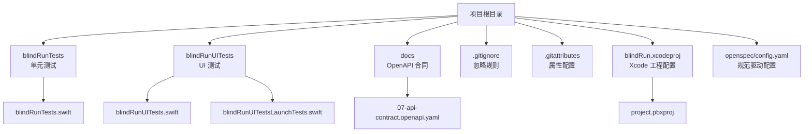
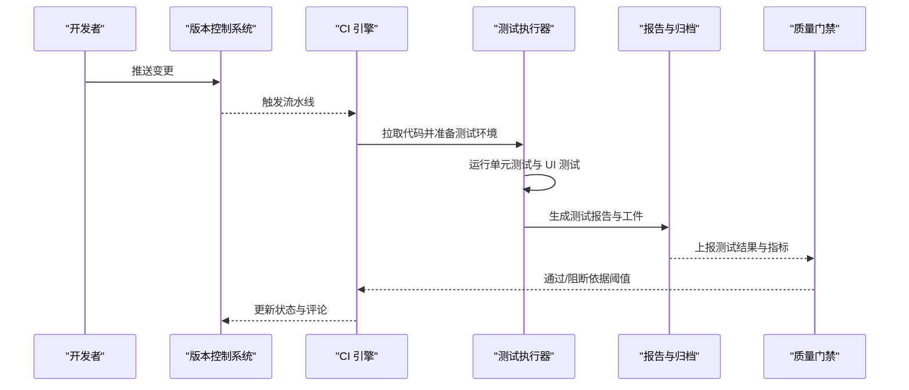
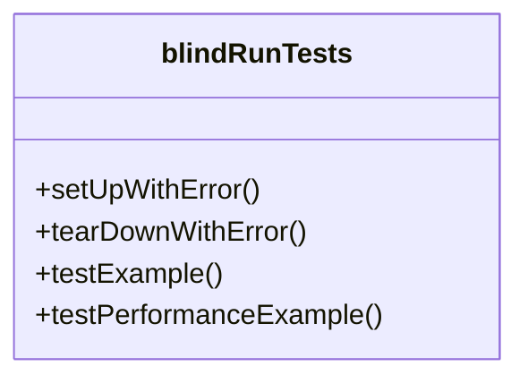
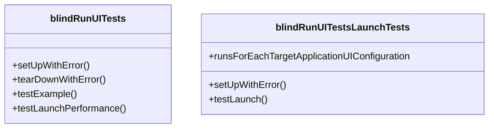
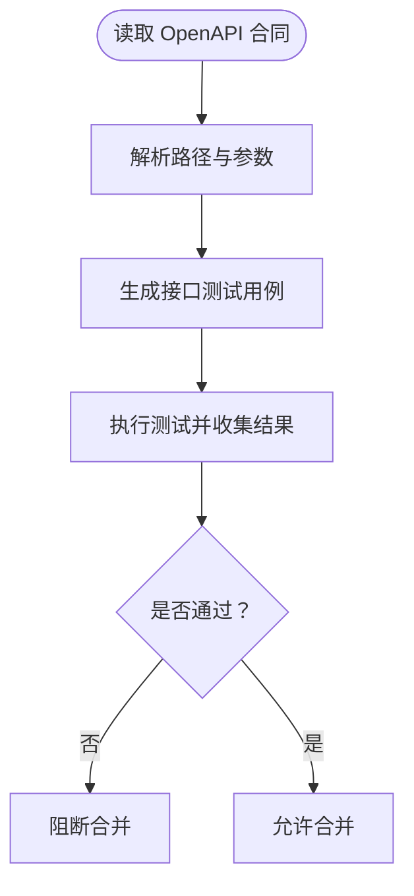
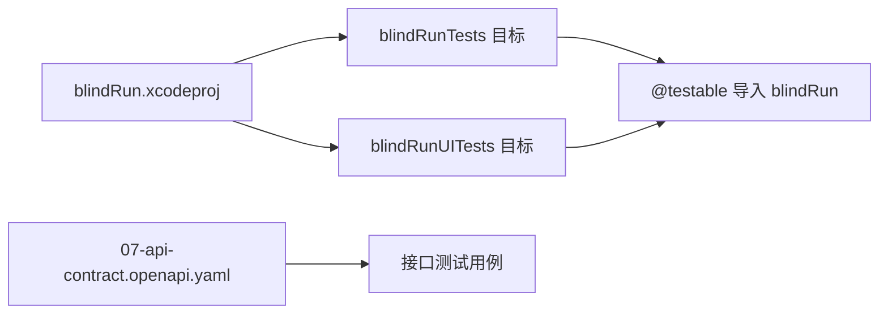

# 测试自动化与持续集成

<cite>
**本文引用的文件**
- [blindRunTests.swift](file://blindRunTests/blindRunTests.swift)
- [blindRunUITests.swift](file://blindRunUITests/blindRunUITests.swift)
- [blindRunUITestsLaunchTests.swift](file://blindRunUITests/blindRunUITestsLaunchTests.swift)
- [07-api-contract.openapi.yaml](file://docs/07-api-contract.openapi.yaml)
- [.gitignore](file://.gitignore)
- [.gitattributes](file://.gitattributes)
- [project.pbxproj](file://blindRun.xcodeproj/project.pbxproj)
- [config.yaml](file://openspec/config.yaml)
</cite>

## 目录
1. [引言](#引言)
2. [项目结构](#项目结构)
3. [核心组件](#核心组件)
4. [架构总览](#架构总览)
5. [详细组件分析](#详细组件分析)
6. [依赖关系分析](#依赖关系分析)
7. [性能考虑](#性能考虑)
8. [故障排查指南](#故障排查指南)
9. [结论](#结论)
10. [附录](#附录)

## 引言
本指南面向 DevOps 团队，提供在 blindRun iOS 应用中落地测试自动化与持续集成（CI/CD）的完整实施路径。内容涵盖测试环境自动化、测试报告生成、质量门禁、并行执行、结果聚合、失败通知、覆盖率统计、性能回归检测与安全测试集成，以及测试数据与环境变量管理的最佳实践。文中所有技术方案均基于仓库现有测试结构与配置文件进行设计与落地。

## 项目结构
blindRun 采用标准 iOS 工程结构，包含单元测试与 UI 测试套件，以及 OpenAPI 合同文档与版本控制配置。下图展示了与测试自动化相关的关键文件与目录：

图表来源
- [blindRunTests.swift](file://blindRunTests/blindRunTests.swift)
- [blindRunUITests.swift](file://blindRunUITests/blindRunUITests.swift)
- [blindRunUITestsLaunchTests.swift](file://blindRunUITests/blindRunUITestsLaunchTests.swift)
- [07-api-contract.openapi.yaml](file://docs/07-api-contract.openapi.yaml)
- [.gitignore](file://.gitignore)
- [.gitattributes](file://.gitattributes)
- [project.pbxproj](file://blindRun.xcodeproj/project.pbxproj)
- [config.yaml](file://openspec/config.yaml)

章节来源
- [blindRunTests.swift:1-39](file://blindRunTests/blindRunTests.swift#L1-L39)
- [blindRunUITests.swift:1-44](file://blindRunUITests/blindRunUITests.swift#L1-L44)
- [blindRunUITestsLaunchTests.swift:1-36](file://blindRunUITests/blindRunUITestsLaunchTests.swift#L1-L36)
- [07-api-contract.openapi.yaml:1-1117](file://docs/07-api-contract.openapi.yaml#L1-L1117)
- [.gitignore:1-63](file://.gitignore#L1-L63)
- [.gitattributes:1-3](file://.gitattributes#L1-L3)
- [project.pbxproj](file://blindRun.xcodeproj/project.pbxproj)
- [config.yaml:1-21](file://openspec/config.yaml#L1-L21)

## 核心组件
- 单元测试模块：提供基础功能测试与性能基准测试框架，便于在本地与 CI 中快速验证业务逻辑正确性与性能表现。
- UI 测试模块：包含应用启动流程与关键交互场景的自动化测试，支持启动性能度量与截图附件上传。
- OpenAPI 合同：定义后端 API 行为契约，可用于接口测试、契约测试与前端/后端联调验证。
- 版本控制配置：统一文本换行符处理与忽略规则，确保 CI 环境一致性与产物可重复性。

章节来源
- [blindRunTests.swift:21-36](file://blindRunTests/blindRunTests.swift#L21-L36)
- [blindRunUITests.swift:25-42](file://blindRunUITests/blindRunUITests.swift#L25-L42)
- [blindRunUITestsLaunchTests.swift:20-34](file://blindRunUITests/blindRunUITestsLaunchTests.swift#L20-L34)
- [07-api-contract.openapi.yaml:24-452](file://docs/07-api-contract.openapi.yaml#L24-L452)
- [.gitattributes:1-3](file://.gitattributes#L1-L3)

## 架构总览
下图展示了从代码提交到测试执行、报告与质量门禁的整体流程，强调了测试自动化在 CI/CD 中的位置与关键节点。

## 详细组件分析

### 单元测试组件分析
- 设计要点
  - 使用 XCTest 框架，提供 setUp/tearDown 生命周期钩子，便于初始化与清理。
  - 包含示例测试与性能基准测试模板，便于扩展具体业务用例。
- 并行与隔离
  - 建议按测试类拆分任务，利用 CI 的并行矩阵能力提升吞吐。
- 报告与归档
  - 输出 JUnit XML 与 Xcode JSON 测试结果，便于 CI 平台解析与可视化。
- 质量门禁
  - 设置失败阈值与覆盖率阈值，结合 PR 评论与状态检查保障质量。

图表来源
- [blindRunTests.swift:11-36](file://blindRunTests/blindRunTests.swift#L11-L36)

章节来源
- [blindRunTests.swift:13-36](file://blindRunTests/blindRunTests.swift#L13-L36)

### UI 测试组件分析
- 设计要点
  - 启动即停止策略，保证早期失败快速反馈。
  - 支持应用启动性能度量与截图附件，便于问题复现与归档。
- 场景覆盖
  - 建议补充导航流程、登录态与关键交互的 UI 测试。
- 并行与稳定性
  - 将启动类测试独立为专用任务，避免相互干扰；使用设备池与模拟器缓存提升稳定性。

图表来源
- [blindRunUITests.swift:10-42](file://blindRunUITests/blindRunUITests.swift#L10-L42)
- [blindRunUITestsLaunchTests.swift:10-34](file://blindRunUITests/blindRunUITestsLaunchTests.swift#L10-L34)

章节来源
- [blindRunUITests.swift:12-42](file://blindRunUITests/blindRunUITests.swift#L12-L42)
- [blindRunUITestsLaunchTests.swift:12-34](file://blindRunUITests/blindRunUITestsLaunchTests.swift#L12-L34)

### OpenAPI 合同与接口测试
- 设计要点
  - 基于 OpenAPI 合同生成接口测试用例，覆盖鉴权、用户、志愿者、订单等路径。
  - 结合契约测试（如 Pact）与 OpenAPI 客户端生成，确保前后端一致。
- 质量门禁
  - 将接口测试失败纳入质量门禁，阻止不合规变更合并。

章节来源
- [07-api-contract.openapi.yaml:24-452](file://docs/07-api-contract.openapi.yaml#L24-L452)

### 版本控制与环境一致性
- 设计要点
  - 统一换行符处理，避免跨平台差异导致的误报。
  - 明确忽略规则，减少无关文件污染测试环境。
- 实施建议
  - 在 CI 中启用属性校验步骤，确保仓库一致性。

章节来源
- [.gitattributes:1-3](file://.gitattributes#L1-L3)
- [.gitignore:1-63](file://.gitignore#L1-L63)

## 依赖关系分析
- 测试目标与工程配置
  - Xcode 工程中声明了单元测试与 UI 测试目标，CI 可直接引用以执行对应测试套件。
- 依赖耦合与内聚
  - 测试模块与被测应用模块解耦，通过 @testable 导入实现受控访问。
- 外部依赖与集成点
  - OpenAPI 合同作为外部契约，驱动接口测试与前端/后端联调。

图表来源
- [project.pbxproj](file://blindRun.xcodeproj/project.pbxproj)
- [07-api-contract.openapi.yaml:24-452](file://docs/07-api-contract.openapi.yaml#L24-L452)

章节来源
- [project.pbxproj](file://blindRun.xcodeproj/project.pbxproj)

## 性能考虑
- 并行执行
  - 将单元测试与 UI 测试拆分为不同任务，结合设备/模拟器矩阵并行运行，缩短整体耗时。
- 缓存优化
  - 缓存 Xcode 构建产物与依赖（如 Pods/Carthage），减少重复下载与编译时间。
- 性能回归检测
  - 在 CI 中记录性能指标（如启动时长、CPU/内存），建立基线与阈值，触发回归告警。
- 资源管理
  - 控制并发度与重试次数，避免 CI 资源争用与超时。

## 故障排查指南
- 常见问题
  - 测试失败：优先检查日志与截图附件，定位失败步骤与输入条件。
  - 环境差异：核对 .gitattributes 与 .gitignore，确保 CI 与本地一致。
  - 资源不足：调整并行度与重试策略，必要时扩容 Runner。
- 建议流程
  - 失败后自动抓取屏幕截图与日志，生成报告并发送通知。
  - 对关键测试设置“失败即停”，缩短反馈周期。

章节来源
- [blindRunUITests.swift:15-16](file://blindRunUITests/blindRunUITests.swift#L15-L16)
- [blindRunUITestsLaunchTests.swift:30-34](file://blindRunUITests/blindRunUITestsLaunchTests.swift#L30-L34)
- [.gitattributes:1-3](file://.gitattributes#L1-L3)
- [.gitignore:1-63](file://.gitignore#L1-L63)

## 结论
通过在 CI/CD 流水线中集成单元测试、UI 测试、接口契约测试与质量门禁，blindRun 可以显著提升交付质量与效率。建议以“尽早失败、快速反馈、持续改进”为核心原则，逐步完善测试覆盖与性能监控，最终形成稳定可靠的自动化测试体系。

## 附录
- 最佳实践清单
  - 使用 OpenAPI 合同驱动接口测试，确保前后端一致性。
  - 将启动类 UI 测试独立执行，避免相互影响。
  - 在 CI 中输出标准化测试报告与工件，便于聚合与回溯。
  - 建立覆盖率与性能基线，纳入质量门禁。
  - 明确环境变量与测试数据管理策略，确保可重复性与安全性。