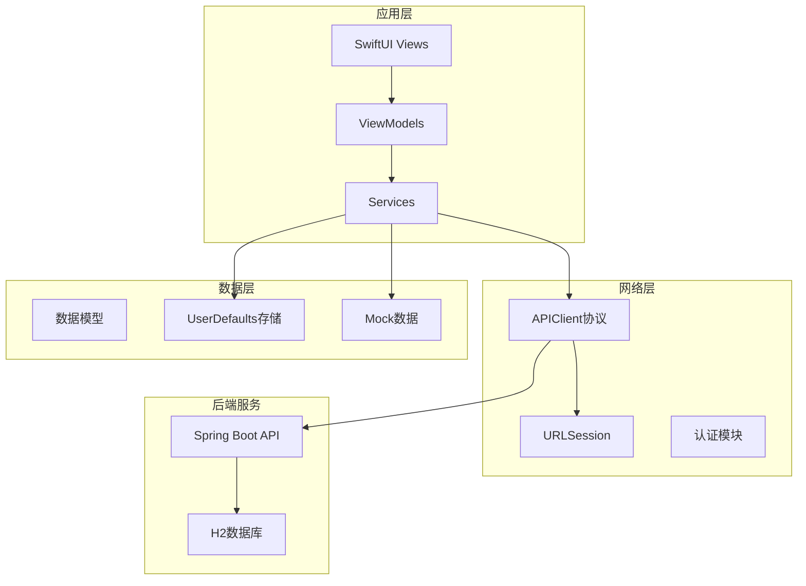
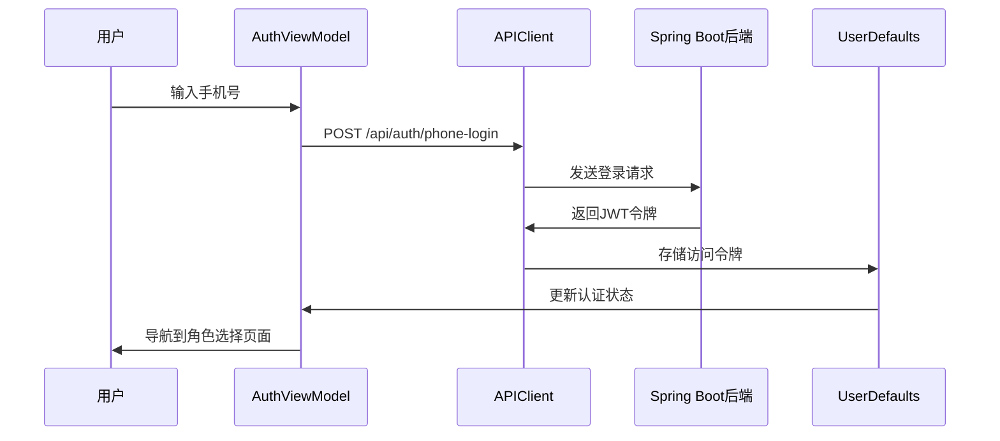
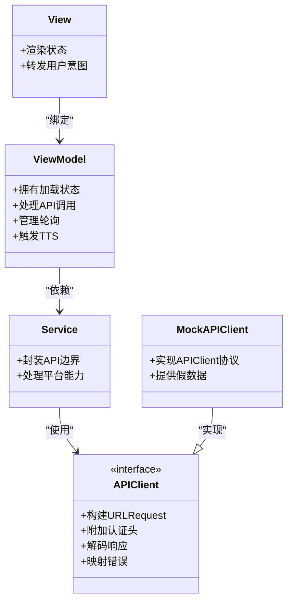
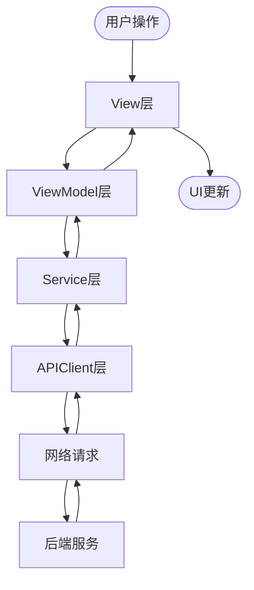
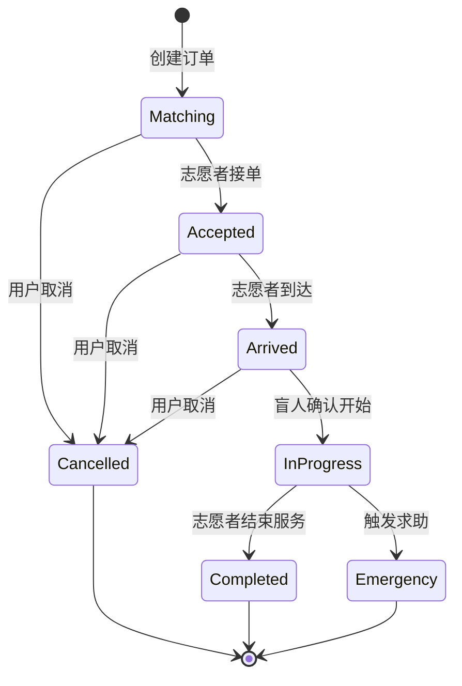
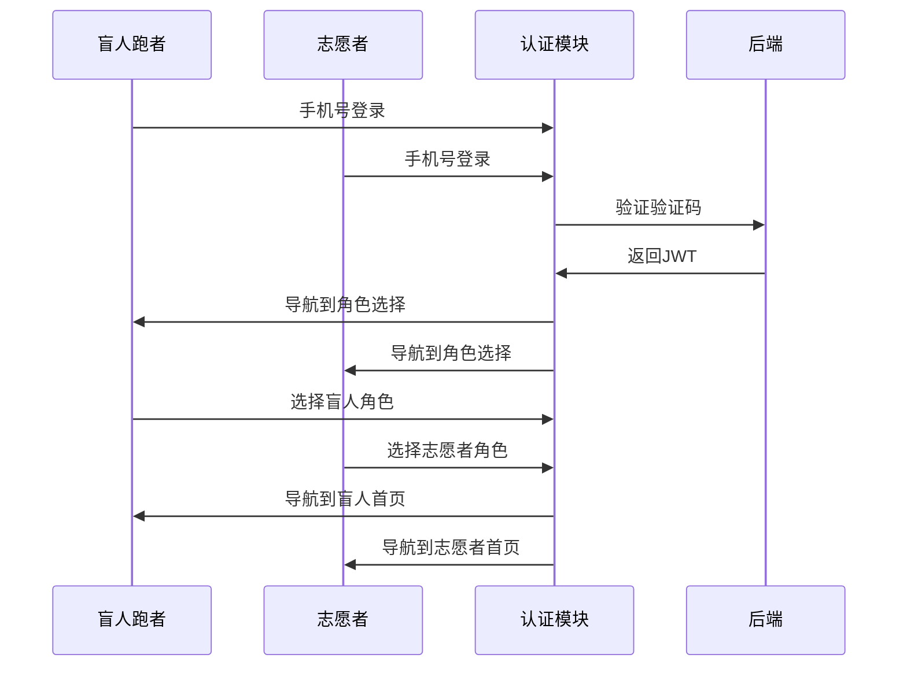
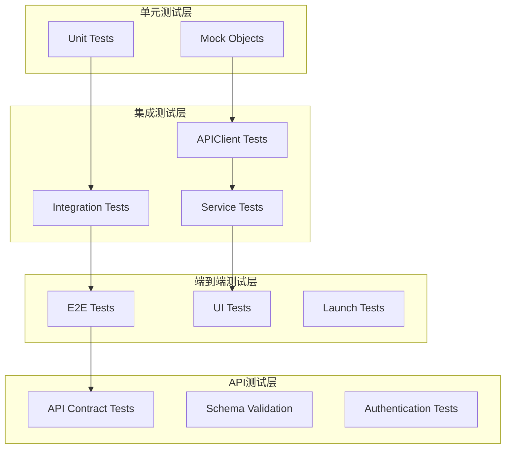
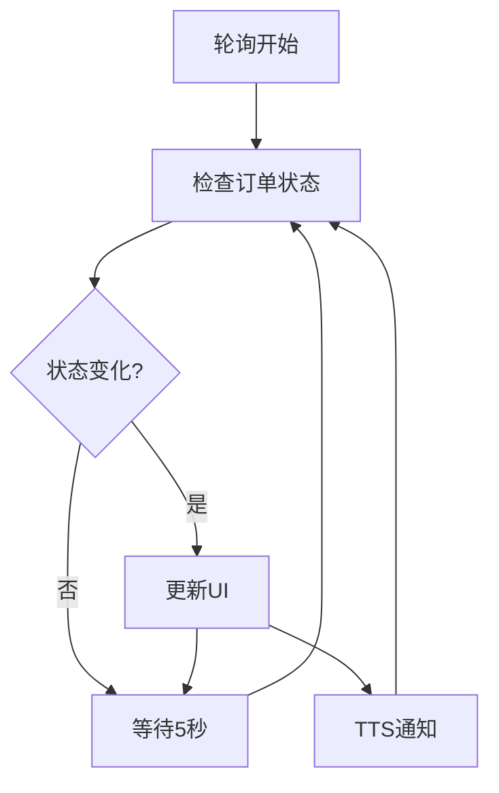

# 集成测试策略文档

<cite>
**本文档引用的文件**
- [blindRunTests.swift](file://blindRunTests/blindRunTests.swift)
- [blindRunUITests.swift](file://blindRunUITests/blindRunUITests.swift)
- [blindRunUITestsLaunchTests.swift](file://blindRunUITests/blindRunUITestsLaunchTests.swift)
- [07-api-contract.openapi.yaml](file://docs/07-api-contract.openapi.yaml)
- [08-ios-architecture.md](file://docs/08-ios-architecture.md)
- [01-product-requirements.md](file://docs/01-product-requirements.md)
- [03-user-stories.md](file://docs/03-user-stories.md)
- [02-mvp-scope.md](file://docs/02-mvp-scope.md)
- [blindRunApp.swift](file://blindRun/blindRunApp.swift)
- [ContentView.swift](file://blindRun/ContentView.swift)
</cite>

## 目录
1. [简介](#简介)
2. [项目结构概述](#项目结构概述)
3. [核心组件分析](#核心组件分析)
4. [架构概览](#架构概览)
5. [详细组件分析](#详细组件分析)
6. [依赖关系分析](#依赖关系分析)
7. [性能考虑](#性能考虑)
8. [故障排查指南](#故障排查指南)
9. [结论](#结论)

## 简介

本集成测试策略文档专为blindRun应用设计，这是一个基于SwiftUI + MVVM架构的iOS应用，实现了助盲跑服务平台的核心功能。该应用支持双角色用户（盲人跑者和志愿者），通过JWT认证和REST API与Spring Boot后端进行交互。

blindRun应用的核心特性包括：
- 手机号登录认证（固定验证码123456）
- 角色切换机制（盲人跑者/志愿者）
- 订单生命周期管理（从创建到完成）
- 实时状态轮询（5秒间隔）
- 无障碍功能（VoiceOver + TTS）
- 高德地图集成

## 项目结构概述

blindRun应用采用模块化架构，主要包含以下核心模块：

**图表来源**
- [08-ios-architecture.md:18-32](file://docs/08-ios-architecture.md#L18-L32)
- [08-ios-architecture.md:68-82](file://docs/08-ios-architecture.md#L68-L82)

**章节来源**
- [08-ios-architecture.md:1-165](file://docs/08-ios-architecture.md#L1-L165)
- [01-product-requirements.md:116-141](file://docs/01-product-requirements.md#L116-L141)

## 核心组件分析

### 网络层架构

应用采用统一的APIClient协议设计，支持多种环境配置：

| 环境类型 | 目的 | URL配置 | 适用场景 |
|---------|------|---------|----------|
| Mock | 本地假数据调试 | 本地服务器地址 | UI和流程调试 |
| Local Backend | 开发者Mac局域网 | http://localhost:8080 | 本地开发测试 |
| Production | 生产部署预留 | 占位符URL | 后续生产环境 |

### 认证与会话管理

应用使用JWT Bearer认证机制，支持以下认证流程：

**图表来源**
- [07-api-contract.openapi.yaml:25-46](file://docs/07-api-contract.openapi.yaml#L25-L46)
- [08-ios-architecture.md:78-82](file://docs/08-ios-architecture.md#L78-L82)

**章节来源**
- [08-ios-architecture.md:68-82](file://docs/08-ios-architecture.md#L68-L82)
- [07-api-contract.openapi.yaml:25-46](file://docs/07-api-contract.openapi.yaml#L25-L46)

## 架构概览

### MVVM架构模式

应用严格遵循MVVM架构模式，确保良好的可测试性和可维护性：

**图表来源**
- [08-ios-architecture.md:33-49](file://docs/08-ios-architecture.md#L33-L49)
- [08-ios-architecture.md:68-82](file://docs/08-ios-architecture.md#L68-L82)

### 数据流架构

应用的数据流遵循单向数据流原则：

**图表来源**
- [08-ios-architecture.md:33-49](file://docs/08-ios-architecture.md#L33-L49)

## 详细组件分析

### 订单生命周期集成测试

订单生命周期是应用的核心业务流程，涉及多个API端点和状态转换：

**图表来源**
- [07-api-contract.openapi.yaml:580-582](file://docs/07-api-contract.openapi.yaml#L580-L582)
- [03-user-stories.md:595-652](file://docs/03-user-stories.md#L595-L652)

### 认证流程集成测试

应用支持手机号登录和角色切换的完整认证流程：

**图表来源**
- [07-api-contract.openapi.yaml:25-46](file://docs/07-api-contract.openapi.yaml#L25-L46)
- [03-user-stories.md:101-158](file://docs/03-user-stories.md#L101-L158)

**章节来源**
- [03-user-stories.md:1-800](file://docs/03-user-stories.md#L1-L800)
- [07-api-contract.openapi.yaml:25-46](file://docs/07-api-contract.openapi.yaml#L25-L46)

## 依赖关系分析

### 测试层次结构

应用的测试架构分为多个层次，确保全面的覆盖：

**图表来源**
- [blindRunTests.swift:1-39](file://blindRunTests/blindRunTests.swift#L1-L39)
- [blindRunUITests.swift:1-44](file://blindRunUITests/blindRunUITests.swift#L1-L44)

### 环境依赖管理

应用支持三种运行环境，每种环境都有特定的依赖要求：

| 环境 | 依赖要求 | 配置方式 | 测试重点 |
|------|----------|----------|----------|
| Mock | 本地假数据 | MockAPIClient实现 | UI交互和业务逻辑 |
| Local Backend | 局域网Spring Boot服务 | localhost:8080 | 网络通信和数据同步 |
| Production | 远程后端服务 | 环境变量配置 | 性能和稳定性 |

**章节来源**
- [08-ios-architecture.md:50-66](file://docs/08-ios-architecture.md#L50-L66)
- [02-mvp-scope.md:136-153](file://docs/02-mvp-scope.md#L136-L153)

## 性能考虑

### 轮询机制测试

应用采用5秒轮询机制监控订单状态变化，这需要特别的性能测试策略：

**图表来源**
- [08-ios-architecture.md:125-139](file://docs/08-ios-architecture.md#L125-L139)
- [03-user-stories.md:655-669](file://docs/03-user-stories.md#L655-L669)

### 网络延迟模拟

在集成测试中需要模拟不同的网络条件：

| 条件 | 延迟范围 | 丢包率 | 测试场景 |
|------|----------|--------|----------|
| 正常网络 | 0-100ms | 0% | 日常使用场景 |
| 较差网络 | 200-500ms | 1-2% | 移动网络场景 |
| 弱网络 | 500-1000ms | 5-10% | 信号不稳定场景 |
| 超时网络 | >1000ms | 15-30% | 网络故障场景 |

## 故障排查指南

### 常见集成测试问题

#### 1. 认证失败问题
- **症状**：API调用返回401未授权
- **排查步骤**：
  1. 验证JWT令牌是否正确存储
  2. 检查Authorization头是否正确添加
  3. 确认后端服务正在运行
  4. 验证固定验证码123456

#### 2. 订单状态同步问题
- **症状**：UI状态与后端状态不一致
- **排查步骤**：
  1. 检查轮询间隔设置
  2. 验证WebSocket连接状态
  3. 确认订单ID传递正确
  4. 检查状态转换逻辑

#### 3. 网络连接问题
- **症状**：API请求超时或失败
- **排查步骤**：
  1. 验证后端服务URL配置
  2. 检查防火墙设置
  3. 确认局域网连通性
  4. 验证SSL证书（如适用）

### 测试数据准备策略

#### Mock数据设计
- **用户数据**：模拟盲人跑者和志愿者账户
- **订单数据**：覆盖所有订单状态组合
- **地理位置**：模拟不同城市的坐标
- **时间数据**：包含过去、现在、未来的预约时间

#### 测试环境隔离
- **数据库隔离**：使用独立的测试数据库
- **缓存隔离**：清空测试前后的缓存数据
- **会话隔离**：为每个测试创建独立的用户会话
- **文件系统隔离**：使用临时目录存储测试文件

**章节来源**
- [07-api-contract.openapi.yaml:453-542](file://docs/07-api-contract.openapi.yaml#L453-L542)
- [08-ios-architecture.md:125-139](file://docs/08-ios-architecture.md#L125-L139)

## 结论

blindRun应用的集成测试策略应该重点关注以下几个方面：

1. **模块间交互测试**：验证MVVM架构中各层之间的正确协作
2. **API集成测试**：确保网络层与后端服务的稳定通信
3. **业务流程测试**：覆盖完整的用户操作流程
4. **错误处理测试**：验证异常情况下的系统行为
5. **性能测试**：确保轮询机制和网络请求的性能表现

通过实施这套全面的集成测试策略，可以确保blindRun应用在各种使用场景下都能提供稳定可靠的服务，为盲人跑者和志愿者创造更好的用户体验。