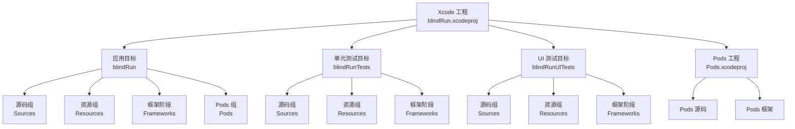
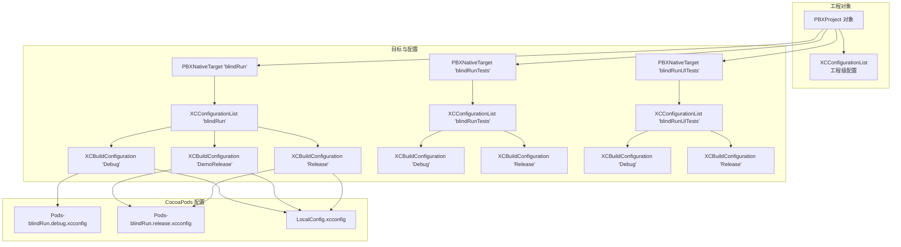
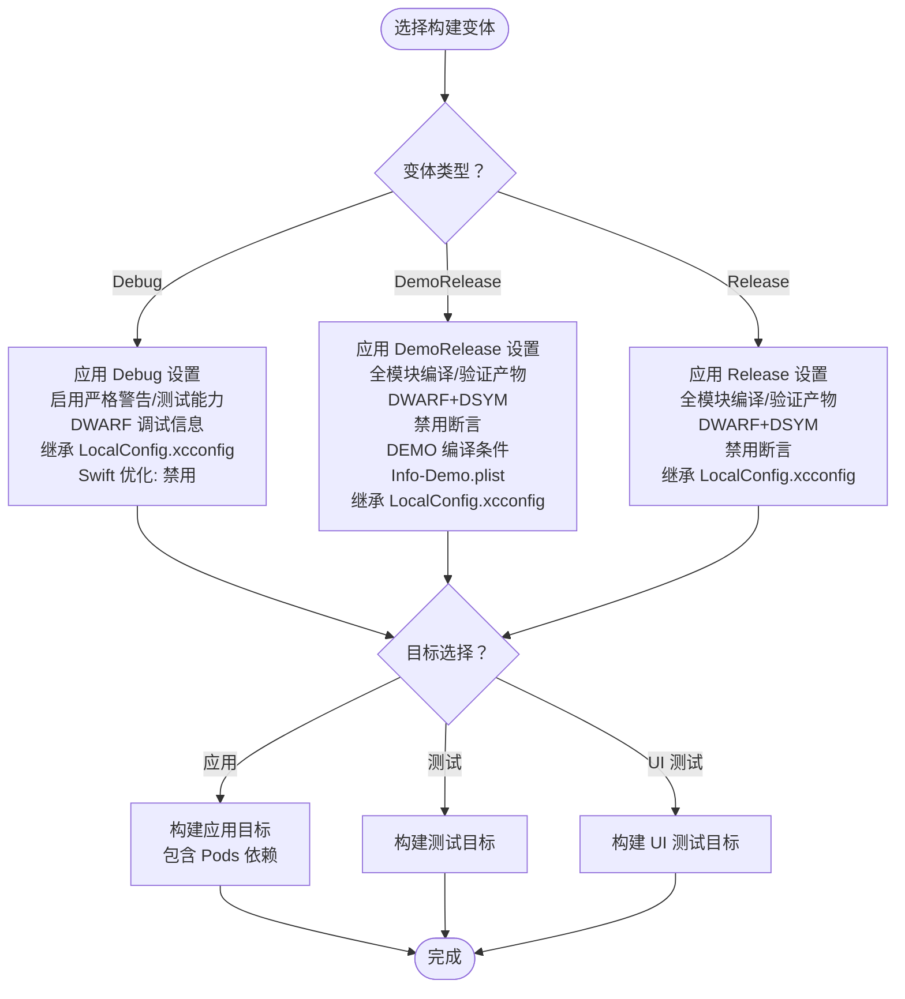
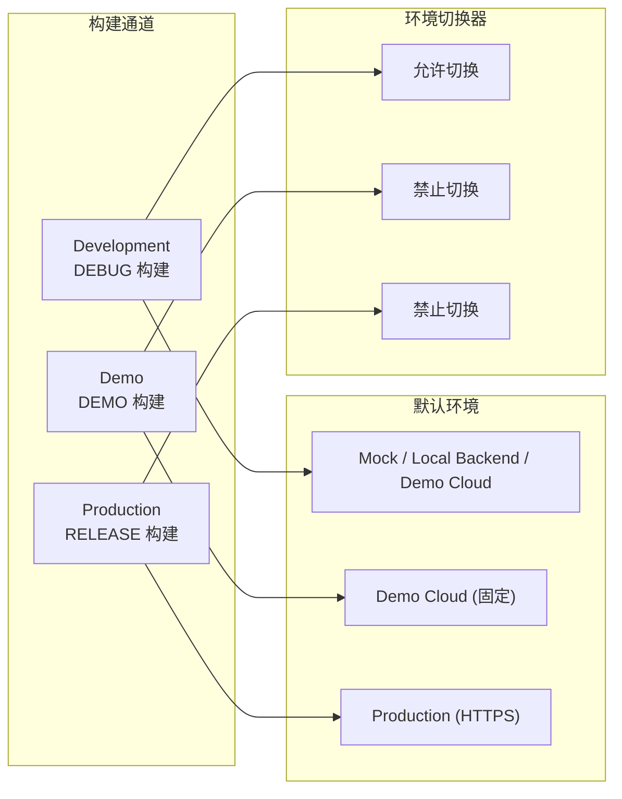
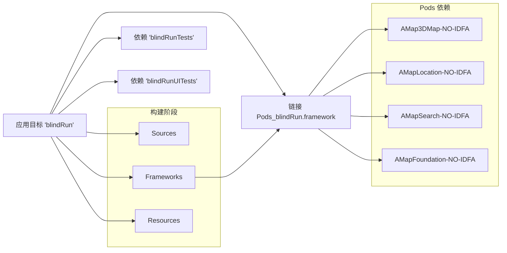

# 构建配置

<cite>
**本文引用的文件**
- [project.pbxproj](file://blindRun.xcodeproj/project.pbxproj)
- [xcschememanagement.plist](file://blindRun.xcodeproj/xcuserdata/jerry.xcuserdatad/xcschemes/xcschememanagement.plist)
- [Podfile](file://Podfile)
- [Podfile.lock](file://Podfile.lock)
- [contents.xcworkspacedata](file://blindRun.xcworkspace/contents.xcworkspacedata)
- [LocalConfig.xcconfig](file://LocalConfig.xcconfig)
- [Info.plist](file://blindRun/Info.plist)
- [Info-Demo.plist](file://blindRun/Info-Demo.plist)
- [blindRunApp.swift](file://blindRun/blindRunApp.swift)
- [AMapManager.swift](file://blindRun/Map/AMapManager.swift)
- [AMapContainer.swift](file://blindRun/Map/AMapContainer.swift)
- [EnvironmentConfig.swift](file://blindRun/Core/EnvironmentConfig.swift)
- [AppState.swift](file://blindRun/Core/AppState.swift)
- [blindRunTests.swift](file://blindRunTests/blindRunTests.swift)
- [blindRunUITests.swift](file://blindRunUITests/blindRunUITests.swift)
- [blindRunUITestsLaunchTests.swift](file://blindRunUITests/blindRunUITestsLaunchTests.swift)
</cite>

## 更新摘要
**所做更改**
- 新增构建通道系统章节，详细说明 development、demo、production 三种构建通道及其环境访问控制机制
- 更新构建变体配置图表，包含 DemoRelease 变体
- 新增 Info-Demo.plist 配置说明，解释演示版专用配置文件
- 更新环境配置章节，增加构建通道与 API 环境的关联关系
- 新增构建通道行为测试用例说明
- 更新 CocoaPods 配置，支持 DemoRelease 构建变体映射

## 目录
1. [简介](#简介)
2. [项目结构](#项目结构)
3. [核心组件](#核心组件)
4. [架构总览](#架构总览)
5. [详细组件分析](#详细组件分析)
6. [CocoaPods 依赖管理系统](#cocoapods-依赖管理系统)
7. [本地配置管理](#本地配置管理)
8. [构建通道系统](#构建通道系统)
9. [高德地图 SDK 集成](#高德地图-sdk-集成)
10. [依赖关系分析](#依赖关系分析)
11. [性能考虑](#性能考虑)
12. [故障排查指南](#故障排查指南)
13. [结论](#结论)
14. [附录](#附录)

## 简介
本文件面向开发团队，系统化梳理 blindRun iOS 应用的构建配置与工程设置，覆盖以下主题：
- Xcode 项目构建设置与编译选项
- 目标配置与构建变体（Debug、DemoRelease、Release）
- CocoaPods 依赖管理系统与高德地图 SDK 集成
- Swift 包管理器与依赖集成（当前仓库未启用 Swift Package Manager）
- 本地配置管理与 API Key 管理
- 构建通道系统与环境隔离
- 代码签名、证书与 Provisioning Profile 配置
- 构建脚本与自动化流程建议
- 性能优化、调试符号与包体积优化
- 团队构建环境搭建与维护最佳实践

## 项目结构
blindRun 采用标准 Xcode 工程组织，现已集成 CocoaPods 依赖管理系统，包含应用主目标、单元测试与 UI 测试目标，以及资源与源码分组。新增了 DemoRelease 构建变体，支持演示版应用的独立配置。



**图表来源**
- [project.pbxproj:101-143](file://blindRun.xcodeproj/project.pbxproj#L101-L143)
- [contents.xcworkspacedata:1-11](file://blindRun.xcworkspace/contents.xcworkspacedata#L1-L11)

**章节来源**
- [project.pbxproj:101-143](file://blindRun.xcodeproj/project.pbxproj#L101-L143)
- [contents.xcworkspacedata:1-11](file://blindRun.xcworkspace/contents.xcworkspacedata#L1-L11)

## 核心组件
- 应用主目标：负责打包生成 .app 产物，面向设备与模拟器构建，现已集成 CocoaPods 依赖。
- 单元测试目标：用于执行 Swift 单元测试，依赖应用主目标。
- UI 测试目标：用于执行 UI 自动化测试，依赖应用主目标。
- Pods 工程：由 CocoaPods 自动生成，管理第三方依赖库。
- 资源与源码：应用图标、颜色集等资源位于 Assets.xcassets；应用入口与视图由 Swift 源文件定义。
- **新增**：DemoRelease 构建变体：专为演示用途设计的构建配置，具有独立的 Info.plist 和环境限制。

**章节来源**
- [project.pbxproj:145-210](file://blindRun.xcodeproj/project.pbxproj#L145-L210)
- [project.pbxproj:101-143](file://blindRun.xcodeproj/project.pbxproj#L101-L143)
- [blindRunApp.swift](file://blindRun/blindRunApp.swift)

## 架构总览
下图展示构建配置在工程中的角色与相互关系，包括目标、构建阶段、配置列表与具体构建设置，以及新增的 CocoaPods 依赖管理和 DemoRelease 构建变体。



**图表来源**
- [project.pbxproj:357-712](file://blindRun.xcodeproj/project.pbxproj#L357-L712)
- [project.pbxproj:32-38](file://blindRun.xcodeproj/project.pbxproj#L32-L38)
- [LocalConfig.xcconfig:16-36](file://LocalConfig.xcconfig#L16-L36)

## 详细组件分析

### 构建变体与目标配置
- Debug 变体
  - 编译器与语言标准：启用模块、ARC、弱引用、严格警告等；Swift 优化级别为禁用；仅活动架构开启；调试信息格式为 DWARF。
  - 运行时特性：启用严格消息发送、测试能力、预览支持等。
  - 配置继承：继承 LocalConfig.xcconfig 和 Pods-blindRun.debug.xcconfig。
  - 设备部署目标：iOS 版本号对应工程设置。
- **新增** DemoRelease 变体
  - 编译器与语言标准：启用模块、ARC、严格警告等；Swift 编译模式为全模块；调试信息格式为 DWARF+DSYM；禁用断言。
  - 运行时特性：启用严格消息发送、预览支持；SWIFT_ACTIVE_COMPILATION_CONDITIONS 包含 DEMO 标识。
  - 配置继承：继承 LocalConfig.xcconfig 和 Pods-blindRun.release.xcconfig。
  - 设备部署目标：iOS 版本号对应工程设置。
  - **特殊配置**：使用 Info-Demo.plist，固定演示云服务地址，禁用环境切换器。
- Release 变体
  - 编译器与语言标准：启用模块、ARC、严格警告等；Swift 编译模式为全模块；调试信息格式为 DWARF+DSYM；禁用断言。
  - 运行时特性：验证产物、关闭调试信息。
  - 配置继承：继承 LocalConfig.xcconfig 和 Pods-blindRun.release.xcconfig。
  - 设备部署目标：iOS 版本号对应工程设置。



**图表来源**
- [project.pbxproj:357-712](file://blindRun.xcodeproj/project.pbxproj#L357-L712)

**章节来源**
- [project.pbxproj:357-712](file://blindRun.xcodeproj/project.pbxproj#L357-L712)

### Swift 包管理器与依赖集成
- 当前仓库未检测到 Swift Package Manager 集成文件（如 Package.swift 或 Package.resolved），因此默认不启用 SPM。
- 已集成 CocoaPods 依赖管理系统，专门用于管理高德地图 SDK 及其相关依赖。
- 若后续引入其他第三方依赖，建议继续使用 CocoaPods 管理，保持依赖管理的一致性。
- 版本管理策略建议：
  - 使用精确版本锁定以确保可重复构建；
  - 对于公共依赖，优先使用语义化版本范围并定期审阅更新；
  - 在 CI 中缓存依赖以提升构建速度。

**章节来源**
- [Podfile:1-32](file://Podfile#L1-L32)
- [Podfile.lock:1-31](file://Podfile.lock#L1-L31)

### 构建脚本与自动化流程
- 已配置 CocoaPods 相关的构建脚本：
  - [CP] Check Pods Manifest.lock：验证 Podfile.lock 与实际安装的依赖一致性
  - [CP] Copy Pods Resources：复制 Pods 依赖的资源文件
- 建议在工程中添加 Run Script Build Phase 执行通用任务（如依赖安装、资源生成、代码检查）。
- 自动化流程建议：
  - 使用 xcodebuild 指定方案与目标进行命令行构建；
  - 在 CI 中结合 fastlane 或 GitHub Actions 完成签名、打包与分发；
  - 将构建产物与符号表上传至崩溃分析平台（如 Firebase Crashlytics、App Center）。

**章节来源**
- [project.pbxproj:278-318](file://blindRun.xcodeproj/project.pbxproj#L278-L318)

## CocoaPods 依赖管理系统

### 依赖配置
项目使用 CocoaPods 管理高德地图 SDK 依赖，配置文件位于根目录的 Podfile：

```ruby
platform :ios, '16.0'

project 'blindRun', {
  'Debug' => :debug,
  'DemoRelease' => :release,
  'Release' => :release
}

target 'blindRun' do
  use_frameworks!

  # 高德地图 SDK (NO-IDFA 版本，避免审核问题)
  pod 'AMap3DMap-NO-IDFA'
  pod 'AMapLocation-NO-IDFA'
  pod 'AMapSearch-NO-IDFA'
end

post_install do |installer|
  # 设置部署目标为 16.0
  installer.pods_project.targets.each do |target|
    target.build_configurations.each do |config|
      config.build_settings['IPHONEOS_DEPLOYMENT_TARGET'] = '16.0'
    end
  end

  # 禁用脚本沙箱以解决资源复制问题
  installer.aggregate_targets.each do |target|
    target.xcconfigs.each do |variant, xcconfig|
      xcconfig.attributes['ENABLE_USER_SCRIPT_SANDBOXING'] = 'NO'
      # 排除 arm64 模拟器架构以支持 x86_64 (Rosetta)
      xcconfig.attributes['EXCLUDED_ARCHS[sdk=iphonesimulator*]'] = 'arm64'
      target.client_root.join("Pods", "Target Support Files", target.label, "#{target.label}.#{variant.downcase}.xcconfig").open('w') do |f|
        f.write(xcconfig.to_s)
      end
    end
  end
end
```

**章节来源**
- [Podfile:1-42](file://Podfile#L1-L42)

### 依赖版本管理
根据 Podfile.lock 文件，当前使用的高德地图 SDK 版本：
- AMap3DMap-NO-IDFA: 11.1.200
- AMapLocation-NO-IDFA: 2.11.1
- AMapSearch-NO-IDFA: 9.7.5
- AMapFoundation-NO-IDFA: 1.8.7

**章节来源**
- [Podfile.lock:1-31](file://Podfile.lock#L1-L31)

### Pods 工作区集成
项目通过工作空间文件集成 Pods 工程：

```xml
<?xml version="1.0" encoding="UTF-8"?>
<Workspace version="1.0">
   <FileRef location="group:blindRun.xcodeproj"></FileRef>
   <FileRef location="group:Pods/Pods.xcodeproj"></FileRef>
</Workspace>
```

**章节来源**
- [contents.xcworkspacedata:1-11](file://blindRun.xcworkspace/contents.xcworkspacedata#L1-L11)

## 本地配置管理

### LocalConfig.xcconfig 配置
项目提供了 LocalConfig.xcconfig 作为配置模板，开发者需要复制为 LocalConfig.xcconfig 并填入相应的配置信息。

**更新** 新增 DemoRelease 构建配置支持和 AIDRUN_PRODUCTION_API_BASE_URL 环境变量

主要配置项：
- 高德地图 API Key：AMAP_API_KEY = YOUR_AMAP_IOS_KEY_HERE
- **新增** 生产环境 API 基础 URL：AIDRUN_PRODUCTION_API_BASE_URL = https://api.aidrun.example.com
- CocoaPods 集成说明：项目使用 CocoaPods 管理高德 SDK 依赖
- Info.plist 配置：需要在 Xcode Target -> Info -> Custom iOS Target Properties 中添加 AMapApiKey 和 NSLocationWhenInUseUsageDescription

**章节来源**
- [LocalConfig.xcconfig:1-31](file://LocalConfig.xcconfig#L1-L31)

### 配置继承机制
应用目标的构建配置继承了多层配置：
- LocalConfig.xcconfig：本地开发配置
- Pods-blindRun.debug/release.xcconfig：CocoaPods 生成的配置
- 工程默认配置：Xcode 默认构建设置

**章节来源**
- [project.pbxproj:360-361](file://blindRun.xcodeproj/project.pbxproj#L360-L361)
- [project.pbxproj:483-484](file://blindRun.xcodeproj/project.pbxproj#L483-L484)

### Info-Demo.plist 配置
**新增** DemoRelease 构建变体使用独立的 Info-Demo.plist 配置文件：

```xml
<?xml version="1.0" encoding="UTF-8"?>
<!DOCTYPE plist PUBLIC "-//Apple//DTD PLIST 1.0//EN" "http://www.apple.com/DTDs/PropertyList-1.0.dtd">
<plist version="1.0">
<dict>
    <key>AidRunProductionAPIBaseURL</key>
    <string>$(AIDRUN_PRODUCTION_API_BASE_URL)</string>
    <key>AMapApiKey</key>
    <string>$(AMAP_API_KEY)</string>
    <key>NSAppTransportSecurity</key>
    <dict>
        <key>NSExceptionDomains</key>
        <dict>
            <key>47.114.113.171</key>
            <dict>
                <key>NSExceptionAllowsInsecureHTTPLoads</key>
                <true/>
                <key>NSIncludesSubdomains</key>
                <false/>
            </dict>
        </dict>
    </dict>
</dict>
</plist>
```

该配置文件专门用于演示版应用，包含演示云服务的 HTTP 访问例外和生产 API 基础 URL 的环境变量引用。

**章节来源**
- [Info-Demo.plist:1-28](file://blindRun/Info-Demo.plist#L1-L28)

## 构建通道系统

### 构建通道概述
项目实现了三种构建通道，每种通道都有不同的环境限制和行为：



**图表来源**
- [EnvironmentConfig.swift:5-45](file://blindRun/Core/EnvironmentConfig.swift#L5-L45)
- [project.pbxproj:728](file://blindRun.xcodeproj/project.pbxproj#L728)

### Development 通道（Debug）
- 编译条件：#if DEBUG
- 默认环境：Mock、Local Backend、Demo Cloud
- 环境切换器：允许用户在不同环境间切换
- 适用场景：本地开发、功能测试、调试

### Demo 通道（DemoRelease）
- 编译条件：#elseif DEMO
- 默认环境：Demo Cloud（固定，不可切换）
- 环境切换器：禁止切换
- 适用场景：演示、评审、外部测试

### Production 通道（Release）
- 编译条件：#else
- 默认环境：Production（HTTPS）
- 环境切换器：禁止切换
- 适用场景：正式发布、最终测试

### 环境配置实现
构建通道通过预处理器宏和编译条件实现：

```swift
enum AppBuildChannel: Sendable {
    case development
    case demo
    case production

    static var current: AppBuildChannel {
        #if DEBUG
        return .development
        #elseif DEMO
        return .demo
        #else
        return .production
        #endif
    }

    var allowsEnvironmentSwitcher: Bool {
        self == .development
    }

    var defaultEnvironment: APIEnvironment {
        switch self {
        case .development:
            return .mock
        case .demo:
            return .demoCloud
        case .production:
            return .production
        }
    }

    func allows(_ environment: APIEnvironment) -> Bool {
        switch self {
        case .development:
            return [.mock, .demoCloud].contains(environment)
        case .demo:
            return environment == .demoCloud
        case .production:
            return environment == .production
        }
    }
}
```

**章节来源**
- [EnvironmentConfig.swift:1-45](file://blindRun/Core/EnvironmentConfig.swift#L1-L45)
- [project.pbxproj:728](file://blindRun.xcodeproj/project.pbxproj#L728)

### API 环境配置
API 环境根据构建通道和用户选择动态确定：

```swift
enum APIEnvironment: String, CaseIterable, Sendable {
    case mock
    case localBackend
    case demoCloud
    case production

    var displayName: String {
        switch self {
        case .mock:
            return "Mock (本地模拟)"
        case .localBackend:
            return "本地后端"
        case .demoCloud:
            return "演示云端"
        case .production:
            return "生产环境"
        }
    }

    var baseURL: URL? {
        switch self {
        case .mock:
            return nil  // Mock 模式不使用网络
        case .localBackend:
            return AppConstants.LocalBackend.normalizedBaseURL(...)
        case .demoCloud:
            return AppConstants.DemoCloud.baseURL  // http://47.114.113.171
        case .production:
            return AppConstants.ProductionBackend.configuredBaseURL()
        }
    }
}
```

**章节来源**
- [EnvironmentConfig.swift:49-89](file://blindRun/Core/EnvironmentConfig.swift#L49-L89)

### 构建通道行为测试
构建通道系统通过以下测试用例验证：

```swift
func testDemoReleaseLocksInitialEnvironmentToDemoCloud() {
    XCTAssertEqual(AppState.resolvedInitialEnvironment(.mock, channel: .demo), .demoCloud)
    XCTAssertEqual(AppState.resolvedInitialEnvironment(.localBackend, channel: .demo), .demoCloud)
    XCTAssertEqual(AppState.resolvedInitialEnvironment(.demoCloud, channel: .demo), .demoCloud)
    XCTAssertEqual(AppState.resolvedInitialEnvironment(.production, channel: .demo), .demoCloud)
}

func testProductionReleaseLocksInitialEnvironmentToProduction() {
    XCTAssertEqual(AppState.resolvedInitialEnvironment(.mock, channel: .production), .production)
    XCTAssertEqual(AppState.resolvedInitialEnvironment(.localBackend, channel: .production), .production)
    XCTAssertEqual(AppState.resolvedInitialEnvironment(.demoCloud, channel: .production), .production)
    XCTAssertEqual(AppState.resolvedInitialEnvironment(.production, channel: .production), .production)
}

func testStoredLegacyProductionEnvironmentMapsToDemoCloudOutsideProductionBuilds() {
    XCTAssertEqual(AppState.storedEnvironment(from: "production", channel: .development), .demoCloud)
    XCTAssertEqual(AppState.storedEnvironment(from: "production", channel: .demo), .demoCloud)
    XCTAssertEqual(AppState.storedEnvironment(from: "production", channel: .production), .production)
}
```

**章节来源**
- [blindRunTests.swift:129-169](file://blindRunTests/blindRunTests.swift#L129-L169)

## 高德地图 SDK 集成

### SDK 初始化流程
应用在启动时通过 AMapManager.configure() 方法初始化高德地图 SDK：

```swift
static func configure() {
    guard let key = resolveAPIKey(),
          !key.isEmpty,
          key != "YOUR_AMAP_IOS_KEY_HERE" else {
        isConfigured = false
        #if DEBUG
        print("[AMapManager] 高德地图 Key 未配置，地图功能不可用。请参考 LocalConfig.xcconfig 配置 Key。")
        #endif
        return
    }

    AMapServices.shared().apiKey = key
    AMapServices.shared().enableHTTPS = true
    isConfigured = true

    #if DEBUG
    print("[AMapManager] 高德地图 SDK 初始化成功")
    #endif
}
```

**章节来源**
- [AMapManager.swift:14-34](file://blindRun/Map/AMapManager.swift#L14-L34)

### 地图容器组件
AMapContainer 提供了 SwiftUI 与高德地图 SDK 的桥接：

```swift
struct AMapContainer: UIViewRepresentable {
    let centerCoordinate: CLLocationCoordinate2D
    var showsUserLocation: Bool = true
    var annotations: [MapAnnotationItem] = []
    var zoomLevel: CGFloat = 15.0

    func makeUIView(context: Context) -> MAMapView {
        let mapView = MAMapView(frame: .zero)
        mapView.delegate = context.coordinator
        mapView.showsUserLocation = showsUserLocation
        mapView.userTrackingMode = .follow
        mapView.setZoomLevel(zoomLevel, animated: false)
        mapView.setCenter(centerCoordinate, animated: false)
        mapView.showsCompass = true
        mapView.showsScale = true
        return mapView
    }
}
```

**章节来源**
- [AMapContainer.swift:19-36](file://blindRun/Map/AMapContainer.swift#L19-L36)

### 地图功能封装
MapViewWrapper 根据 SDK 配置状态自动选择显示地图或占位视图：

```swift
struct MapViewWrapper: View {
    let centerCoordinate: CLLocationCoordinate2D
    var showsUserLocation: Bool = true
    var annotations: [MapAnnotationItem] = []
    var zoomLevel: CGFloat = 15.0

    var body: some View {
        if AMapManager.isConfigured {
            AMapContainer(...)
        } else {
            MapPlaceholderView()
        }
    }
}
```

**章节来源**
- [AMapContainer.swift:105-125](file://blindRun/Map/AMapContainer.swift#L105-L125)

### 构建配置优化
CocoaPods 配置中包含了针对高德地图 SDK 的特殊优化：
- 禁用脚本沙箱：解决 Xcode 15+ 默认开启的脚本沙箱阻止资源复制的问题
- 排除 arm64 模拟器架构：支持 x86_64 (Rosetta) 模拟器运行

**章节来源**
- [Podfile:24-29](file://Podfile#L24-L29)

## 依赖关系分析
- 目标依赖：测试目标通过 PBXTargetDependency 依赖应用主目标，确保测试在应用构建后运行。
- 构建阶段：各目标包含 Sources、Frameworks、Resources 三个构建阶段，现已包含 Pods 依赖框架。
- 配置继承：各目标的 XCConfigurationList 统一包含 Debug、DemoRelease 与 Release 三种配置，现已集成 CocoaPods 生成的配置文件。
- Pods 集成：应用目标通过 Frameworks 构建阶段链接 Pods_blindRun.framework。



**图表来源**
- [project.pbxproj:145-210](file://blindRun.xcodeproj/project.pbxproj#L145-L210)
- [project.pbxproj:76-99](file://blindRun.xcodeproj/project.pbxproj#L76-L99)
- [Podfile.lock:1-31](file://Podfile.lock#L1-L31)

**章节来源**
- [project.pbxproj:145-210](file://blindRun.xcodeproj/project.pbxproj#L145-L210)
- [project.pbxproj:76-99](file://blindRun.xcodeproj/project.pbxproj#L76-L99)
- [Podfile.lock:1-31](file://Podfile.lock#L1-L31)

## 性能考虑
- 编译优化
  - Release 和 DemoRelease 下启用全模块编译与验证产物，有助于提升运行时性能与稳定性。
  - Debug 下保持较低优化级别以便调试，同时保留 DWARF 调试信息。
- Metal 性能
  - Release 和 DemoRelease 关闭调试信息，Debug 开启源码调试信息，按需平衡性能与调试体验。
- 包体积优化
  - 在 Release 和 DemoRelease 中移除未使用的资源与代码（配合裁剪工具与链接时优化）；
  - 控制第三方库体积，优先选择轻量级替代方案；
  - 使用 Bitcode 与符号表分离（DSYM）便于发布后问题定位。
- CocoaPods 优化
  - 通过排除不必要的模拟器架构减少包体积；
  - 禁用脚本沙箱避免构建时间开销。

**章节来源**
- [Podfile:24-29](file://Podfile#L24-L29)

## 故障排查指南
- 构建失败
  - 检查目标的构建设置是否匹配当前 Xcode 版本与 iOS SDK；
  - 确认签名设置正确，证书与 Provisioning Profile 有效且未过期。
  - 验证 CocoaPods 依赖安装：运行 `pod install` 确保 Podfile.lock 与实际安装一致。
- 调试困难
  - 确保 Debug 变体的调试信息格式为 DWARF，且未被剥离；
  - 在测试目标中确认 TEST_HOST 指向正确的应用可执行文件。
- 包体积过大
  - 分析二进制大小组成，移除无用资源与静态库；
  - 在 Release 和 DemoRelease 中启用必要的裁剪与压缩选项。
- 高德地图 SDK 问题
  - 确认 LocalConfig.xcconfig 中的 AMAP_API_KEY 已正确配置；
  - 检查 Info.plist 中的 AMapApiKey 配置；
  - 验证 AMapManager.initialize() 是否在应用启动时正确调用。
- **新增** DemoRelease 构建问题
  - 确认 DemoRelease 配置已正确设置 SWIFT_ACTIVE_COMPILATION_CONDITIONS 为 "DEMO $(inherited)"；
  - 验证 Info-Demo.plist 是否正确引用 AIDRUN_PRODUCTION_API_BASE_URL 环境变量；
  - 检查演示云服务地址 http://47.114.113.171 是否可达。
- **新增** 构建通道问题
  - 确认构建通道正确识别：DEBUG、DEMO、PRODUCTION 三者互斥且唯一；
  - 验证环境访问控制：Demo 通道不允许切换到非演示环境，Production 通道只允许生产环境；
  - 检查 API 环境解析逻辑：resolvedInitialEnvironment 和 storedEnvironment 的行为符合预期。

**章节来源**
- [LocalConfig.xcconfig:23-31](file://LocalConfig.xcconfig#L23-L31)
- [AMapManager.swift:14-34](file://blindRun/Map/AMapManager.swift#L14-L34)
- [project.pbxproj:278-318](file://blindRun.xcodeproj/project.pbxproj#L278-L318)
- [Info-Demo.plist:5-21](file://blindRun/Info-Demo.plist#L5-L21)
- [EnvironmentConfig.swift:10-45](file://blindRun/Core/EnvironmentConfig.swift#L10-L45)

## 结论
blindRun 工程现已完整集成 CocoaPods 依赖管理系统，成功引入高德地图 SDK，采用简洁的单应用目标结构，配合标准的 Debug、DemoRelease、Release 变体与测试目标，满足日常开发、演示和生产环境的多样化需求。新增的构建通道机制提供了更好的环境隔离和安全性控制。建议团队在现有基础上完善本地配置管理、CocoaPods 依赖维护与自动化签名流程，并在 CI 中固化构建与分发步骤，以提升交付效率与质量。

## 附录

### 构建变体对比摘要
- Debug
  - 优化级别：禁用
  - 调试信息：DWARF
  - 测试能力：启用
  - 断言：启用
  - 配置继承：LocalConfig.xcconfig + Pods 配置
  - 编译条件：DEBUG
- **新增** DemoRelease
  - 优化级别：启用（全模块编译）
  - 调试信息：DWARF+DSYM
  - 测试能力：启用
  - 断言：禁用
  - 配置继承：LocalConfig.xcconfig + Pods 配置
  - 编译条件：DEMO
  - 特殊配置：Info-Demo.plist，演示云服务访问例外
- Release
  - 优化级别：启用（全模块编译）
  - 调试信息：DWARF+DSYM
  - 测试能力：关闭
  - 断言：禁用
  - 配置继承：LocalConfig.xcconfig + Pods 配置
  - 编译条件：PRODUCTION

**章节来源**
- [project.pbxproj:357-712](file://blindRun.xcodeproj/project.pbxproj#L357-L712)

### 方案与目标映射
- 工程默认方案状态由 xcschemes 管理，当前仅包含应用目标的共享方案条目。

**章节来源**
- [xcschememanagement.plist:1-33](file://blindRun.xcodeproj/xcuserdata/jerry.xcuserdatad/xcschemes/xcschememanagement.plist#L1-L33)

### CocoaPods 依赖版本对照
- AMap3DMap-NO-IDFA: 11.1.200
- AMapLocation-NO-IDFA: 2.11.1
- AMapSearch-NO-IDFA: 9.7.5
- AMapFoundation-NO-IDFA: 1.8.7

**章节来源**
- [Podfile.lock:2-8](file://Podfile.lock#L2-L8)

### 构建通道行为测试
- DemoRelease 构建会将所有环境锁定到演示云服务，防止误用生产环境
- Production 构建要求生产 API 必须使用 HTTPS 协议
- Development 构建允许在多种环境间自由切换

**章节来源**
- [blindRunTests.swift:129-169](file://blindRunTests/blindRunTests.swift#L129-L169)

### 构建通道与 API 环境映射
构建通道系统通过 AppState 类实现环境访问控制：

```swift
static func resolvedInitialEnvironment(
    _ environment: APIEnvironment,
    channel: AppBuildChannel = AppBuildChannel.current
) -> APIEnvironment {
    channel.allows(environment) ? environment : channel.defaultEnvironment
}

static func storedEnvironment(from rawValue: String, channel: AppBuildChannel = AppBuildChannel.current) -> APIEnvironment? {
    if rawValue == "production", channel != .production {
        return .demoCloud
    }
    return APIEnvironment(rawValue: rawValue)
}
```

**章节来源**
- [AppState.swift:212-224](file://blindRun/Core/AppState.swift#L212-L224)