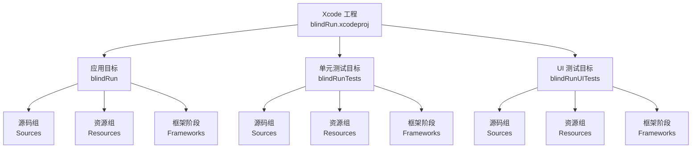
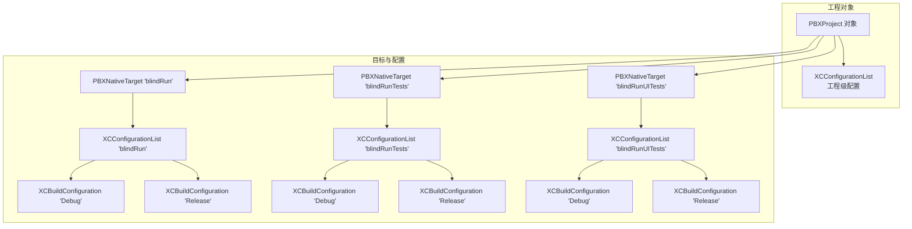
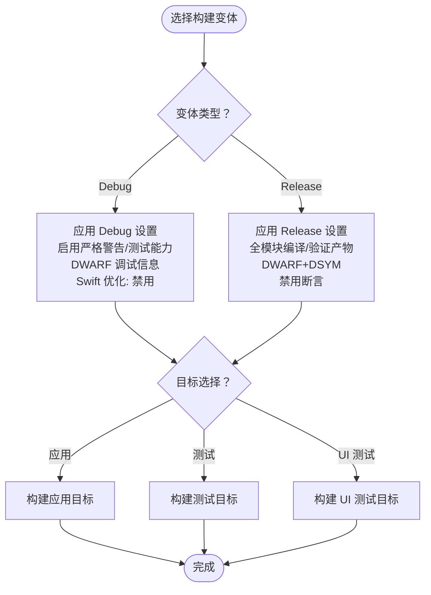
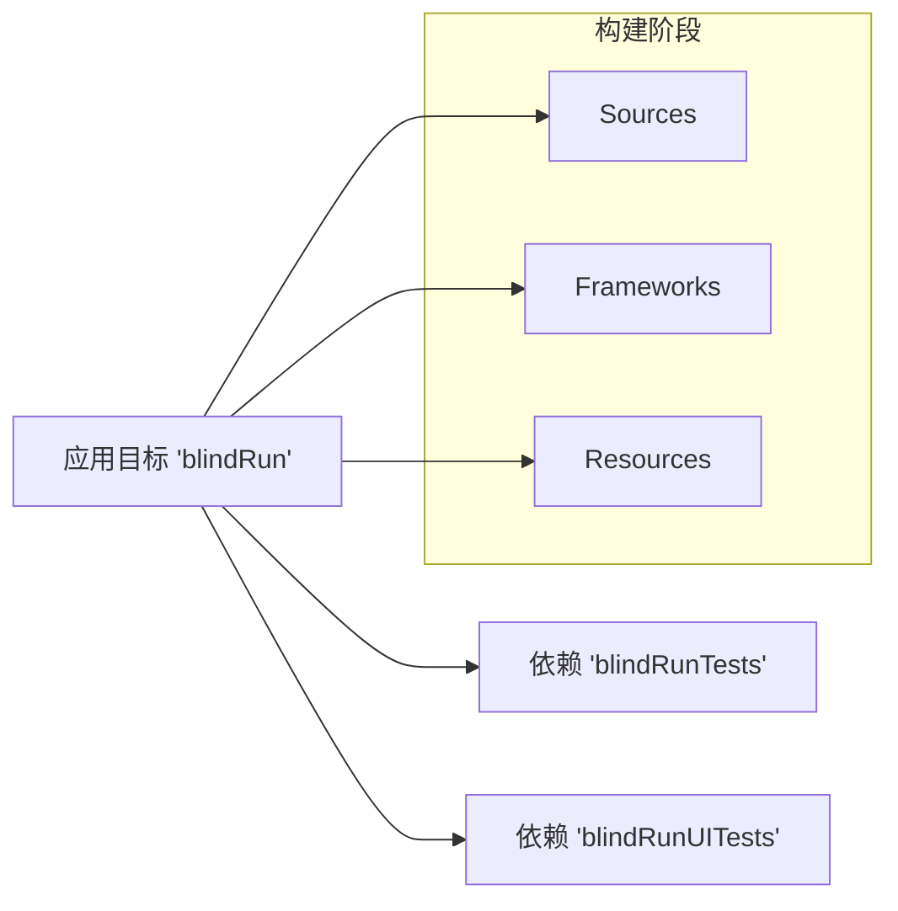

# 构建配置

<cite>
**本文引用的文件**
- [project.pbxproj](file://blindRun.xcodeproj/project.pbxproj)
- [xcschememanagement.plist](file://blindRun.xcodeproj/xcuserdata/jerry.xcuserdatad/xcschemes/xcschememanagement.plist)
- [blindRunApp.swift](file://blindRun/blindRunApp.swift)
- [ContentView.swift](file://blindRun/ContentView.swift)
- [blindRunTests.swift](file://blindRunTests/blindRunTests.swift)
- [blindRunUITests.swift](file://blindRunUITests/blindRunUITests.swift)
- [blindRunUITestsLaunchTests.swift](file://blindRunUITests/blindRunUITestsLaunchTests.swift)
</cite>

## 目录
1. [简介](#简介)
2. [项目结构](#项目结构)
3. [核心组件](#核心组件)
4. [架构总览](#架构总览)
5. [详细组件分析](#详细组件分析)
6. [依赖关系分析](#依赖关系分析)
7. [性能考虑](#性能考虑)
8. [故障排查指南](#故障排查指南)
9. [结论](#结论)
10. [附录](#附录)

## 简介
本文件面向开发团队，系统化梳理 blindRun iOS 应用的构建配置与工程设置，覆盖以下主题：
- Xcode 项目构建设置与编译选项
- 目标配置与构建变体（Debug、Release）
- Swift 包管理器与依赖集成（当前仓库未启用 Swift Package Manager）
- 代码签名、证书与 Provisioning Profile 配置
- 构建脚本与自动化流程建议
- 性能优化、调试符号与包体积优化
- 团队构建环境搭建与维护最佳实践

## 项目结构
blindRun 采用标准 Xcode 工程组织，包含应用主目标、单元测试与 UI 测试目标，以及资源与源码分组。

图表来源
- [project.pbxproj:74-166](file://blindRun.xcodeproj/project.pbxproj#L74-L166)

章节来源
- [project.pbxproj:74-166](file://blindRun.xcodeproj/project.pbxproj#L74-L166)

## 核心组件
- 应用主目标：负责打包生成 .app 产物，面向设备与模拟器构建。
- 单元测试目标：用于执行 Swift 单元测试，依赖应用主目标。
- UI 测试目标：用于执行 UI 自动化测试，依赖应用主目标。
- 资源与源码：应用图标、颜色集等资源位于 Assets.xcassets；应用入口与视图由 Swift 源文件定义。

章节来源
- [project.pbxproj:97-166](file://blindRun.xcodeproj/project.pbxproj#L97-L166)
- [blindRunApp.swift](file://blindRun/blindRunApp.swift)
- [ContentView.swift](file://blindRun/ContentView.swift)

## 架构总览
下图展示构建配置在工程中的角色与相互关系，包括目标、构建阶段、配置列表与具体构建设置。

图表来源
- [project.pbxproj:168-207](file://blindRun.xcodeproj/project.pbxproj#L168-L207)
- [project.pbxproj:543-580](file://blindRun.xcodeproj/project.pbxproj#L543-L580)

## 详细组件分析

### 构建变体与目标配置
- Debug 变体
  - 编译器与语言标准：启用模块、ARC、弱引用、严格警告等；Swift 优化级别为禁用；仅活动架构开启；调试信息格式为 DWARF。
  - 运行时特性：启用严格消息发送、测试能力、预览支持等。
  - 设备部署目标：iOS 版本号对应工程设置。
- Release 变体
  - 编译器与语言标准：启用模块、ARC、严格警告等；Swift 编译模式为全模块；调试信息格式为 DWARF+DSYM；禁用断言。
  - 运行时特性：验证产物、关闭调试信息。
  - 设备部署目标：iOS 版本号对应工程设置。

图表来源
- [project.pbxproj:271-392](file://blindRun.xcodeproj/project.pbxproj#L271-L392)
- [project.pbxproj:393-540](file://blindRun.xcodeproj/project.pbxproj#L393-L540)

章节来源
- [project.pbxproj:271-392](file://blindRun.xcodeproj/project.pbxproj#L271-L392)
- [project.pbxproj:393-540](file://blindRun.xcodeproj/project.pbxproj#L393-L540)

### Swift 包管理器与依赖集成
- 当前仓库未检测到 Swift Package Manager 集成文件（如 Package.swift 或 Package.resolved），因此默认不启用 SPM。
- 若后续引入第三方依赖，建议通过 Xcode 的 Swift Packages 面板添加，或在工程中新增 Package.swift 并统一管理版本与来源。
- 版本管理策略建议：
  - 使用精确版本锁定以确保可重复构建；
  - 对于公共依赖，优先使用语义化版本范围并定期审阅更新；
  - 在 CI 中缓存依赖以提升构建速度。

[本节为通用指导，不直接分析具体文件]

### 代码签名、证书与 Provisioning Profile
- 工程设置中已指定开发团队标识与自动签名样式，适用于本地开发与团队协作。
- 建议：
  - 使用 Apple Developer 账户登录 Xcode；
  - 在目标的“Signing & Capabilities”页设置 Team 与 Bundle Identifier；
  - 为不同分发场景（App Store、TestFlight、Ad-Hoc）准备对应的 Provisioning Profile；
  - 在 CI 环境中使用专用的签名证书与密钥链，配合 fastlane 或 xcodebuild 参数完成自动化签名。

章节来源
- [project.pbxproj:307-371](file://blindRun.xcodeproj/project.pbxproj#L307-L371)
- [project.pbxproj:400-432](file://blindRun.xcodeproj/project.pbxproj#L400-L432)
- [project.pbxproj:463-485](file://blindRun.xcodeproj/project.pbxproj#L463-L485)
- [project.pbxproj:506-527](file://blindRun.xcodeproj/project.pbxproj#L506-L527)

### 构建脚本与自动化流程
- 建议在工程中添加 Run Script Build Phase 执行通用任务（如依赖安装、资源生成、代码检查）。
- 自动化流程建议：
  - 使用 xcodebuild 指定方案与目标进行命令行构建；
  - 在 CI 中结合 fastlane 或 GitHub Actions 完成签名、打包与分发；
  - 将构建产物与符号表上传至崩溃分析平台（如 Firebase Crashlytics、App Center）。

[本节为通用指导，不直接分析具体文件]

### 测试目标与启动测试
- 单元测试与 UI 测试目标均已配置，测试主机指向应用主目标。
- 启动测试（Launch Tests）用于验证应用冷启动路径，建议在 CI 中作为必跑用例。

章节来源
- [project.pbxproj:475-497](file://blindRun.xcodeproj/project.pbxproj#L475-L497)
- [project.pbxproj:517-537](file://blindRun.xcodeproj/project.pbxproj#L517-L537)
- [blindRunUITestsLaunchTests.swift](file://blindRunUITests/blindRunUITestsLaunchTests.swift)

## 依赖关系分析
- 目标依赖：测试目标通过 PBXTargetDependency 依赖应用主目标，确保测试在应用构建后运行。
- 构建阶段：各目标包含 Sources、Frameworks、Resources 三个构建阶段，当前未配置任何外部框架链接。
- 配置继承：各目标的 XCConfigurationList 统一包含 Debug 与 Release 两种配置，便于跨变体对比与切换。

图表来源
- [project.pbxproj:258-269](file://blindRun.xcodeproj/project.pbxproj#L258-L269)
- [project.pbxproj:50-72](file://blindRun.xcodeproj/project.pbxproj#L50-L72)

章节来源
- [project.pbxproj:258-269](file://blindRun.xcodeproj/project.pbxproj#L258-L269)
- [project.pbxproj:50-72](file://blindRun.xcodeproj/project.pbxproj#L50-L72)

## 性能考虑
- 编译优化
  - Release 下启用全模块编译与验证产物，有助于提升运行时性能与稳定性。
  - Debug 下保持较低优化级别以便调试，同时保留 DWARF 调试信息。
- Metal 性能
  - Release 关闭调试信息，Debug 开启源码调试信息，按需平衡性能与调试体验。
- 包体积优化
  - 在 Release 中移除未使用的资源与代码（配合裁剪工具与链接时优化）；
  - 控制第三方库体积，优先选择轻量级替代方案；
  - 使用 Bitcode 与符号表分离（DSYM）便于发布后问题定位。

[本节为通用指导，不直接分析具体文件]

## 故障排查指南
- 构建失败
  - 检查目标的构建设置是否匹配当前 Xcode 版本与 iOS SDK；
  - 确认签名设置正确，证书与 Provisioning Profile 有效且未过期。
- 调试困难
  - 确保 Debug 变体的调试信息格式为 DWARF，且未被剥离；
  - 在测试目标中确认 TEST_HOST 指向正确的应用可执行文件。
- 包体积过大
  - 分析二进制大小组成，移除无用资源与静态库；
  - 在 Release 中启用必要的裁剪与压缩选项。

章节来源
- [project.pbxproj:306-370](file://blindRun.xcodeproj/project.pbxproj#L306-L370)
- [project.pbxproj:475-497](file://blindRun.xcodeproj/project.pbxproj#L475-L497)
- [project.pbxproj:517-537](file://blindRun.xcodeproj/project.pbxproj#L517-L537)

## 结论
blindRun 工程采用简洁的单应用目标结构，配合标准的 Debug/Release 变体与测试目标，满足日常开发与测试需求。建议团队在现有基础上完善 Swift 包管理、自动化签名与打包流程，并在 CI 中固化构建与分发步骤，以提升交付效率与质量。

[本节为总结性内容，不直接分析具体文件]

## 附录

### 构建变体对比摘要
- Debug
  - 优化级别：禁用
  - 调试信息：DWARF
  - 测试能力：启用
  - 断言：启用
- Release
  - 优化级别：启用（全模块编译）
  - 调试信息：DWARF+DSYM
  - 测试能力：关闭
  - 断言：禁用

章节来源
- [project.pbxproj:271-392](file://blindRun.xcodeproj/project.pbxproj#L271-L392)
- [project.pbxproj:393-540](file://blindRun.xcodeproj/project.pbxproj#L393-L540)

### 方案与目标映射
- 工程默认方案状态由 xcschemes 管理，当前仅包含应用目标的共享方案条目。

章节来源
- [xcschememanagement.plist:1-15](file://blindRun.xcodeproj/xcuserdata/jerry.xcuserdatad/xcschemes/xcschememanagement.plist#L1-L15)