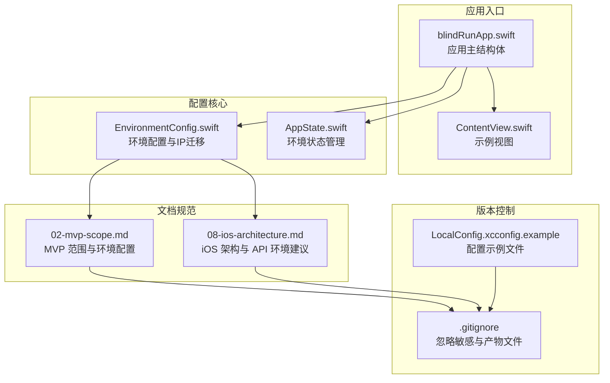
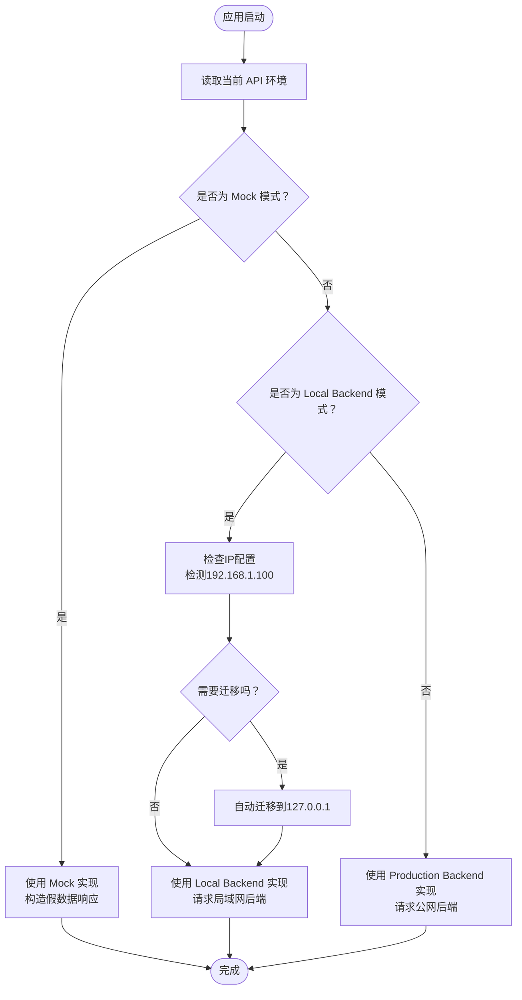
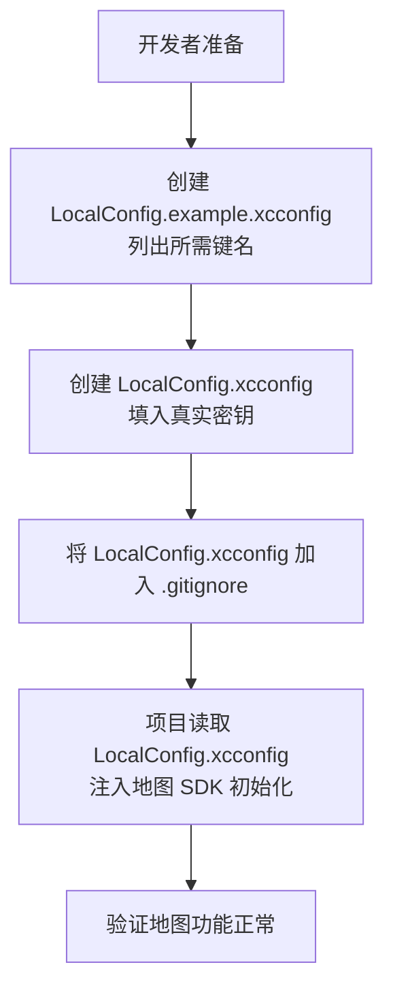
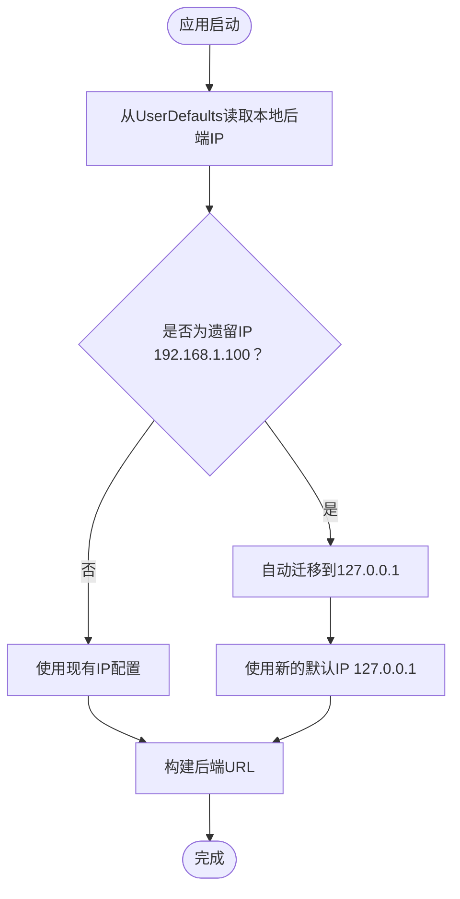
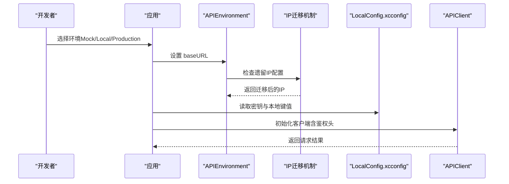
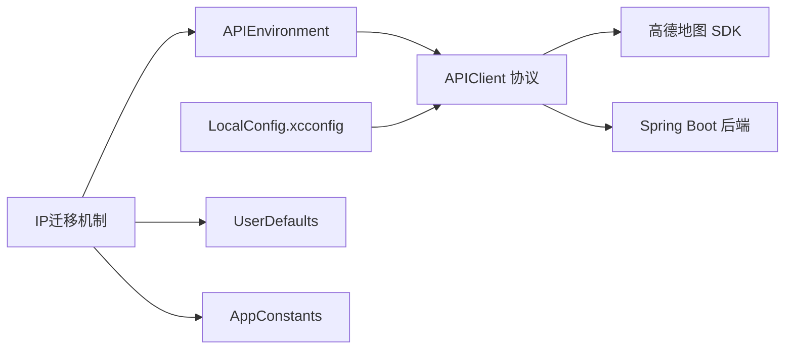

# 环境配置

<cite>
**本文引用的文件**
- [.gitignore](file://.gitignore)
- [blindRunApp.swift](file://blindRun/blindRunApp.swift)
- [ContentView.swift](file://blindRun/ContentView.swift)
- [02-mvp-scope.md](file://docs/02-mvp-scope.md)
- [08-ios-architecture.md](file://docs/08-ios-architecture.md)
- [EnvironmentConfig.swift](file://blindRun/Core/EnvironmentConfig.swift)
- [LocalConfig.xcconfig.example](file://LocalConfig.xcconfig.example)
</cite>

## 目录
1. [简介](#简介)
2. [项目结构](#项目结构)
3. [核心组件](#核心组件)
4. [架构总览](#架构总览)
5. [详细组件分析](#详细组件分析)
6. [依赖分析](#依赖分析)
7. [性能考虑](#性能考虑)
8. [故障排查指南](#故障排查指南)
9. [结论](#结论)
10. [附录](#附录)

## 简介
本文件面向 blindRun iOS 应用的开发者，系统性说明应用的环境配置方法与最佳实践。重点涵盖三类 API 环境模式（Mock、Local Backend、Production Backend）的配置与使用场景；高德地图 API 密钥的管理方式（LocalConfig.xcconfig 的配置、密钥存储位置与安全注意事项）；环境变量与配置文件的加载顺序与优先级；不同开发阶段（开发、测试、生产）的配置差异；以及 .gitignore 的作用与敏感配置的安全管理策略。特别新增了对遗留 IP 地址配置的自动迁移支持，确保从旧版本的 '192.168.1.100' 自动升级到新默认的 '127.0.0.1' 地址。文末提供完整的环境初始化与配置检查清单，帮助团队快速、安全地完成本地与联调环境搭建。

## 项目结构
blindRun 为 SwiftUI 原生 iOS 工程，采用 MVVM 架构，核心入口为应用主结构体与视图层。环境配置相关的关键信息主要沉淀在文档与忽略规则中，实际运行时通过文档中约定的配置方式生效。



**图表来源**
- [blindRunApp.swift:1-29](file://blindRun/blindRunApp.swift#L1-L29)
- [ContentView.swift:1-112](file://blindRun/ContentView.swift#L1-L112)
- [EnvironmentConfig.swift:1-68](file://blindRun/Core/EnvironmentConfig.swift#L1-L68)
- [02-mvp-scope.md:136-151](file://docs/02-mvp-scope.md#L136-L151)
- [08-ios-architecture.md:50-66](file://docs/08-ios-architecture.md#L50-L66)
- [.gitignore:1-71](file://.gitignore#L1-L71)
- [LocalConfig.xcconfig.example:1-31](file://LocalConfig.xcconfig.example#L1-L31)

**章节来源**
- [blindRunApp.swift:1-29](file://blindRun/blindRunApp.swift#L1-L29)
- [ContentView.swift:1-112](file://blindRun/ContentView.swift#L1-L112)
- [EnvironmentConfig.swift:1-68](file://blindRun/Core/EnvironmentConfig.swift#L1-L68)
- [02-mvp-scope.md:136-151](file://docs/02-mvp-scope.md#L136-L151)
- [08-ios-architecture.md:50-66](file://docs/08-ios-architecture.md#L50-L66)
- [.gitignore:1-71](file://.gitignore#L1-L71)
- [LocalConfig.xcconfig.example:1-31](file://LocalConfig.xcconfig.example#L1-L31)

## 核心组件
- API 环境模式
  - Mock：本地假数据，无需后端，适用于 UI 与流程调试。
  - Local Backend：局域网连接 Spring Boot 后端，适用于 Mac 本地运行后端并通过局域网访问移动设备。
  - Production Backend：公网后端，为后续扩展预留。
- 高德地图密钥管理
  - 密钥存储于 LocalConfig.xcconfig 或本地 plist。
  - 本地配置文件加入 .gitignore，避免提交到版本库。
  - 提供 LocalConfig.example.xcconfig 说明所需键名。
- **IP 地址自动迁移机制**
  - 支持从遗留的 '192.168.1.100' 自动迁移到新的默认 '127.0.0.1'。
  - 通过 UserDefaults 检测现有配置，智能判断是否需要执行迁移。
  - 保持向后兼容性，确保老版本用户的无缝升级体验。
- 环境选择与加载
  - 在 Debug 构建中，可通过设置或启动配置暴露小型环境选择器。
  - localBackend 需支持类似 http://192.168.x.x:8080 的局域网地址。
  - 生产 URL 可先保留占位，待部署时再替换。
- 配置加载顺序与优先级
  - 文档建议通过统一的 APIEnvironment 定义 baseURL 与显示名称，并使用单一 APIClient 协议让 Mock 与真实实现共享调用点。
  - 通过 Debug 构建暴露的环境选择器动态决定当前环境。
  - 本地配置（如 LocalConfig.xcconfig）应被项目正确读取，确保密钥与后端地址分离。

**章节来源**
- [02-mvp-scope.md:138-144](file://docs/02-mvp-scope.md#L138-L144)
- [02-mvp-scope.md:146-150](file://docs/02-mvp-scope.md#L146-L150)
- [08-ios-architecture.md:50-66](file://docs/08-ios-architecture.md#L50-L66)
- [08-ios-architecture.md:119-124](file://docs/08-ios-architecture.md#L119-L124)
- [EnvironmentConfig.swift:27-31](file://blindRun/Core/EnvironmentConfig.swift#L27-L31)
- [EnvironmentConfig.swift:54-55](file://blindRun/Core/EnvironmentConfig.swift#L54-L55)

## 架构总览
下图展示了应用如何在不同环境模式下加载配置与调用后端 API。Mock 模式绕过后端直连假数据；Local Backend 通过局域网访问本机后端；Production Backend 指向公网地址。新增的 IP 地址迁移机制确保了配置的向后兼容性。

```mermaid
graph TB
subgraph "应用层"
APP["应用主结构体<br/>blindRunApp.swift"]
VIEW["视图层<br/>ContentView.swift"]
STATE["状态管理<br/>AppState.swift"]
END
subgraph "配置层"
ENV["APIEnvironment<br/>定义 baseURL 与显示名"]
IPMIG["IP迁移机制<br/>自动从192.168.1.100迁移到127.0.0.1"]
CLIENT["APIClient 协议<br/>统一请求构建与鉴权"]
KEY["LocalConfig.xcconfig<br/>高德密钥与本地键值"]
END
subgraph "后端层"
MOCK["Mock 数据源"]
LOCAL["Local Backend<br/>Spring Boot 局域网"]
PROD["Production Backend<br/>公网地址"]
END
APP --> VIEW
APP --> STATE
STATE --> ENV
ENV --> IPMIG
IPMIG --> CLIENT
CLIENT --> MOCK
CLIENT --> LOCAL
CLIENT --> PROD
KEY --> CLIENT
```

**图表来源**
- [blindRunApp.swift:10-28](file://blindRun/blindRunApp.swift#L10-L28)
- [ContentView.swift:10-112](file://blindRun/ContentView.swift#L10-L112)
- [EnvironmentConfig.swift:5-41](file://blindRun/Core/EnvironmentConfig.swift#L5-L41)
- [EnvironmentConfig.swift:27-31](file://blindRun/Core/EnvironmentConfig.swift#L27-L31)
- [02-mvp-scope.md:138-144](file://docs/02-mvp-scope.md#L138-L144)
- [08-ios-architecture.md:50-66](file://docs/08-ios-architecture.md#L50-L66)
- [08-ios-architecture.md:119-124](file://docs/08-ios-architecture.md#L119-L124)

## 详细组件分析

### 组件一：API 环境模式与加载流程
- Mock 模式
  - 用途：UI 与流程调试，无需网络后端。
  - 配置要点：在 APIEnvironment 中设置 Mock 的 baseURL；APIClient 的 Mock 实现负责构造假数据响应。
- Local Backend 模式
  - 用途：Mac 本地运行后端，移动设备通过局域网访问。
  - 配置要点：确保后端监听局域网地址（如 192.168.x.x），APIEnvironment 指向该地址；Debug 构建暴露环境选择器便于切换。
  - **IP 地址迁移**：系统会自动检测并迁移从 '192.168.1.100' 到 '127.0.0.1' 的配置，确保新旧版本的兼容性。
- Production Backend 模式
  - 用途：公网后端，为后续扩展预留。
  - 配置要点：保留占位 URL，待部署后再替换为实际域名。



**图表来源**
- [02-mvp-scope.md:138-144](file://docs/02-mvp-scope.md#L138-L144)
- [08-ios-architecture.md:50-66](file://docs/08-ios-architecture.md#L50-L66)
- [EnvironmentConfig.swift:27-31](file://blindRun/Core/EnvironmentConfig.swift#L27-L31)
- [EnvironmentConfig.swift:54-55](file://blindRun/Core/EnvironmentConfig.swift#L54-L55)

**章节来源**
- [02-mvp-scope.md:138-144](file://docs/02-mvp-scope.md#L138-L144)
- [08-ios-architecture.md:50-66](file://docs/08-ios-architecture.md#L50-L66)
- [EnvironmentConfig.swift:27-31](file://blindRun/Core/EnvironmentConfig.swift#L27-L31)
- [EnvironmentConfig.swift:54-55](file://blindRun/Core/EnvironmentConfig.swift#L54-L55)

### 组件二：高德地图密钥管理与安全
- 密钥存储位置
  - LocalConfig.xcconfig 或本地 plist。
- 安全注意事项
  - 将本地配置文件加入 .gitignore，避免提交到版本库。
  - 提供 LocalConfig.example.xcconfig 说明所需键名，但不包含任何真实密钥。
- 读取与生效
  - 项目需正确读取 LocalConfig.xcconfig 中的键值，确保地图 SDK 初始化时可用。



**图表来源**
- [02-mvp-scope.md:146-150](file://docs/02-mvp-scope.md#L146-L150)
- [08-ios-architecture.md:119-124](file://docs/08-ios-architecture.md#L119-L124)
- [.gitignore:64-65](file://.gitignore#L64-L65)

**章节来源**
- [02-mvp-scope.md:146-150](file://docs/02-mvp-scope.md#L146-L150)
- [08-ios-architecture.md:119-124](file://docs/08-ios-architecture.md#L119-L124)
- [.gitignore:64-65](file://.gitignore#L64-L65)
- [LocalConfig.xcconfig.example:1-31](file://LocalConfig.xcconfig.example#L1-L31)

### 组件三：IP 地址自动迁移机制
- **遗留配置检测**
  - 系统会检查 UserDefaults 中保存的本地后端 IP 配置。
  - 检测值是否等于遗留的 '192.168.1.100'。
- **自动迁移逻辑**
  - 如果检测到遗留配置，自动将其迁移到新的默认 '127.0.0.1'。
  - 迁移后继续使用新的默认地址，确保开发体验的一致性。
- **向后兼容性**
  - 保持对现有配置的完全兼容，不会破坏已有的工作流程。
  - 新用户直接使用默认的 '127.0.0.1' 地址，无需手动配置。



**图表来源**
- [EnvironmentConfig.swift:27-31](file://blindRun/Core/EnvironmentConfig.swift#L27-L31)
- [EnvironmentConfig.swift:54-55](file://blindRun/Core/EnvironmentConfig.swift#L54-L55)

**章节来源**
- [EnvironmentConfig.swift:27-31](file://blindRun/Core/EnvironmentConfig.swift#L27-L31)
- [EnvironmentConfig.swift:54-55](file://blindRun/Core/EnvironmentConfig.swift#L54-L55)

### 组件四：环境变量与配置文件加载顺序与优先级
- 建议的加载顺序
  - 项目启动时先读取 Debug 构建暴露的环境选择器（如设置页或启动参数）。
  - 根据所选环境设置 APIEnvironment.baseURL。
  - 读取 LocalConfig.xcconfig 中的地图密钥等本地键值。
  - 对于其他环境变量（如日志级别、遥测开关），可在同一配置层按需注入。
- 优先级原则
  - Debug 环境下的用户选择优先于默认配置。
  - 本地配置（LocalConfig.xcconfig）优先于硬编码默认值。
  - **IP 迁移机制**：遗留配置会被自动检测并迁移，确保新旧版本的平滑过渡。
  - 生产环境的配置应通过外部注入（如构建参数或打包时替换）而非代码内嵌。



**图表来源**
- [08-ios-architecture.md:50-66](file://docs/08-ios-architecture.md#L50-L66)
- [08-ios-architecture.md:119-124](file://docs/08-ios-architecture.md#L119-L124)
- [EnvironmentConfig.swift:27-31](file://blindRun/Core/EnvironmentConfig.swift#L27-L31)

**章节来源**
- [08-ios-architecture.md:50-66](file://docs/08-ios-architecture.md#L50-L66)
- [08-ios-architecture.md:119-124](file://docs/08-ios-architecture.md#L119-L124)
- [EnvironmentConfig.swift:27-31](file://blindRun/Core/EnvironmentConfig.swift#L27-L31)

### 组件五：不同开发阶段的配置差异对比
- 开发阶段（开发机 + 本地后端）
  - 环境：Local Backend（局域网地址）。
  - 密钥：LocalConfig.xcconfig 中的真实密钥。
  - IP 配置：支持自动从遗留 '192.168.1.100' 迁移到 '127.0.0.1'。
  - 其他：日志级别较高，便于问题定位。
- 测试阶段（测试机 + 本地后端）
  - 环境：Local Backend（局域网地址）。
  - 密钥：LocalConfig.xcconfig 中的真实密钥。
  - IP 配置：自动迁移机制确保测试环境的一致性。
  - 其他：启用必要的自动化测试开关，关注稳定性与回归。
- 生产阶段（线上）
  - 环境：Production Backend（公网地址）。
  - 密钥：通过安全渠道注入（如构建参数或打包时替换），不内嵌于仓库。
  - 其他：严格控制日志级别与遥测开关，确保性能与隐私合规。

**章节来源**
- [02-mvp-scope.md:138-144](file://docs/02-mvp-scope.md#L138-L144)
- [08-ios-architecture.md:50-66](file://docs/08-ios-architecture.md#L50-L66)
- [EnvironmentConfig.swift:27-31](file://blindRun/Core/EnvironmentConfig.swift#L27-L31)
- [EnvironmentConfig.swift:54-55](file://blindRun/Core/EnvironmentConfig.swift#L54-L55)

## 依赖分析
- 组件耦合与内聚
  - APIEnvironment 与 APIClient 协议解耦了环境与网络层，提高可测试性与可维护性。
  - 高德密钥通过 LocalConfig.xcconfig 独立管理，避免与业务代码耦合。
  - **IP 迁移机制**：通过 UserDefaults 和常量定义实现，保持了良好的封装性和可维护性。
- 外部依赖与集成点
  - 高德地图 iOS SDK 需要有效的密钥。
  - 后端 Spring Boot 提供 REST API，支持 Mock、Local Backend 与 Production 三种模式。
  - **IP 迁移依赖**：依赖 UserDefaults 进行配置持久化，依赖 AppConstants 定义常量值。
- 潜在循环依赖
  - 文档层面未见循环依赖迹象；建议在实现时保持配置层与业务层分离，避免反向依赖。



**图表来源**
- [02-mvp-scope.md:138-144](file://docs/02-mvp-scope.md#L138-L144)
- [08-ios-architecture.md:50-66](file://docs/08-ios-architecture.md#L50-L66)
- [08-ios-architecture.md:119-124](file://docs/08-ios-architecture.md#L119-L124)
- [EnvironmentConfig.swift:27-31](file://blindRun/Core/EnvironmentConfig.swift#L27-L31)
- [EnvironmentConfig.swift:45-59](file://blindRun/Core/EnvironmentConfig.swift#L45-L59)

**章节来源**
- [02-mvp-scope.md:138-144](file://docs/02-mvp-scope.md#L138-L144)
- [08-ios-architecture.md:50-66](file://docs/08-ios-architecture.md#L50-L66)
- [08-ios-architecture.md:119-124](file://docs/08-ios-architecture.md#L119-L124)
- [EnvironmentConfig.swift:27-31](file://blindRun/Core/EnvironmentConfig.swift#L27-L31)
- [EnvironmentConfig.swift:45-59](file://blindRun/Core/EnvironmentConfig.swift#L45-L59)

## 性能考虑
- 网络层
  - 使用 URLSession + async/await，减少额外依赖，降低包体积与启动开销。
  - 避免在 Mock 模式下进行网络请求，减少不必要的延迟。
- 地图与定位
  - 高德地图 SDK 初始化时仅加载必要资源，避免在 Mock 模式下初始化地图。
- **IP 迁移性能**
  - IP 迁移操作仅在应用启动时执行一次，性能开销极小。
  - 通过 UserDefaults 缓存迁移结果，避免重复检测。
- 轮询与实时性
  - 订单状态轮询周期为 5 秒，兼顾演示实时性与性能消耗。

**章节来源**
- [08-ios-architecture.md:11-16](file://docs/08-ios-architecture.md#L11-L16)
- [08-ios-architecture.md:125-139](file://docs/08-ios-architecture.md#L125-L139)
- [EnvironmentConfig.swift:27-31](file://blindRun/Core/EnvironmentConfig.swift#L27-L31)

## 故障排查指南
- 无法加载后端 API
  - 检查 APIEnvironment.baseURL 是否与后端监听地址一致（Local Backend 需支持局域网地址）。
  - 确认 Debug 构建中环境选择器已正确设置。
  - **IP 迁移问题**：如果遇到 IP 迁移相关问题，检查 UserDefaults 中的 'localBackendIP' 键值。
- 地图功能异常
  - 检查 LocalConfig.xcconfig 是否存在且未被 .gitignore 忽略。
  - 确认项目已正确读取 LocalConfig.xcconfig 中的地图密钥。
- 配置泄露风险
  - 确保 LocalConfig.xcconfig 已加入 .gitignore，避免提交到版本库。
  - 使用 LocalConfig.example.xcconfig 仅列出键名，不包含真实密钥。
- **IP 迁移故障**
  - 检查 UserDefaults 中是否存在遗留的 '192.168.1.100' 配置。
  - 确认 AppConstants.Defaults.legacyLocalBackendIP 常量值正确。
  - 验证新默认地址 '127.0.0.1' 的可达性。

**章节来源**
- [02-mvp-scope.md:138-150](file://docs/02-mvp-scope.md#L138-L150)
- [08-ios-architecture.md:50-66](file://docs/08-ios-architecture.md#L50-L66)
- [08-ios-architecture.md:119-124](file://docs/08-ios-architecture.md#L119-L124)
- [.gitignore:64-65](file://.gitignore#L64-L65)
- [EnvironmentConfig.swift:27-31](file://blindRun/Core/EnvironmentConfig.swift#L27-L31)
- [EnvironmentConfig.swift:54-55](file://blindRun/Core/EnvironmentConfig.swift#L54-L55)

## 结论
通过明确的三类 API 环境模式、严格的高德地图密钥管理策略、清晰的配置加载顺序以及完善的 IP 地址自动迁移机制，blindRun iOS 应用能够在开发、测试与生产各阶段高效、安全地运行。新增的遗留配置迁移功能确保了从旧版本到新版本的平滑过渡，提升了用户体验和系统的稳定性。建议在团队内固化配置检查清单，确保每次环境切换与密钥更新都符合安全与一致性要求。

## 附录

### 环境初始化与配置检查清单
- 环境模式
  - [ ] 选择并配置 API 环境（Mock/Local/Production）。
  - [ ] Local Backend 模式下确保后端监听局域网地址。
  - [ ] Production 模式下准备公网后端地址占位。
- 高德地图密钥
  - [ ] 创建 LocalConfig.example.xcconfig 并列出所需键名。
  - [ ] 创建 LocalConfig.xcconfig 并填入真实密钥。
  - [ ] 将 LocalConfig.xcconfig 加入 .gitignore。
  - [ ] 确认项目正确读取 LocalConfig.xcconfig。
- **IP 地址迁移**
  - [ ] 检查是否存在遗留的 '192.168.1.100' 配置。
  - [ ] 验证自动迁移机制正常工作。
  - [ ] 确认新默认地址 '127.0.0.1' 可用。
- 配置加载顺序与优先级
  - [ ] Debug 构建中暴露环境选择器。
  - [ ] 环境选择优先于默认配置。
  - [ ] 本地配置（LocalConfig.xcconfig）优先于硬编码默认值。
  - [ ] **IP 迁移优先于手动配置**。
- 版本控制与安全
  - [ ] .gitignore 已包含 LocalConfig.xcconfig。
  - [ ] 未将任何真实密钥提交到版本库。
- 开发阶段验证
  - [ ] Mock 模式下 UI 与流程可正常调试。
  - [ ] Local Backend 模式下可访问后端 API。
  - [ ] 生产模式下可访问公网后端（部署后）。
  - [ ] **遗留配置用户可无缝升级到新版本**。

**章节来源**
- [02-mvp-scope.md:138-150](file://docs/02-mvp-scope.md#L138-L150)
- [08-ios-architecture.md:50-66](file://docs/08-ios-architecture.md#L50-L66)
- [08-ios-architecture.md:119-124](file://docs/08-ios-architecture.md#L119-L124)
- [.gitignore:64-65](file://.gitignore#L64-L65)
- [EnvironmentConfig.swift:27-31](file://blindRun/Core/EnvironmentConfig.swift#L27-L31)
- [EnvironmentConfig.swift:54-55](file://blindRun/Core/EnvironmentConfig.swift#L54-L55)