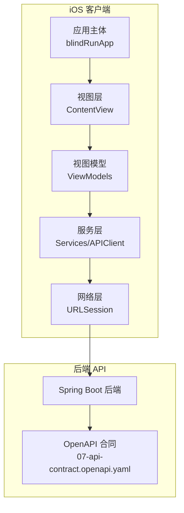
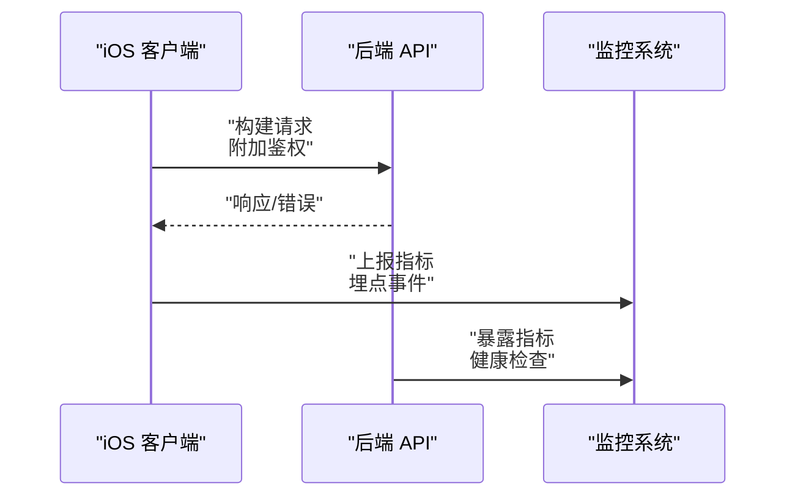
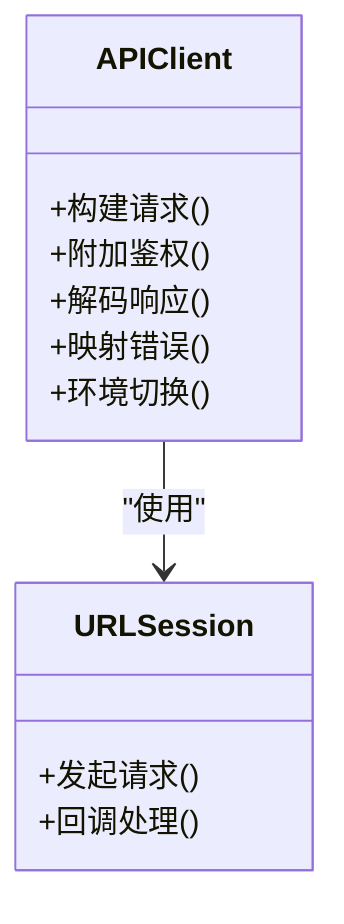
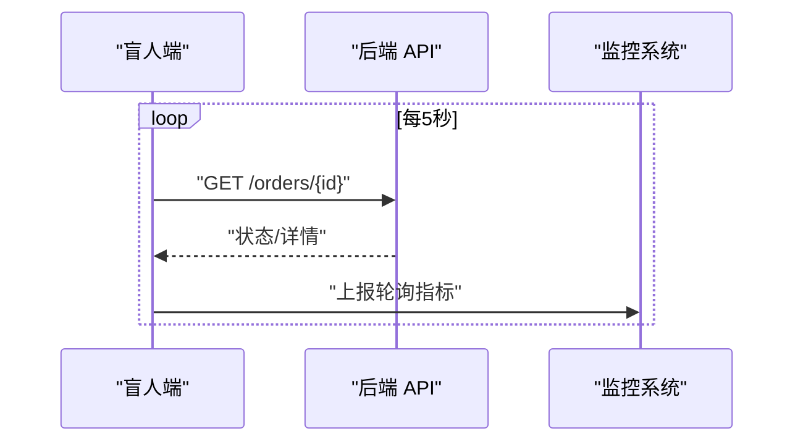
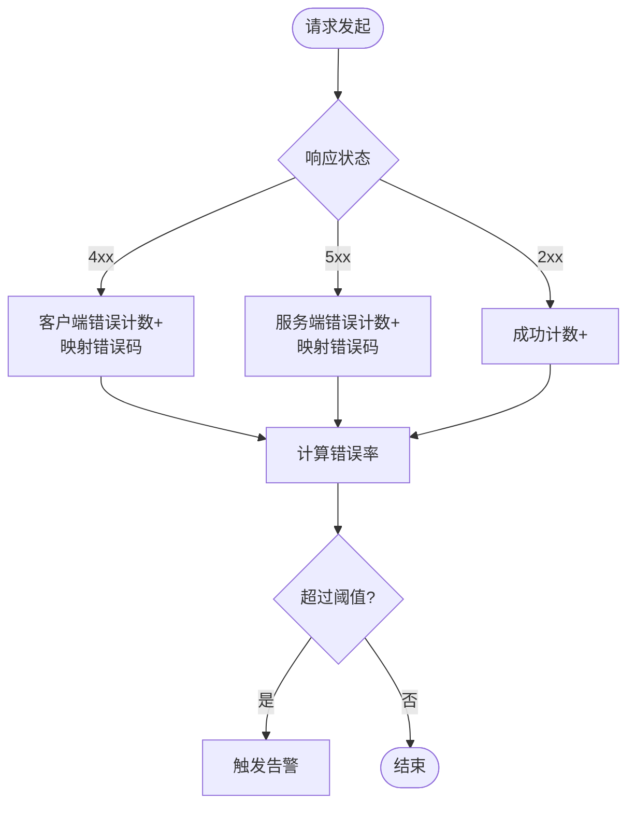
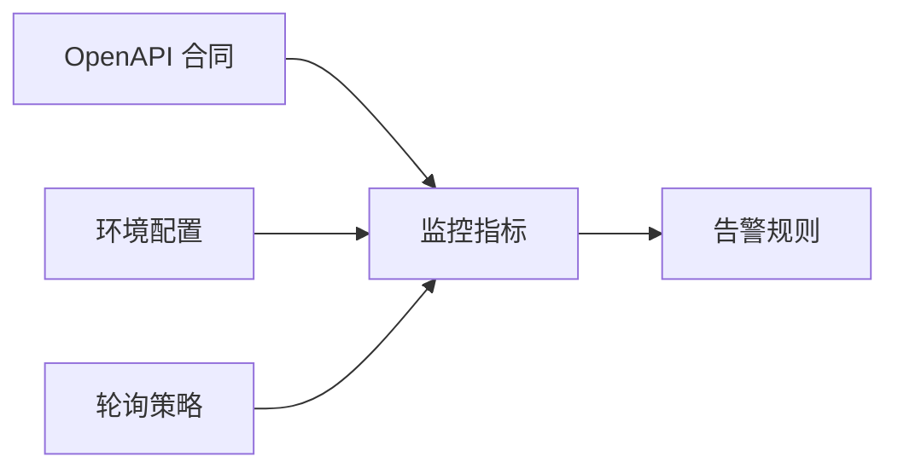

# 监控运维

<cite>
**本文引用的文件**
- [blindRunApp.swift](file://blindRun/blindRunApp.swift)
- [ContentView.swift](file://blindRun/ContentView.swift)
- [07-api-contract.openapi.yaml](file://docs/07-api-contract.openapi.yaml)
- [08-ios-architecture.md](file://docs/08-ios-architecture.md)
- [00-consistency-check-report.md](file://docs/00-consistency-check-report.md)
- [.gitignore](file://.gitignore)
</cite>

## 目录
1. [简介](#简介)
2. [项目结构](#项目结构)
3. [核心组件](#核心组件)
4. [架构总览](#架构总览)
5. [详细组件分析](#详细组件分析)
6. [依赖分析](#依赖分析)
7. [性能考虑](#性能考虑)
8. [故障排查指南](#故障排查指南)
9. [结论](#结论)
10. [附录](#附录)

## 简介
本文件面向 blindRun iOS 应用的监控运维实践，结合现有工程文档与 API 合同，给出一套可落地的运行时监控与运维方案。内容涵盖：
- 崩溃日志收集与用户反馈
- 性能指标监控（API 响应时间、轮询频率、错误率）
- 用户行为分析（关键路径转化、页面停留、关键操作）
- 日志管理策略与聚合分析
- 故障预警与应急响应
- 数据备份与灾难恢复
- 运维仪表板配置与日常操作指南

说明：当前仓库为 iOS 客户端工程，后端 Spring Boot 项目独立存在。本文以客户端视角梳理监控落地方案，并明确与后端 API 的对接边界。

## 项目结构
blindRun iOS 工程采用 SwiftUI + MVVM 架构，核心入口为应用主体与视图层，业务逻辑通过 ViewModel 与 Service 层封装，网络层基于 URLSession。API 合同定义了后端 REST 接口与错误码，支撑监控指标采集与告警规则。

图表来源
- [blindRunApp.swift:10-17](file://blindRun/blindRunApp.swift#L10-L17)
- [ContentView.swift:10-20](file://blindRun/ContentView.swift#L10-L20)
- [08-ios-architecture.md:68-82](file://docs/08-ios-architecture.md#L68-L82)
- [07-api-contract.openapi.yaml:1-1117](file://docs/07-api-contract.openapi.yaml#L1-L1117)

章节来源
- [blindRunApp.swift:10-17](file://blindRun/blindRunApp.swift#L10-L17)
- [ContentView.swift:10-20](file://blindRun/ContentView.swift#L10-L20)
- [08-ios-architecture.md:33-82](file://docs/08-ios-architecture.md#L33-L82)
- [07-api-contract.openapi.yaml:1-1117](file://docs/07-api-contract.openapi.yaml#L1-L1117)

## 核心组件
- 应用主体与场景：应用入口负责窗口组与根视图渲染，支撑后续监控埋点与日志上报。
- 视图与状态：视图层薄逻辑，状态由 ViewModel 管理，便于在关键状态变化处注入监控。
- 网络与 API：统一 APIClient 构建请求、附加鉴权、解码响应与错误映射，是监控指标采集的核心边界。
- 轮询机制：盲人端订单状态轮询（每 5 秒）是关键链路，需纳入性能与错误率统计。
- 错误码与响应：后端稳定错误码集合，便于统一错误分类与告警阈值设定。

章节来源
- [blindRunApp.swift:10-17](file://blindRun/blindRunApp.swift#L10-L17)
- [ContentView.swift:10-20](file://blindRun/ContentView.swift#L10-L20)
- [08-ios-architecture.md:68-82](file://docs/08-ios-architecture.md#L68-L82)
- [07-api-contract.openapi.yaml:469-542](file://docs/07-api-contract.openapi.yaml#L469-L542)

## 架构总览
下图展示 iOS 客户端与后端 API 的交互关系，以及监控数据流的关键节点。

图表来源
- [08-ios-architecture.md:68-82](file://docs/08-ios-architecture.md#L68-L82)
- [07-api-contract.openapi.yaml:25-411](file://docs/07-api-contract.openapi.yaml#L25-L411)

## 详细组件分析

### 组件 A：APIClient 与网络监控
- 职责边界：统一构建 URLRequest、附加 Authorization、解码响应与错误、映射错误码。
- 监控要点：
  - 请求耗时（含 DNS、连接、TLS、首包、下载）
  - 状态码分布（2xx/4xx/5xx）
  - 错误码分类（统一映射到后端错误码集合）
  - 重试与退避策略（避免雪崩）
  - 环境切换（Mock/Local/Production）对指标的影响

图表来源
- [08-ios-architecture.md:68-82](file://docs/08-ios-architecture.md#L68-L82)

章节来源
- [08-ios-architecture.md:68-82](file://docs/08-ios-architecture.md#L68-L82)

### 组件 B：轮询与状态监控
- 轮询策略：盲人端在特定页面每 5 秒轮询订单详情，直至终态或页面离开。
- 监控要点：
  - 轮询命中率（状态未变化的请求占比）
  - 轮询延迟（从请求到 UI 更新的端到端时延）
  - 轮询中断与恢复（页面生命周期、网络异常）
  - 轮询频率与成本平衡（5s vs 10s）

图表来源
- [08-ios-architecture.md:125-139](file://docs/08-ios-architecture.md#L125-L139)
- [07-api-contract.openapi.yaml:240-254](file://docs/07-api-contract.openapi.yaml#L240-L254)

章节来源
- [08-ios-architecture.md:125-139](file://docs/08-ios-architecture.md#L125-L139)
- [07-api-contract.openapi.yaml:240-254](file://docs/07-api-contract.openapi.yaml#L240-L254)

### 组件 C：错误码与错误率统计
- 错误码集合：统一映射后端错误码，便于分类统计与告警。
- 监控要点：
  - 各错误码占比与趋势
  - 用户可见错误提示（TTS/Toast）与后台错误码的关联
  - 与轮询、认证、订单生命周期相关的错误集中度

图表来源
- [07-api-contract.openapi.yaml:543-557](file://docs/07-api-contract.openapi.yaml#L543-L557)

章节来源
- [07-api-contract.openapi.yaml:469-542](file://docs/07-api-contract.openapi.yaml#L469-L542)
- [07-api-contract.openapi.yaml:543-557](file://docs/07-api-contract.openapi.yaml#L543-L557)

### 组件 D：用户行为分析
- 关键路径：登录 → 角色选择 → 资料填写 → 预约 → 等待 → 到达/开始 → 完成/评分
- 分析维度：
  - 页面停留时长（首页、订单状态页、服务中页）
  - 关键操作转化率（接单、到达、确认开始、完成、求助）
  - 环境切换（Mock/Local/Production）对行为的影响
  - 无障碍交互（VoiceOver/TTS）对关键节点的影响

章节来源
- [08-ios-architecture.md:125-139](file://docs/08-ios-architecture.md#L125-L139)
- [00-consistency-check-report.md:45-63](file://docs/00-consistency-check-report.md#L45-L63)

## 依赖分析
- 客户端依赖后端 API 合同，确保监控指标与后端语义一致。
- 环境配置（Mock/Local/Production）影响指标采集与告警阈值。
- 轮询机制与后端状态机耦合，需同步监控两端指标。

图表来源
- [07-api-contract.openapi.yaml:1-1117](file://docs/07-api-contract.openapi.yaml#L1-L1117)
- [08-ios-architecture.md:50-67](file://docs/08-ios-architecture.md#L50-L67)

章节来源
- [07-api-contract.openapi.yaml:1-1117](file://docs/07-api-contract.openapi.yaml#L1-L1117)
- [08-ios-architecture.md:50-67](file://docs/08-ios-architecture.md#L50-L67)

## 性能考虑
- 轮询频率权衡：5 秒为 MVP 轮询间隔，建议在生产环境评估 10–30 秒区间，降低后端压力与客户端能耗。
- 端到端时延：从请求到 UI 更新的链路包含网络、后端处理与前端渲染，需分别采集。
- 错误重试：避免指数退避导致的雪崩，建议引入抖动与上限控制。
- 网络质量：区分 WiFi/蜂窝网络、弱网与断网场景，差异化阈值与提示。

## 故障排查指南
- 登录与认证
  - 现象：验证码错误、Token 无效、自动登录失败
  - 排查：核对后端错误码映射、检查本地 Token 存储与过期策略
- 订单状态轮询
  - 现象：状态长时间未更新、轮询频繁失败
  - 排查：检查网络连通性、轮询停止条件（页面离开/终态）、后端状态机一致性
- 紧急求助
  - 现象：求助后另一端未感知
  - 排查：确认轮询链路、后端状态流转、TTS/提示一致性
- 环境切换
  - 现象：Mock/Local/Production 切换后指标异常
  - 排查：确认 APIClient 环境配置、后端地址与证书

章节来源
- [08-ios-architecture.md:68-82](file://docs/08-ios-architecture.md#L68-L82)
- [07-api-contract.openapi.yaml:469-542](file://docs/07-api-contract.openapi.yaml#L469-L542)
- [00-consistency-check-report.md:15-43](file://docs/00-consistency-check-report.md#L15-L43)

## 结论
本方案以 API 合同与轮询机制为监控抓手，围绕客户端指标（请求耗时、错误率、轮询命中率）与用户行为（关键路径转化、页面停留）构建监控闭环。建议在生产环境逐步引入更细粒度的端到端时延与错误分类，并配套可视化仪表板与自动化告警。

## 附录

### A. 监控指标清单（建议）
- API 指标
  - 请求耗时（p50/p90/p95）、状态码分布、错误码分布、成功率
  - 环境维度（Mock/Local/Production）
- 客户端指标
  - 轮询命中率、轮询端到端时延、轮询中断次数
  - 关键页面停留时长、关键操作转化率
- 用户体验指标
  - TTS/提示命中率、无障碍交互使用率

### B. 告警规则建议
- 错误率：连续 5 分钟内错误率 > 3%
- API 延迟：p95 超过阈值（如 5s）
- 轮询中断：连续 10 次失败
- 环境异常：Mock/Local/Production 指标异常波动

### C. 日志管理与聚合
- 日志采集：统一结构化日志，包含时间戳、环境、用户标识、页面/操作、耗时、错误码
- 日志聚合：按环境、页面、操作、错误码聚合统计
- 分析工具：ELK/ClickHouse/Grafana/Prometheus（按团队能力选择）

### D. 备份与灾难恢复
- 数据备份：后端数据库定期备份与校验
- 恢复流程：RTO/RPO 目标明确，演练与文档化
- 灾难预案：多活/异地容灾（视业务规模与 SLA）

### E. 运维仪表板配置
- 仪表板建议板块
  - 实时概览（请求量、错误率、成功率）
  - API 性能（耗时分布、状态码分布）
  - 客户端健康（轮询命中率、页面停留）
  - 用户行为（关键路径转化、关键操作）
  - 环境对比（Mock/Local/Production）
- 操作指南
  - 新增指标：在 APIClient 与关键 ViewModel 中注入埋点
  - 新增页面：在页面生命周期中上报停留时长与关键事件
  - 新增环境：在环境配置中增加指标维度