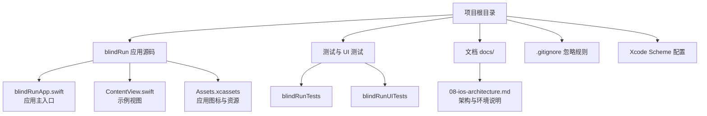
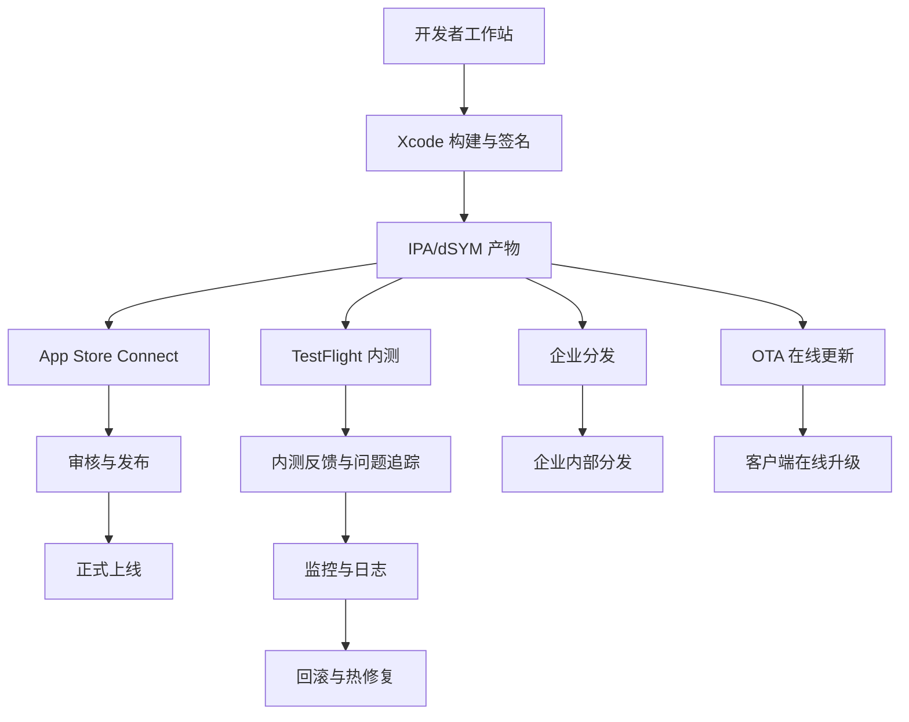
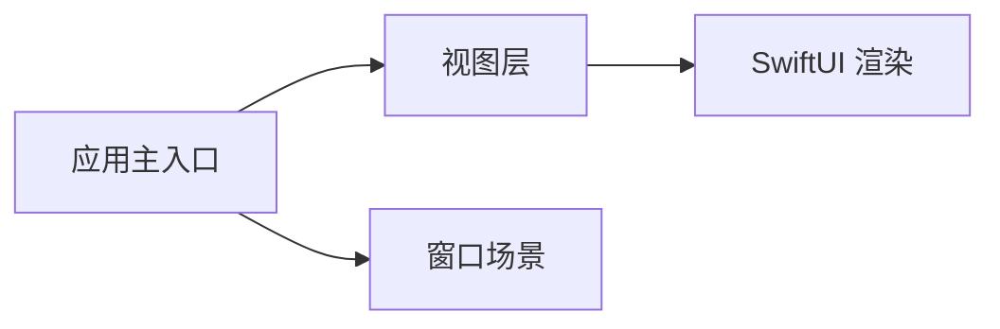

# 部署流程

<cite>
**本文引用的文件**
- [blindRunApp.swift](file://blindRun/blindRunApp.swift)
- [ContentView.swift](file://blindRun/ContentView.swift)
- [08-ios-architecture.md](file://docs/08-ios-architecture.md)
- [.gitignore](file://.gitignore)
- [xcschememanagement.plist](file://blindRun.xcodeproj/xcuserdata/jerry.xcuserdatad/xcschemes/xcschememanagement.plist)
</cite>

## 目录
1. [简介](#简介)
2. [项目结构](#项目结构)
3. [核心组件](#核心组件)
4. [架构总览](#架构总览)
5. [详细组件分析](#详细组件分析)
6. [依赖分析](#依赖分析)
7. [性能考虑](#性能考虑)
8. [故障排除指南](#故障排除指南)
9. [结论](#结论)
10. [附录](#附录)

## 简介
本文件面向运维与工程团队，提供 blindRun iOS 应用从开发到生产的标准化部署流程文档。内容涵盖：
- 代码打包、签名与验证、分发（App Store Connect、TestFlight、企业分发、OTA）
- 审核准备与元数据管理
- CI/CD 流水线集成（自动化测试、构建、部署）
- 版本发布策略、热修复与回滚
- 部署监控、错误追踪与用户反馈收集
- 标准化操作手册与故障排除

由于当前仓库未包含实际的构建脚本、CI/CD 配置或 App Store Connect 配置文件，本文在涉及具体工具与命令时采用通用实践与最佳实践描述，并在相应章节提供“Section sources”标注以明确参考来源。

## 项目结构
blindRun 是一个基于 SwiftUI 的 iOS 应用，当前包含最小可运行的主入口与视图文件，以及一份 iOS 架构设计文档。项目根目录包含构建产物忽略规则与部分 IDE 用户数据。

图表来源
- [blindRunApp.swift:1-18](file://blindRun/blindRunApp.swift#L1-L18)
- [ContentView.swift:1-25](file://blindRun/ContentView.swift#L1-L25)
- [08-ios-architecture.md:1-165](file://docs/08-ios-architecture.md#L1-L165)
- [.gitignore:1-63](file://.gitignore#L1-L63)
- [xcschememanagement.plist](file://blindRun.xcodeproj/xcuserdata/jerry.xcuserdatad/xcschemes/xcschememanagement.plist)

章节来源
- [blindRunApp.swift:1-18](file://blindRun/blindRunApp.swift#L1-L18)
- [ContentView.swift:1-25](file://blindRun/ContentView.swift#L1-L25)
- [08-ios-architecture.md:1-165](file://docs/08-ios-architecture.md#L1-L165)
- [.gitignore:1-63](file://.gitignore#L1-L63)

## 核心组件
- 应用入口与窗口场景：应用主入口负责创建并展示主窗口与视图，确保在不同设备与系统版本上具备一致的启动体验。
- 视图层：示例视图用于演示 SwiftUI 组件与预览功能，便于在开发阶段进行界面验证。
- 架构与环境：架构文档明确了网络层、认证与角色切换、地图与定位、轮询策略、无障碍与语音等关键模块，为后续部署中的环境变量与配置提供依据。

章节来源
- [blindRunApp.swift:10-17](file://blindRun/blindRunApp.swift#L10-L17)
- [ContentView.swift:10-20](file://blindRun/ContentView.swift#L10-L20)
- [08-ios-architecture.md:50-83](file://docs/08-ios-architecture.md#L50-L83)

## 架构总览
下图展示了应用在部署阶段的关键交互：开发者在本地完成构建与签名，随后通过分发渠道（App Store Connect/TestFlight/企业分发/OTA）向用户发布；同时，CI/CD 流水线负责自动化测试、构建与发布。

## 详细组件分析

### 1) 代码打包与签名验证
- 构建目标与配置
  - 使用 Xcode 的 Release 配置生成可分发的 IPA 包。
  - 确保使用正确的 Team、Bundle Identifier 与 Provisioning Profile。
- 产物与符号表
  - 保留 .ipa 与 dSYM 符号表，便于崩溃分析与符号化。
- 签名验证
  - 通过命令行工具验证签名完整性与证书链有效性。
- 忽略规则
  - 构建产物与符号表默认被 .gitignore 排除，避免误提交。

章节来源
- [.gitignore:11-15](file://.gitignore#L11-L15)

### 2) 分发方式与流程

#### 2.1 App Store Connect 配置与审核准备
- 应用信息与元数据
  - 在 App Store Connect 中完善应用名称、副标题、关键词、隐私政策链接、支持链接等。
  - 准备截图与预览视频，确保符合审核规范。
- 审核设置
  - 配置自动发布或手动发布策略。
  - 设置审核偏好与联系信息。
- 提交前检查清单
  - 本地化与多语言一致性。
  - 隐私与权限声明。
  - 无障碍与语音功能完备性。

#### 2.2 TestFlight 内测分发
- 上传构建
  - 将已签名的 IPA 上传至 App Store Connect。
- 内测组管理
  - 创建或选择内测组，邀请测试者加入。
- 反馈与追踪
  - 收集测试者反馈，记录问题并纳入后续迭代。

#### 2.3 企业分发
- 适用场景
  - 内部员工或限定范围内的分发。
- 注意事项
  - 遵守企业分发协议与安全策略，避免越权分发。
  - 保持分发渠道的可追溯性与审计日志。

#### 2.4 OTA 在线更新
- 适用场景
  - 面向外部用户的在线升级。
- 实现要点
  - 客户端需实现版本检测与增量更新逻辑。
  - 服务端提供版本清单与下载地址。
  - 强制更新与可选更新的策略区分。

### 3) CI/CD 流水线配置指南
以下为通用流水线建议，具体命令与工具需根据团队现有平台（如 GitHub Actions、GitLab CI、Jenkins 等）进行适配。

- 阶段划分
  - 代码检出 → 依赖安装 → 单元测试 → UI 测试 → 构建 → 打包 → 上传 → 发布
- 关键任务
  - 自动化测试：在模拟器或真机上执行单元与 UI 测试，输出报告与覆盖率。
  - 构建：针对 Release 配置生成 IPA 与 dSYM。
  - 上传：将构建产物上传至 App Store Connect/TestFlight/企业分发/OTA 平台。
  - 发布：触发审核或自动发布。
- 环境变量与密钥
  - 使用受保护的环境变量存储证书、Provisioning Profile、API 密钥等。
- 日志与报告
  - 输出测试报告、构建日志与上传结果，便于排障与审计。

章节来源
- [08-ios-architecture.md:50-83](file://docs/08-ios-architecture.md#L50-L83)

### 4) 版本发布策略、热修复与回滚
- 版本命名
  - 使用语义化版本号（主.次.修订），结合构建号形成唯一版本标识。
- 发布节奏
  - 主版本：重大功能与架构变更。
  - 次版本：新增功能与改进。
  - 修订版本：Bug 修复与小改动。
- 热修复
  - 快速修复高优先级问题，走最小改动的回归测试流程。
  - 通过 TestFlight 快速验证，再决定是否紧急发布。
- 回滚机制
  - 保留最近几个版本的 IPA 与 dSYM。
  - 若新版本出现严重问题，立即回滚至上一稳定版本。
  - 通知用户并提供降级路径与补偿措施。

### 5) 部署监控、错误追踪与用户反馈
- 监控
  - 上报关键指标（崩溃率、启动时间、页面加载耗时、网络请求成功率）。
  - 结合日志与埋点，建立告警阈值。
- 错误追踪
  - 集成崩溃上报 SDK，确保 dSYM 正确上传与符号化。
  - 对高频错误进行分类与优先级排序。
- 用户反馈
  - 在应用内提供反馈入口，收集截图、日志与复现步骤。
  - 与内测组联动，建立问题闭环处理流程。

### 6) 标准化部署操作手册
- 开发环境
  - 确认本地证书与 Provisioning Profile 有效。
  - 使用正确的 Bundle Identifier 与 Team。
- 预发布检查
  - 本地签名验证、构建产物校验、TestFlight 内测验证。
- 生产发布
  - App Store Connect 提交审核、企业分发或 OTA 发布。
  - 记录发布日志与回滚预案。
- 回滚操作
  - 下载上一版本 IPA 与 dSYM，按回滚流程执行。

### 7) 故障排除指南
- 常见问题
  - 签名失败：检查证书与 Provisioning Profile 是否匹配、是否过期。
  - 构建失败：确认依赖安装、SDK 版本与 Xcode 版本兼容。
  - 审核被拒：检查隐私政策、权限说明与无障碍功能。
- 排障步骤
  - 重试构建与上传、查看日志、对照审核指南逐项自查。
  - 必要时回滚至上一版本，修复后再重新发布。

## 依赖分析
应用当前依赖关系简单，主要围绕 SwiftUI 应用生命周期与视图渲染。随着功能扩展，可能引入网络层、地图 SDK、语音与无障碍服务等外部依赖。建议在 CI/CD 中对依赖进行锁定与缓存，提升构建稳定性。

图表来源
- [blindRunApp.swift:10-17](file://blindRun/blindRunApp.swift#L10-L17)
- [ContentView.swift:10-20](file://blindRun/ContentView.swift#L10-L20)

## 性能考虑
- 构建优化
  - 启用并行构建与缓存，减少重复编译时间。
- 产物体积
  - 控制资源大小与数量，剥离调试符号与冗余资源。
- 发布策略
  - 采用增量更新与灰度发布，降低大规模风险。

## 故障排除指南
- 签名与证书
  - 确认证书链完整、Provisioning Profile 与 Bundle Identifier 匹配。
- 构建与打包
  - 检查 Xcode 版本与最低系统版本设置，确保 dSYM 与 IPA 成功生成。
- 审核与分发
  - 对照审核指南逐项检查隐私与无障碍要求，修正后再提交。

章节来源
- [.gitignore:11-15](file://.gitignore#L11-L15)

## 结论
本文提供了 blindRun iOS 应用从开发到生产的部署流程蓝图，覆盖打包、签名、分发、审核准备、内测与企业分发、OTA 更新、CI/CD 集成、版本策略与回滚、监控与反馈等关键环节。建议团队结合自身平台与工具链，将通用实践落地为可执行的操作手册与自动化流水线，持续优化发布效率与质量。

## 附录
- Scheme 与构建配置
  - Xcode Scheme 配置位于用户数据目录中，建议在团队协作中统一共享与备份。
- 架构与环境
  - 架构文档明确了网络、认证、角色、地图与轮询等模块，为部署时的环境变量与配置提供依据。

章节来源
- [xcschememanagement.plist](file://blindRun.xcodeproj/xcuserdata/jerry.xcuserdatad/xcschemes/xcschememanagement.plist)
- [08-ios-architecture.md:50-83](file://docs/08-ios-architecture.md#L50-L83)