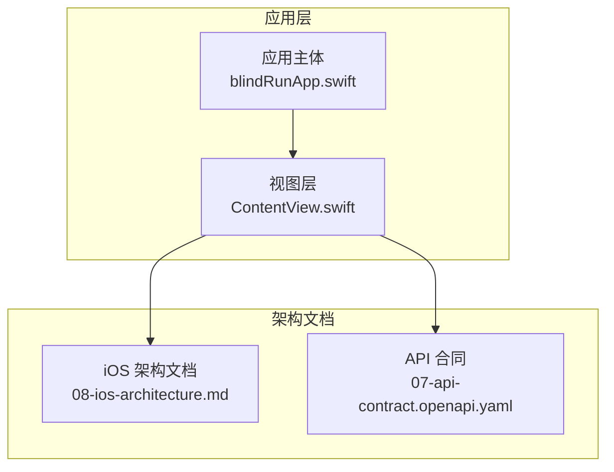
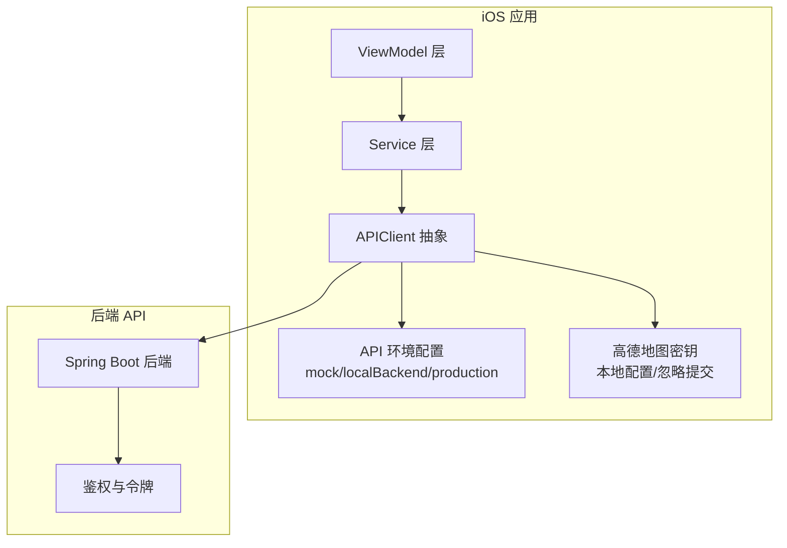
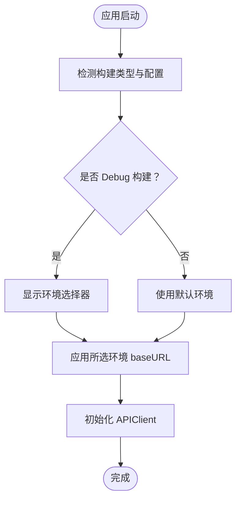
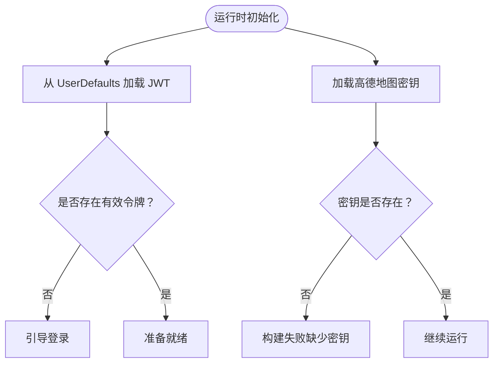
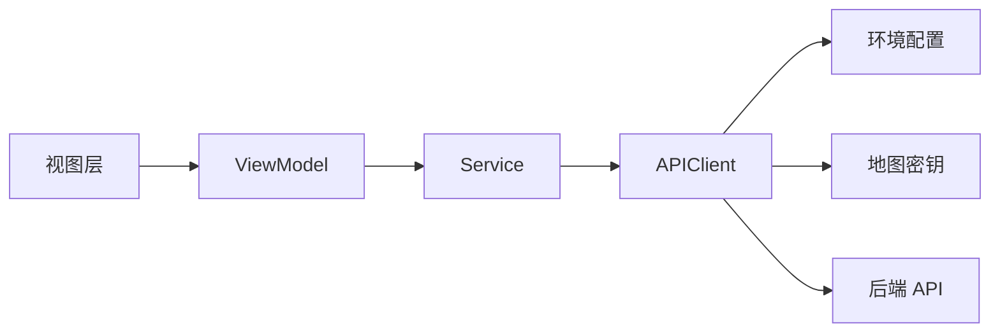

# 配置与部署

<cite>
**本文引用的文件**
- [blindRunApp.swift](file://blindRun/blindRun/blindRunApp.swift)
- [ContentView.swift](file://blindRun/blindRun/ContentView.swift)
- [08-ios-architecture.md](file://docs/08-ios-architecture.md)
- [07-api-contract.openapi.yaml](file://docs/07-api-contract.openapi.yaml)
- [xcschememanagement.plist](file://blindRun.xcodeproj/xcuserdata/jerry.xcuserdatad/xcschemes/xcschememanagement.plist)
</cite>

## 目录
1. [简介](#简介)
2. [项目结构](#项目结构)
3. [核心组件](#核心组件)
4. [架构总览](#架构总览)
5. [详细组件分析](#详细组件分析)
6. [依赖关系分析](#依赖关系分析)
7. [性能考虑](#性能考虑)
8. [故障排查指南](#故障排查指南)
9. [结论](#结论)
10. [附录](#附录)

## 简介
本文件面向运维工程师与 DevOps 团队，提供 blindRun iOS 应用的配置与部署实施手册。内容覆盖多环境配置管理（开发、测试、生产）、环境变量与密钥策略、构建与签名、App Store 发布流程、CI/CD 集成建议、第三方服务（高德地图 API、推送通知等）部署要求、容器化与云服务配置、监控告警、版本发布与回滚策略以及应急响应预案。

## 项目结构
blindRun 是一个基于 SwiftUI + MVVM 的 iOS 应用，采用 Swift 原生实现，最小支持 iOS 16+。应用入口由 SwiftUI App 主体定义，界面层为轻量视图，业务逻辑通过 ViewModel 与 Service 层协作，网络层使用 URLSession 并通过统一的 APIClient 抽象对接后端 API。

图表来源
- [blindRunApp.swift:10-17](file://blindRun/blindRun/blindRunApp.swift#L10-L17)
- [ContentView.swift:10-20](file://blindRun/blindRun/ContentView.swift#L10-L20)
- [08-ios-architecture.md:1-165](file://docs/08-ios-architecture.md#L1-L165)
- [07-api-contract.openapi.yaml:1-1117](file://docs/07-api-contract.openapi.yaml#L1-L1117)

章节来源
- [blindRunApp.swift:10-17](file://blindRun/blindRun/blindRunApp.swift#L10-L17)
- [ContentView.swift:10-20](file://blindRun/blindRun/ContentView.swift#L10-L20)
- [08-ios-architecture.md:1-165](file://docs/08-ios-architecture.md#L1-L165)
- [07-api-contract.openapi.yaml:1-1117](file://docs/07-api-contract.openapi.yaml#L1-L1117)

## 核心组件
- 应用主体与场景
  - 应用主入口定义了窗口组场景，承载根视图。
- 视图层
  - 根视图为简单示例，实际业务页面由各功能模块 ViewModel 驱动。
- 架构与网络
  - 文档明确了 API 环境切换、APIClient 抽象、令牌存储与 Keychain 迁移提示、高德地图 SDK 集成与本地密钥管理策略。
- API 合同
  - 文档定义了鉴权方式、路径与错误码，为部署时的后端服务对接提供契约依据。

章节来源
- [blindRunApp.swift:10-17](file://blindRun/blindRun/blindRunApp.swift#L10-L17)
- [ContentView.swift:10-20](file://blindRun/blindRun/ContentView.swift#L10-L20)
- [08-ios-architecture.md:50-83](file://docs/08-ios-architecture.md#L50-L83)
- [07-api-contract.openapi.yaml:22-24](file://docs/07-api-contract.openapi.yaml#L22-L24)

## 架构总览
下图展示了 iOS 应用与后端 API 的交互关系，以及环境切换与密钥管理的关键点。

图表来源
- [08-ios-architecture.md:50-83](file://docs/08-ios-architecture.md#L50-L83)
- [08-ios-architecture.md:119-124](file://docs/08-ios-architecture.md#L119-L124)
- [07-api-contract.openapi.yaml:22-24](file://docs/07-api-contract.openapi.yaml#L22-L24)

## 详细组件分析

### API 环境配置与切换
- 环境类型
  - mock：本地假数据，便于 UI 与流程调试。
  - localBackend：开发者本机或局域网后端（示例地址见 API 合同）。
  - production：保留字段，待部署。
- 实施要点
  - 使用统一的 API 环境枚举与 baseURL 映射。
  - 在 Debug 构建中暴露小环境选择器或启动配置项。
  - 支持 LAN IP 地址访问（如 192.168.x.x:8080）。

图表来源
- [08-ios-architecture.md:50-66](file://docs/08-ios-architecture.md#L50-L66)
- [07-api-contract.openapi.yaml:11-16](file://docs/07-api-contract.openapi.yaml#L11-L16)

章节来源
- [08-ios-architecture.md:50-66](file://docs/08-ios-architecture.md#L50-L66)
- [07-api-contract.openapi.yaml:11-16](file://docs/07-api-contract.openapi.yaml#L11-L16)

### 令牌存储与密钥管理
- 令牌存储
  - MVP 使用 UserDefaults 存储 JWT；生产需迁移到 Keychain。
- 密钥管理
  - 高德地图密钥存放在本地配置文件（如 LocalConfig.xcconfig 或本地 plist），加入 .gitignore。
  - 提交示例配置文件，仅列出键名，不含敏感值。

图表来源
- [08-ios-architecture.md:78-83](file://docs/08-ios-architecture.md#L78-L83)
- [08-ios-architecture.md:119-124](file://docs/08-ios-architecture.md#L119-L124)

章节来源
- [08-ios-architecture.md:78-83](file://docs/08-ios-architecture.md#L78-L83)
- [08-ios-architecture.md:119-124](file://docs/08-ios-architecture.md#L119-L124)

### 构建与签名配置
- Xcode Scheme 管理
  - 项目包含 Xcode Scheme 管理文件，用于区分 Debug/Release 等构建配置。
- 签名与证书
  - 使用 Apple Developer 账户配置 Team、Bundle Identifier、Provisioning Profile 与 Distribution 证书。
  - 将证书与私钥安全存储于受控的密钥库或 CI 凭据管理器。
- 构建脚本
  - 在 CI 中执行构建与打包，确保环境变量与密钥注入正确。

章节来源
- [xcschememanagement.plist](file://blindRun.xcodeproj/xcuserdata/jerry.xcuserdatad/xcschemes/xcschememanagement.plist)

### 第三方服务集成
- 高德地图
  - 在本地配置中存放密钥，避免提交到版本库。
  - 在应用中桥接高德 SDK，实现地图展示、定位与距离计算。
- 推送通知
  - 配置 APNs 证书与 Bundle ID 的推送能力。
  - 在应用中请求用户授权并处理推送事件。

章节来源
- [08-ios-architecture.md:119-124](file://docs/08-ios-architecture.md#L119-L124)

### CI/CD 集成方案
- 构建阶段
  - 拉取代码 → 注入环境变量与密钥 → 编译与单元测试 → 打包产物。
- 部署阶段
  - 测试环境：自动化上传至 TestFlight 或内测平台。
  - 生产环境：通过 App Store Connect 自动发布或人工审核后发布。
- 版本标签与工件
  - 使用 Git 标签标记发布版本，归档构建工件与符号表。

章节来源
- [08-ios-architecture.md:50-66](file://docs/08-ios-architecture.md#L50-L66)

### App Store 发布流程
- 准备工作
  - 确保应用图标、截图、隐私清单与元数据完备。
  - 配置 App Store Connect 与 TestFlight。
- 提交审核
  - 生成并上传二进制包，填写审核说明与测试账户。
- 发布与监控
  - 审核通过后自动发布或手动发布。
  - 监控下载量、崩溃率与用户反馈。

章节来源
- [08-ios-architecture.md:50-66](file://docs/08-ios-architecture.md#L50-L66)

### Docker 容器化部署
- 适用范围
  - iOS 应用本身不直接容器化运行，但可使用容器化工具链支撑构建与测试。
- 建议实践
  - 使用容器镜像封装 Xcode 与依赖，保证构建一致性。
  - 将构建产物与符号表挂载到 CI 存储。

章节来源
- [08-ios-architecture.md:50-66](file://docs/08-ios-architecture.md#L50-L66)

### 云服务与监控告警
- 云服务
  - 后端服务可部署于云厂商弹性计算或容器服务，配合负载均衡与数据库托管。
- 监控与告警
  - 集成崩溃上报（如崩溃日志收集）与性能监控（如响应时间、错误率）。
  - 设置阈值告警，联动值班与自动回滚。

章节来源
- [08-ios-architecture.md:50-66](file://docs/08-ios-architecture.md#L50-L66)

### 版本发布流程、回滚策略与应急响应
- 发布流程
  - 规划版本计划 → 代码冻结 → 构建与测试 → 灰度发布 → 全量发布。
- 回滚策略
  - 快速回滚至上一稳定版本；必要时回退数据库迁移。
- 应急响应
  - 建立应急小组与沟通渠道；准备降级方案与临时修复。

章节来源
- [08-ios-architecture.md:50-66](file://docs/08-ios-architecture.md#L50-L66)

## 依赖关系分析
- 组件耦合
  - 视图层保持薄逻辑，通过 ViewModel 与 Service 解耦。
  - APIClient 对外屏蔽具体实现，便于替换与测试。
- 外部依赖
  - 高德地图 SDK、Apple 推送服务、后端 API。
- 配置依赖
  - 环境 baseURL、令牌存储位置、地图密钥。

图表来源
- [08-ios-architecture.md:50-83](file://docs/08-ios-architecture.md#L50-L83)

章节来源
- [08-ios-architecture.md:50-83](file://docs/08-ios-architecture.md#L50-L83)

## 性能考虑
- 网络层
  - 简化重试策略，避免复杂离线队列；对频繁轮询接口（如订单状态）控制频率。
- 令牌与密钥
  - 将令牌持久化迁移至 Keychain，减少明文存储风险。
- 地图与定位
  - 合理使用缓存与批量请求，降低定位与渲染开销。

章节来源
- [08-ios-architecture.md:78-83](file://docs/08-ios-architecture.md#L78-L83)
- [08-ios-architecture.md:125-139](file://docs/08-ios-architecture.md#L125-L139)

## 故障排查指南
- 环境无法切换或访问失败
  - 检查 API 环境配置与 baseURL 是否正确；确认 LAN 地址可达。
- 无令牌或鉴权失败
  - 核对 UserDefaults 中的 JWT；生产环境检查 Keychain 迁移。
- 地图功能异常
  - 确认本地密钥配置存在且未提交到仓库；检查网络与权限。
- 推送通知未收到
  - 核对 APNs 证书与 Bundle ID；检查用户授权状态。

章节来源
- [08-ios-architecture.md:50-83](file://docs/08-ios-architecture.md#L50-L83)
- [08-ios-architecture.md:119-124](file://docs/08-ios-architecture.md#L119-L124)

## 结论
本部署文档围绕 blindRun iOS 应用的多环境配置、密钥与令牌管理、构建签名、发布流程与 CI/CD 集成进行了系统性梳理。建议在生产环境中尽快完成令牌存储的 Keychain 迁移与密钥的集中化管理，并建立完善的监控与应急响应机制，以保障应用的稳定性与安全性。

## 附录
- 关键文件索引
  - 应用入口与视图：[blindRunApp.swift](file://blindRun/blindRun/blindRunApp.swift)，[ContentView.swift](file://blindRun/blindRun/ContentView.swift)
  - 架构与 API 文档：[08-ios-architecture.md](file://docs/08-ios-architecture.md)，[07-api-contract.openapi.yaml](file://docs/07-api-contract.openapi.yaml)
  - Xcode Scheme 管理：[xcschememanagement.plist](file://blindRun.xcodeproj/xcuserdata/jerry.xcuserdatad/xcschemes/xcschememanagement.plist)