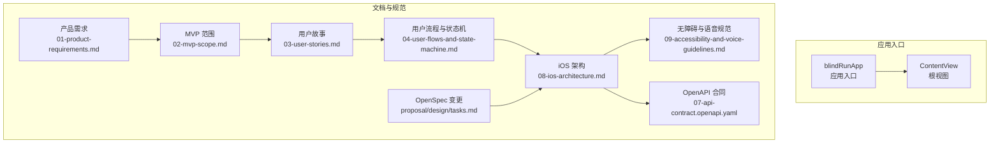
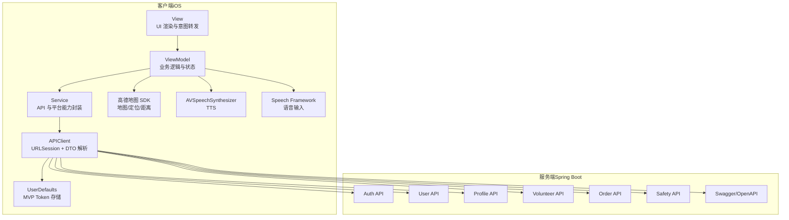
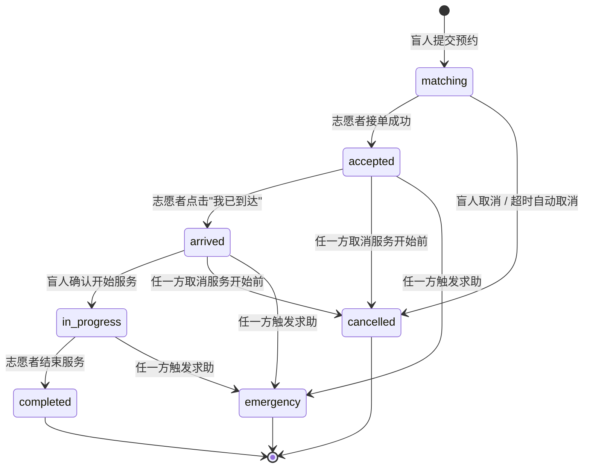
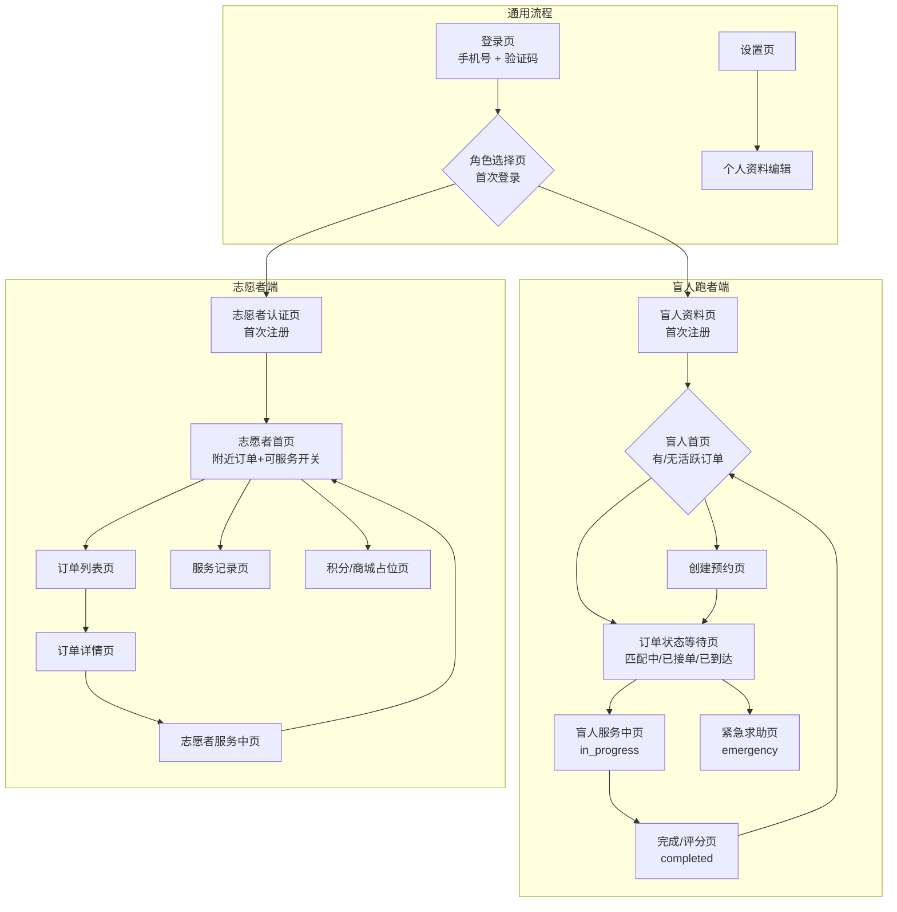
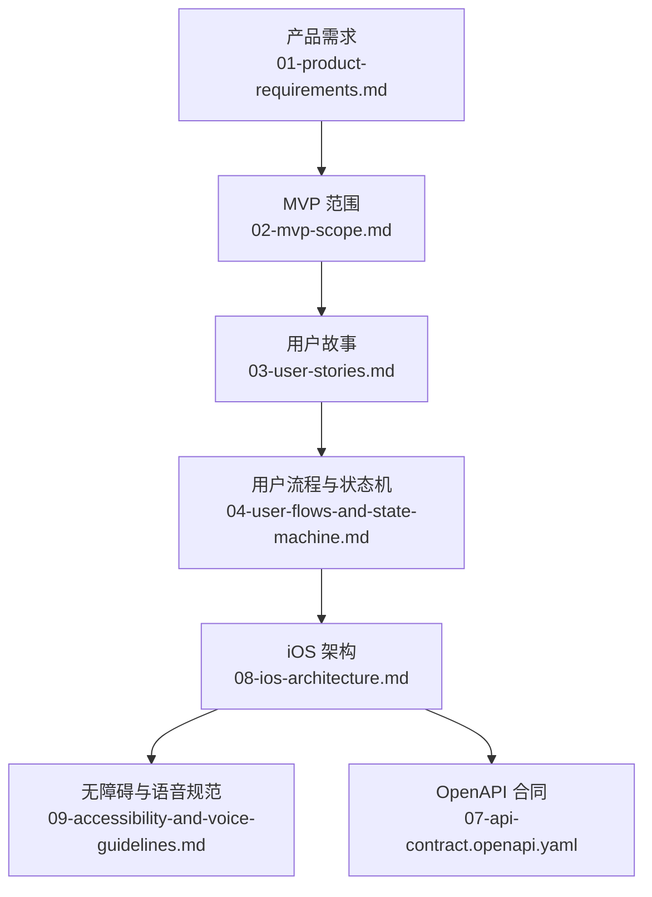

# 项目概述

<cite>
**本文引用的文件**
- [blindRunApp.swift](file://blindRun/blindRunApp.swift)
- [ContentView.swift](file://blindRun/ContentView.swift)
- [01-product-requirements.md](file://docs/01-product-requirements.md)
- [02-mvp-scope.md](file://docs/02-mvp-scope.md)
- [03-user-stories.md](file://docs/03-user-stories.md)
- [04-user-flows-and-state-machine.md](file://docs/04-user-flows-and-state-machine.md)
- [07-api-contract.openapi.yaml](file://docs/07-api-contract.openapi.yaml)
- [08-ios-architecture.md](file://docs/08-ios-architecture.md)
- [09-accessibility-and-voice-guidelines.md](file://docs/09-accessibility-and-voice-guidelines.md)
- [proposal.md](file://openspec/changes/add-aidrun-ios-spring-mvp/proposal.md)
- [design.md](file://openspec/changes/add-aidrun-ios-spring-mvp/design.md)
- [tasks.md](file://openspec/changes/add-aidrun-ios-spring-mvp/tasks.md)
</cite>

## 目录
1. [引言](#引言)
2. [项目结构](#项目结构)
3. [核心组件](#核心组件)
4. [架构总览](#架构总览)
5. [详细组件分析](#详细组件分析)
6. [依赖关系分析](#依赖关系分析)
7. [性能考量](#性能考量)
8. [故障排查指南](#故障排查指南)
9. [结论](#结论)
10. [附录](#附录)

## 引言
助盲跑（AidRun）是一个面向盲人跑者与志愿者的双角色移动应用，旨在户外跑步场景中建立安全、可预约、可追踪的协助服务闭环。项目采用 Swift 原生 iOS + SwiftUI/MVVM + Spring Boot 的技术栈，围绕“预约型服务”在 3 天内完成可演示的 MVP 版本，重点验证从盲人预约到志愿者完成服务的完整流程，同时确保真实地图、真实定位、真实登录与无障碍体验（VoiceOver、TTS、语音输入）。

项目背景与愿景
- 项目类型：公益项目展示 / 学生项目 / 比赛作品
- 目标用户：盲人跑者与志愿者
- 第一版目标：3 天内完成可演示版本，而非生产级完整系统
- 核心价值主张：
  - 对盲人跑者：可预约的陪伴式跑步协助，紧急求助安全保障，极简无障碍交互
  - 对志愿者：有意义的公益参与，积分激励体系（MVP 展示占位），灵活的时间安排

社会意义与技术创新点
- 社会意义：通过技术手段降低盲人户外跑步的安全风险，促进社会包容与互助
- 技术创新点：
  - 无障碍优先：VoiceOver、TTS、语音输入、大按钮、重复状态播报
  - 真实集成：高德地图、真实定位、手机号登录 + JWT、5 秒轮询
  - 状态机驱动：严格的订单生命周期与状态流转规则
  - 角色切换与拦截：同一账户在双角色间切换并受活跃订单拦截

## 项目结构
应用采用 SwiftUI + MVVM 架构，核心文件位于 blindRun 模块中，主要入口为应用结构体与根视图。文档目录包含产品需求、MVP 范围、用户故事、用户流程与状态机、iOS 架构、无障碍与语音规范、OpenAPI 合同以及 OpenSpec 变更说明。

图表来源
- [blindRunApp.swift:10-17](file://blindRun/blindRunApp.swift#L10-L17)
- [ContentView.swift:10-20](file://blindRun/ContentView.swift#L10-L20)
- [01-product-requirements.md:1-161](file://docs/01-product-requirements.md#L1-L161)
- [02-mvp-scope.md:1-216](file://docs/02-mvp-scope.md#L1-L216)
- [03-user-stories.md:1-800](file://docs/03-user-stories.md#L1-L800)
- [04-user-flows-and-state-machine.md:1-309](file://docs/04-user-flows-and-state-machine.md#L1-L309)
- [08-ios-architecture.md:1-165](file://docs/08-ios-architecture.md#L1-L165)
- [09-accessibility-and-voice-guidelines.md:1-143](file://docs/09-accessibility-and-voice-guidelines.md#L1-L143)
- [07-api-contract.openapi.yaml:1-200](file://docs/07-api-contract.openapi.yaml#L1-L200)
- [proposal.md:1-37](file://openspec/changes/add-aidrun-ios-spring-mvp/proposal.md#L1-L37)
- [design.md:1-37](file://openspec/changes/add-aidrun-ios-spring-mvp/design.md#L1-L37)
- [tasks.md:1-61](file://openspec/changes/add-aidrun-ios-spring-mvp/tasks.md#L1-L61)

章节来源
- [blindRunApp.swift:10-17](file://blindRun/blindRunApp.swift#L10-L17)
- [ContentView.swift:10-20](file://blindRun/ContentView.swift#L10-L20)
- [01-product-requirements.md:1-161](file://docs/01-product-requirements.md#L1-L161)
- [02-mvp-scope.md:1-216](file://docs/02-mvp-scope.md#L1-L216)

## 核心组件
- 应用入口与根视图：应用结构体负责窗口组与根视图渲染，当前为占位内容，后续将承载登录、角色选择与主流程导航。
- 文档与规范：产品需求、MVP 范围、用户故事、用户流程与状态机、iOS 架构、无障碍与语音规范、OpenAPI 合同、OpenSpec 变更等，构成完整的工程契约与实现指导。
- OpenAPI 合同：定义认证、用户、资料、志愿者、订单、安全等模块的接口契约，冻结 MVP v0.3 的 API 行为与约束。

章节来源
- [blindRunApp.swift:10-17](file://blindRun/blindRunApp.swift#L10-L17)
- [ContentView.swift:10-20](file://blindRun/ContentView.swift#L10-L20)
- [07-api-contract.openapi.yaml:25-200](file://docs/07-api-contract.openapi.yaml#L25-L200)

## 架构总览
应用采用 SwiftUI + MVVM 架构，网络层基于 URLSession，使用 JWT Bearer 认证，数据模型与 API 约束由 OpenAPI 合同统一。iOS 架构建议模块化分层，包括 Core、Auth、Role、BlindRunner、Volunteer、Orders、Map、Voice、Safety、Profile 等，职责清晰、边界明确。

图表来源
- [08-ios-architecture.md:33-83](file://docs/08-ios-architecture.md#L33-L83)
- [07-api-contract.openapi.yaml:25-200](file://docs/07-api-contract.openapi.yaml#L25-L200)

章节来源
- [08-ios-architecture.md:1-165](file://docs/08-ios-architecture.md#L1-L165)
- [07-api-contract.openapi.yaml:1-200](file://docs/07-api-contract.openapi.yaml#L1-L200)

## 详细组件分析

### 订单状态机与流程
订单生命周期严格定义了从“匹配中”到“完成/取消/紧急”的状态流转，支持志愿者接单、到达、确认开始、结束服务、取消与紧急求助等关键动作。轮询机制确保盲人端与志愿者端在关键状态下能及时感知状态变化。

图表来源
- [04-user-flows-and-state-machine.md:74-96](file://docs/04-user-flows-and-state-machine.md#L74-L96)

章节来源
- [04-user-flows-and-state-machine.md:120-178](file://docs/04-user-flows-and-state-machine.md#L120-L178)
- [04-user-flows-and-state-machine.md:180-228](file://docs/04-user-flows-and-state-machine.md#L180-L228)
- [04-user-flows-and-state-machine.md:230-257](file://docs/04-user-flows-and-state-machine.md#L230-L257)

### 盲人端与志愿者端导航与流程
应用采用双角色导航：盲人端强调极简触控与语音播报，志愿者端强调接单与服务执行闭环。两套流程通过角色选择与切换衔接，且在活跃订单状态下拦截角色切换。

图表来源
- [04-user-flows-and-state-machine.md:5-70](file://docs/04-user-flows-and-state-machine.md#L5-L70)

章节来源
- [04-user-flows-and-state-machine.md:1-309](file://docs/04-user-flows-and-state-machine.md#L1-L309)

### 无障碍与语音集成
- VoiceOver：所有关键按钮、输入框、状态文本均配置 accessibilityLabel 与 accessibilityHint，遍历顺序与视觉布局一致
- TTS：关键节点（进入首页、订单提交成功、匹配中、志愿者已接单、志愿者已到达、确认开始服务、服务开始、服务完成、进入求助状态、错误提示）均通过 AVSpeechSynthesizer 播报
- 语音输入：Speech Framework 支持地点描述、备注等文本输入，失败时允许键盘输入作为降级方案
- 危险操作二次确认：取消订单、进入求助、结束服务、退出登录均需二次确认
- 大按钮：盲人端关键主按钮最小高度 ≥ 64pt，确保触控操作便利

章节来源
- [09-accessibility-and-voice-guidelines.md:13-143](file://docs/09-accessibility-and-voice-guidelines.md#L13-L143)
- [08-ios-architecture.md:140-147](file://docs/08-ios-architecture.md#L140-L147)

### API 合同与环境切换
- 认证与用户：手机号登录 + JWT、用户信息、角色切换、令牌自动登录与退出登录
- 资料管理：盲人/志愿者资料 CRUD
- 志愿者：Mock 认证、可服务开关
- 订单：创建预约、我的订单、订单详情、状态流转、轮询查询
- 安全：紧急求助触发、紧急联系人存储
- 环境切换：Mock、Local Backend、Production 三种模式，Debug 构建暴露环境选择

章节来源
- [07-api-contract.openapi.yaml:25-200](file://docs/07-api-contract.openapi.yaml#L25-L200)
- [08-ios-architecture.md:50-83](file://docs/08-ios-architecture.md#L50-L83)

## 依赖关系分析
- 文档与实现的一致性：MVP v0.3 冻结口径与各文档对齐，确保工程实现与产品契约一致
- 模块耦合：MVVM 分层清晰，ViewModel 与 Service 解耦，APIClient 通过协议抽象支持 Mock 与真实实现
- 外部依赖：高德地图 SDK、CoreLocation、AVSpeechSynthesizer、Speech Framework、URLSession、UserDefaults（MVP）

图表来源
- [01-product-requirements.md:1-161](file://docs/01-product-requirements.md#L1-L161)
- [02-mvp-scope.md:1-216](file://docs/02-mvp-scope.md#L1-L216)
- [03-user-stories.md:1-800](file://docs/03-user-stories.md#L1-L800)
- [04-user-flows-and-state-machine.md:1-309](file://docs/04-user-flows-and-state-machine.md#L1-L309)
- [08-ios-architecture.md:1-165](file://docs/08-ios-architecture.md#L1-L165)
- [09-accessibility-and-voice-guidelines.md:1-143](file://docs/09-accessibility-and-voice-guidelines.md#L1-L143)
- [07-api-contract.openapi.yaml:1-200](file://docs/07-api-contract.openapi.yaml#L1-L200)

章节来源
- [proposal.md:1-37](file://openspec/changes/add-aidrun-ios-spring-mvp/proposal.md#L1-L37)
- [design.md:1-37](file://openspec/changes/add-aidrun-ios-spring-mvp/design.md#L1-L37)
- [tasks.md:1-61](file://openspec/changes/add-aidrun-ios-spring-mvp/tasks.md#L1-L61)

## 性能考量
- 轮询策略：盲人端订单状态页面每 5 秒轮询一次，平衡实时性与资源消耗
- 网络层：URLSession + async/await，MVP 使用 UserDefaults 存储 Token，生产需迁移到 Keychain
- 地图与定位：iOS 端根据志愿者位置与订单坐标计算距离，减少后端地理复杂度
- 无障碍体验：VoiceOver、TTS、语音输入的集成需避免重复播报与频繁 UI 更新

## 故障排查指南
- 登录与认证
  - 验证码固定为 123456，首次登录自动注册；若出现登录失败，检查手机号格式与网络连通性
  - 令牌自动登录：若 UserDefaults 中的 token 已过期或无效，应用将清除并回到登录页
- 角色切换拦截
  - 若存在 accepted / arrived / in_progress / emergency 状态的活跃订单，系统会拦截角色切换并提示原因
- 订单状态异常
  - 超时自动取消：当预约时间不足 30 分钟且无人接单，订单将自动取消
  - 并发接单保护：若多个志愿者几乎同时接单，仅第一个成功，其余返回“已接单”错误
- 无障碍与语音
  - VoiceOver 未生效：检查系统无障碍设置与页面的 accessibilityLabel/traits
  - TTS 未播报：确认当前状态节点是否在必需播报清单中，或是否存在重复播报抑制
  - 语音输入失败：检查麦克风与语音识别权限，必要时启用键盘输入作为降级方案
- 地图与定位
  - 定位权限被拒绝：盲人端无法创建预约，志愿者无法查看/接单；请在系统设置中开启定位权限
  - 模拟器定位不稳定：提供默认测试坐标以稳定演示

章节来源
- [03-user-stories.md:61-96](file://docs/03-user-stories.md#L61-L96)
- [03-user-stories.md:139-158](file://docs/03-user-stories.md#L139-L158)
- [04-user-flows-and-state-machine.md:671-684](file://docs/04-user-flows-and-state-machine.md#L671-L684)
- [04-user-flows-and-state-machine.md:687-701](file://docs/04-user-flows-and-state-machine.md#L687-L701)
- [09-accessibility-and-voice-guidelines.md:88-107](file://docs/09-accessibility-and-voice-guidelines.md#L88-L107)
- [08-ios-architecture.md:107-118](file://docs/08-ios-architecture.md#L107-L118)

## 结论
助盲跑项目以无障碍优先与真实集成为核心，通过严格的订单状态机与清晰的双角色流程，实现了从预约到完成的闭环演示。MVP v0.3 冻结口径确保了工程实现与产品契约的高度一致，为后续扩展（如真实短信、实名认证、WebSocket、路线导航等）奠定了坚实基础。项目不仅展示了技术能力，更重要的是体现了对社会公益的关注与责任。

## 附录
- 演示脚本与验收场景：包含完整正向流程、紧急求助流程、角色切换拦截等，可用于联调与验收
- OpenSpec 变更：定义了新能力与修改能力清单，明确了目标与非目标范围，确保项目方向不偏离

章节来源
- [02-mvp-scope.md:154-216](file://docs/02-mvp-scope.md#L154-L216)
- [proposal.md:12-37](file://openspec/changes/add-aidrun-ios-spring-mvp/proposal.md#L12-L37)
- [design.md:5-37](file://openspec/changes/add-aidrun-ios-spring-mvp/design.md#L5-L37)
- [tasks.md:55-61](file://openspec/changes/add-aidrun-ios-spring-mvp/tasks.md#L55-L61)