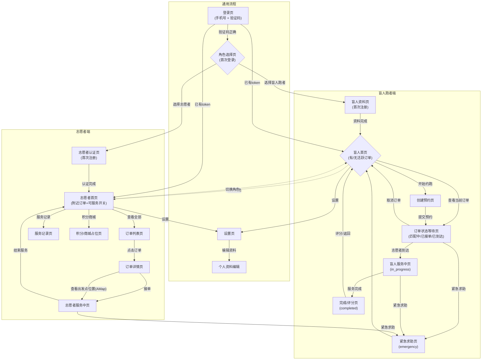
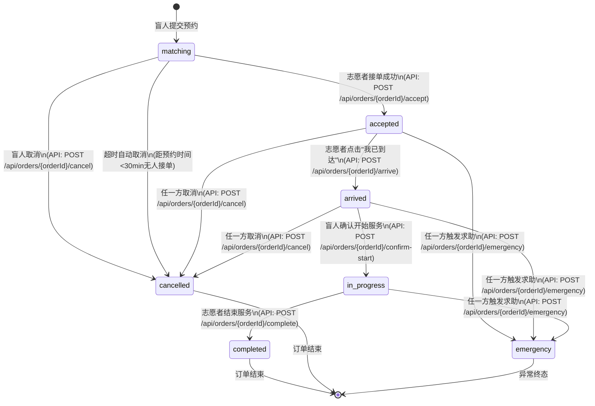
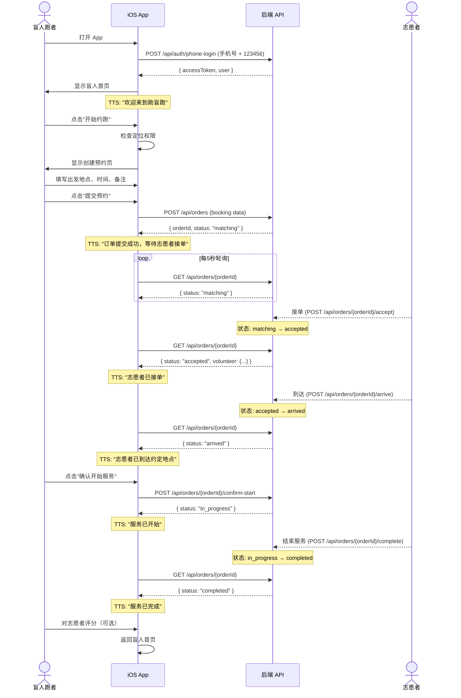
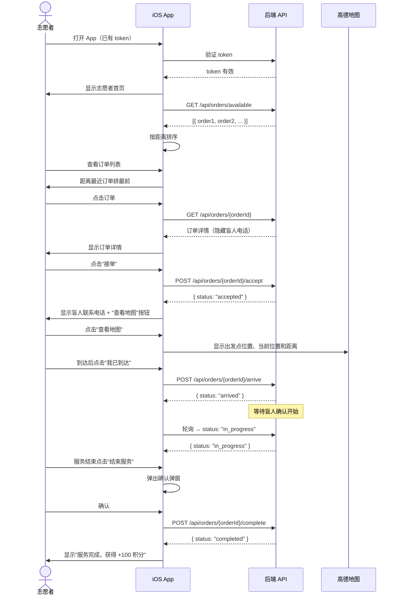
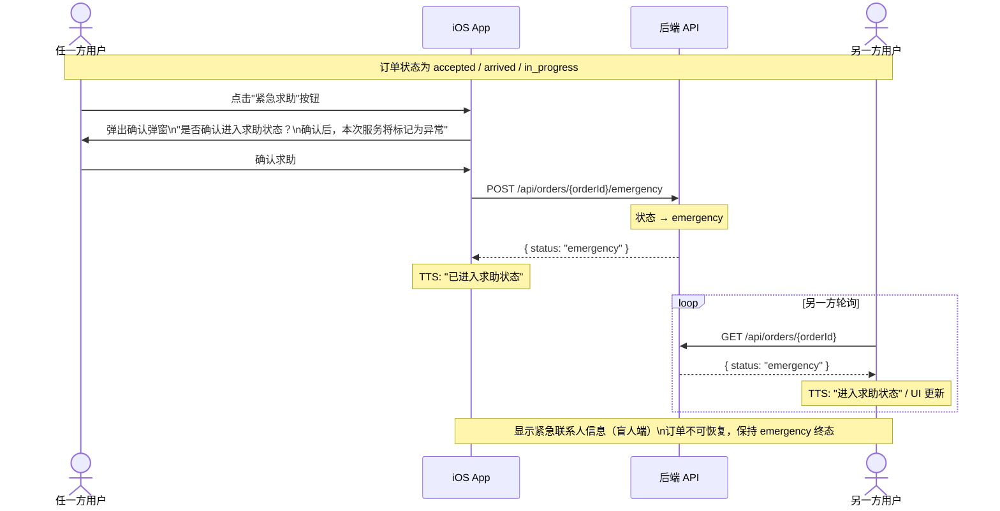
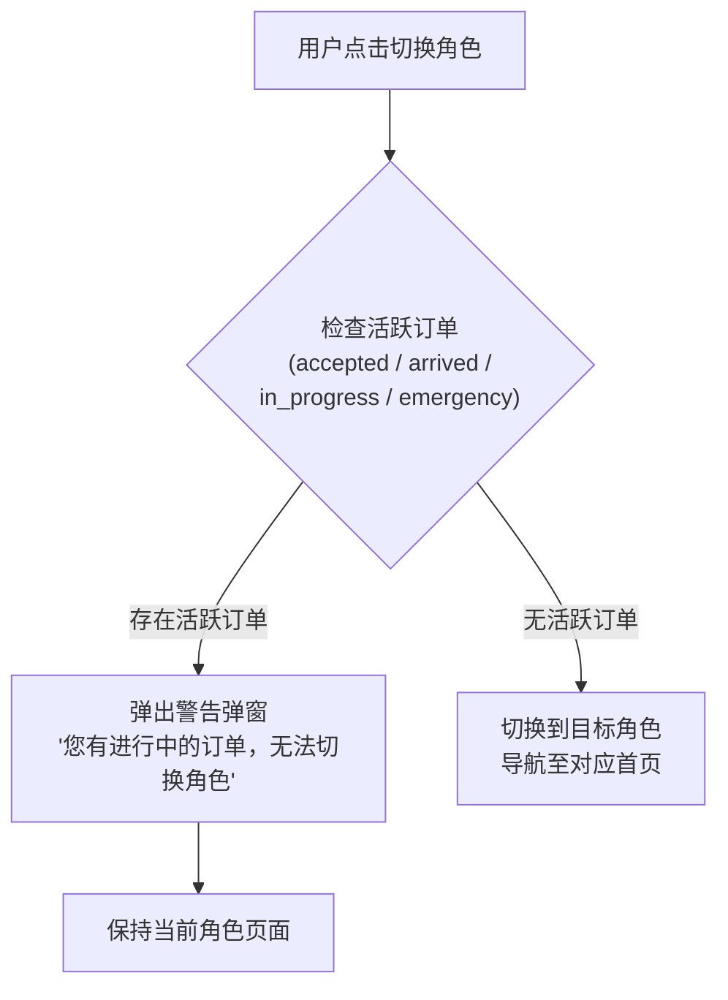
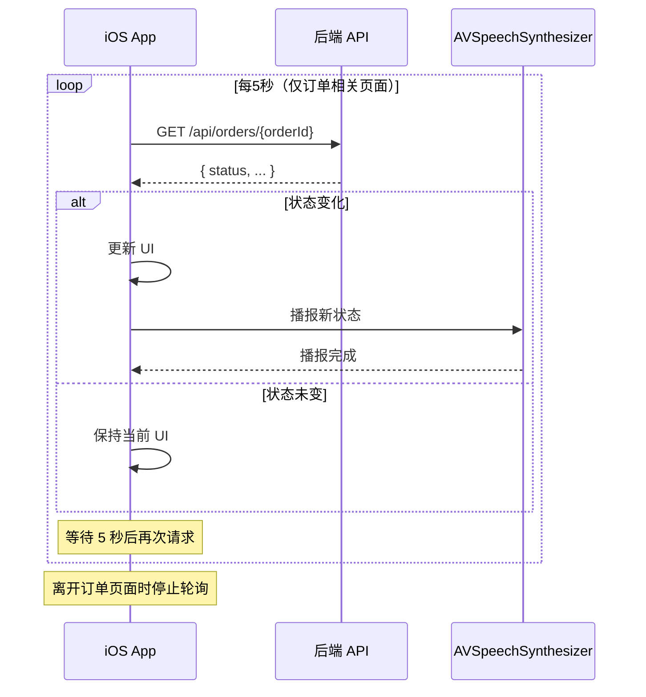

# 04 — 用户流程与状态机

## 1. App 整体导航图

## 2. 订单状态机

### 状态流转规则表

| 当前状态 | 允许的目标状态 | 触发者 | 说明 |
|----------|---------------|--------|------|
| matching | accepted | 志愿者 | 接单（乐观锁保护） |
| matching | cancelled | 盲人 / 系统 | 手动取消或超时 |
| accepted | arrived | 志愿者 | 标记到达 |
| accepted | cancelled | 盲人 / 志愿者 | 服务开始前可取消 |
| accepted | emergency | 盲人 / 志愿者 | 一键求助 |
| arrived | in_progress | 盲人 | 确认开始服务 |
| arrived | cancelled | 盲人 / 志愿者 | 服务开始前可取消 |
| arrived | emergency | 盲人 / 志愿者 | 一键求助 |
| in_progress | completed | 志愿者 | 正常结束 |
| in_progress | emergency | 盲人 / 志愿者 | 一键求助 |

### 禁止的流转

- in_progress → cancelled（服务开始后不支持普通取消，只能走 emergency）
- emergency → 任何其他状态（MVP 不支持恢复或继续执行生命周期动作）
- completed → 任何状态（终态）
- cancelled → 任何状态（终态）

## 3. 盲人跑者正向流程（Happy Path）

## 4. 志愿者正向流程（Happy Path）

## 5. 紧急求助流程

## 6. 角色切换拦截流程

## 7. 轮询机制

### 需要轮询的页面

| 页面 | 角色 | 轮询终止条件 |
|------|------|-------------|
| 订单状态等待页 | 盲人 | 页面离开 / 订单进入终态 |
| 盲人服务中页 | 盲人 | 页面离开 / 订单进入终态 |
| 志愿者服务中页 | 志愿者 | 页面离开 / 订单进入终态 |
| 志愿者订单详情页（已接单） | 志愿者 | 页面离开 |
