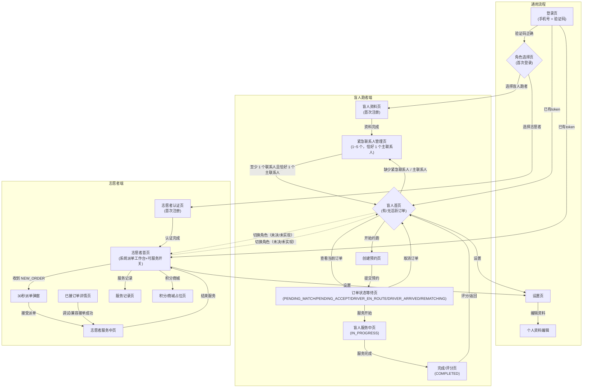
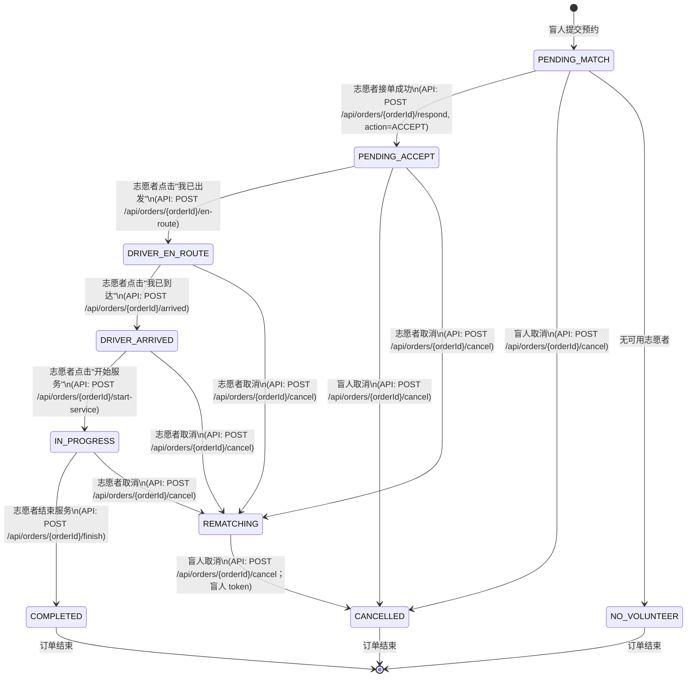
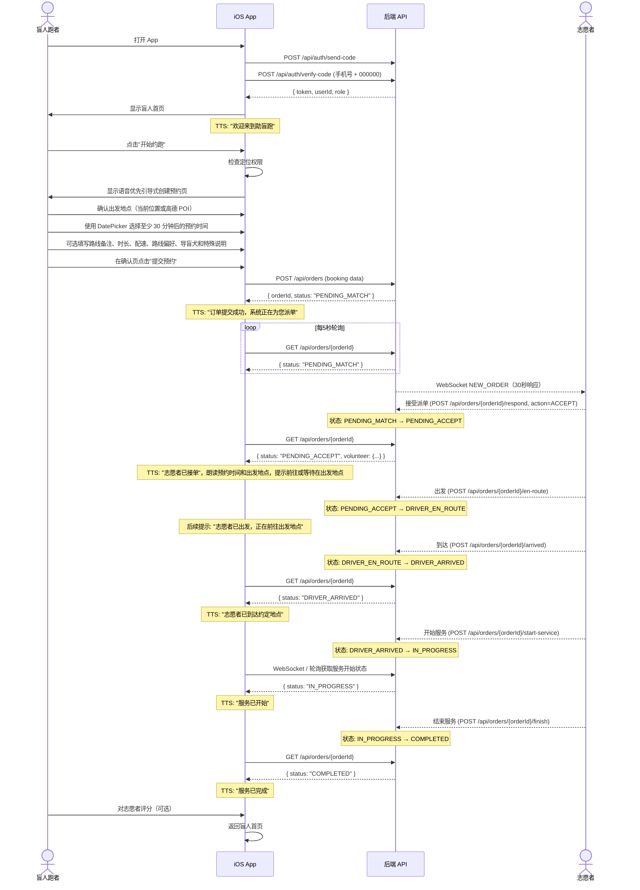
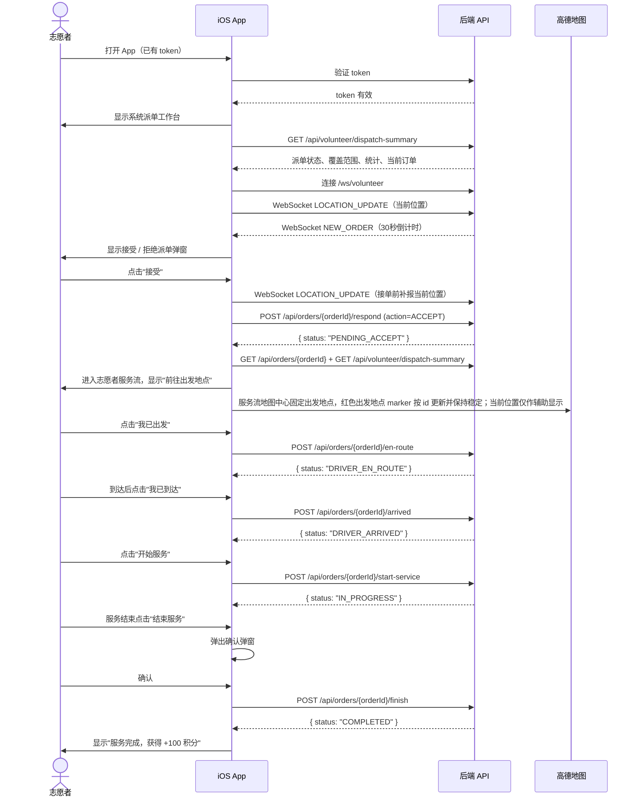
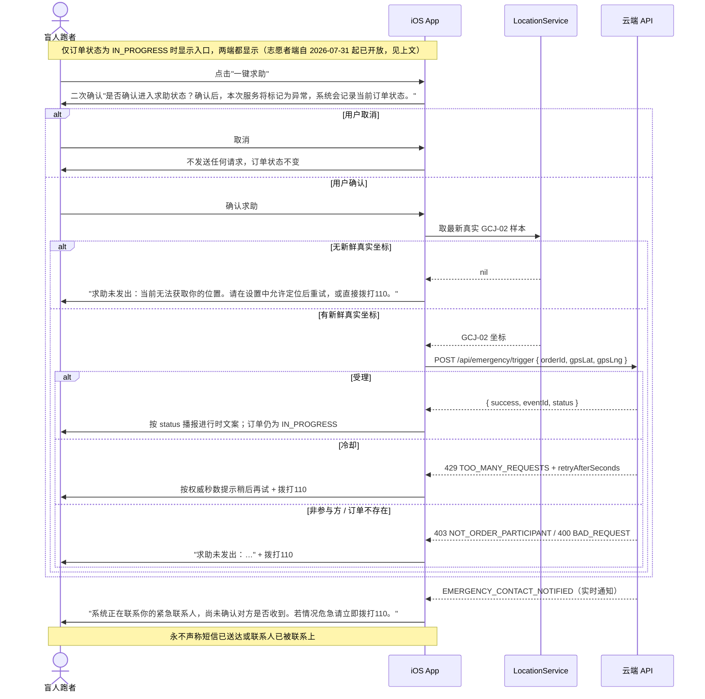
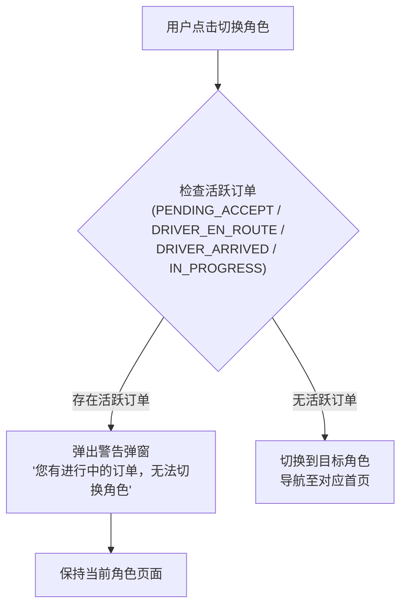
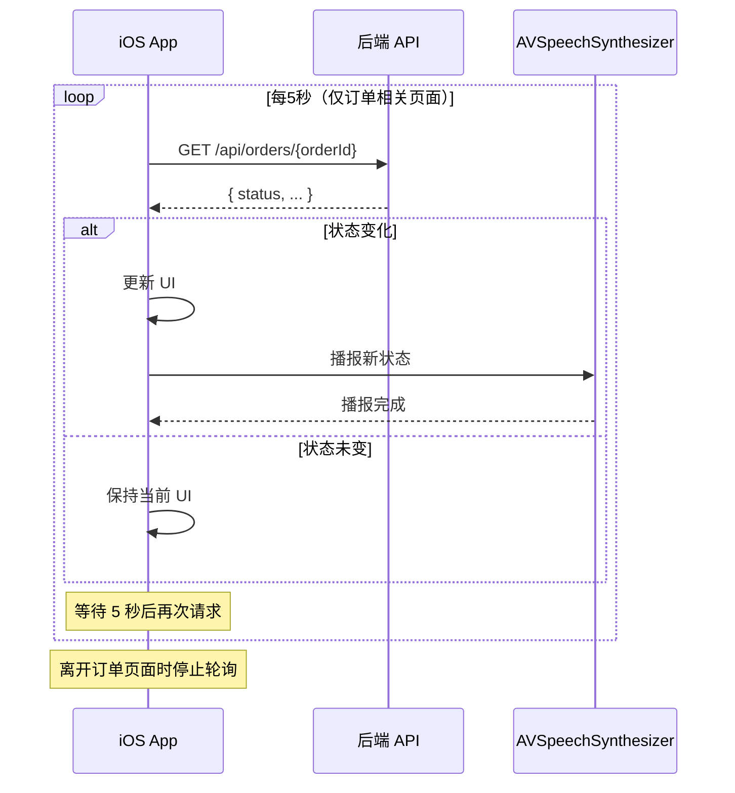
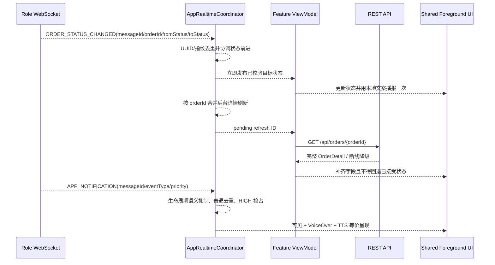

# 04 — 用户流程与状态机

## 1. App 整体导航图



**【未决 / 未实现】** 上图两条虚线（切换角色）当前**不存在**：后端没有角色切换端点，App 内入口已删除。详见第 6 节。

## 2. 订单状态机



### 状态流转规则表

| 当前状态 | 允许的目标状态 | 触发者 | 说明 |
|----------|---------------|--------|------|
| PENDING_MATCH | PENDING_ACCEPT | 志愿者 | 接单（乐观锁保护） |
| PENDING_MATCH | CANCELLED / NO_VOLUNTEER | 盲人 / 系统 | 手动取消或无可用志愿者 |
| PENDING_ACCEPT | DRIVER_EN_ROUTE | 志愿者 | 标记出发 |
| PENDING_ACCEPT | CANCELLED | 盲人 | 服务开始前盲人可取消 |
| PENDING_ACCEPT / DRIVER_EN_ROUTE / DRIVER_ARRIVED / IN_PROGRESS | REMATCHING | 志愿者 | 志愿者取消后进入重新匹配，志愿者端退出当前服务流程 |
| DRIVER_EN_ROUTE | DRIVER_ARRIVED | 志愿者 | 标记到达 |
| DRIVER_ARRIVED | IN_PROGRESS | 志愿者 | 开始服务；调用 `POST /api/orders/{orderId}/start-service`，iOS 不允许从 DRIVER_ARRIVED 直接结束 |
| IN_PROGRESS | COMPLETED | 志愿者 | 正常结束 |
| REMATCHING | CANCELLED | 盲人 | 志愿者主动取消已接单订单后进入重新匹配；盲人可用自己的 token 调用 `/cancel` 退出本次订单，志愿者 token 不适用 |

取消按钮显示规则：

- 盲人跑者端仅在 `PENDING_MATCH`、`PENDING_ACCEPT`、`REMATCHING` 显示"取消订单"，均需二次确认。
- 志愿者端仅在 `PENDING_ACCEPT`、`DRIVER_EN_ROUTE`、`DRIVER_ARRIVED`、`IN_PROGRESS` 显示"取消订单"，均需二次确认；取消成功后不再用志愿者 token 拉取该订单详情。
- 盲人跑者端在 `DRIVER_EN_ROUTE`、`DRIVER_ARRIVED`、`IN_PROGRESS` 不显示取消按钮。

求助入口显示规则：

- 盲人跑者端仅在 `IN_PROGRESS` 显示"一键求助"，需二次确认（`RunOrderStatus.canBlindRunnerTriggerEmergency` / `canTriggerEmergency(as:)`，`blindRun/Core/Models/OrderModels.swift`）。
- 志愿者端同样仅在 `IN_PROGRESS` 显示求助入口（`canVolunteerTriggerEmergency == (self == .inProgress)`），**自 2026-07-31 起已开放**。~~此前全状态隐藏，因为后端按触发人建事件~~ —— 后端 commit `a5ba523`（SOS-1）把 `event.userId` 改为取订单的盲人方、用 `TriggerType.VOLUNTEER_BUTTON` 区分来源后，该理由不再成立。志愿者**没有撤销权**（后端 403 `EMERGENCY_VOLUNTEER_CANNOT_DISMISS`）：一对一陪跑里志愿者可能就是威胁来源，撤销权只在受助者本人和客服手里。

### 禁止的流转

- COMPLETED / CANCELLED / NO_VOLUNTEER → 任何状态（终态）
- 后端 emergency event 不得作为订单状态；盲人端触发求助后订单仍保持 `IN_PROGRESS`，`RunOrderStatus` 不因求助改变。

## 3. 盲人跑者正向流程（Happy Path）

### 下单前置条件

创建预约（`POST /api/orders`）在以下条件全部满足前必须被阻断：

1. 当前角色为 `BLIND`。
2. 盲人基础资料完整。
3. **实名认证已通过（`verifyStatus == VERIFIED`）。** 外部后端 `OrderCreationService` 自 2026-07-30 起硬校验此项，未通过返回 403 `IDENTITY_NOT_VERIFIED`。
4. **已保存 1～5 个紧急联系人，且其中恰好 1 个为主联系人。** 后端只检查联系人是否存在（缺失时 403 `EMERGENCY_CONTACT_REQUIRED`），客户端的阻断与之保持一致并额外要求主联系人唯一。
5. 定位权限已授予。
6. 已确认出发地点。
7. 预约时间至少在当前时间 30 分钟之后。

第 3 条必须排在第 4 条**之前**：后端的判定顺序就是先实名后联系人，客户端顺序若相反，用户补完联系人仍会被 403 挡回来。实名状态（`BlindProfileResponse.verifyStatus`）仅 `NOT_VERIFIED` / `VERIFIED` / `FAILED` 三态，字段缺失一律按未通过处理。

任一条件不满足时，App 展示并播报**第一个可执行的**缺失项，"重复当前状态"必须包含该阻断原因。



## 4. 志愿者正向流程（Happy Path）



## 5. 盲人一键求助流程



## 6. 角色切换拦截流程

**【未决 / 未实现】** 「一号一身份 vs 双身份」尚未有产品结论（见 `demo/docs/handoff.md` 2026-07-31「一号一身份是不是最终产品形态」）。后端当前**没有任何角色切换端点**，App 内切换角色入口已删除，下面这张图不描述任何已实现的流程。



## 7. 轮询机制



### 需要轮询的页面

| 页面 | 角色 | 轮询终止条件 |
|------|------|-------------|
| 订单状态等待页 | 盲人 | 页面离开 / 订单进入终态 |
| 盲人服务中页 | 盲人 | 页面离开 / 订单进入终态 |
| 志愿者服务中页 | 志愿者 | 页面离开 / 订单进入终态 |
| 志愿者订单详情页（已接单） | 志愿者 | 页面离开 |

## 8. App-lifetime 实时协调流程



- `ORDER_STATUS_CHANGED` 的相同 UUID/指纹重发不再次更新、播报或刷新；UUID 身份碰撞不采用内容，只触发一次有界安全刷新。缺失或非法 UUID 记录匿名合同异常后仍按旧消息兼容路径协调状态。
- REST 详情刷新与盲人端五秒轮询继续补齐完整字段并兜底断线或漏事件；WebSocket 即时状态不得被迟到 REST 旧值回退。
- 生命周期 `APP_NOTIFICATION` 与结构化状态事件并行到达时只播报客户端固定状态文案一次；终态移除活动订单后的 30 秒内继续按目标状态语义抑制模板通知，安全告警不受影响。
- `NEW_ORDER` 由协调器保留至响应、超时、失效或角色变化；志愿者首页重新出现时按原始截止时间恢复倒计时。
- 退出、角色/token 变化或 WebSocket 服务替换时先取消旧订阅，再清空前一用户的派单、通知、位置和安全事件内存状态。
- 重连后活动订单重新请求详情，志愿者摘要等依赖功能收到恢复信号并恢复自己的 cadence。
- `VOLUNTEER_LOCATION_UPDATE` / `BLIND_LOCATION_UPDATE` 只在角色、订单和坐标合法时路由；本流程不决定地图展示。

## 9. 实时同行会话与完成轨迹

```text
权威订单进入 DRIVER_EN_ROUTE / DRIVER_ARRIVED / IN_PROGRESS
  -> 立即发送最新真实位置 -> 每 5 秒发送
  -> 同行样本匹配订单且 <=15 秒 -> 更新辅助 marker
  -> 设备/同行样本 >15 秒 -> 停止复用旧值 / 隐藏 marker / 可见与 TTS 降级

IN_PROGRESS -> 开启 fitness 后台定位
离开 IN_PROGRESS 或会话/身份失效 -> 关闭后台定位并清空同行内存

COMPLETED -> GET /api/orders/{id}/track
  -> blindTrack 作为“本次路线”
  -> 空/部分数据结合 response.status 说明
  -> volunteerTrack 仅保留，不输出异常判断
```

- PING/PONG 两角色均为 30 秒；服务端 90 秒无消息关闭后走现有重连。
- `ESCORT_DISTANCE_ALERT` 和 `ESCORT_SIGNAL_LOST` 只产生高优先级提醒，不改变订单状态或触发 iOS SOS。
## 会话与账户生命周期流程

```text
启动 -> 读取本地 JWT -> GET /api/auth/me
  -> 有效且角色为 BLIND/VOLUNTEER -> 建立对应 WebSocket -> 角色主页
  -> 有效且角色缺省/UNSET -> 不建立角色 WebSocket -> 角色选择
  -> 401/已删除账户 -> 完整清理本地会话 -> 登录

确认退出 -> POST /api/auth/logout
  -> 200/401 -> 完整本地清理 -> 登录
  -> 网络/5xx -> 保留会话 -> 重试 / 二次确认“仅退出本机”

账户删除第一阶段确认 -> 活动订单预检 -> 第二阶段确认 -> DELETE /api/users/{currentUser.id}
  -> 成功 -> 完整本地清理 -> 登录
  -> 活动订单/其他失败 -> 保留账户与会话
```
