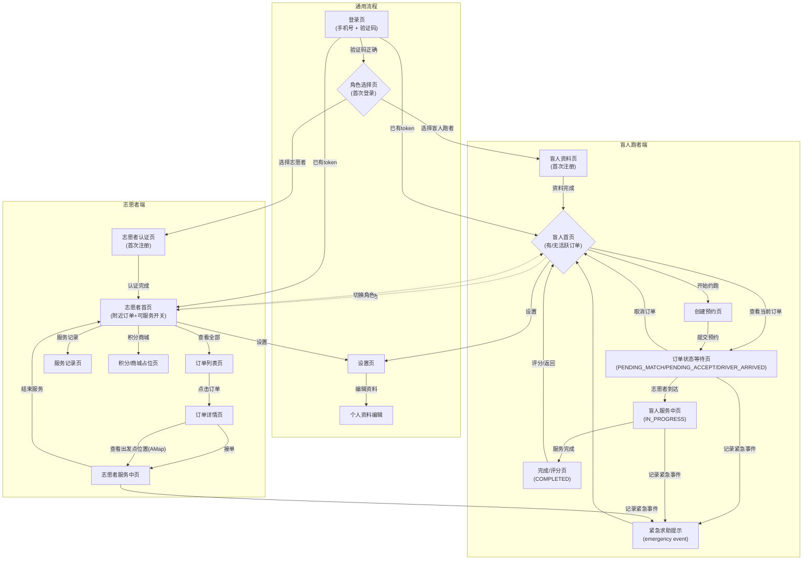
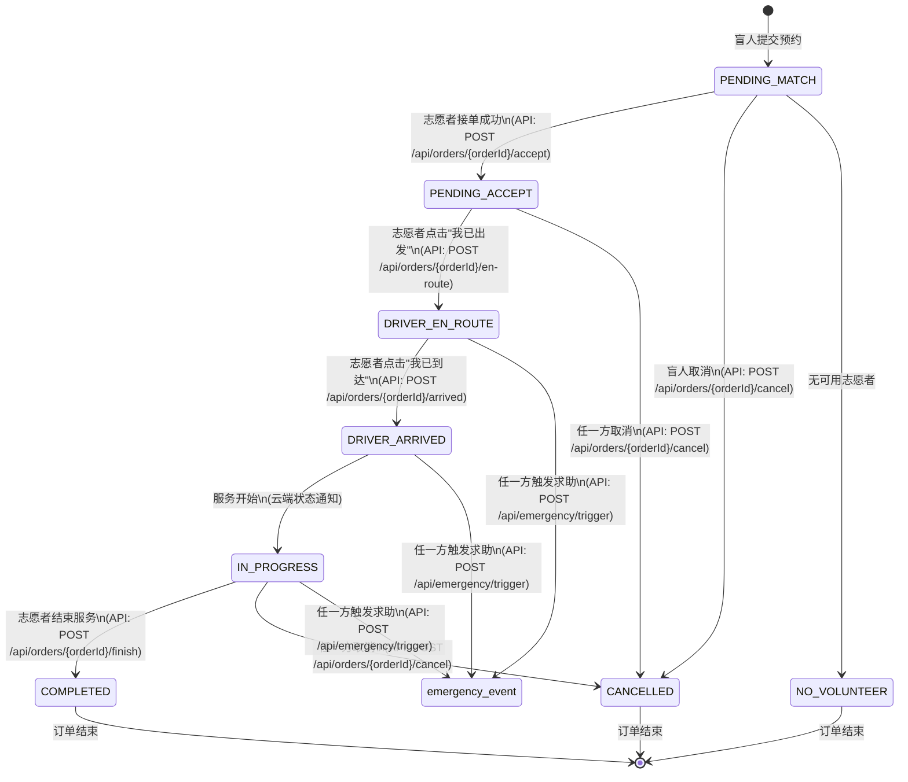
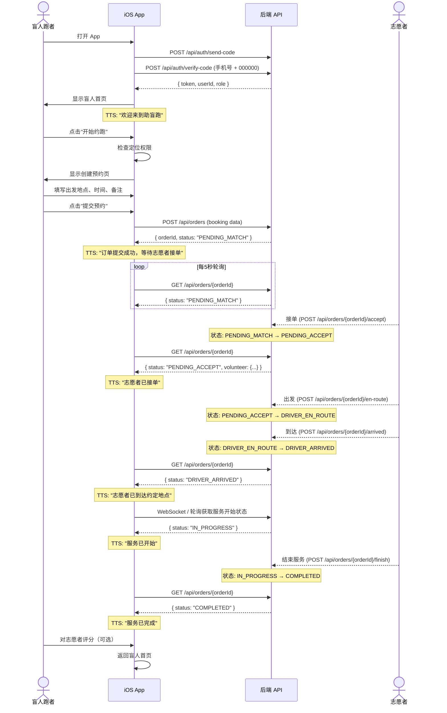
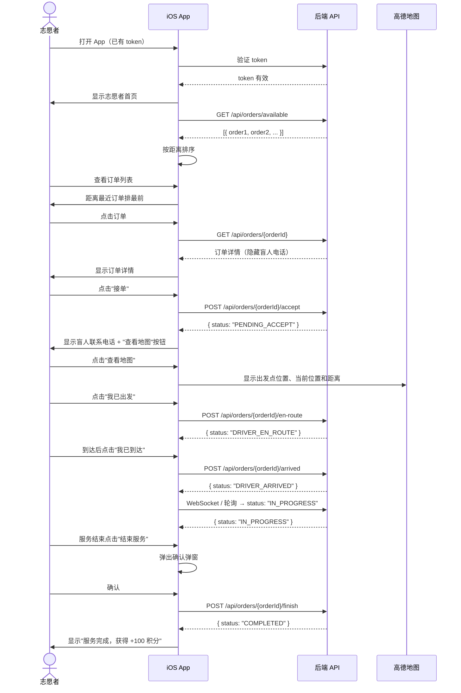
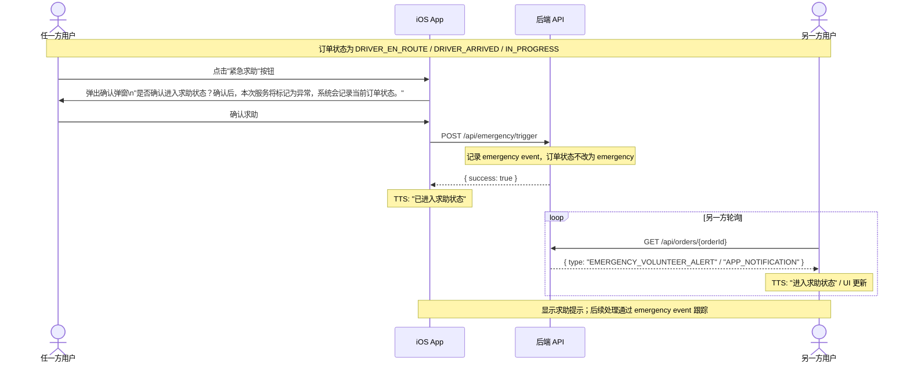
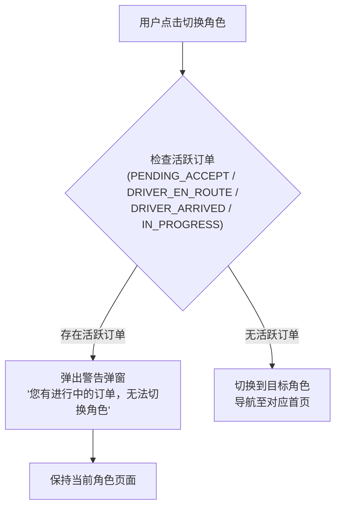
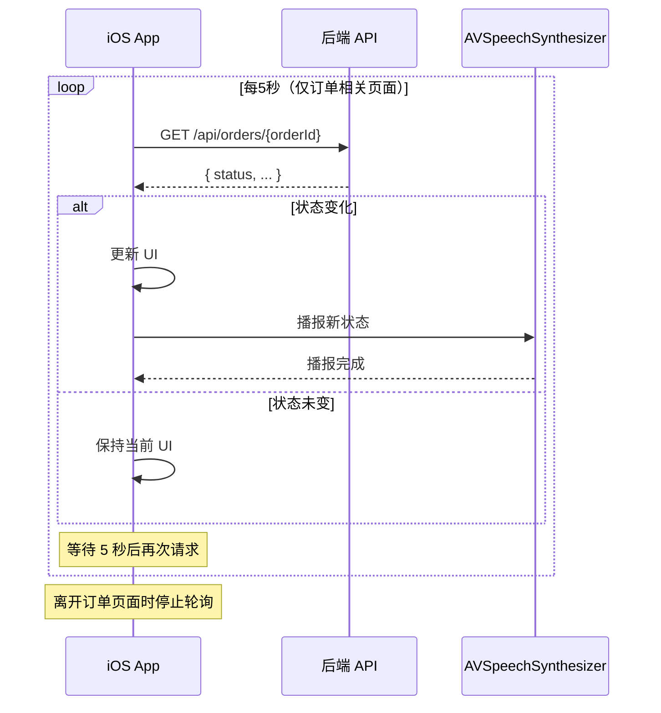

# 04 — 用户流程与状态机

## 1. App 整体导航图

## 2. 订单状态机

### 状态流转规则表

| 当前状态 | 允许的目标状态 | 触发者 | 说明 |
|----------|---------------|--------|------|
| PENDING_MATCH | PENDING_ACCEPT | 志愿者 | 接单（乐观锁保护） |
| PENDING_MATCH | CANCELLED / NO_VOLUNTEER | 盲人 / 系统 | 手动取消或无可用志愿者 |
| PENDING_ACCEPT | DRIVER_EN_ROUTE | 志愿者 | 标记出发 |
| PENDING_ACCEPT | CANCELLED | 盲人 / 志愿者 | 服务开始前可取消 |
| DRIVER_EN_ROUTE | DRIVER_ARRIVED | 志愿者 | 标记到达 |
| DRIVER_EN_ROUTE / DRIVER_ARRIVED / IN_PROGRESS | emergency event | 盲人 / 志愿者 | 通过 `POST /api/emergency/trigger` 记录求助事件，订单状态不改为 emergency |
| DRIVER_ARRIVED | IN_PROGRESS | 系统 / 云端通知 | 服务开始；当前云端 REST 契约没有单独 start endpoint |
| IN_PROGRESS | COMPLETED | 志愿者 | 正常结束 |
| IN_PROGRESS | CANCELLED | 盲人 / 志愿者 | 服务中可取消 |

### 禁止的流转

- COMPLETED / CANCELLED / NO_VOLUNTEER → 任何状态（终态）
- emergency event → 订单状态（求助是独立事件，不是订单状态流转）

## 3. 盲人跑者正向流程（Happy Path）

## 4. 志愿者正向流程（Happy Path）

## 5. 紧急求助流程

## 6. 角色切换拦截流程

## 7. 轮询机制

### 需要轮询的页面

| 页面 | 角色 | 轮询终止条件 |
|------|------|-------------|
| 订单状态等待页 | 盲人 | 页面离开 / 订单进入终态 |
| 盲人服务中页 | 盲人 | 页面离开 / 订单进入终态 |
| 志愿者服务中页 | 志愿者 | 页面离开 / 订单进入终态 |
| 志愿者订单详情页（已接单） | 志愿者 | 页面离开 |
