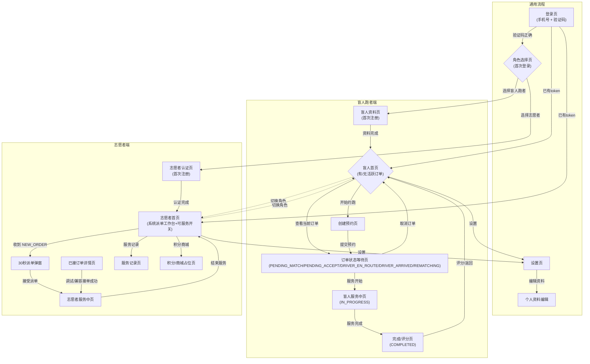
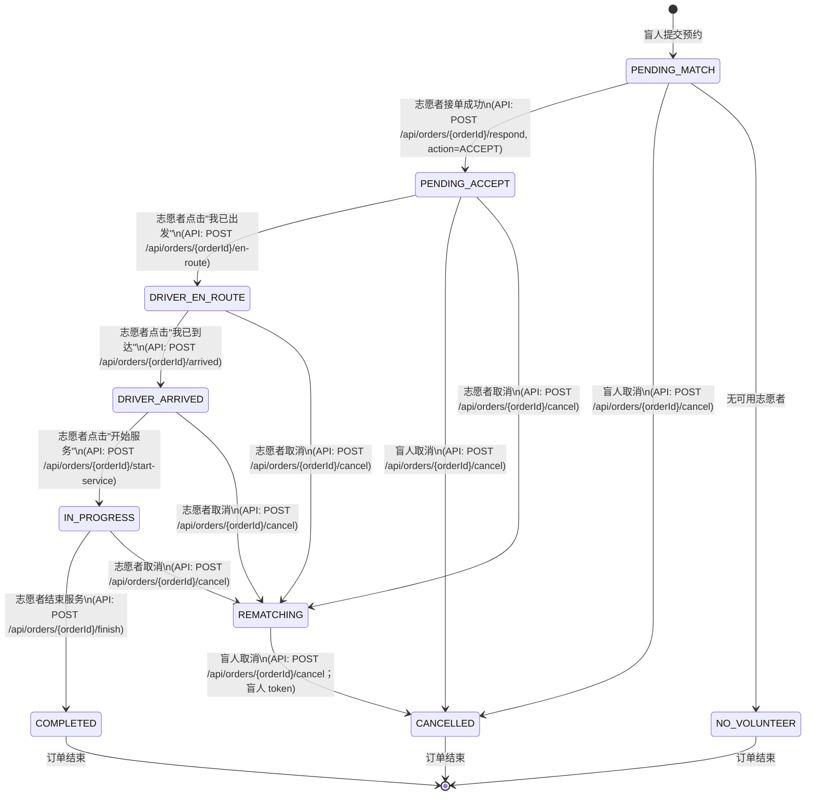
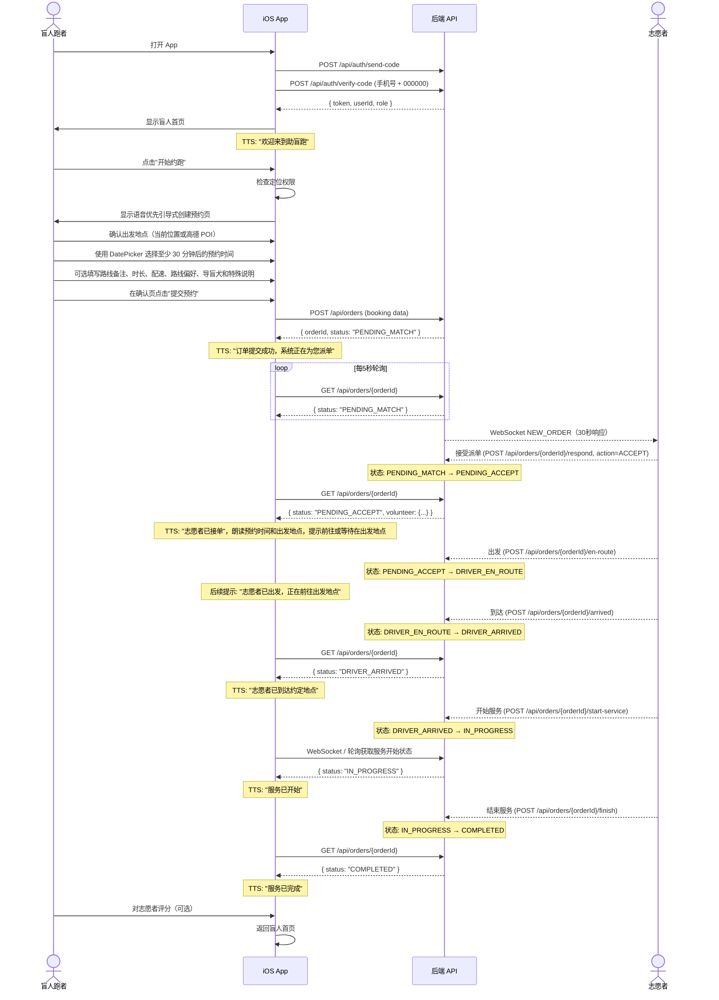
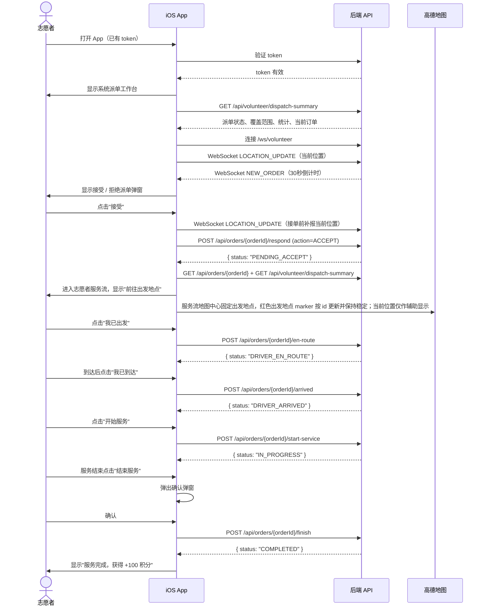
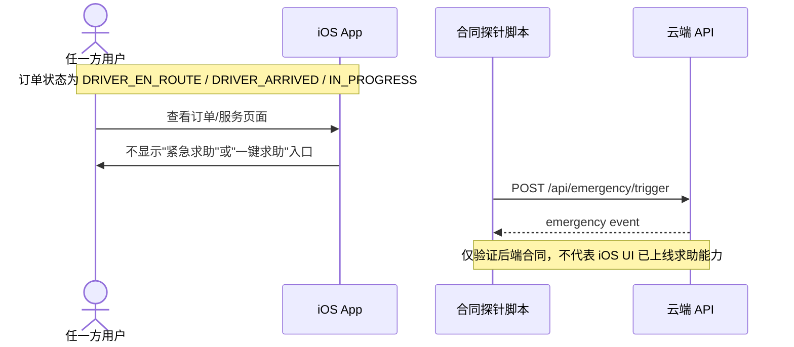
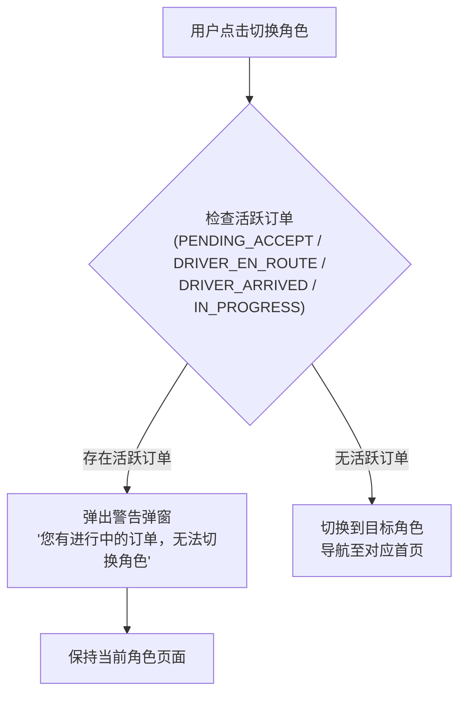
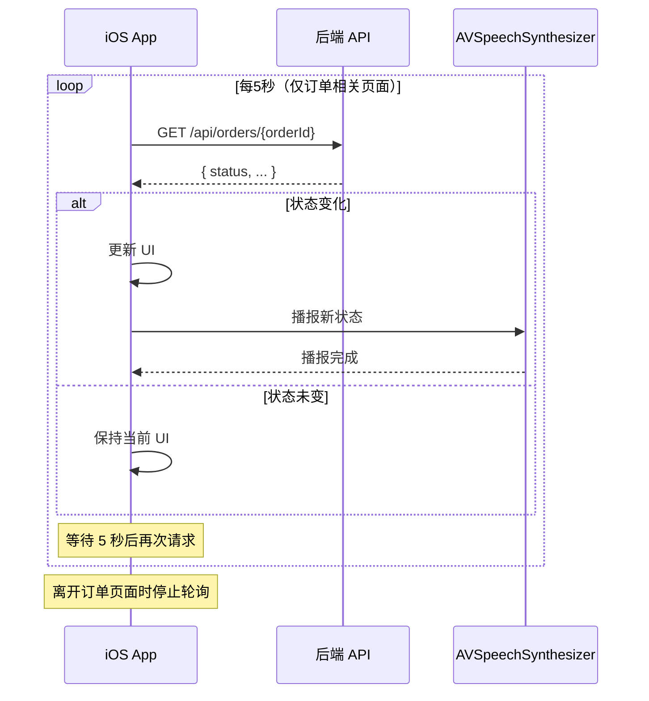

# 04 — 用户流程与状态机

## 1. App 整体导航图



## 2. 订单状态机



### 状态流转规则表

| 当前状态 | 允许的目标状态 | 触发者 | 说明 |
|----------|---------------|--------|------|
| PENDING_MATCH | PENDING_ACCEPT | 志愿者 | 接单（乐观锁保护） |
| PENDING_MATCH | CANCELLED / NO_VOLUNTEER | 盲人 / 系统 | 手动取消或无可用志愿者 |
| PENDING_ACCEPT | DRIVER_EN_ROUTE | 志愿者 | 标记出发 |
| PENDING_ACCEPT | CANCELLED | 盲人 | 服务开始前盲人可取消 |
| PENDING_ACCEPT / DRIVER_EN_ROUTE / DRIVER_ARRIVED / IN_PROGRESS | REMATCHING | 志愿者 | 志愿者取消后进入重新匹配，志愿者端退出当前服务流程 |
| DRIVER_EN_ROUTE | DRIVER_ARRIVED | 志愿者 | 标记到达 |
| DRIVER_ARRIVED | IN_PROGRESS | 志愿者 | 开始服务；调用 `POST /api/orders/{orderId}/start-service`，iOS 不允许从 DRIVER_ARRIVED 直接结束 |
| IN_PROGRESS | COMPLETED | 志愿者 | 正常结束 |
| REMATCHING | CANCELLED | 盲人 | 志愿者主动取消已接单订单后进入重新匹配；盲人可用自己的 token 调用 `/cancel` 退出本次订单，志愿者 token 不适用 |

取消按钮显示规则：

- 盲人跑者端仅在 `PENDING_MATCH`、`PENDING_ACCEPT`、`REMATCHING` 显示"取消订单"，均需二次确认。
- 志愿者端仅在 `PENDING_ACCEPT`、`DRIVER_EN_ROUTE`、`DRIVER_ARRIVED`、`IN_PROGRESS` 显示"取消订单"，均需二次确认；取消成功后不再用志愿者 token 拉取该订单详情。
- 盲人跑者端在 `DRIVER_EN_ROUTE`、`DRIVER_ARRIVED`、`IN_PROGRESS` 不显示取消按钮；当前 release 也不显示求助入口，真实安全求助需后续专项恢复。

### 禁止的流转

- COMPLETED / CANCELLED / NO_VOLUNTEER → 任何状态（终态）
- 后端 emergency event 不得作为订单状态；当前 release iOS UI 不触发该事件。

## 3. 盲人跑者正向流程（Happy Path）



## 4. 志愿者正向流程（Happy Path）



## 5. 紧急求助当前 release 处理



## 6. 角色切换拦截流程



## 7. 轮询机制



### 需要轮询的页面

| 页面 | 角色 | 轮询终止条件 |
|------|------|-------------|
| 订单状态等待页 | 盲人 | 页面离开 / 订单进入终态 |
| 盲人服务中页 | 盲人 | 页面离开 / 订单进入终态 |
| 志愿者服务中页 | 志愿者 | 页面离开 / 订单进入终态 |
| 志愿者订单详情页（已接单） | 志愿者 | 页面离开 |
## 会话与账户生命周期流程

```text
启动 -> 读取本地 JWT -> GET /api/auth/me
  -> 有效且角色为 BLIND/VOLUNTEER -> 建立对应 WebSocket -> 角色主页
  -> 有效且角色缺省/UNSET -> 不建立角色 WebSocket -> 角色选择
  -> 401/已删除账户 -> 完整清理本地会话 -> 登录

确认退出 -> POST /api/auth/logout
  -> 200/401 -> 完整本地清理 -> 登录
  -> 网络/5xx -> 保留会话 -> 重试 / 二次确认“仅退出本机”

账户删除第一阶段确认 -> 活动订单预检 -> 第二阶段确认 -> DELETE /api/users/{currentUser.id}
  -> 成功 -> 完整本地清理 -> 登录
  -> 活动订单/其他失败 -> 保留账户与会话
```
